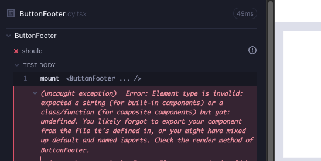
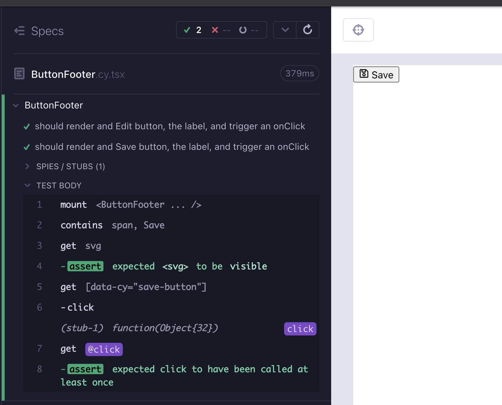

# ButtonFooter

This is what our component might look like eventually. We need a button that wraps a label and CSS icon. The icon and the text can vary; Cancel, Save, Edit or Delete.


Create a branch `feat/button-footer`. Create 2 files under `src/components/` folder; `ButtonFooter.cy.tsx`, `ButtonFooter.tsx`.

We start minimal with a test that checks that the component mounts (Red 1).

```tsx
// src/components/ButtonFooter.cy.tsx
import ButtonFooter from "./ButtonFooter";

describe("ButtonFooter", () => {
  it("should", () => {
    cy.mount(<ButtonFooter />);
  });
});
```

The compiler complains that there is no such component, let's make it green (Green 1).

```tsx
// src/components/ButtonFooter.tsx

export default function ButtonFooter() {
  return <button>hello</button>;
}
```

Start the Cypress component test runner and execute the test; `yarn cy:open-ct`.

Let's test that the string renders. Once we have a passing test, we can keep adding to it until we get a new failure, or until we want to refactor.

```typescript
// src/components/ButtonFooter.cy.tsx
import ButtonFooter from "./ButtonFooter";

describe("ButtonFooter", () => {
  it("should", () => {
    cy.mount(<ButtonFooter />);
    cy.contains("hello");
  });
});
```


Let's have the button wrap a span, the span will include a string.

```tsx
// src/components/ButtonFooter.tsx

export default function ButtonFooter() {
  return (
    <button>
      <span>hello</span>
    </button>
  );
}
```

We really want the "hello" string to be a variable, a prop that we can pass in to the component. Let's name the variable for the string `label`, and make it a prop. We mount the component with this new prop. The test still passes, but we get compiler error (Red 2).

```tsx
// src/components/ButtonFooter.tsx
import ButtonFooter from "./ButtonFooter";

describe("ButtonFooter", () => {
  it("should", () => {
    const label = "hello";
    cy.mount(<ButtonFooter label={label} />);
    cy.contains(label);
  });
});
```

Now we need a passing test. Let's add the prop and its type to the component (Green 2).

```tsx
// src/components/ButtonFooter.tsx
type ButtonFooterProps = {
  label: "Cancel" | "Save" | "Edit" | "Delete";
};

export default function ButtonFooter({ label }: ButtonFooterProps) {
  return (
    <button>
      <span>{label}</span>
    </button>
  );
}
```

Styling is not a major part of this guide, and we prefer to have global styles for most components. In the case of this one, [react-icons](https://react-icons.github.io/react-icons/) makes a lot of sense, because for each component we can have a specific styling.

```bash
yarn add react-icons
yarn add -D @types/react-icons
```

Per the specification, we want to be able to use different kinds of icons within the button; Edit, Delete, Save, Cancel. We can have the button wrap that style, and customize it as a prop. We will call the prop `IconClass` specify the possible types.

```tsx
// src/components/ButtonFooter.tsx
import { FaUndo, FaRegSave, FaEdit, FaTrash } from "react-icons/fa";

type ButtonFooterProps = {
  label: "Cancel" | "Save" | "Edit" | "Delete";
  IconClass: typeof FaUndo | typeof FaRegSave | typeof FaEdit | typeof FaTrash;
};

export default function ButtonFooter({ label, IconClass }: ButtonFooterProps) {
  return (
    <button>
      <IconClass />
      <span>{label}</span>
    </button>
  );
}
```

That fails the test because now we have to pass a `IconClass` prop to the component we are mounting. Become familiar with this error; it says we expected some prop but got undefined (Red 3). The same failure could also be caught via a TS error in the test. In this case, it is worthwhile to get familiar with the errors we might run into with Cypress component tests.



If we pass a prop `IconClass` with a value of type `FaEdit`, then our test will pass again (Green 3).

```tsx
// src/components/ButtonFooter.cy.tsx
import ButtonFooter from "./ButtonFooter";
import { FaEdit } from "react-icons/fa";

describe("ButtonFooter", () => {
  it("should", () => {
    const label = "Edit";
    cy.mount(<ButtonFooter label={label} IconClass={FaEdit} />);
    cy.contains(label);
  });
});
```


This means we can have different styles, and probably should call a click handler on click. Let's write the test for it (Red 4).

```tsx
// src/components/ButtonFooter.cy.tsx
import ButtonFooter from "./ButtonFooter";
import { FaEdit } from "react-icons/fa";

describe("ButtonFooter", () => {
  it("should", () => {
    const label = "Edit";
    cy.mount(
      <ButtonFooter
        label={label}
        IconClass={FaEdit}
        onClick={cy.stub().as("click")}
      />
    );
    cy.contains(label).click();
    cy.get("@click").should("be.called");
  });
});
```

We can immediately tell that we need an `onClick` prop. Let's enhance our component to fulfill this requirement (Green 4).

```tsx
// src/components/ButtonFooter.tsx
import { FaUndo, FaRegSave, FaEdit, FaTrash } from "react-icons/fa";
import { MouseEvent } from "react";

type ButtonFooterProps = {
  label: "Cancel" | "Save" | "Edit" | "Delete";
  IconClass: typeof FaUndo | typeof FaRegSave | typeof FaEdit | typeof FaTrash;
  onClick: (e: MouseEvent<HTMLButtonElement>) => void;
};

export default function ButtonFooter({
  label,
  IconClass,
  onClick,
}: ButtonFooterProps) {
  return (
    <button onClick={onClick}>
      <IconClass />
      <span>{label}</span>
    </button>
  );
}
```

We can now enhance our selector, and base it on the `label` string. We keep `cy.contains(label)` to make sure there is a text being displayed, but we will do the clicking with our `data-cy` selector, which should fail the test (Red 5).

```tsx
// src/components/ButtonFooter.cy.tsx
import ButtonFooter from "./ButtonFooter";
import { FaEdit } from "react-icons/fa";

describe("ButtonFooter", () => {
  it("should", () => {
    const label = "Edit";
    cy.mount(
      <ButtonFooter
        label={label}
        IconClass={FaEdit}
        onClick={cy.stub().as("click")}
      />
    );
    cy.getByCy(`${label.toLowerCase()}-button`).click();
    cy.get("@click").should("be.called");
  });
});
```

Now we can add the `data-cy` selector to the button attributes. While we are here, we can also add an `aria-label` because it will have a similar value as a freebie. Here we can also add a `&nbsp;` a non-breaking space to have a space between the icon and the text for a nicer look (Refactor 5).

```tsx
// src/components/ButtonFooter.tsx
import { FaUndo, FaRegSave, FaEdit, FaTrash } from "react-icons/fa";
import { MouseEvent } from "react";

type ButtonFooterProps = {
  label: "Cancel" | "Save" | "Edit" | "Delete";
  IconClass: typeof FaUndo | typeof FaRegSave | typeof FaEdit | typeof FaTrash;
  onClick: (e: MouseEvent<HTMLButtonElement>) => void;
};

export default function ButtonFooter({
  label,
  IconClass,
  onClick,
}: ButtonFooterProps) {
  return (
    <button
      data-cy={`${label.toLowerCase()}-button`}
      aria-label={label}
      onClick={onClick}
    >
      <IconClass />
      &nbsp;
      <span>{label}</span>
    </button>
  );
}
```

There is only one line left to cover; we should make sure that the `svg` icon is rendered. We can also finalize the name of the test. We are rendering an Edit button, verifying the label and the click operation. It is almost like a small scale e2e test.

```tsx
// src/components/ButtonFooter.cy.tsx
import ButtonFooter from "./ButtonFooter";
import { FaEdit } from "react-icons/fa";

describe("ButtonFooter", () => {
  it("should render and Edit button, the label, and trigger an onClick", () => {
    const label = "Edit";
    cy.mount(
      <ButtonFooter
        label={label}
        IconClass={FaEdit}
        onClick={cy.stub().as("click")}
      />
    );

    cy.contains(label);
    cy.get("svg").should("be.visible");

    cy.getByCy(`${label.toLowerCase()}-button`).click();
    cy.get("@click").should("be.called");
  });
});
```

What else can we do with this component? There is only the label and icon props. Let's write another test for a different kind of icon (Green 5).

```tsx
// src/components/ButtonFooter.cy.tsx
import ButtonFooter from "./ButtonFooter";
import { FaEdit, FaRegSave } from "react-icons/fa";

describe("ButtonFooter", () => {
  it("should render and Edit button, the label, and trigger an onClick", () => {
    const label = "Edit";
    cy.mount(
      <ButtonFooter
        label={label}
        IconClass={FaEdit}
        onClick={cy.stub().as("click")}
      />
    );

    cy.contains(label);
    cy.get("svg").should("be.visible");

    cy.getByCy(`${label.toLowerCase()}-button`).click();
    cy.get("@click").should("be.called");
  });

  it("should render and Save button, the label, and trigger an onClick", () => {
    const label = "Save";
    cy.mount(
      <ButtonFooter
        label={label}
        IconClass={FaRegSave}
        onClick={cy.stub().as("click")}
      />
    );

    cy.contains(label);
    cy.get("svg").should("be.visible");

    cy.getByCy(`${label.toLowerCase()}-button`).click();
    cy.get("@click").should("be.called");
  });
});
```

There are diverging opinions about code duplication in tests. Some prefer to have long tests with duplication, as opposed to using test hooks and helpers, so that failure diagnosis is easier. Always think about how the test may fail and if the refactor will make diagnosis harder. In this case, the two components will most likely fail the same way. If we keep the helper function nearby, we can refactor the test to be drier (Refactor 6).

> Tip: use [`cy.pause()`](https://docs.cypress.io/api/commands/pause#Pause-and-step-through-each-click-command) to step through tests during diagnosis, or demos. Another useful diagnosis command is [`cy.debug()`](https://docs.cypress.io/api/commands/debug#Syntax).

We can add an additional css check, since in the second test we are adding a style to the component. Import the styles for the final look.

```tsx
// src/components/ButtonFooter.cy.tsx
import ButtonFooter from "./ButtonFooter";
import { FaEdit, FaRegSave } from "react-icons/fa";
import "../styles.scss";

describe("ButtonFooter", () => {
  const doAssertions = (label: "Cancel" | "Save" | "Edit" | "Delete") => {
    cy.contains(label);
    cy.get("svg").should("be.visible");

    cy.getByCy(`${label.toLowerCase()}-button`).click();
    cy.get("@click").should("be.called");
  };

  it("should render and Edit button, the label, and trigger an onClick", () => {
    const label = "Edit";
    cy.mount(
      <ButtonFooter
        label={label}
        IconClass={FaEdit}
        onClick={cy.stub().as("click")}
      />
    );

    doAssertions(label);
  });

  it("should render and Save button, the label, and trigger an onClick", () => {
    const label = "Save";
    cy.mount(
      <ButtonFooter
        label={label}
        IconClass={FaRegSave}
        onClick={cy.stub().as("click")}
      />
    );

    doAssertions(label);
  });
});
```

## Important note about styles

Instead of having to import styles in every component test file, we can import them at `cypress/support/component.ts` file (or `.tsx` in the future), which runs before every component test.

Note that in the upcoming examples, we will explicitly import the styles for TDD purposes. In the final project, you can remove the imports from the test files and have it only at the support file.

```tsx
// cypress/support/component.tsx
import "./commands";
import { mount } from "cypress/react18";
// import styles here so you don't have to import in each component test
import "../../src/styles.scss";

Cypress.Commands.add("mount", mount);
```



## React Testing Library (RTL) version of the component test

```tsx
// src/components/ButtonFooter.test.tsx
import ButtonFooter from "./ButtonFooter";
import { FaEdit, FaRegSave } from "react-icons/fa";
import { render, screen } from "@testing-library/react";
import userEvent from "@testing-library/user-event";
import "@testing-library/jest-dom";

describe("ButtonFooter", () => {
  const click = jest.fn();

  const doAssertions = async (label: string) => {
    expect(await screen.findByText(label)).toBeVisible();

    await userEvent.click(
      await screen.findByTestId(`${label.toLowerCase()}-button`)
    );
    expect(click).toHaveBeenCalled();
  };

  it("should render and Edit button, the label, and trigger an onClick", async () => {
    const label = "Edit";
    render(<ButtonFooter label={label} IconClass={FaEdit} onClick={click} />);

    await doAssertions(label);
  });

  it("should render and Save button, the label, and trigger an onClick", async () => {
    const label = "Save";
    render(
      <ButtonFooter label={label} IconClass={FaRegSave} onClick={click} />
    );

    await doAssertions(label);
  });
});
```

## Summary

We looked at the requirement and wrote a minimal failing test that mounts a component (Red 1).

We added a component to pass the test (Green 1).

</br>

We made the hard-coded string into a variable in the test, and made it so that it is a prop being passed in to `cy.mount`. (Red 2)

We added the prop `label` and its type to the component (Green 2).

</br>

We added an icon to the component as a new prop and got a failing test (Red 3).

We enhanced the test to also use that new prop (Green 3).

</br>

We added a test for the onClick event (Red 4).

We enhanced the component to accommodate the new feature (Green 4).

</br>

We decided to use a data-cy query for the button click (Red 5).

And enhanced the component with the data-cy attribute (Green 5, Refactor 5).

We enhanced the test and made sure that the `svg` is rendered.

</br>

We increased the test coverage by trying a different component; a Save button (Green 6).

And we refactored the test to be leaner (Refactor 6).

## Takeaways

- Having first a failing test, ensures a fault-finding one.
- TypeScript and ESlint can serve as "tests" that give us a Red.
- Once we have a passing test, we can keep adding to it until we get a new failure, or until we want to refactor.
- The RedGreenRefactor cycles do not always have to be in that order. It can be a few cycles of Red + Green, and then Refactor. Or it can be a Red, followed by a few Greens, and no Refactor. The key idea is to start with something failing, do the mimimum to get it to work, and then make it better.
- Using `data-cy` attributes for selectors, with template literals and JSX, we can have a precise and effortless way to refer to a component or its variants (ex: save vs edit).
- Refactoring can be applied to tests so long as they will not be detrimental to failure diagnosis, evaluate case by case.
