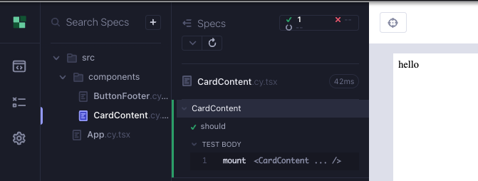

# CardContent

This is what our component might look like eventually. We need a div wrapping two other divs.


Create a branch `feat/cardContent`. Create 2 files under `src/components/` folder; `CardContent.cy.tsx`, `CardContent.tsx`.

We start minimal with a test that renders the component (Red 1).

```tsx
// src/components/CardContent.cy.tsx
import CardContent from "./CardContent";

describe("CardContent", () => {
  it("should render the card content", () => {
    cy.mount(<CardContent />);
  });
});
```

We do the mimimum to make the compiler green.

```tsx
// src/components/CardContent.tsx

export default function CardContent() {
  return <div>hello</div>;
}
```

Start the Cypress component test runner and execute the test; `yarn cy:open-ct`.

Let's test that the string renders (Green 1).

```tsx
// src/components/CardContent.cy.tsx
import CardContent from "./CardContent";

describe("CardContent", () => {
  it("should render the card content", () => {
    cy.mount(<CardContent />);
    cy.contains("hello");
  });
});
```



Let's write a test for the divs we want; we need two divs, one contains a name, the other a description (Red 2).

```tsx
// src/components/CardContent.cy.tsx
import CardContent from "./CardContent";

describe("CardContent", () => {
  it("should render the card content", () => {
    cy.mount(<CardContent />);

    cy.contains("Bjorn Ironside");
    cy.contains("king of 9th century Sweden");
  });
});
```

We make it green by hard-coding the values being tested for (Green 2).

```tsx
// src/components/CardContent.tsx
export default function CardContent() {
  return (
    <div>
      <div>Bjorn Ironside</div>
      <div>king of 9th century Sweden</div>
    </div>
  );
}
```

It is becoming obvious we should be passing name and description as props (Red 3).

```tsx
// src/components/CardContent.cy.tsx
import CardContent from "./CardContent";

describe("CardContent", () => {
  it("should render the card content", () => {
    const name = "Bjorn Ironside";
    const description = "king of 9th century Sweden";
    cy.mount(<CardContent name={name} description={description} />);

    cy.contains(name);
    cy.contains(description);
  });
});
```

The test still passes, but the compiler is complaining about the props that don not exist. Let's add those to the component (Green 3). We can also add the types for these props since we know they will both be strings.

```tsx
// src/components/CardContent.tsx
type CardContentProps = {
  name: string;
  description: string;
};

export default function CardContent({ name, description }: CardContentProps) {
  return (
    <div>
      <div>{name}</div>
      <div>{description}</div>
    </div>
  );
}
```

Now we can add some styles to our component.

```tsx
// src/components/CardContent.cy.tsx
import CardContent from "./CardContent";
import "../styles.scss";

// ...
```

Our component is still looking the same in the Cypress runner. Let's add some css classes to make it look nicer (Refactor 3).

```tsx
// src/components/CardContent.tsx
type CardContentProps = {
  name: string;
  description: string;
};

export default function CardContent({ name, description }: CardContentProps) {
  return (
    <div className="card-content">
      <div className="name">{name}</div>
      <div className="description">{description}</div>
    </div>
  );
}
```

Finally, we add a `data-cy` attribute to top tag of the component to make it easier to reference when it is used.

```tsx
type CardContentProps = {
  name: string;
  description: string;
};

export default function CardContent({ name, description }: CardContentProps) {
  return (
    <div data-cy="card-content" className="card-content">
      <div className="name">{name}</div>
      <div className="description">{description}</div>
    </div>
  );
}
```

This finalizes our work with the component.


## RTL version of the component test

```tsx
// src/components/CardContent.test.tsx
import CardContent from "./CardContent";
import { render, screen } from "@testing-library/react";
import "@testing-library/jest-dom";

describe("CardContent", () => {
  it("should render the card content", async () => {
    const name = "Bjorn Ironside";
    const description = "king of 9th century Sweden";
    render(<CardContent name={name} description={description} />);

    expect(await screen.findByText(name)).toBeVisible();
    expect(await screen.findByText(description)).toBeVisible();
  });
});
```

## Summary

We started with a minimal test that renders the component (Red 1)

We added the function component to make it green (Green1)

We added a test to verify the render (Green 1)

</br>

We wrote a failing test for the divs (Red 2).

We hard-coded the values into the divs that we created for the component (Green2).

</br>

We enhanced the test to render with props instead of hard-coded values (Red 3).

We added the props and their types to the component (Green 3).

We added styles and classes to the component (Refactor 3).

</br>

## Takeaways

- It is encouraged to use hard coded values to make the tests pass initially.
- Using a `data-cy` attribute in the top tag of the component will make it easier to reference when other components or the app uses it.
