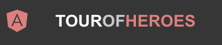
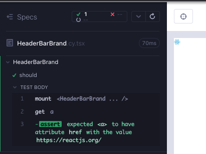
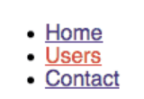
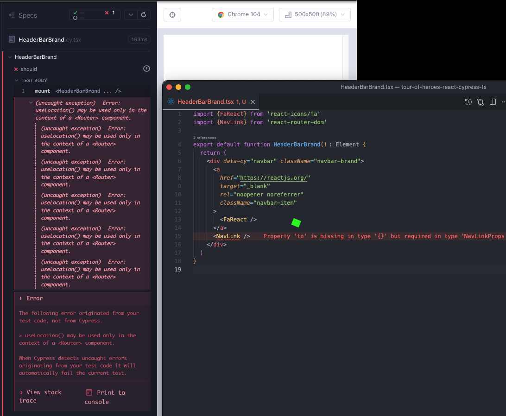
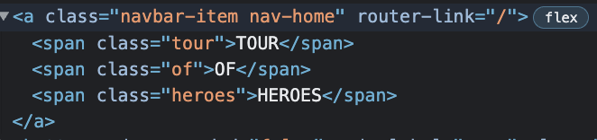
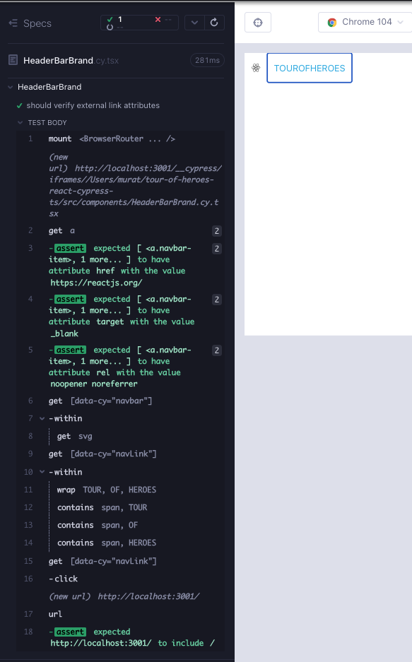

# HeaderBarBrand

This is what our component might look like eventually. We need two links; one to https://reactjs.org/ the other to `/heroes` route of our app. We need the React icon displayed and some css for the text.



Create a branch `feat/headerBarBrand`. Create 2 files under `src/components/` folder; `HeaderBarBrand.cy.tsx`, `HeaderBarBrand.tsx`. As usual, start minimal with a component rendering; copy the below to the files and execute the test after opening the runner with `yarn cy:open-ct`.

```tsx
// src/components/HeaderBarBrand.cy.tsx
import HeaderBarBrand from "./HeaderBarBrand";
import "../styles.scss";

describe("HeaderBarBrand", () => {
  it("should", () => {
    cy.mount(<HeaderBarBrand />);
  });
});
```

```tsx
// src/components/HeaderBarBrand.tsx

export default function HeaderBarBrand() {
  return <div>hello</div>;
}
```

## Link to the external address

We need a `div` wrapping two links. Let's start with the easier one in a failing test (Red 1).

```tsx
// src/components/HeaderBarBrand.cy.tsx
import HeaderBarBrand from "./HeaderBarBrand";
import "../styles.scss";

describe("HeaderBarBrand", () => {
  it("should", () => {
    cy.mount(<HeaderBarBrand />);
    cy.get("a").should("have.attr", "href", "https://reactjs.org/");
  });
});
```

Add the link to the component to make the test pass (Green 1).

```tsx
// src/components/HeaderBarBrand.tsx

export default function HeaderBarBrand() {
  return (
    <div>
      <a href="https://reactjs.org/" />
    </div>
  );
}
```

Let's click that link and see if there is any navigation. Cypress runner will complain that the element is not visible (Red 2).

```tsx
// src/components/HeaderBarBrand.cy.tsx
import HeaderBarBrand from "./HeaderBarBrand";
import "../styles.scss";

describe("HeaderBarBrand", () => {
  it("should", () => {
    cy.mount(<HeaderBarBrand />);
    cy.get("a").should("have.attr", "href", "https://reactjs.org/").click();
  });
});
```


We could add a force to the click operation `.click({force: true})`, but let's do better. We installed `react-icons` in the first chapter, therefore we can import `FaReact` (Green 2) .

For now, remove the `.click()` in the test, and just check for visibility.

```tsx
// src/components/HeaderBarBrand.tsx
import { FaReact } from "react-icons/fa";

export default function HeaderBarBrand() {
  return (
    <div>
      <a href="https://reactjs.org/">
        <FaReact />
      </a>
    </div>
  );
}
```

```tsx
// src/components/HeaderBarBrand.cy.tsx
import HeaderBarBrand from "./HeaderBarBrand";
import "../styles.scss";

describe("HeaderBarBrand", () => {
  it("should", () => {
    cy.mount(<HeaderBarBrand />);
    cy.get("a")
      .should("have.attr", "href", "https://reactjs.org/")
      .should("be.visible");
  });
});
```

The icon renders (Green 2).



We want the link to open a new tab to https://reactjs.org. We can achieve this by adding `target='_blank'` and `rel="noopener noreferrer">` attributes to the link. Let's write a failing test for the new functionality (Red 3).

```tsx
// src/components/HeaderBarBrand.tsx
import HeaderBarBrand from "./HeaderBarBrand";
import "../styles.scss";

describe("HeaderBarBrand", () => {
  it("should", () => {
    cy.mount(<HeaderBarBrand />);
    cy.get("a")
      .should("have.attr", "href", "https://reactjs.org/")
      .and("have.attr", "target", "_blank")
      .and("have.attr", "rel", "noopener noreferrer");
  });
});
```

We add the attributes to the component to have the test pass (Green 3).

```tsx
// src/components/HeaderBarBrand.tsx
import { FaReact } from "react-icons/fa";

export default function HeaderBarBrand() {
  return (
    <div>
      <a href="https://reactjs.org/" target="_blank" rel="noopener noreferrer">
        <FaReact />
      </a>
    </div>
  );
}
```

> There are [3 ways to deal with a 2nd tab](https://glebbahmutov.com/blog/cypress-second-tab/) in Cypress. Our approach is low cost and confident; no need to click and navigate out of the component.

Looking at the css, we have classes `navbar-brand` and `navbar-item`. We can add those to make the render look better (Refactor 3).

```tsx
// src/components/HeaderBarBrand.tsx
import { FaReact } from "react-icons/fa";

export default function HeaderBarBrand() {
  return (
    <div className="navbar-brand">
      <a
        href="https://reactjs.org/"
        target="_blank"
        rel="noopener noreferrer"
        className="navbar-item"
      >
        <FaReact />
      </a>
    </div>
  );
}
```

At the moment we are only checking the link. We could also verify that there is an `svg` inside the component. We want to have a `data-cy` attribute for the component instead of referring to with a css selector. Let's add a failing test for it (Red 4).

```tsx
// src/components/HeaderBarBrand.tsx
import HeaderBarBrand from "./HeaderBarBrand";
import "../styles.scss";

describe("HeaderBarBrand", () => {
  it("should", () => {
    cy.mount(<HeaderBarBrand />);
    cy.get("a")
      .should("have.attr", "href", "https://reactjs.org/")
      .and("have.attr", "target", "_blank")
      .and("have.attr", "rel", "noopener noreferrer");
    cy.getByCy("header-bar-brand").within(() => cy.get("svg"));
  });
});
```

Include the `data-cy` attribute in the component and we are done with the link portion of the component.

```tsx
// src/components/HeaderBarBrand.tsx
import { FaReact } from "react-icons/fa";

export default function HeaderBarBrand() {
  return (
    <div data-cy="header-bar-brand" className="navbar-brand">
      <a
        href="https://reactjs.org/"
        target="_blank"
        rel="noopener noreferrer"
        className="navbar-item"
      >
        <FaReact />
      </a>
    </div>
  );
}
```

## Link to the `/heroes` route

We are going to be using `react-router` as the routing solution in our app. React Router's `Link` component is used to navigate the different routes on the app, and `NavLink` is used to add the style attributes to the active routes so that the user has a visual indication for the route they are on. We will opt to `NavLink`. Here is a sample snap showing the link highlight feature of `NavLink`.



Add React-router to our app with `yarn add react-router-dom`. Add the `NavLink` under the `div` and let's see what things are looking like.

```tsx
// src/components/HeaderBarBrand.tsx
import { FaReact } from "react-icons/fa";
import { NavLink } from "react-router-dom";

export default function HeaderBarBrand() {
  return (
    <div data-cy="header-bar-brand" className="navbar-brand">
      <a
        href="https://reactjs.org/"
        target="_blank"
        rel="noopener noreferrer"
        className="navbar-item"
      >
        <FaReact />
      </a>
      <NavLink />
    </div>
  );
}
```

We get two failures. One is a compiler warning about a missing attribute, the other is the `react-router` being used without wrapping the component in a `Router` component (Red 5). This one is another component test error we would like to get familiar with.



We can address the compiler warning by adding a `to` attribute to `NavLink` (Green 5).

```tsx
// src/components/HeaderBarBrand.tsx
import { FaReact } from "react-icons/fa";
import { NavLink } from "react-router-dom";

export default function HeaderBarBrand() {
  return (
    <div data-cy="header-bar-brand" className="navbar-brand">
      <a
        href="https://reactjs.org/"
        target="_blank"
        rel="noopener noreferrer"
        className="navbar-item"
      >
        <FaReact />
      </a>
      <NavLink to="/" />
    </div>
  );
}
```

We can address the component test failure by wrapping the mounted component in `BrowserRouter`. This is something we will see often see in the future component tests that have to do with routing.

```tsx
// src/components/HeaderBarBrand.cy.tsx
import HeaderBarBrand from "./HeaderBarBrand";
import { BrowserRouter } from "react-router-dom";
import "../styles.scss";

tsxdescribe("HeaderBarBrand", () => {
  it("should", () => {
    cy.mount(
      <BrowserRouter>
        <HeaderBarBrand />
      </BrowserRouter>
    );
    cy.get("a")
      .should("have.attr", "href", "https://reactjs.org/")
      .and("have.attr", "target", "_blank")
      .and("have.attr", "rel", "noopener noreferrer");
    cy.getByCy("header-bar-brand").within(() => cy.get("svg"));
  });
});
```

The test is green again, but there is no visual difference. We are using the [Angular version of the app](https://papa-heroes-angular.azurewebsites.net/heroes) as the requirements specification. From there we can see that the text is three spans with different styles. We can also add the css classes to the `NavLink`.



We can write a new failing test checking for this content. We want to check that `NavLink` is rendered, and we want to verify the strings under the spans. We can also verify that when clicking on this link, we are at the home route (Red 6). There is no concept of url in a Cypress component test, however clicking on links does indeed change a url value, which we can verify.

```tsx
// src/components/HeaderBarBrand.cy.tsx
import HeaderBarBrand from "./HeaderBarBrand";
import { BrowserRouter } from "react-router-dom";
import "../styles.scss";

describe("HeaderBarBrand", () => {
  it("should verify external link attributes", () => {
    cy.mount(
      <BrowserRouter>
        <HeaderBarBrand />
      </BrowserRouter>
    );

    cy.get("a")
      .should("have.attr", "href", "https://reactjs.org/")
      .and("have.attr", "target", "_blank")
      .and("have.attr", "rel", "noopener noreferrer");
    cy.getByCy("header-bar-brand").within(() => cy.get("svg"));

    cy.getByCy("navLink").within(() =>
      ["TOUR", "OF", "HEROES"].forEach((part: string) =>
        cy.contains("span", part)
      )
    );
    cy.getByCy("navLink").click();
    cy.url().should("contain", "/");
  });
});
```

To address the failures, we add the `data-cy` attribute, and copy the DOM structure from the Angular version of the app (Green 6).

```tsx
// src/components/HeaderBarBrand.tsx
import { FaReact } from "react-icons/fa";
import { NavLink } from "react-router-dom";

export default function HeaderBarBrand() {
  return (
    <div data-cy="header-bar-brand" className="navbar-brand">
      <a
        href="https://reactjs.org/"
        target="_blank"
        rel="noopener noreferrer"
        className="navbar-item"
        data-cy="header-bar-brand-link"
      >
        <div data-cy="react-icon-svg">
          <FaReact />
        </div>
      </a>
      <NavLink data-cy="navLink" to="/" className="navbar-item navbar-home">
        <span className="tour">TOUR</span>
        <span className="of">OF</span>
        <span className="heroes">HEROES</span>
      </NavLink>
    </div>
  );
}
```



There is a possible test refactor at this point, should we segregate the test in to two distinct parts, or should it be all under a single `it` block?

A Cypress component test is a small scale e2e; there is no need to keep the tests short to have a smaller blast radius in case of a failure because the runner makes diagnosis easy. What matters from a test perspective is the beginning state of a test; if reaching that state is common, then usually it is an opportunity for a test enhancement vs partial test duplication.

In our case, it is a simple component, we can either keep the test long or use a before hook for the common state (the mounting of the component) and have 2 distinct tests. Here are the two versions (Refactor 6):

> Tip: In a long test [`cy.log()`](https://docs.cypress.io/api/commands/log#Syntax) can be used for delimitation.

```tsx
// src/components/HeaderBarBrand.cy.tsx
// single it block
import HeaderBarBrand from "./HeaderBarBrand";
import { BrowserRouter } from "react-router-dom";
import "../styles.scss";

describe("HeaderBarBrand", () => {
  it("should verify internal and external links", () => {
    cy.mount(
      <BrowserRouter>
        <HeaderBarBrand />
      </BrowserRouter>
    );

    cy.get("a")
      .should("have.attr", "href", "https://reactjs.org/")
      .and("have.attr", "target", "_blank")
      .and("have.attr", "rel", "noopener noreferrer");
    cy.getByCy("header-bar-brand").within(() => cy.get("svg"));

    cy.getByCy("navLink").within(() =>
      ["TOUR", "OF", "HEROES"].forEach((part: string) =>
        cy.contains("span", part)
      )
    );
    cy.getByCy("navLink").click();
    cy.url().should("contain", "/");
  });
});
```

```tsx
// src/components/HeaderBarBrand.cy.tsx
// 2 it blocks with a beforeEach hook for mount
import HeaderBarBrand from "./HeaderBarBrand";
import { BrowserRouter } from "react-router-dom";
import "../styles.scss";

describe("HeaderBarBrand", () => {
  r;
  beforeEach(() => {
    cy.mount(
      <BrowserRouter>
        <HeaderBarBrand />
      </BrowserRouter>
    );
  });

  it("should verify external link attributes", () => {
    cy.get("a")
      .should("have.attr", "href", "https://reactjs.org/")
      .and("have.attr", "target", "_blank")
      .and("have.attr", "rel", "noopener noreferrer");
    cy.getByCy("header-bar-brand").within(() => cy.get("svg"));
  });

  it("should verify internal link spans and navigation", () => {
    cy.getByCy("navLink").within(() =>
      ["TOUR", "OF", "HEROES"].forEach((part: string) =>
        cy.contains("span", part)
      )
    );
    cy.getByCy("navLink").click();
    cy.url().should("contain", "/");
  });
});
```

### RTL version of the component test

```tsx
// src/components/HeaderBarBrand.test.tsx
import HeaderBarBrand from "./HeaderBarBrand";
import { render, screen, within } from "@testing-library/react";
import { BrowserRouter } from "react-router-dom";
import userEvent from "@testing-library/user-event";
import "@testing-library/jest-dom";

describe("HeaderBarBrand", () => {
  beforeEach(() => {
    render(
      <BrowserRouter>
        <HeaderBarBrand />
      </BrowserRouter>
    );
  });
  it("should verify external link attributes", async () => {
    const link = await screen.findByTestId("header-bar-brand-link");
    expect(link).toHaveAttribute("href", "https://reactjs.org/");
    expect(link).toHaveAttribute("target", "_blank");
    expect(link).toHaveAttribute("rel", "noopener noreferrer");

    // not easy to get a tag with RTL, needed to use a test id
    within(await screen.findByTestId("header-bar-brand")).getByTestId(
      "react-icon-svg"
    );
  });

  it("should verify internal link spans and navigation", async () => {
    const navLink = await screen.findByTestId("navLink");
    const withinNavLink = within(navLink);
    ["TOUR", "OF", "HEROES"].map((part) => withinNavLink.getByText(part));

    await userEvent.click(navLink);
    expect(window.location.pathname).toBe("/");
  });
});
```

## Summary

We added a failing test for a link that goes to an href (Red 1).

We added the link to the component (Green 1).

</br>

The icon / link was not visible (Red 2).

We added a `react-icon` and verified the visibility of the link (Green 2).

</br>

We added a failing test for a new feature to open a new tab when clicking on the external link (Red 3).

We added the `target=_blank` and `rel` attributes to the component (Green 3).

We added CSS to make the component look better (Refactor 3).

</br>

We improved the test by making a deeper check and using the `data-cy` selector (Red 4).

Subsequently we improved the component to pass the test (Green 4).

</br>

We added `react-router` and used `NavLink` for the internal link. We got two failures, one for NavLink not having a `to` attribute, the other about the test not being wrapped by a `Router` component (Red 5).

We add the `to` attribute to `NavLink`, and wrapped the mounted component in `BrowserRouter` (Green 5).

</br>

Looking at the [Angular version of the app](https://papa-heroes-angular.azurewebsites.net/heroes), we added new tests for the DOM structure (Red 6).

We improved the component to pass the test (Green 6).

We refactored the test (Refactor 6)

## Takeaways

- There are [3 ways to deal with a 2nd tab](https://glebbahmutov.com/blog/cypress-second-tab/) in Cypress. Most the time it suffices to check for the `href` attribute
- [`react-router`](https://reactrouter.com/en/main) is a de-facto solution to routing in React apps. We use [`NavLink`](https://reactrouter.com/en/main/components/nav-link) with a `to` attribute for navigation.
- For component tests that have to do with `react-router`, wrap the component in `BrowserRouter`.
- There is no concept of url in a Cypress component test, however clicking on links does indeed change a url attribute which we can verify.
- A Cypress component test is a small scale e2e; there is no need to keep the tests short to have a smaller blast radius in case of a failure because the runner makes diagnosis easy. What matters from a test perspective is the beginning state of a test; if reaching that state is common, then usually it is an opportunity for a test enhancement vs partial test duplication.
- In a long test [`cy.log()`](https://docs.cypress.io/api/commands/log#Syntax) can be used for delimitation.
