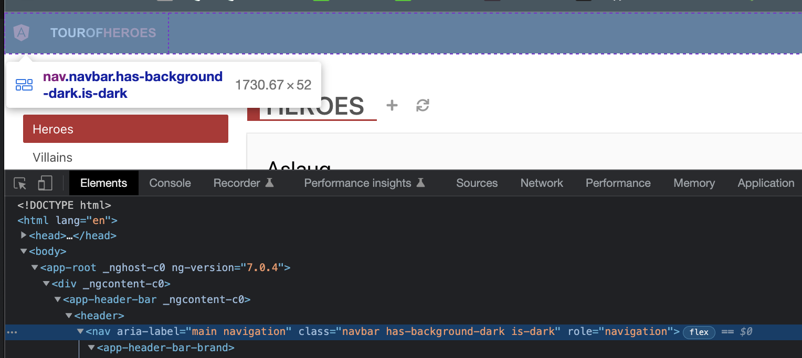
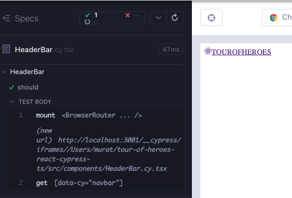

# HeaderBar

In the Angular version of the app, there is a parent component above `HeaderBarBrand`. Let's create it too.



Create a branch `feat/headerBar`. Create 2 files under `src/components/` folder; `HeaderBar.cy.tsx`, `HeaderBar.tsx`. As usual, start minimal with a component rendering; copy the below to the files and execute the test after opening the runner with `yarn cy:open-ct`.

```typescript
// src/components/HeaderBar.cy.tsx
import HeaderBar from "./HeaderBar";

describe("HeaderBar", () => {
  it("should", () => {
    cy.mount(<HeaderBar />);
  });
});
```

```tsx
// src/components/HeaderBar.tsx

export default function HeaderBar() {
  return <div>hello</div>;
}
```

In `HeaderBar` component, which is the child of `HeaderBar`, we added a top level `data-cy` selector with the value of `header-bar-brand`. Let's add a failing test to check the existence of the child component (Red 1).

```tsx
// src/components/HeaderBar.cy.tsx
import HeaderBar from "./HeaderBar";

describe("HeaderBar", () => {
  it("should", () => {
    cy.mount(<HeaderBar />);
    cy.getByCy("header-bar-brand");
  });
});
```

Insert the child component into the parent.

```tsx
// src/components/HeaderBar.tsx
import HeaderBarBrand from "./HeaderBarBrand";

export default function HeaderBar() {
  return (
    <div>
      <HeaderBarBrand />
    </div>
  );
}
```

We get the same `react-router` related error that we got with the `HeaderBarBrand` component. If a child component is using `react-router`, when testing the parent component, we also have to wrap the parent in `BrowserRouter` (Green 1).

```tsx
// src/components/HeaderBar.cy.tsx
import HeaderBar from "./HeaderBar";
import { BrowserRouter } from "react-router-dom";
import "../styles.scss";

describe("HeaderBar", () => {
  it("should", () => {
    cy.mount(
      <BrowserRouter>
        <HeaderBar />
      </BrowserRouter>
    );
    cy.getByCy("header-bar-brand");
  });
});
```

The child component renders.



The specification shows that the child component is wrapped by a `header` and a `nav` There is also some css that gives it the dark theme. We can copy those off of the browser. We also add a `data-cy` selector to the top tag of the component.

```tsx
// src/components/HeaderBar.tsx
import HeaderBarBrand from "./HeaderBarBrand";

export default function HeaderBar() {
  return (
    <header data-cy="header-bar">
      <nav
        className="navbar has-background-dark is-dark"
        role="navigation"
        aria-label="main navigation"
      >
        <HeaderBarBrand />
      </nav>
    </header>
  );
}
```

The component is looking great with CSS.


Realize that we did not necessarily go through a traditional RedGreenRefactor cycle; our Red in this case was the component not rendering in its final form and we kept improving that step by step.

What else can be tested at this point? We do not need to repeat the tests for the child component, because we covered all of it at the child. The only valuable additional check would be to check for an attribute of the `nav` tag. We can easily add that with [Cypress testing library](https://testing-library.com/docs/cypress-testing-library/intro/) (Refactor 1).

```tsx
// src/components/HeaderBar.cy.tsx
import HeaderBar from "./HeaderBar";
import { BrowserRouter } from "react-router-dom";
import "../styles.scss";

describe("HeaderBar", () => {
  it("should", () => {
    cy.mount(
      <BrowserRouter>
        <HeaderBar />
      </BrowserRouter>
    );
    cy.getByCy("header-bar-brand");
    cy.findByRole("navigation");
  });
});
```

## RTL version of the component test

```tsx
// src/components/HeaderBar.test.tsx
import HeaderBar from "./HeaderBar";
import { render, screen } from "@testing-library/react";
import { BrowserRouter } from "react-router-dom";
import "@testing-library/jest-dom";

describe("HeaderBar", () => {
  it("should render error", async () => {
    render(
      <BrowserRouter>
        <HeaderBar />
      </BrowserRouter>
    );
    expect(await screen.findByTestId("header-bar-brand")).toBeVisible();
  });
});
```

## Summary & takeaways

The main takeaway in this section is the parent-child relationship between the components, and a demo of how top level `data-cy` selectors make child components easier to reference in higher level tests.

If a child component is using `react-router`, when testing the parent component we also have to wrap the parent in `BrowserRouter`.

In a parent component, we do not need to repeat the tests for the child component, because we covered all of it at the child. The same thought process applies to higher level tests with e2e.

When designing the component, we do not necessarily have to go through a traditional RedGreenRefactor cycle. When our test tool is also the design tool, our RGR can as well be incremental visual enhancements to the component whilst adding classes and css.
