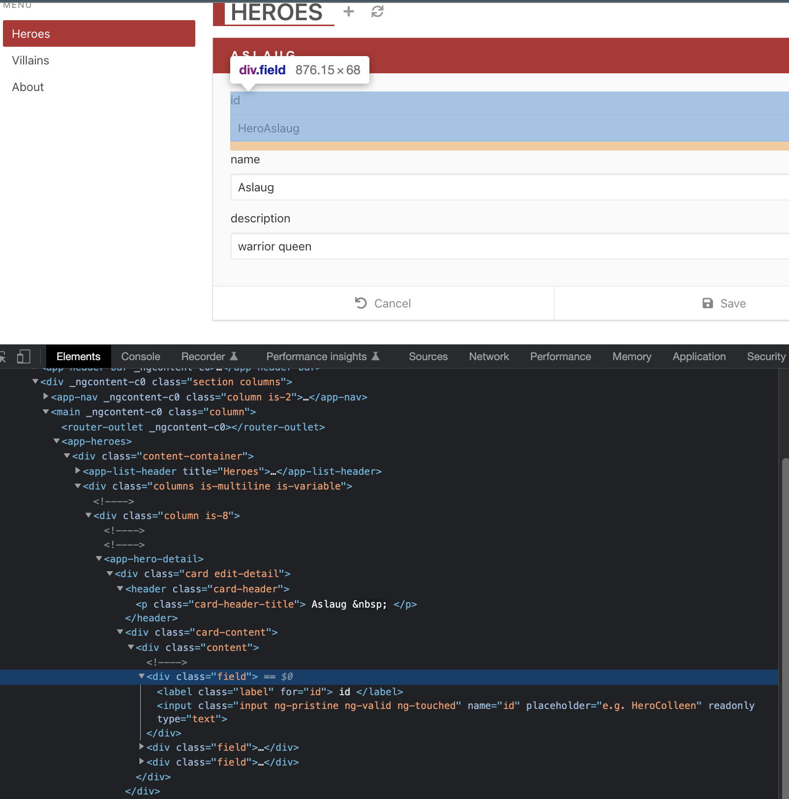
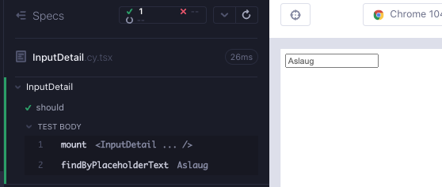

# InputDetail

In the Angular version of the app, we can see that this component will be a `div` wrapping a `label` and an `input`. This is a classic form field.



Create a branch `feat/inputDetail`. Create 2 files under `src/components/` folder; `InputDetail.cy.tsx`, `InputDetail.tsx`. As usual, start minimal with a component rendering; copy the below to the files and execute the test after opening the runner with `yarn cy:open-ct`.

```tsx
// src/components/InputDetail.cy.tsx
import InputDetail from "./InputDetail";

describe("InputDetail", () => {
  it("should", () => {
    cy.mount(<InputDetail />);
  });
});
```

```tsx
// src/components/InputDetail.tsx
export default function InputDetail() {
  return <div>hello</div>;
}
```

Let's add our first failing test. There needs to be an `input` with a placeholder attribute. We can use Testing Library's `findByPlaceholderText` to check for both (Red 1).

```tsx
// src/components/InputDetail.cy.tsx
import InputDetail from "./InputDetail";

describe("InputDetail", () => {
  it("should", () => {
    cy.mount(<InputDetail />);
    cy.findByPlaceholderText("Aslaug");
  });
});
```

We enhance to component, with hard-coding, to pass the test (Green 1).

```tsx
// src/components/InputDetail.tsx
export default function InputDetail() {
  return (
    <div>
      <input placeholder="Aslaug"></input>
    </div>
  );
}
```

We can immediately tell that this needs to be a property, because of the hard-coded value. We enhance the test and the component to accept a prop (Refactor 1).

```tsx
// src/components/InputDetail.cy.tsx
import InputDetail from "./InputDetail";

describe("InputDetail", () => {
  it("should", () => {
    const placeholder = "Aslaug";
    cy.mount(<InputDetail placeholder={placeholder} />);
    cy.findByPlaceholderText(placeholder);
  });
});
```

```tsx
// src/components/InputDetail.tsx
type InputDetailProps = {
  placeholder: string;
};

export default function InputDetail({ placeholder }: InputDetailProps) {
  return (
    <div>
      <input placeholder={placeholder}></input>
    </div>
  );
}
```



The next tag we need is `label`. This is a usual pattern in forms, a `div` wrapping a `label` and an `input` with css & attributes. Let's write a failing test (Red 2).

```tsx
// src/components/InputDetail.cy.tsx
import InputDetail from "./InputDetail";

describe("InputDetail", () => {
  it("should", () => {
    const placeholder = "Aslaug";
    const name = "name";
    cy.mount(<InputDetail name={name} placeholder={placeholder} />);

    cy.contains(name);
    cy.findByPlaceholderText(placeholder);
  });
});
```

Add the new prop to the types, to the component arguments and into a label tag to get a passing test (Green 2).

```tsx
// src/components/InputDetail.tsx
type InputDetailProps = {
  name: string;
  placeholder: string;
};

export default function InputDetail({ name, placeholder }: InputDetailProps) {
  return (
    <div>
      <label>{name}</label>
      <input placeholder={placeholder}></input>
    </div>
  );
}
```

We can add the css from the specification, alongside the usual form field attributes.

`input type="text"` makes an `input` a text input.

`label htmlFor={someValue}` links the `label` and `input` tags (Refactor 2).

```tsx
// src/components/InputDetail.tsx
type InputDetailProps = {
  name: string;
  placeholder: string;
};

export default function InputDetail({ name, placeholder }: InputDetailProps) {
  return (
    <div className="field">
      <label className="label" htmlFor={name}>
        {name}
      </label>
      <input
        name={name}
        placeholder={placeholder}
        className="input"
        type="text"
      ></input>
    </div>
  );
}
```

Form fields also have a `value` attribute, which can be used display a `readonly` value from the network, or writable form fields. For now, let's write a failing test checking for the `defaultValue` of a form, while also adding the styles (Red 3).

```tsx
// src/components/InputDetail.cy.tsx
import InputDetail from "./InputDetail";
import "../styles.scss";

describe("InputDetail", () => {
  it("should", () => {
    const placeholder = "Aslaug";
    const name = "name";
    const value = "some value";
    cy.mount(
      <InputDetail name={name} value={value} placeholder={placeholder} />
    );

    cy.contains(name);
    cy.get("input").should("have.value", value);
    cy.findByPlaceholderText(placeholder);
  });
});
```

We make the test green by adding a `defaultValue` attribute, with a `value` prop. We also add it as a type and as an argument to the component (Green 3).

```tsx
// src/components/InputDetail.tsx
type InputDetailProps = {
  name: string;
  value: string;
  placeholder: string;
};

export default function InputDetail({
  name,
  value,
  placeholder,
}: InputDetailProps) {
  return (
    <div className="field">
      <label className="label" htmlFor={name}>
        {name}
      </label>
      <input
        name={name}
        defaultValue={value}
        placeholder={placeholder}
        className="input"
        type="text"
      ></input>
    </div>
  );
}
```

The component is rendering nicely with the css.


We suggested 2 variants of the form field; a readonly vs a writable field. Let's create two cases. The first test which checks that a field can be modified should pass. The second test checking that the input is readonly should fail for now. We also get a compiler indicator that we are trying to pass a non-existing `readOnly` prop (Red 4).

```tsx
//  src/components/InputDetail.cy.tsx
import InputDetail from "./InputDetail";
import "../styles.scss";

describe("InputDetail", () => {
  it("should allow the input field to be modified", () => {
    const placeholder = "Aslaug";
    const name = "name";
    const value = "some value";
    const newValue = "42";
    cy.mount(
      <InputDetail name={name} value={value} placeholder={placeholder} />
    );

    cy.contains(name);
    cy.findByPlaceholderText(placeholder).clear().type(newValue);
    cy.get("input").should("have.value", newValue);
  });

  it("should not allow the input field to be modified when readonly", () => {
    const placeholder = "Aslaug";
    const name = "name";
    const value = "some value";
    cy.mount(
      <InputDetail
        name={name}
        value={value}
        placeholder={placeholder}
        readOnly={true}
      />
    );

    cy.contains(name);
    cy.findByPlaceholderText(placeholder).should("have.attr", "readOnly");
  });
});
```

We can add the readOnly prop to the types, to the arguments and the readonly attribute of the component to get a passing test (Green 4). At this time, it is worth noting that `name` and `value` are the mandatory fields, and the rest are optional.

```tsx
//  src/components/InputDetail.tsx
type InputDetailProps = {
  name: string;
  value: string;
  placeholder?: string;
  readOnly?: boolean;
};

export default function InputDetail({
  name,
  value,
  placeholder,
  readOnly,
}: InputDetailProps) {
  return (
    <div className="field">
      <label className="label" htmlFor={name}>
        {name}
      </label>
      <input
        name={name}
        defaultValue={value}
        placeholder={placeholder}
        readOnly={readOnly}
        className="input"
        type="text"
      ></input>
    </div>
  );
}
```

The final attribute we need for a form field is `onChange`, in case it is a writable field. Let's enhance the test to check that the `onChange` event is called when the form field changes (Red 5). The value of `onChange` is simply `cy.stub().as('onChange')`

```tsx
//  src/components/InputDetail.cy.tsx
import InputDetail from "./InputDetail";
import "../styles.scss";

describe("InputDetail", () => {
  it("should allow the input field to be modified", () => {
    const placeholder = "Aslaug";
    const name = "name";
    const value = "some value";
    const newValue = "42";
    cy.mount(
      <InputDetail
        name={name}
        value={value}
        placeholder={placeholder}
        onChange={cy.stub().as("onChange")}
      />
    );

    cy.contains(name);
    cy.findByPlaceholderText(placeholder).clear().type(newValue);
    cy.get("input").should("have.value", newValue);
    cy.get("@onChange").should("have.been.called");
  });

  it("should not allow the input field to be modified when readonly", () => {
    const placeholder = "Aslaug";
    const name = "name";
    const value = "some value";
    cy.mount(
      <InputDetail
        name={name}
        value={value}
        placeholder={placeholder}
        readOnly={true}
      />
    );

    cy.contains(name);
    cy.findByPlaceholderText(placeholder).should("have.attr", "readOnly");
    cy.get("input").should("have.value", value);
  });
});
```

To make the test pass, once again we have to add the type for the new prop `onChange`, the prop as the argument to the component, and we need an attribute for the input tag (Green 5).

```tsx
import { ChangeEvent } from "react";

type InputDetailProps = {
  name: string;
  value: string;
  placeholder?: string;
  onChange?: (e: ChangeEvent<HTMLInputElement>) => void;
  readOnly?: boolean;
};

export default function InputDetail({
  name,
  value,
  placeholder,
  onChange,
  readOnly,
}: InputDetailProps) {
  return (
    <div className="field">
      <label className="label" htmlFor={name}>
        {name}
      </label>
      <input
        name={name}
        defaultValue={value}
        placeholder={placeholder}
        onChange={onChange}
        readOnly={readOnly}
        className="input"
        type="text"
      ></input>
    </div>
  );
}
```

We can enhance the test to be more specific with the onChange check. It should be called 2 times when typing 42 (Refactor 5).

```tsx
// src/components/InputDetail.cy.tsx
import InputDetail from "./InputDetail";
import "../styles.scss";

describe("InputDetail", () => {
  const placeholder = "Aslaug";
  const name = "name";
  const value = "some value";
  const newValue = "42";

  it("should allow the input field to be modified", () => {
    cy.mount(
      <InputDetail
        name={name}
        value={value}
        placeholder={placeholder}
        onChange={cy.stub().as("onChange")}
      />
    );

    cy.contains("label", name);
    cy.findByPlaceholderText(placeholder).clear().type(newValue);
    cy.findByDisplayValue(newValue);
    cy.get("@onChange")
      .its("callCount")
      .should("eq", newValue.length + 1);
  });

  it("should not allow the input field to be modified", () => {
    cy.mount(
      <InputDetail
        name={name}
        value={value}
        placeholder={placeholder}
        readOnly={true}
      />
    );

    cy.contains("label", name);
    cy.findByPlaceholderText(placeholder)
      .should("have.value", value)
      .and("have.attr", "readOnly");
  });
});
```

As a final touch up, we add a `data-cy` selector to make the component easier to reference when it is used as a child.

```tsx
import { ChangeEvent } from "react";

type InputDetailProps = {
  name: string;
  value: string;
  placeholder?: string;
  onChange?: (e: ChangeEvent<HTMLInputElement>) => void;
  readOnly?: boolean;
};

export default function InputDetail({
  name,
  value,
  placeholder,
  onChange,
  readOnly,
}: InputDetailProps) {
  return (
    <div data-cy={`input-detail-${name}`} className="field">
      <label className="label" htmlFor={name}>
        {name}
      </label>
      <input
        name={name}
        defaultValue={value}
        placeholder={placeholder}
        onChange={onChange}
        readOnly={readOnly}
        className="input"
        type="text"
      ></input>
    </div>
  );
}
```

## RTL version of the component test

```tsx
// src/components/InputDetail.test.tsx
import InputDetail from "./InputDetail";
import { render, screen } from "@testing-library/react";
import userEvent from "@testing-library/user-event";

describe("InputDetail", () => {
  const placeholder = "Aslaug";
  const name = "name";
  const value = "some value";
  const newValue = "42";

  it("should allow the input field to be modified", async () => {
    const onChange = jest.fn();
    render(
      <InputDetail
        name={name}
        value={value}
        placeholder={placeholder}
        onChange={onChange}
      />
    );

    await screen.findByText(name);
    const inputField = await screen.findByPlaceholderText(placeholder);
    await userEvent.clear(inputField);
    await userEvent.type(inputField, newValue);
    expect(inputField).toHaveDisplayValue(newValue);
    expect(onChange).toHaveBeenCalledTimes(newValue.length);
  });

  it("should not allow the input field to be modified", async () => {
    render(
      <InputDetail
        name={name}
        value={value}
        placeholder={placeholder}
        readOnly={true}
      />
    );

    await screen.findByText(name);
    const inputField = await screen.findByPlaceholderText(placeholder);
    expect(inputField).toHaveDisplayValue(value);
    expect(inputField).toHaveAttribute("readOnly");
  });
});
```

## Summary

We started with an input placeholder text check using Testing Library's `findByPlaceholderText` command (Red 1).

We hard-coded a value for the placeholder attribute to make the test pass (Green 1).

We refactored the hard-coded value to be instead a prop. We added the prop to the types, to the arguments of the component, and we used that argument for the value of the placeholder attribute (Refactor 1).

</br>

We identified a usual pattern in forms; a `div` wrapping a `label` and an `input` with css and attributes. We wrote a failing test that checks for the field name under a label tag (Red 2).

We added the new prop to the types, to the arguments of the component, and to the `label` tag. (Green 2).

We identified a key knowledge on forms that `input type="text"` makes an `input` a text input, `label htmlFor={someValue}` links the `label` and `input` tags. We enhanced the component with this knowledge (Refactor 2).

</br>

We added a test for a new prop `value` / `defaultValue` (Red 3).

As in the previous cycles, we made the test green by adding defaultValue to the type, to the arguments of the component, and to the `input` attribute (Green 3)

</br>

We decided to add support for two variants of the component; one for writable fields, and the other for readonly fields. We added a new test verifying that a readonly field should not be modified (Red 4).

As in the previous cycles, we added the readOnly type, the argument to the component, and the attribute with a matching prop (Green 4).

</br>

Finally, we wanted an `onChange` prop for the field. We added a test checking that the `onChange` event is called while modifying the field (Red 5).

We added the type for the new prop, the argument to the component, and the attribute with a matching prop (Green 5).

We enhanced the test to check for a specific number of `onChange` calls (Refactor 5).

## Takeaways

- When adding a prop to the component test:
  1. Add the prop to the component types.
  2. Add it to the arguments or the component.
  3. Use the prop in the component.
- A `div` wrapping a `label` and an `input` is a usual pattern to create form fields. `input type="text"` makes an `input` a text input, `label htmlFor={someValue}` links the `label` and `input` tags.
