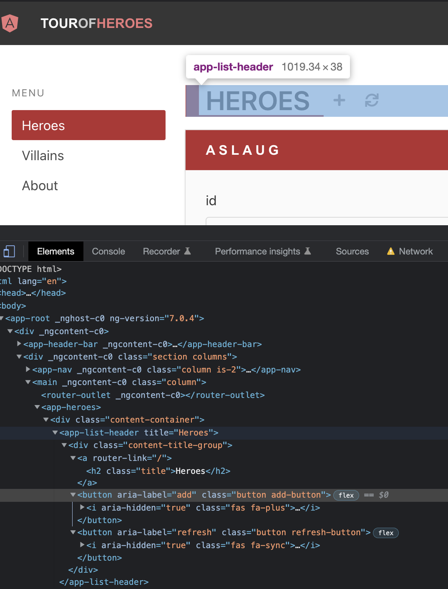
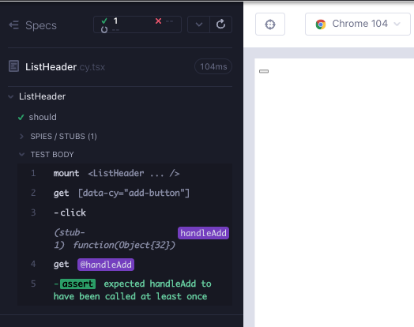
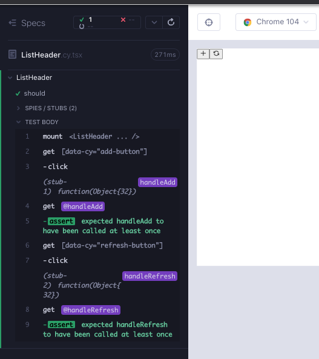
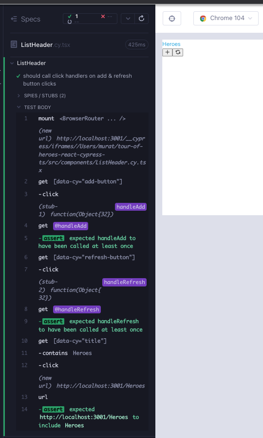
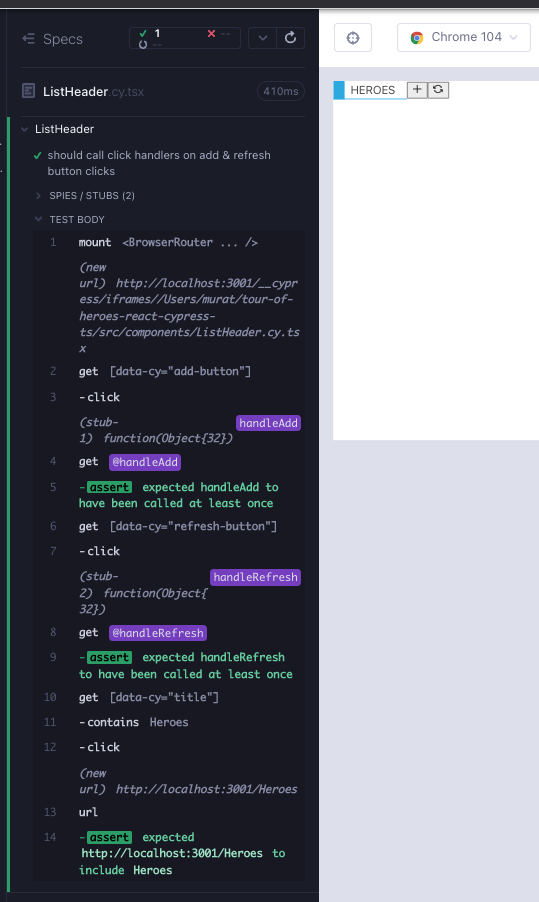

# ListHeader

In the Angular version of the app, we can see that the component will be a `div` wrapping a link and two buttons for add and refresh.



Create a branch `feat/listHeader`. Create 2 files under `src/components/` folder; `ListHeader.cy.tsx`, `ListHeader.tsx`. As usual, start minimal with a component rendering; copy the below to the files and execute the test after opening the runner with `yarn cy:open-ct`.

```tsx
// src/components/ListHeader.cy.tsx
import ListHeader from "./ListHeader";

describe("ListHeader", () => {
  it("should", () => {
    cy.mount(<ListHeader />);
  });
});
```

```tsx
// src/components/ListHeader.tsx

export default function ListHeader() {
  return <div>hello</div>;
}
```

We will start with the add button, and write a failing test (Red 1).

```tsx
// src/components/ListHeader.cy.tsx
import ListHeader from "./ListHeader";
describe("ListHeader", () => {
  it("should", () => {
    cy.mount(<ListHeader />);

    cy.getByCy("add-button");
  });
});
```

We add the `data-cy` attribute for the button to pass the test (Green 1). We also add a `data-cy` attribute for the top level tag, for when the component is used in a larger scale.

```tsx
// src/components/ListHeader.tsx
export default function ListHeader() {
  return (
    <div data-cy="list-header">
      <button data-cy="add-button"></button>
    </div>
  );
}
```

Buttons have `onClick` handlers. We add a test which mounts the component with a prop called `handleAdd` and we expect it to be called upon click (Red 2).

```tsx
// src/components/ListHeader.cy.tsx
import ListHeader from "./ListHeader";

describe("ListHeader", () => {
  it("should", () => {
    cy.mount(<ListHeader handleAdd={cy.stub().as("handleAdd")} />);

    cy.getByCy("add-button").click();
    cy.get("@handleAdd").should("be.called");
  });
});
```

We recall from the previous chapters the flow when adding new props to a component:

\* Add the prop to the types

\* Add it to the arguments or the component

\* Use it in the component.

Here the attribute is `onClick` and it gets added to the `button` tag. We have our first passing test (Green 2).

```tsx
// src/components/ListHeader.tsx
import { MouseEvent } from "react";

type ListHeaderProps = {
  handleAdd: (e: MouseEvent<HTMLButtonElement>) => void;
};

export default function ListHeader({ handleAdd }: ListHeaderProps) {
  return (
    <div data-cy="list-header">
      <button data-cy="add-button" onClick={handleAdd}></button>
    </div>
  );
}
```



We can create another check for the refresh button, with a similar prop and similar assertion, just different name; `handleRefresh` (Red 3).

```tsx
// src/components/ListHeader.cy.tsx
import ListHeader from "./ListHeader";

describe("ListHeader", () => {
  it("should", () => {
    cy.mount(
      <ListHeader
        handleAdd={cy.stub().as("handleAdd")}
        handleRefresh={cy.stub().as("handleRefresh")}
      />
    );

    cy.getByCy("add-button").click();
    cy.get("@handleAdd").should("be.called");

    cy.getByCy("refresh-button").click();
    cy.get("@handleRefresh").should("be.called");
  });
});
```

Adding the prop type, prop argument, and the `onClick` attribute is a mirror of the add button (Green 3).

```tsx
// src/components/ListHeader.tsx
import { MouseEvent } from "react";

type ListHeaderProps = {
  handleAdd: (e: MouseEvent<HTMLButtonElement>) => void;
  handleRefresh: (e: MouseEvent<HTMLButtonElement>) => void;
};

export default function ListHeader({
  handleAdd,
  handleRefresh,
}: ListHeaderProps) {
  return (
    <div data-cy="list-header">
      <button data-cy="add-button" onClick={handleAdd}></button>
      <button data-cy="refresh-button" onClick={handleRefresh}></button>
    </div>
  );
}
```

We can conveniently copy the aria labels from the Angular app (Refactor 3).

```tsx
// src/components/ListHeader.tsx
import { MouseEvent } from "react";

type ListHeaderProps = {
  handleAdd: (e: MouseEvent<HTMLButtonElement>) => void;
  handleRefresh: (e: MouseEvent<HTMLButtonElement>) => void;
};

export default function ListHeader({
  handleAdd,
  handleRefresh,
}: ListHeaderProps) {
  return (
    <div data-cy="list-header">
      <button
        data-cy="add-button"
        onClick={handleAdd}
        aria-label="add"
      ></button>
      <button
        data-cy="refresh-button"
        onClick={handleRefresh}
        aria-label="refresh"
      ></button>
    </div>
  );
}
```

The visuals show that we are missing the icons for the buttons. We can use [react-icons](https://react-icons.github.io/react-icons) to pick any refresh and add icon (Refactor 4). This is another example of our testing tool serving as the design tool in order to aid RedGreenRefactor cycles with incremental visual enhancements.

```tsx
// src/components/ListHeader.tsx
import { MouseEvent } from "react";
import { FiRefreshCcw } from "react-icons/fi";
import { GrAdd } from "react-icons/gr";

type ListHeaderProps = {
  handleAdd: (e: MouseEvent<HTMLButtonElement>) => void;
  handleRefresh: (e: MouseEvent<HTMLButtonElement>) => void;
};

export default function ListHeader({
  handleAdd,
  handleRefresh,
}: ListHeaderProps) {
  return (
    <div data-cy="list-header">
      <button data-cy="add-button" onClick={handleAdd} aria-label="add">
        <GrAdd />
      </button>
      <button
        data-cy="refresh-button"
        onClick={handleRefresh}
        aria-label="refresh"
      >
        <FiRefreshCcw />
      </button>
    </div>
  );
}
```



The final remaining piece is the title link. We write a failing check with a `data-cy` attribute, and we hypothesize that it should contain some text (Red 5).

```tsx
// src/components/ListHeader.cy.tsx
import ListHeader from "./ListHeader";
import "../styles.scss";

describe("ListHeader", () => {
  it("should call click handlers on add & refresh button clicks", () => {
    cy.mount(
      <ListHeader
        handleAdd={cy.stub().as("handleAdd")}
        handleRefresh={cy.stub().as("handleRefresh")}
      />
    );

    cy.getByCy("add-button").click();
    cy.get("@handleAdd").should("be.called");

    cy.getByCy("refresh-button").click();
    cy.get("@handleRefresh").should("be.called");

    cy.getByCy("title").contains("HEROES");
  });
});
```

We make the test pass with a hard-coded title in a link (Green 5).

```tsx
// src/components/ListHeader.tsx
import { MouseEvent } from "react";
import { FiRefreshCcw } from "react-icons/fi";
import { GrAdd } from "react-icons/gr";

type ListHeaderProps = {
  handleAdd: (e: MouseEvent<HTMLButtonElement>) => void;
  handleRefresh: (e: MouseEvent<HTMLButtonElement>) => void;
};

export default function ListHeader({
  handleAdd,
  handleRefresh,
}: ListHeaderProps) {
  return (
    <div data-cy="list-header">
      <a data-cy="title">
        <h2>HEROES</h2>
      </a>
      <button data-cy="add-button" onClick={handleAdd} aria-label="add">
        <GrAdd />
      </button>
      <button
        data-cy="refresh-button"
        onClick={handleRefresh}
        aria-label="refresh"
      >
        <FiRefreshCcw />
      </button>
    </div>
  );
}
```

As with all hard coded value, we recall the pattern of passing it as a prop. We add the prop `title` to the component test (Red 6).

```tsx
// src/components/ListHeader.cy.tsx
import ListHeader from "./ListHeader";
import "../styles.scss";

describe("ListHeader", () => {
  it("should call click handlers on add & refresh button clicks", () => {
    const title = "Heroes";
    cy.mount(
      <ListHeader
        title={title}
        handleAdd={cy.stub().as("handleAdd")}
        handleRefresh={cy.stub().as("handleRefresh")}
      />
    );

    cy.getByCy("add-button").click();
    cy.get("@handleAdd").should("be.called");

    cy.getByCy("refresh-button").click();
    cy.get("@handleRefresh").should("be.called");

    cy.getByCy("title").contains(title);
  });
});
```

We also recall the pattern of passing the prop as a type, a component argument, and a variable in the component render (Green 6).

```tsx
// src/components/ListHeader.tsx
import { MouseEvent } from "react";
import { FiRefreshCcw } from "react-icons/fi";
import { GrAdd } from "react-icons/gr";

type ListHeaderProps = {
  title: string;
  handleAdd: (e: MouseEvent<HTMLButtonElement>) => void;
  handleRefresh: (e: MouseEvent<HTMLButtonElement>) => void;
};

export default function ListHeader({
  title,
  handleAdd,
  handleRefresh,
}: ListHeaderProps) {
  return (
    <div data-cy="list-header">
      <a data-cy="title">
        <h2>{title}</h2>
      </a>
      <button data-cy="add-button" onClick={handleAdd} aria-label="add">
        <GrAdd />
      </button>
      <button
        data-cy="refresh-button"
        onClick={handleRefresh}
        aria-label="refresh"
      >
        <FiRefreshCcw />
      </button>
    </div>
  );
}
```

In the previous component `HeaderBarBrand` we used a `NavLink` from `react-router`.The application hints that this `a` link is in fact a route in our app that can either be Heroes, Villians or About. We use `NavLink` instead of `a`, and `to` attribute is one of the routes. We can enhance the string type to be a union of the 3 possibilities as well (Refactor 6).

```tsx
// src/components/ListHeader.tsx
import { MouseEvent } from "react";
import { NavLink } from "react-router-dom";
import { FiRefreshCcw } from "react-icons/fi";
import { GrAdd } from "react-icons/gr";

type ListHeaderProps = {
  title: "Heroes" | "Villains" | "About";
  handleAdd: (e: MouseEvent<HTMLButtonElement>) => void;
  handleRefresh: (e: MouseEvent<HTMLButtonElement>) => void;
};

export default function ListHeader({
  title,
  handleAdd,
  handleRefresh,
}: ListHeaderProps) {
  return (
    <div data-cy="list-header">
      <NavLink data-cy="title" to={title}>
        <h2>{title}</h2>
      </NavLink>
      <button data-cy="add-button" onClick={handleAdd} aria-label="add">
        <GrAdd />
      </button>
      <button
        data-cy="refresh-button"
        onClick={handleRefresh}
        aria-label="refresh"
      >
        <FiRefreshCcw />
      </button>
    </div>
  );
}
```

With that change, we run into the familiar test error complaining about the `Router` component. Any time we are using `react-router`, we have to wrap the mounted component in `BrowserRouter`.

```tsx
// src/components/ListHeader.cy.tsx
import ListHeader from "./ListHeader";
import { BrowserRouter } from "react-router-dom";
import "../styles.scss";

describe("ListHeader", () => {
  it("should call click handlers on add & refresh button clicks", () => {
    const title = "Heroes";
    cy.mount(
      <BrowserRouter>
        <ListHeader
          title={title}
          handleAdd={cy.stub().as("handleAdd")}
          handleRefresh={cy.stub().as("handleRefresh")}
        />
      </BrowserRouter>
    );

    cy.getByCy("add-button").click();
    cy.get("@handleAdd").should("be.called");

    cy.getByCy("refresh-button").click();
    cy.get("@handleRefresh").should("be.called");

    cy.getByCy("title").contains(title);
  });
});
```

We notice a test enhancement. We can check that when navigating to the route with a click, we end up on that url. We have done this before in the `HeaderBarBrand` component (Refactor 7).

```tsx
// src/components/ListHeader.cy.tsx
import ListHeader from "./ListHeader";
import { BrowserRouter } from "react-router-dom";
import "../styles.scss";

describe("ListHeader", () => {
  it("should call click handlers on add & refresh button clicks", () => {
    const title = "Heroes";
    cy.mount(
      <BrowserRouter>
        <ListHeader
          title={title}
          handleAdd={cy.stub().as("handleAdd")}
          handleRefresh={cy.stub().as("handleRefresh")}
        />
      </BrowserRouter>
    );

    cy.getByCy("add-button").click();
    cy.get("@handleAdd").should("be.called");

    cy.getByCy("refresh-button").click();
    cy.get("@handleRefresh").should("be.called");

    cy.getByCy("title").contains(title).click();
    cy.url().should("contain", title);
  });
});
```



Our test is looking great with high coverage. The render is lacking though. We can copy the css in the wrapper `div` from the original app, and use our test tool as the design tool to aid us in RGF cycles (Refactor 8).

```tsx
// src/components/ListHeader.tsx
import { MouseEvent } from "react";
import { NavLink } from "react-router-dom";
import { FiRefreshCcw } from "react-icons/fi";
import { GrAdd } from "react-icons/gr";

type ListHeaderProps = {
  title: "Heroes" | "Villains" | "About";
  handleAdd: (e: MouseEvent<HTMLButtonElement>) => void;
  handleRefresh: (e: MouseEvent<HTMLButtonElement>) => void;
};

export default function ListHeader({
  title,
  handleAdd,
  handleRefresh,
}: ListHeaderProps) {
  return (
    <div data-cy="list-header" className="content-title-group">
      <NavLink data-cy="title" to={title}>
        <h2>{title}</h2>
      </NavLink>
      <button data-cy="add-button" onClick={handleAdd} aria-label="add">
        <GrAdd />
      </button>
      <button
        data-cy="refresh-button"
        onClick={handleRefresh}
        aria-label="refresh"
      >
        <FiRefreshCcw />
      </button>
    </div>
  );
}
```



## RTL version of the component test

```tsx
// src/components/ListHeader.test.tsx
import ListHeader from "./ListHeader";
import { render, screen } from "@testing-library/react";
import userEvent from "@testing-library/user-event";
import { BrowserRouter } from "react-router-dom";
import "@testing-library/jest-dom";

describe("ListHeader", () => {
  it("should call click handlers on add & refresh button clicks", async () => {
    const handleAdd = jest.fn();
    const handleRefresh = jest.fn();
    const title = "Heroes";
    render(
      <BrowserRouter>
        <ListHeader
          title={title}
          handleAdd={handleAdd}
          handleRefresh={handleRefresh}
        />
      </BrowserRouter>
    );

    await userEvent.click(await screen.findByTestId("add-button"));
    expect(handleAdd).toHaveBeenCalled();

    await userEvent.click(await screen.findByTestId("refresh-button"));
    expect(handleRefresh).toHaveBeenCalled();

    await userEvent.click(await screen.findByText(title));
    expect(window.location.pathname).toBe(`/${title}`);
  });
});
```

## Summary

We started with a failing test for a button click (Red 1, 2).

We enhanced the component to have button with a `data-cy` selector (Green 1) and an onClick handler (Green 2).

</br>

We repeated the same for a refresh button (Red 3, Green 3).

We enhanced the component with aria labels (Refactor 3).

We used the test tool as the visual design tool, and added icons for add and refresh (Refactor 4).

</br>

We added a failing test for a link that contains the title of the list (Red 5).

We made the test pass with a hard-coded title in a link (Green 5).

</br>

We recalled that we prefer to pass hard-coded values as props instead. We added the prop to the component mount in the test (Red 6).

Once again, we added the new prop to the component; types, arguments, and used it in the component (Green 6).

We refactored the `a` tag to be a `NavLink` as in the `HeaderBarBrand` component (Refactor 6).

We enhanced the test with a route url check (Refactor 7).

We enhance the visuals with additional css (Refactor 8).

## Takeaways

- We recalled the pattern of adding props to a component:
  - Add the prop to the types
  - Add it to the arguments or the component
  - Use it in the component.
- The test tool can serve as the design tool in order to aid RedGreenRefactor cycles with incremental visual enhancements.
- Like we saw in chapter one, the key idea is to start with something failing, do the mimimum to get it to work, and then make it better. In this chapter, to make things better at the end, we kept improving the test and the visuals.
