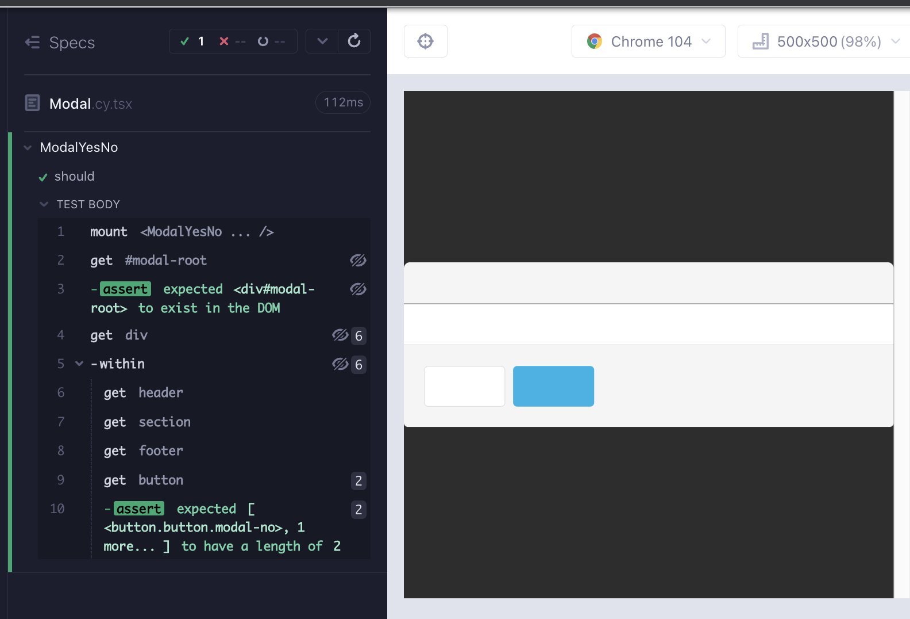

# ModalYesNo

In the Angular version of the app, we can see that the component will be a modal with lots of css, header, section and finally a footer with 2 buttons. For a walking skeleton, we can start with a `div` wrapping `header`, `section`, `footer` and the two buttons under the `footer`.


Create a branch `feat/modalYesNo`. Create 2 files under `src/components/` folder; `ModalYesNo.cy.tsx`, `ModalYesNo.tsx`. As usual, start minimal with a component rendering; copy the below to the files and execute the test after opening the runner with `yarn cy:open-ct`.

```tsx
// src/components/ModalYesNo.cy.tsx
import ModalYesNo from "./ModalYesNo";

describe("ModalYesNo", () => {
  it("should", () => {
    cy.mount(<ModalYesNo />);
  });
});
```

```tsx
// src/components/ModalYesNo.tsx

export default function ModalYesNo() {
  return <div>hello</div>;
}
```

## Modal Portal Recipe

To keep things simple we will use the original recipe from [**React TypeScript Cheatsheet**](https://react-typescript-cheatsheet.netlify.app/), [modal portal](https://react-typescript-cheatsheet.netlify.app/docs/basic/getting-started/portals/) example. Create `src/components/Modal.tsx` and paste-in the following code.

```tsx
/* eslint-disable @typescript-eslint/no-non-null-assertion */
import { useEffect, useRef, ReactNode } from "react";
import { createPortal } from "react-dom";

type ModalProps = {
  children?: ReactNode;
};

const Modal = ({ children }: ModalProps) => {
  const el = useRef(document.createElement("div"));

  let modalRoot = document.getElementById("modal-root");
  if (!modalRoot) {
    modalRoot = document.createElement("div");
    modalRoot.setAttribute("id", "modal-root");
    document.body.appendChild(modalRoot);
  }

  useEffect(() => {
    const currentEl = el.current;

    modalRoot!.appendChild(currentEl);

    return () => {
      modalRoot!.removeChild(currentEl);
    };
  }, [modalRoot]);

  return createPortal(children, el.current);
};

export default Modal;
```

For the moment we will assume that the modal is always open, and write a failing tests the ensures that an element with an id `modal-root` exists in the DOM (Red 1).

```tsx
// src/components/ModalYesNo.cy.tsx
import ModalYesNo from "./ModalYesNo";

describe("ModalYesNo", () => {
  it("should", () => {
    cy.mount(<ModalYesNo />);

    cy.get("#modal-root").should("exist");
  });
});
```

We must import and render `Modal` to pass the test (Green 1).

```tsx
// src/components/ModalYesNo.tsx
import Modal from "./Modal";

export default function ModalYesNo() {
  return <Modal></Modal>;
}
```

We decided on a skeleton of the app with `header`, `section` and `footer` with two buttons. Let's write a failing test for it (Red 2).

```tsx
// src/components/ModalYesNo.cy.tsx
import ModalYesNo from "./ModalYesNo";

describe("ModalYesNo", () => {
  it("should", () => {
    cy.mount(<ModalYesNo />);

    cy.get("#modal-root").should("exist");

    cy.get("div")
      .last()
      .within(() => {
        cy.get("header");
        cy.get("section");
        cy.get("footer");
        cy.get("button").should("have.length", 2);
      });
  });
});
```

We create the walking skeleton of the modal to make the test pass (Green 2).

```tsx
import Modal from "./Modal";

export default function ModalYesNo() {
  return (
    <Modal>
      <div>
        <header></header>
        <section></section>
        <footer>
          <button>No</button>
          <button>Yes</button>
        </footer>
      </div>
    </Modal>
  );
}
```


That is looking a bit bare. Let us copy the styles from the Angular version of the app, and add a few more tags (Refactor 2). Similar to the previous chapter, we are able to do a RedGreenRefactor cycle with visual aids for refactor increments.

```tsx
// src/components/ModalYesNo.tsx
import Modal from "./Modal";

export default function ModalYesNo() {
  return (
    <Modal>
      <div className="modal is-active">
        <div className="modal-background" />
        <div className="modal-card">
          <header className="modal-card-head">
            <p className="modal-card-title"></p>
          </header>
          <section className="modal-card-body"></section>
          <footer className="modal-card-foot card-footer">
            <button className="button modal-no"></button>
            <button className="button is-primary modal-yes"></button>
          </footer>
        </div>
      </div>
    </Modal>
  );
}
```

The test mostly stays the same, the only difference being the import of styles.

```tsx
// src/components/ModalYesNo.cy.tsx
import ModalYesNo from "./ModalYesNo";
import "../styles.scss";

describe("ModalYesNo", () => {
  it("should", () => {
    cy.mount(<ModalYesNo />);

    cy.get("#modal-root").should("exist");

    cy.get("div")
      .last()
      .within(() => {
        cy.get("header");
        cy.get("section");
        cy.get("footer");
        cy.get("button").should("have.length", 2);
      });
  });
});
```

The visuals are looking like the real thing. Now what is remaining are some text, and onClick handlers for the buttons.



There are 4 pieces of text in the modal; the title, the message, and the buttons. Let's write a failing test checking for these strings. We will use hard-coded values, and decide later what can be parameterized (Red 3).

```tsx
// src/components/ModalYesNo.cy.tsx
import ModalYesNo from "./ModalYesNo";
import "../styles.scss";

describe("ModalYesNo", () => {
  it("should", () => {
    cy.mount(<ModalYesNo />);

    cy.get("#modal-root").should("exist");

    cy.get("div")
      .last()
      .within(() => {
        cy.get("header").contains("Confirm");
        cy.get("section").contains("Are you sure?");
        cy.get("footer");
        cy.getByCy("button-yes").contains("Yes");
        cy.getByCy("button-no").contains("No");
      });
  });
});
```

We add the hard-coded strings into respective tags to pass the test (Green 3).

```tsx
// src/components/ModalYesNo.tsx
import Modal from "./Modal";

export default function ModalYesNo() {
  return (
    <Modal>
      <div className="modal is-active">
        <div className="modal-background" />
        <div className="modal-card">
          <header className="modal-card-head">
            <p className="modal-card-title">Confirm</p>
          </header>
          <section className="modal-card-body">Are you sure?</section>
          <footer className="modal-card-foot card-footer">
            <button data-cy="button-no" className="button modal-no">
              No
            </button>
            <button
              data-cy="button-yes"
              className="button is-primary modal-yes"
            >
              Yes
            </button>
          </footer>
        </div>
      </div>
    </Modal>
  );
}
```

With the visuals, we can make a better judgement on what needs to be parameterized. Confirm, No and Yes are most likely to stay constants. The message, if anything, should be parameterized as a prop. It is significant here that the tool is aiding us in the refactoring of the component as well as the design.


We will tweak the test to accept a prop for the message. The test passes, but the TS compiler is warning us against the newly added prop (Red 4). It is significant here that TS also aids us in the RedGreenRefactor cycles.

```tsx
// src/components/ModalYesNo.cy.tsx
import ModalYesNo from "./ModalYesNo";
import "../styles.scss";

describe("ModalYesNo", () => {
  it("should", () => {
    const message = "Are you sure?";
    cy.mount(<ModalYesNo message={message} />);

    cy.get("#modal-root").should("exist");

    cy.get("div")
      .last()
      .within(() => {
        cy.get("header").contains("Confirm");
        cy.get("section").contains(message);
        cy.get("footer");
        cy.getByCy("button-yes").contains("Yes");
        cy.getByCy("button-no").contains("No");
      });
  });
});
```

We follow the well established pattern of adding a prop type, an argument to the component and using the value in the component (Green 4).

```tsx
// src/components/ModalYesNo.tsx
import Modal from "./Modal";

type ModalYesNoProps = {
  message: string;
};

export default function ModalYesNo({ message }: ModalYesNoProps) {
  return (
    <Modal>
      <div className="modal is-active">
        <div className="modal-background" />
        <div className="modal-card">
          <header className="modal-card-head">
            <p className="modal-card-title">Confirm</p>
          </header>
          <section className="modal-card-body">{message}</section>
          <footer className="modal-card-foot card-footer">
            <button data-cy="button-no" className="button modal-no">
              No
            </button>
            <button
              data-cy="button-yes"
              className="button is-primary modal-yes"
            >
              Yes
            </button>
          </footer>
        </div>
      </div>
    </Modal>
  );
}
```

Let's add click handlers for the Yes and No buttons. We are going to need to pass in props and ensure that they are called. Write a failing test (Red 5).

```tsx
// src/components/ModalYesNo.cy.tsx
import ModalYesNo from "./ModalYesNo";
import "../styles.scss";

describe("ModalYesNo", () => {
  it("should", () => {
    const message = "Are you sure?";
    cy.mount(<ModalYesNo message={message} onYes={cy.stub().as("onYes")} />);

    cy.get("#modal-root").should("exist");

    cy.get("div")
      .last()
      .within(() => {
        cy.get("header").contains("Confirm");
        cy.get("section").contains(message);
        cy.get("footer");
        cy.getByCy("button-yes").contains("Yes");
        cy.getByCy("button-no").contains("No");
      });

    cy.getByCy("button-yes").click();
    cy.get("@onYes").should("be.called");
  });
});
```

Add the `onYes` prop type, add it as an argument to the component, and add it alongside a `onClick` attribute to the button.

```tsx
// src/components/ModalYesNo.tsx
import Modal from "./Modal";
import { MouseEvent } from "react";

type ModalYesNoProps = {
  message: string;
  onYes: (e: MouseEvent<HTMLButtonElement>) => void;
};

export default function ModalYesNo({ message, onYes }: ModalYesNoProps) {
  return (
    <Modal>
      <div className="modal is-active">
        <div className="modal-background" />
        <div className="modal-card">
          <header className="modal-card-head">
            <p className="modal-card-title">Confirm</p>
          </header>
          <section className="modal-card-body">{message}</section>
          <footer className="modal-card-foot card-footer">
            <button data-cy="button-no" className="button modal-no">
              No
            </button>
            <button
              data-cy="button-yes"
              onClick={onYes}
              className="button is-primary modal-yes"
            >
              Yes
            </button>
          </footer>
        </div>
      </div>
    </Modal>
  );
}
```

For the next cycle, repeat the same for the No button. As always, we write the failing test first, and then the code to make it pass (Red 6, Green 6).

```tsx
// src/components/ModalYesNo.cy.tsx
import ModalYesNo from "./ModalYesNo";
import "../styles.scss";

describe("ModalYesNo", () => {
  it("should render the modal and call onClick handlers", () => {
    const message = "Are you sure?";
    cy.mount(
      <ModalYesNo
        message={message}
        onYes={cy.stub().as("onYes")}
        onNo={cy.stub().as("onNo")}
      />
    );

    cy.get("#modal-root").should("exist");

    cy.get("div")
      .last()
      .within(() => {
        cy.get("header").contains("Confirm");
        cy.get("section").contains(message);
        cy.get("footer");
        cy.getByCy("button-yes").contains("Yes");
        cy.getByCy("button-no").contains("No");
      });

    cy.getByCy("button-yes").click();
    cy.get("@onYes").should("be.called");

    cy.getByCy("button-no").click();
    cy.get("@onNo").should("be.called");
  });
});
```

```tsx
import Modal from "./Modal";
import { MouseEvent } from "react";

type ModalYesNoProps = {
  message: string;
  onYes: (e: MouseEvent<HTMLButtonElement>) => void;
  onNo: (e: MouseEvent<HTMLButtonElement>) => void;
};

export default function ModalYesNo({ message, onYes, onNo }: ModalYesNoProps) {
  return (
    <Modal>
      <div className="modal is-active">
        <div className="modal-background" />
        <div className="modal-card">
          <header className="modal-card-head">
            <p className="modal-card-title">Confirm</p>
          </header>
          <section className="modal-card-body">{message}</section>
          <footer className="modal-card-foot card-footer">
            <button
              data-cy="button-no"
              onClick={onNo}
              className="button modal-no"
            >
              No
            </button>
            <button
              data-cy="button-yes"
              onClick={onYes}
              className="button is-primary modal-yes"
            >
              Yes
            </button>
          </footer>
        </div>
      </div>
    </Modal>
  );
}
```

The final feature to ponder about is the usage of the modal. It can either be open or closed. Usually this is handled by a `useState` hook, but we can replicate the usage of it with a test. We need a parent component that includes a boolean conditional render. We add a test, with a helper function that allows us to check for this edge case. The only thing we have to do make it work is to add a `data-cy` attribute to the top div of the component (Refactor 6).

```tsx
// src/components/ModalYesNo.cy.tsx
import ModalYesNo from "./ModalYesNo";
import "../styles.scss";

describe("ModalYesNo", () => {
  it("should render the modal and call onClick handlers", () => {
    const message = "Are you sure?";
    cy.mount(
      <ModalYesNo
        message={message}
        onYes={cy.stub().as("onYes")}
        onNo={cy.stub().as("onNo")}
      />
    );

    cy.get("#modal-root").should("exist");

    cy.get("div")
      .last()
      .within(() => {
        cy.get("header").contains("Confirm");
        cy.get("section").contains(message);
        cy.get("footer");
        cy.getByCy("button-yes").contains("Yes");
        cy.getByCy("button-no").contains("No");
      });

    cy.getByCy("button-yes").click();
    cy.get("@onYes").should("be.called");

    cy.getByCy("button-no").click();
    cy.get("@onNo").should("be.called");
  });

  it("should not render the modal with if conditional render is false", () => {
    function ParentComponent(): JSX.Element | boolean {
      return (
        false && (
          <ModalYesNo
            message={"yo"}
            onYes={cy.stub().as("onYes")}
            onNo={cy.stub().as("onNo")}
          />
        )
      );
    }

    // @ts-expect-error: replicating useState
    cy.mount(<ParentComponent />);
    cy.getByCy("modal-yes-no").should("not.exist");
  });
});
```

```tsx
// src/components/ModalYesNo.tsx
import Modal from "./Modal";
import { MouseEvent } from "react";

type ModalYesNoProps = {
  message: string;
  onYes: (e: MouseEvent<HTMLButtonElement>) => void;
  onNo: (e: MouseEvent<HTMLButtonElement>) => void;
};

export default function ModalYesNo({ message, onYes, onNo }: ModalYesNoProps) {
  return (
    <Modal>
      <div data-cy="modal-yes-no" className="modal is-active">
        <div className="modal-background" />
        <div className="modal-card">
          <header className="modal-card-head">
            <p className="modal-card-title">Confirm</p>
          </header>
          <section className="modal-card-body">{message}</section>
          <footer className="modal-card-foot card-footer">
            <button
              data-cy="button-no"
              onClick={onNo}
              className="button modal-no"
            >
              No
            </button>
            <button
              data-cy="button-yes"
              onClick={onYes}
              className="button is-primary modal-yes"
            >
              Yes
            </button>
          </footer>
        </div>
      </div>
    </Modal>
  );
}
```

## RTL version of the component test

```tsx
// src/components/ModalYesNo.test.tsx
import ModalYesNo from "./ModalYesNo";
import { render, screen } from "@testing-library/react";
import userEvent from "@testing-library/user-event";
import "@testing-library/jest-dom";

describe("ModalYesNo", () => {
  const message = "Are you sure?";
  const onYes = jest.fn();
  const onNo = jest.fn();
  it("should render the modal and call onClick handlers", async () => {
    render(<ModalYesNo message={message} onYes={onYes} onNo={onNo} />);

    await screen.findByText("Confirm");
    await screen.findByText(message);

    const buttonYes = await screen.findByTestId("button-yes");
    const buttonNo = await screen.findByTestId("button-no");

    expect(buttonYes).toBeVisible();
    expect(buttonNo).toBeVisible();

    await userEvent.click(buttonYes);
    expect(onYes).toHaveBeenCalled();

    await userEvent.click(buttonNo);
    expect(onNo).toHaveBeenCalled();
  });

  it("should not render the modal with if conditional render is false", async () => {
    function ParentComponent(): JSX.Element | boolean {
      return false && <ModalYesNo message={"yo"} onYes={onYes} onNo={onNo} />;
    }
    // @ts-expect-error: replicating useState
    render(<ParentComponent />);
    expect(screen.queryByTestId("modal-yes-no")).not.toBeInTheDocument();
  });
});
```

## Summary

We started with a simple test that checks that the modal-root is rendered (Red 1).

We used a modal recipe and imported it to our component (Green 1).

</br>

We decided on the skeleton of the component and wrote a test for it (Red 2).

We refactored the component by adding styles. As in the previous chapters, we used visual aids for refactor increments (Refactor 3).

</br>

We wrote a failing test with the 4 pieces of text in the modal, using hard coded values (Red 3)

We added the hard-coded strings into respective tags to pass the test (Green 3).

Aided by the visuals of the component, we made a design choice to parameterize one of the strings, and leave the rest unchanged. It was of significance to be aided by the tool in the refactoring of the component as well as the design.

</br>

We added a prop fo the parameterized string "message" and wrote a failing test for it (Red 4).

We followed the pattern of adding a prop type, an argument to the component and using the value in the function return / render.

</br>

We added click handler tests for the Yes and No buttons (Red 5, 6), and added the props to the component with types, args and onClick attributes (Green 5, 6).

To ensure that the component can be used with conditional rendering, we created a helper function, a parent component that includes a boolean conditional render, in the component test (Refactor 6).

## Takeaway

- The visual results of the component test can aid with refactoring the component as well as designing it.
- As we also saw in chapter one, TypeScript and ESlint can also serve as "tests" that give us a Red.
