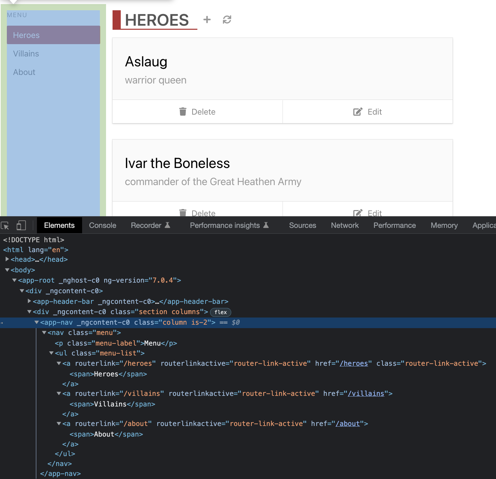
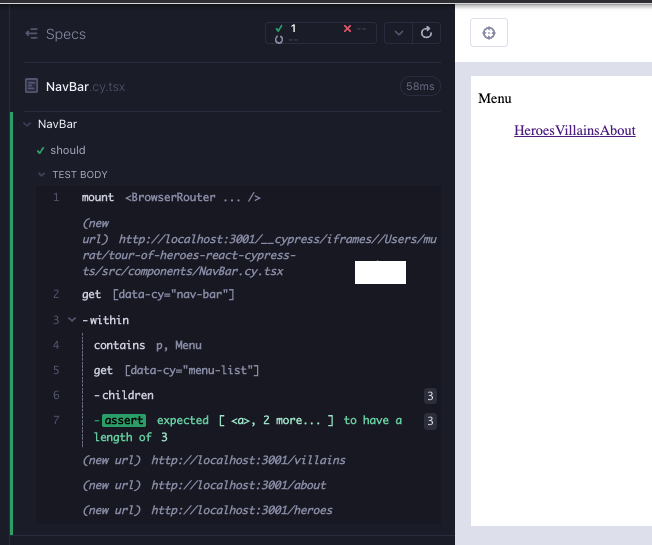
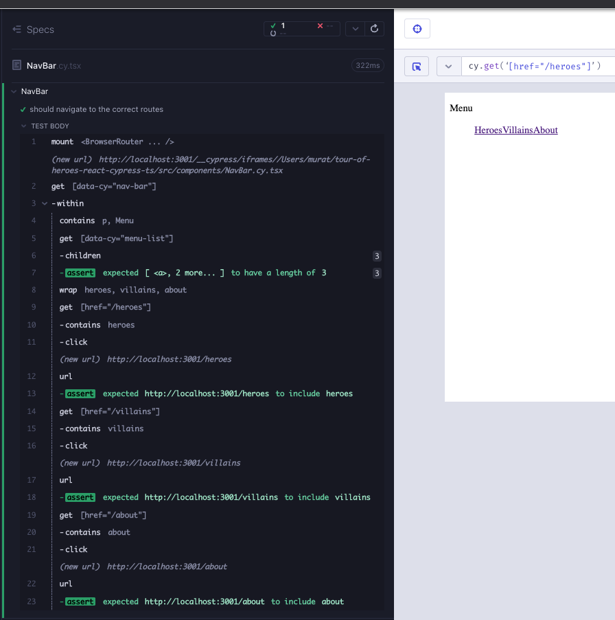
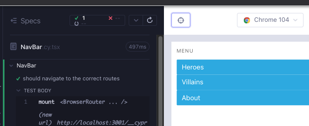
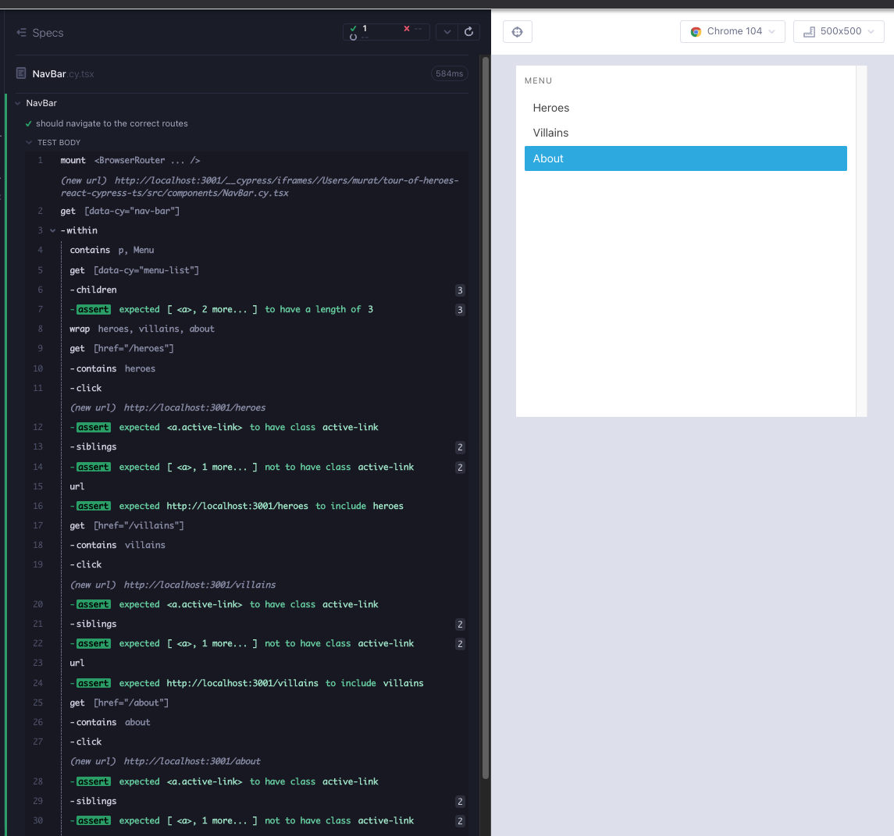

# NavBar

In the Angular version of the app, the component consists of a `nav`, a `p` with a hard-coded string "Menu", a `ul`, and three links to our routes.



Create a branch `feat/NavBar`. Create 2 files under `src/components/` folder; `NavBar.cy.tsx`, `NavBar.tsx`. As usual, start minimal with a component rendering; copy the below to the files and execute the test after opening the runner with `yarn cy:open-ct`.

```tsx
// src/components/NavBar.cy.tsx
import NavBar from "./NavBar";

describe("NavBar", () => {
  it("should", () => {
    cy.mount(<NavBar />);
  });
});
```

```tsx
// src/components/NavBar.tsx

export default function NavBar() {
  return <div>hello</div>;
}
```

We start with a failing test that verifies the skeleton of the component. We want the top tag to have a `data-cy` attribute with the component name, making the component easier to reference when it is used. We can also add `data-cy` attributes for the tags that may be of importance later (Red 1).

```tsx
// src/components/NavBar.cy.tsx
import NavBar from "./NavBar";

describe("NavBar", () => {
  it("should", () => {
    cy.mount(<NavBar />);

    cy.getByCy("nav-bar").within(() => {
      cy.contains("p", "Menu");
      cy.getByCy("menu-list").children().should("have.length", 3);
    });
  });
});
```

The minimal component that passes this test is like so (Green 1):

```tsx
// src/components/NavBar.tsx
export default function NavBar() {
  return (
    <nav data-cy="nav-bar">
      <p>Menu</p>
      <ul data-cy="menu-list">
        <a></a>
        <a></a>
        <a></a>
      </ul>
    </nav>
  );
}
```

In the previous components that had to do with application routes (`HeaderBarBrand`, `ListHeader`), we used `NavLink` from `react-router-dom`. We can refactor the component the same way. The refactor results in a familiar `Router` error we saw in the previous routing related components. In the component test, we wrap the mount with `BrowserRouter` to address the issue (Refactor 1).

```tsx
// src/components/NavBar.tsx
import { NavLink } from "react-router-dom";

export default function NavBar() {
  return (
    <nav data-cy="nav-bar">
      <p>Menu</p>
      <ul data-cy="menu-list">
        <NavLink></NavLink>
        <NavLink></NavLink>
        <NavLink></NavLink>
      </ul>
    </nav>
  );
}
```

```tsx
// src/components/NavBar.tsx
import NavBar from "./NavBar";
import { BrowserRouter } from "react-router-dom";

describe("NavBar", () => {
  it("should", () => {
    cy.mount(
      <BrowserRouter>
        <NavBar />
      </BrowserRouter>
    );

    cy.getByCy("nav-bar").within(() => {
      cy.contains("p", "Menu");
      cy.getByCy("menu-list").children().should("have.length", 3);
    });
  });
});
```

We have a new failure in the test `*(uncaught exception)**TypeError: Cannot read properties of undefined (reading 'pathname')*`. There is also a TS error that gives us a hint `Property 'to' is missing in type '{}' but required in type 'NavLinkProps` (Red 2). We need to enhance the links with `to` attributes (Green 2). It is of significance here that TS also aids us, alongside a failing test, figuring out the source of the failure.

```tsx
// src/components/NavBar.tsx
import { NavLink } from "react-router-dom";

export default function NavBar() {
  return (
    <nav data-cy="nav-bar">
      <p>Menu</p>
      <ul data-cy="menu-list">
        <NavLink to="/heroes">Heroes</NavLink>
        <NavLink to="/villains">Villains</NavLink>
        <NavLink to="/about">About</NavLink>
      </ul>
    </nav>
  );
}
```

We have a walking skeleton of the component.



Any time we have a green test, we can either refactor or add additional tests until we get another red. Let's add some tests which verify that clicking on these routes takes us to the respective urls. The test is similar to what was done in `HeaderBarBrand` and `ListHeader` components. We can use Cypress' selector playground for this enhancement. `cy.get` targeting an `href` is a good selector in this case, which will not change unless the route changes (Green 3).


Adding the route checks, the test is still green.

```tsx
// src/components/NavBar.cy.tsx
import NavBar from "./NavBar";
import { BrowserRouter } from "react-router-dom";

describe("NavBar", () => {
  it("should navigate to the correct routes", () => {
    cy.mount(
      <BrowserRouter>
        <NavBar />
      </BrowserRouter>
    );

    cy.getByCy("nav-bar").within(() => {
      cy.contains("p", "Menu");
      cy.getByCy("menu-list").children().should("have.length", 3);

      cy.get('[href="/heroes"]').click();
      cy.url().should("contain", "heroes");

      cy.get('[href="/villains"]').click();
      cy.url().should("contain", "villains");

      cy.get('[href="/about"]').click();
      cy.url().should("contain", "about");
    });
  });
});
```

The repetition is not looking great. Let's refactor the test a bit (Refactor 3).

```tsx
// src/components/NavBar.cy.tsx
import NavBar from "./NavBar";
import { BrowserRouter } from "react-router-dom";

describe("NavBar", () => {
  it("should navigate to the correct routes", () => {
    cy.mount(
      <BrowserRouter>
        <NavBar />
      </BrowserRouter>
    );

    cy.getByCy("nav-bar").within(() => {
      cy.contains("p", "Menu");
      cy.getByCy("menu-list").children().should("have.length", 3);

      cy.wrap(["heroes", "villains", "about"]).each((route) => {
        cy.get(`[href="/${route}"]`).click();
        cy.url().should("contain", route);
      });
    });
  });
});
```

The test is still green as a part of the refactor. The only additional test we can think of at this time is checking the string in the link. We can indicate that the `route` is of type `string`, and we can match either casing with `{matchCase: false}` (Refactor 3).

```tsx
// src/components/NavBar.cy.tsx
import NavBar from "./NavBar";
import { BrowserRouter } from "react-router-dom";
import "../styles.scss";

describe("NavBar", () => {
  it("should navigate to the correct routes", () => {
    cy.mount(
      <BrowserRouter>
        <NavBar />
      </BrowserRouter>
    );

    cy.getByCy("nav-bar").within(() => {
      cy.contains("p", "Menu");
      cy.getByCy("menu-list").children().should("have.length", 3);

      cy.wrap(["heroes", "villains", "about"]).each((route: string) => {
        cy.get(`[href="/${route}"]`)
          .contains(route, { matchCase: false })
          .click();
        cy.url().should("contain", route);
      });
    });
  });
});
```



We went through RedGreenRefactor cycles, we enhanced the test as much as possible, and we did not get any failures. At this time we can use the test tool as the design tool and enhance the visuals. Let's add the css from the Angular version of the component. Remember to add `import '../styles.scss'` to the component test.

```tsx
// src/components/NavBar.cy.tsx
import { NavLink } from "react-router-dom";

export default function NavBar() {
  return (
    <nav data-cy="nav-bar" className="column is-2 menu">
      <p className="menu-label">Menu</p>
      <ul data-cy="menu-list" className="menu-list">
        <NavLink to="/heroes">Heroes</NavLink>
        <NavLink to="/villains" className="active-link">
          Villains
        </NavLink>
        <NavLink to="/about" className="active-link">
          About
        </NavLink>
      </ul>
    </nav>
  );
}
```

Adding the styles, we realize an issue in the visuals; every link is active all the time (Red 4).

.

Of significance here is component test aiding us as the design tool to create a new failing test. What we need is the active node to have the class `active-link` and the other nodes not to have it. Let's write a failing test (Red 4).

```tsx
// src/components/NavBar.cy.tsx
import NavBar from "./NavBar";
import { BrowserRouter } from "react-router-dom";
import "../styles.scss";

describe("NavBar", () => {
  it("should navigate to the correct routes", () => {
    cy.mount(
      <BrowserRouter>
        <NavBar />
      </BrowserRouter>
    );

    cy.getByCy("nav-bar").within(() => {
      cy.contains("p", "Menu");
      cy.getByCy("menu-list").children().should("have.length", 3);

      cy.wrap(["heroes", "villains", "about"]).each((route: string) => {
        cy.get(`[href="/${route}"]`)
          .contains(route, { matchCase: false })
          .click();
        cy.get(`[href="/${route}"]`).should("have.class", "active-link");
        cy.get(`[href="/${route}"]`)
          .siblings()
          .should("not.have.class", "active-link");
        cy.url().should("contain", route);
      });
    });
  });
});
```

To pass this test, we need a logic per link to have the `active-link` css if the link is active, otherwise have no css (Green 4).

```tsx
// src/components/NavBar.tsx
import { NavLink } from "react-router-dom";

export default function NavBar() {
  return (
    <nav data-cy="nav-bar" className="column is-2 menu">
      <p className="menu-label">Menu</p>
      <ul data-cy="menu-list" className="menu-list">
        <NavLink
          to="/heroes"
          className={(link) => (link.isActive ? "active-link" : "")}
        >
          Heroes
        </NavLink>
        <NavLink
          to="/villains"
          className={(link) => (link.isActive ? "active-link" : "")}
        >
          Villains
        </NavLink>
        <NavLink
          to="/about"
          className={(link) => (link.isActive ? "active-link" : "")}
        >
          About
        </NavLink>
      </ul>
    </nav>
  );
}
```

We can refactor the repeated code into a helper (Refactor 4).

```tsx
// src/components/NavBar.tsx
import { NavLink } from "react-router-dom";

export default function NavBar() {
  const linkIsActive = (link: { isActive: boolean }) =>
    link.isActive ? "active-link" : "";

  return (
    <nav data-cy="nav-bar" className="column is-2 menu">
      <p className="menu-label">Menu</p>
      <ul data-cy="menu-list" className="menu-list">
        <NavLink to="/heroes" className={linkIsActive}>
          Heroes
        </NavLink>
        <NavLink to="/villains" className={linkIsActive}>
          Villains
        </NavLink>
        <NavLink to="/about" className={linkIsActive}>
          About
        </NavLink>
      </ul>
    </nav>
  );
}
```

In the component test, we also realize that the subject `cy.get(`\[href="/${_route_}"]`)` is common to each assertion. We can take advantage of Cypress' chain syntax to lean out the assertions. We can also have a little less hard-coding with the menu length assertion (Refactor 4).

```tsx
// src/components/NavBar.cy.tsx
import NavBar from "./NavBar";
import { BrowserRouter } from "react-router-dom";
import "../styles.scss";

const routes = ["heroes", "villains", "boys", "about"];

describe("NavBar", () => {
  it("should navigate to the correct routes", () => {
    cy.mount(
      <BrowserRouter>
        <NavBar />
      </BrowserRouter>
    );

    cy.contains("p", "Menu");
    cy.getByCy("menu-list").children().should("have.length", routes.length);

    routes.forEach((route: string) => {
      cy.get(`[href="/${route}"]`)
        .contains(route, { matchCase: false })
        .click()
        .should("have.class", "active-link")
        .siblings()
        .should("not.have.class", "active-link");

      cy.url().should("contain", route);
    });
  });
});
```



## RTL version of the component test

```tsx
// src/components/NavBar.test.tsx
import NavBar from "./NavBar";
import { render, screen, within, waitFor } from "@testing-library/react";
import userEvent from "@testing-library/user-event";
import { BrowserRouter } from "react-router-dom";
import "@testing-library/jest-dom";

const routes = ["Heroes", "Villains", "Boys", "About"];

describe("NavBar", () => {
  beforeEach(() => {
    render(
      <BrowserRouter>
        <NavBar />
      </BrowserRouter>
    );
  });

  it("should verify route layout", async () => {
    expect(await screen.findByText("Menu")).toBeVisible();

    const menuList = await screen.findByTestId("menu-list");
    expect(within(menuList).queryAllByRole("link").length).toBe(routes.length);

    routes.forEach((route) => within(menuList).getByText(route));
  });

  it.each(routes)("should navigate to route %s", async (route: string) => {
    const link = async (name: string) => screen.findByRole("link", { name });
    const activeRouteLink = await link(route);
    userEvent.click(activeRouteLink);
    await waitFor(() => expect(activeRouteLink).toHaveClass("active-link"));
    expect(window.location.pathname).toEqual(`/${route.toLowerCase()}`);

    const remainingRoutes = routes.filter((r) => r !== route);
    remainingRoutes.forEach(async (inActiveRoute) => {
      expect(await link(inActiveRoute)).not.toHaveClass("active-link");
    });
  });
});
```

## Summary

We identified the skeleton of the component and wrote a failing test for it (Red 1).

We created a minimal component to pass the test (Green 1).

We refactored the component to use NavLinks instead of anchor tags (Refactor 1)

</br>

We had a test failure, aided by TS errors, about a missing an attribute from the NavLinks (Red 2).

The `to` attributes and their routes got added to the NavLinks (Green 2).

Similar to the previous chapters, of significance here was TS also aiding us, alongside a failing test.

</br>

Any time we have a green test, \*we can either refactor or add additional tests until we get another red\*.

Our preference is adding tests before styles.

We added tests for route checks (Green 3), and refactored the test further (Refactor 3).

</br>

Once we exhausted the tests we can think of, we added styles to the component and realized something off with visuals. Every link was active (Red 4).

We wrote a failing test to double check the styles, using `have.class` vs `not.have.class` assertions (Red 4).

We added logic to the component css to determine the style of active vs inactive links (Green 4).

We refactored the logic to be more DRY (Refactor 4).

Finally, we refactored the component test to take advantage of Cypress' chaining syntax and use less magic numbers (Refactor 4).

## Takeaway

Of significance here was component testing aiding us as the design tool to create a new failing test. We wrote as many tests as we could think of, but only when we saw that all links are always active, we thought about an additional feature.
