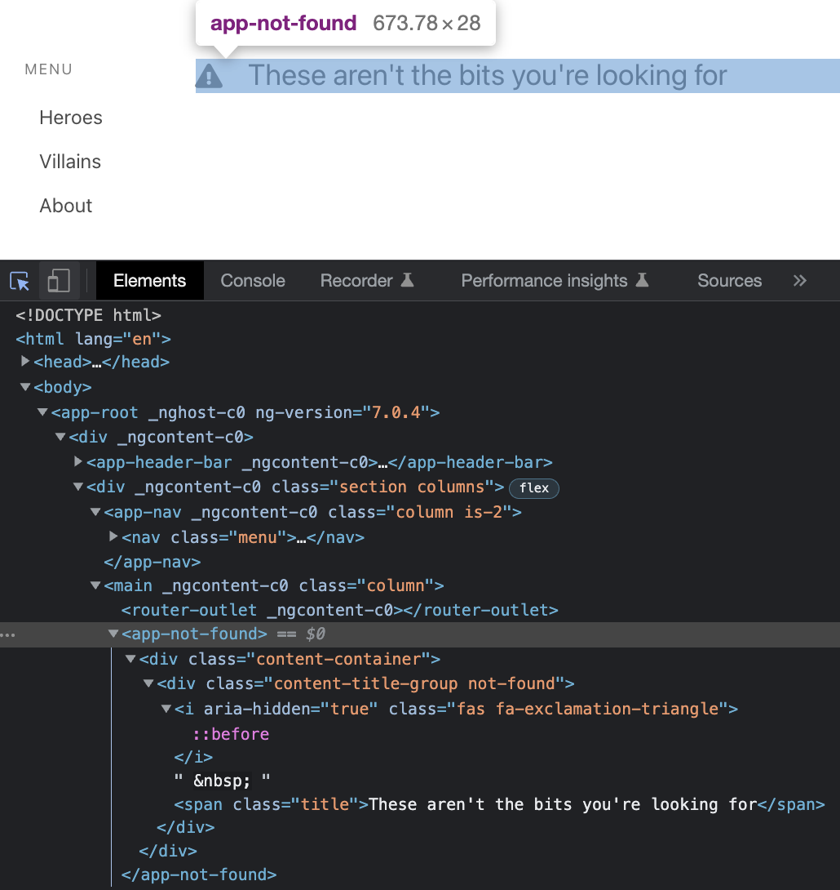
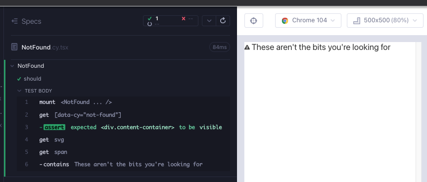

# NotFound

In the Angular version of the app, the component mainly consists of an icon and span, wrapped by divs for styling.



Create a branch `feat/NotFound`. Create 2 files under `src/components/` folder; `NotFound.cy.tsx`, `NotFound.tsx`. As usual, start minimal with a component rendering; copy the below to the files and execute the test after opening the runner with `yarn cy:open-ct`.

```tsx
// src/components/NotFound.cy.tsx
import NotFound from "./NotFound";

describe("NotFound", () => {
  it("should", () => {
    cy.mount(<NotFound />);
  });
});
```

```tsx
// src/components/NotFound.tsx

export default function NotFound() {
  return <div>hello</div>;
}
```

Write a test for the skeleton of the component we would like to have (Red 1). Until now we have been using Cypress' [within](https://docs.cypress.io/api/commands/within). Since we are testing a component and everything is under one tag, using within is optional. We can also import the styles into component at the beginning, since we will do it later as with every component.

```tsx
// src/components/NotFound.cy.tsx
import NotFound from "./NotFound";
import "../styles.scss";

describe("NotFound", () => {
  it("should", () => {
    cy.mount(<NotFound />);

    cy.getByCy("not-found").should("be.visible");
    cy.get("svg");
    cy.get("span").contains("These aren't the bits you're looking for");
  });
});
```

To make the test pass, we create a minimal component (Green 1).

```tsx
// src/components/NotFound.tsx
export default function NotFound() {
  return (
    <div data-cy="not-found">
      <svg />
      <span>These aren't the bits you're looking for</span>
    </div>
  );
}
```

We would like that `svg` to be an actual icon. Let's import a triangle icon with an exclamation inside from [react-icons](https://react-icons.github.io/react-icons/search?q=tria). Of significance here is the test tool aiding our design in a RedGreenRefactor cycle (Refactor 1).

```tsx
// src/components/NotFound.tsx
import { FaExclamationTriangle } from "react-icons/fa";

export default function NotFound() {
  return (
    <div data-cy="not-found">
      <FaExclamationTriangle />
      <span>These aren't the bits you're looking for</span>
    </div>
  );
}
```

This one is a simple component, there aren't any more worthwhile tests to add. All we have left are the styles. We can copy those from the Angular version of the app (Refactor 1).

```tsx
import { FaExclamationTriangle } from "react-icons/fa";

export default function NotFound() {
  return (
    <div data-cy="not-found" className="content-container">
      <div className="content-title-group not-found">
        <div data-cy="exclamation">
          <FaExclamationTriangle />
        </div>
        &nbsp;
        <span className="title">These aren't the bits you're looking for</span>
      </div>
    </div>
  );
}
```



## RTL version of the component test

```tsx
// src/components/NotFound.test.tsx
import NotFound from "./NotFound";
import { render, screen } from "@testing-library/react";
import "@testing-library/jest-dom";

describe("NotFound", () => {
  it("should", async () => {
    render(<NotFound />);

    expect(await screen.findByTestId("not-found")).toBeVisible();
    expect(await screen.findByTestId("exclamation")).toBeVisible();
    expect(
      await screen.findByText("These aren't the bits you're looking for")
    ).toBeVisible();
  });
});
```

## Summary

This one was a simple component where we solidified some of the past learnings.

In a component test, we can immediately setup the styles. In our examples so far this has been a simple import.

It is profitable to take advantage of `react-icons` and / or `styles-icons`.

Cypress component tests can aid our visual design in RedGreenRefactor cycles.
