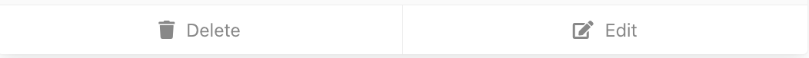
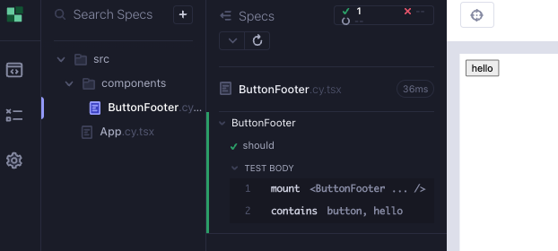
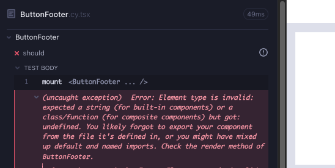
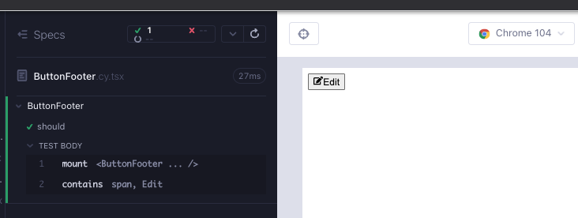
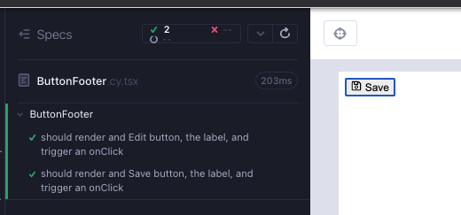

# ButtonFooter

This is what our component might look like eventually. We need a button that wraps a label and CSS icon, the icon and the text can vary.



Create a branch `feat/button-footer`. Create 2 files under `src/components/` folder; `ButtonFooter.cy.tsx`, `ButtonFooter.tsx`.

We start minimal with a test (Red 1).

```tsx
// src/components/ButtonFooter.cy.tsx
import ButtonFooter from "./ButtonFooter";

describe("ButtonFooter", () => {
  it("should", () => {
    cy.mount(<ButtonFooter />);
  });
});
```

The compiler complains that there is no such component, let's make it green (Green 1).

```tsx
// src/components/ButtonFooter.tsx

export default function ButtonFooter() {
  return <div>hello</div>;
}
```

Start the Cypress component test runner and execute the test; `yarn cy:open-ct`.

Let's test that the string renders (Green 1).

```tsx
// src/components/ButtonFooter.cy.tsx
import ButtonFooter from "./ButtonFooter";

describe("ButtonFooter", () => {
  it("should", () => {
    cy.mount(<ButtonFooter />);
    cy.contains("button", "hello");
  });
});
```



Let's have the button wrap a span, the span will include a string.

```ts
// src/components/ButtonFooter.tsx

export default function ButtonFooter() {
  return (
    <button>
      <span>hello</span>
    </button>
  );
}
```

The test is still green because we are looking for the string somewhere in within a button selector. Let's update that to be more specific (Green 1).

```tsx
// src/components/ButtonFooter.cy.tsx
import ButtonFooter from "./ButtonFooter";

describe("ButtonFooter", () => {
  it("should", () => {
    cy.mount(<ButtonFooter />);
    cy.contains("span", "hello");
  });
});
```

We really want that "hello" string to be a variable, a prop that we can pass in to the component. Let's name the variable for the string `label`, and make it a prop. We mount the component with this new prop. The test still passes, but we get compiler error (Red 2).

```tsx
// src/components/ButtonFooter.tsx
import ButtonFooter from "./ButtonFooter";

describe("ButtonFooter", () => {
  it("should", () => {
    const label = "hello";
    cy.mount(<ButtonFooter label={label} />);
    cy.contains("span", label);
  });
});
```

Now we need a passing test. Let's add the prop and its type to the component (Green 2).

```tsx
// src/components/ButtonFooter.tsx

type ButtonFooterProps = {
  label: string;
};

export default function ButtonFooter({ label }: ButtonFooterProps) {
  return (
    <button>
      <span>{label}</span>
    </button>
  );
}
```

Styling is not a major part of this guide, and we prefer to have global styles for most components. In the case of this one, react-icons make a lot of sense, because for each component we can have a specific styling using [react-icons](https://react-icons.github.io/react-icons/)

```bash
yarn add react-icons
yard add -D @types/react-icons
```

Per the specification, we want to be able to use different kinds of icons within the button; Edit, Delete, Save, Cancel. We can have the button wrap that style, and customize it as a prop. We will call the prop `IconClass` specify the possible types.

```tsx
// src/components/ButtonFooter.tsx
import { FaUndo, FaRegSave, FaEdit, FaTrash } from "react-icons/fa";

type ButtonFooterProps = {
  label: string;
  IconClass: typeof FaUndo | typeof FaRegSave | typeof FaEdit | typeof FaTrash;
};

export default function ButtonFooter({ label, IconClass }: ButtonFooterProps) {
  return (
    <button>
      <IconClass />
      <span>{label}</span>
    </button>
  );
}
```

That fails the test because now we have to pass a `IconClass` prop to the component we are mounting. Become familiar with this error; it says we expected some prop but got undefined (Red 3).



If we pass a prop `IconClass` with a value of type `FaEdit`, then our test will pass again (Green 3).

```tsx
// src/components/ButtonFooter.cy.tsx
import ButtonFooter from "./ButtonFooter";
import { FaEdit } from "react-icons/fa";

describe("ButtonFooter", () => {
  it("should", () => {
    const label = "Edit";
    cy.mount(<ButtonFooter label={label} IconClass={FaEdit} />);
    cy.contains("span", label);
  });
});
```



This means we can have different styles, and probably should call a click handler on click. Let's write the test for it (Red 4).

```tsx
// src/components/ButtonFooter.cy.tsx
import ButtonFooter from "./ButtonFooter";
import { FaEdit } from "react-icons/fa";

describe("ButtonFooter", () => {
  it("should", () => {
    const label = "Edit";
    cy.mount(
      <ButtonFooter
        label={label}
        IconClass={FaEdit}
        onClick={cy.stub().as("click")}
      />
    );
    cy.contains("span", label).click();
    cy.get("@click").should("be.called");
  });
});
```

We can immediately tell that we need an `onClick` prop. Let's enhance our component to fulfill this requirement (Green 4).

```tsx
// src/components/ButtonFooter.tsx
import { FaUndo, FaRegSave, FaEdit, FaTrash } from "react-icons/fa";
import { SyntheticEvent } from "react";

type ButtonFooterProps = {
  label: string;
  IconClass: typeof FaUndo | typeof FaRegSave | typeof FaEdit | typeof FaTrash;
  onClick: (e: SyntheticEvent) => void;
};

export default function ButtonFooter({
  label,
  IconClass,
  onClick,
}: ButtonFooterProps) {
  return (
    <button onClick={onClick}>
      <IconClass />
      <span>{label}</span>
    </button>
  );
}
```

We can now enhance our selector, and base it on the `label` string. We keep `cy.contains('span', label)` to make sure there is a span, but we will do the clicking with our `data-cy` selector, which should fail the test (Red 5).

```tsx
// src/components/ButtonFooter.cy.tsx
import ButtonFooter from "./ButtonFooter";
import { FaEdit } from "react-icons/fa";

describe("ButtonFooter", () => {
  it("should", () => {
    const label = "Edit";
    cy.mount(
      <ButtonFooter
        label={label}
        IconClass={FaEdit}
        onClick={cy.stub().as("click")}
      />
    );
    cy.getByCy(`${label.toLowerCase()}-button`).click();
    cy.get("@click").should("be.called");
  });
});
```

Now we can add the data-cy selector to the button attributes. While we are here, we can also add an `aria-label` because it will have a similar value as a freebie (Green 5). Here we can also add a `&nbsp;` a non-breaking space to have a space between the icon and the text for a nicer look.

```tsx
// src/components/ButtonFooter.tsx
import { FaUndo, FaRegSave, FaEdit, FaTrash } from "react-icons/fa";
import { SyntheticEvent } from "react";

type ButtonFooterProps = {
  label: string;
  IconClass: typeof FaUndo | typeof FaRegSave | typeof FaEdit | typeof FaTrash;
  onClick: (e: SyntheticEvent) => void;
};

export default function ButtonFooter({
  label,
  IconClass,
  onClick,
}: ButtonFooterProps) {
  return (
    <button
      data-cy={`${label.toLowerCase()}-button`}
      aria-label={label}
      onClick={onClick}
    >
      <IconClass />
      &nbsp;
      <span>{label}</span>
    </button>
  );
}
```

There is only one line left to cover; we should make sure that the `svg` icon is rendered (Green 5). We can also finalize the name of the test. We are rendering an Edit button, verifying the label and the click operation. It is almost like a small scale e2e test.

```tsx
// src/components/ButtonFooter.cy.tsx
import ButtonFooter from "./ButtonFooter";
import { FaEdit } from "react-icons/fa";

describe("ButtonFooter", () => {
  it("should render and Edit button, the label, and trigger an onClick", () => {
    const label = "Edit";
    cy.mount(
      <ButtonFooter
        label={label}
        IconClass={FaEdit}
        onClick={cy.stub().as("click")}
      />
    );

    cy.contains("span", label);
    cy.get("svg").should("be.visible");

    cy.getByCy(`${label.toLowerCase()}-button`).click();
    cy.get("@click").should("be.called");
  });
});
```

What else can we do with this component? There is only the label and icon props. Let's write another test for a different kind of icon (Green 5).

```tsx
// src/components/ButtonFooter.cy.tsx
import ButtonFooter from "./ButtonFooter";
import { FaEdit, FaRegSave } from "react-icons/fa";

describe("ButtonFooter", () => {
  it("should render and Edit button, the label, and trigger an onClick", () => {
    const label = "Edit";
    cy.mount(
      <ButtonFooter
        label={label}
        IconClass={FaEdit}
        onClick={cy.stub().as("click")}
      />
    );

    cy.contains("span", label);
    cy.get("svg").should("be.visible");

    cy.getByCy(`${label.toLowerCase()}-button`).click();
    cy.get("@click").should("be.called");
  });

  it("should render and Save button, the label, and trigger an onClick", () => {
    const label = "Save";
    cy.mount(
      <ButtonFooter
        label={label}
        IconClass={FaRegSave}
        onClick={cy.stub().as("click")}
      />
    );

    cy.contains("span", label);
    cy.get("svg").should("be.visible");

    cy.getByCy(`${label.toLowerCase()}-button`).click();
    cy.get("@click").should("be.called");
  });
});
```

We do not really like that duplication, we can refactor the test to be drier with a helper function (Refactor 6).

We can add an additional css check, since in the second test we are adding a style to the component.

```tsx
// src/components/ButtonFooter.cy.tsx
import ButtonFooter from "./ButtonFooter";
import { FaEdit, FaRegSave } from "react-icons/fa";

describe("ButtonFooter", () => {
  const doAssertions = (label: string) => {
    cy.contains("span", label);
    cy.get("svg").should("be.visible");

    cy.getByCy(`${label.toLowerCase()}-button`).click();
    cy.get("@click").should("be.called");
  };

  it("should render and Edit button, the label, and trigger an onClick", () => {
    const label = "Edit";
    cy.mount(
      <ButtonFooter
        label={label}
        IconClass={FaEdit}
        onClick={cy.stub().as("click")}
      />
    );

    doAssertions(label);
  });

  it("should render and Save button, the label, and trigger an onClick", () => {
    const label = "Save";
    cy.mount(
      <ButtonFooter
        label={label}
        IconClass={FaRegSave}
        onClick={cy.stub().as("click")}
      />
    );

    doAssertions(label);
  });
});
```



## Summary

We looked at the requirement and wrote a minimal failing test that mounts a component (Red 1).

We added a minimal component to pass the test (Green 1).

We enhanced the test to check a little more `cy.contains('button', 'hello')` (Green 1).

<br />

We made the hard-coded string into a variable in the test, and made it so that it is a prop being passed in to `cy.mount`. (Red 2)

We added the prop `label` and its type to the component (Green 2).

<br />

We added an icon to the component as a new prop and got a failing test (Red 3).

We enhanced the test to also use that new prop (Green 3).

<br />

We added a test for the onClick event (Red 4).

We enhanced the component to accommodate the new feature (Green 4).

<br />

We decided to a data-cy query for the button click (Red 5).

And enhanced the component with the data-cy attribute (Green 5).

We enhanced the test and made sure that the `svg` is rendered (Green 5).

<br />

We increased the test coverage by trying a different component; a Save button (Green 6).

And we refactored the test to be leaner (Refactor 6).

<br />
