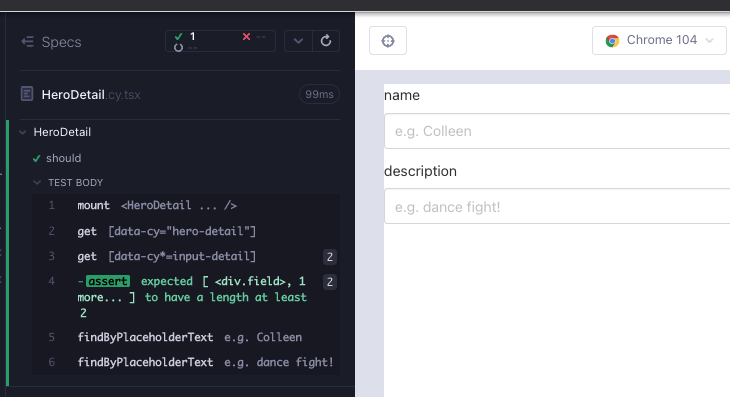
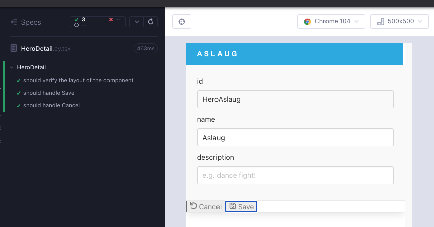

# HeroDetail

We are done with the simpler, child components. From now on we will be focusing on higher level components that use the child components and consider application state.

In the Angular version of the app, we see a component slightly more involved than the others so far. When a component is looking complicated, it is easier to make sense out of it starting at the top level, and moving down layer by layer.

- header
  - `p` with the hero name.
- div/div
  - 3 fields using the `InputDetail` component. The first is `readonly`.
- footer
  - 2 footers using the `ButtonFooter` component; a `Cancel` and a `Save` variant.

Test driven design, engineering and the scientific method are all bound together; breaking the problem down into smaller parts, verifying our progress via tests through short feedback cycles and iterating quickly is common in all these disciplines. What makes Cypress component testing a good fit is the quality and the speed of the feedback cycles. We are developing the front-end, and we are engineering the component with the lights on.


Create a branch `feat/HeroDetail`. Create 2 files under `src/heroes/` folder; `HeroDetail.cy.tsx`, `HeroDetail.tsx`. As usual, start minimal with a component rendering; copy the below to the files and execute the test after opening the runner with `yarn cy:open-ct`.

```tsx
// src/heroes/HeroDetail.cy.tsx
import HeroDetail from "./HeroDetail";
import "../styles.scss";

describe("HeroDetail", () => {
  it("should", () => {
    cy.mount(<HeroDetail />);
  });
});
```

```tsx
// src/heroes/HeroDetail.tsx

export default function HeroDetail() {
  return <div>hello</div>;
}
```

## `header`

Looking at the component high level layers, we can begin to write a failing test with the outline (Red 1).

```tsx
// src/heroes/HeroDetail.cy.tsx
import HeroDetail from "./HeroDetail";
import "../styles.scss";

describe("HeroDetail", () => {
  it("should", () => {
    cy.mount(<HeroDetail />);

    cy.getByCy("hero-detail").contains("my hero");
    cy.contains("header", "my hero");
  });
});
```

We start with the minimal requirement for now; all we need to pass this test is a `data-cy` attribute and header tag which contains a hard coded value (Green 1).

```tsx
// src/heroes/HeroDetail.tsx

export default function HeroDetail() {
  return (
    <div data-cy="hero-detail">
      <header>
        <p>my hero</p>
      </header>
    </div>
  );
}
```

## The 3 form fields

The next tags are the 3 fields for `InputDetail` components, which will constitute the forms fields. Let's check that their length should be 3 (Red 2).

```tsx
// src/heroes/HeroDetail.cy.tsx
import HeroDetail from "./HeroDetail";
import "../styles.scss";

describe("HeroDetail", () => {
  it("should", () => {
    cy.mount(<HeroDetail />);

    cy.getByCy("hero-detail").contains("my hero");
    cy.contains("header", "my hero");
    cy.getByCyLike("input-detail").should("have.length", 3);
  });
});
```

We add the `InputDetail` components under two layers of `divs`, and get a passing test (Green 2).

```tsx
// src/heroes/HeroDetail.tsx
import InputDetail from "../components/InputDetail";

export default function HeroDetail() {
  return (
    <div data-cy="hero-detail">
      <header>
        <p>my hero</p>
      </header>
      <div>
        <div>
          <InputDetail></InputDetail>
          <InputDetail></InputDetail>
          <InputDetail></InputDetail>
        </div>
      </div>
    </div>
  );
}
```


TS is helping us out, notifying that `InputDetail` component should come with some props. If we use the compiler and auto-fix it, it adds the mandatory props (Red 3, Green 3).

```tsx
// src/heroes/HeroDetail.tsx
import InputDetail from "../components/InputDetail";

export default function HeroDetail() {
  return (
    <div data-cy="hero-detail">
      <header>
        <p>my hero</p>
      </header>
      <div>
        <div>
          <InputDetail name={""} value={""}></InputDetail>
          <InputDetail name={""} value={""}></InputDetail>
          <InputDetail name={""} value={""}></InputDetail>
        </div>
      </div>
    </div>
  );
}
```

We can take a look at the specification to begin enhancing our test. We know that the first `InputDetail` field will be `readonly`. The two writable fields should have placeholder texts. [Testing Library examples](https://github.com/testing-library/cypress-testing-library/blob/97939da7d4707a71049884c0324c0eda56e26fc2/cypress/integration/find.spec.js) include two helpful commands to check for text in form fields; `findByDisplayValue`, `findByPlaceholderText` (Red 4).

```tsx
// src/heroes/HeroDetail.cy.tsx
import HeroDetail from "./HeroDetail";
import "../styles.scss";

describe("HeroDetail", () => {
  it("should", () => {
    cy.mount(<HeroDetail />);

    cy.getByCy("hero-detail").contains("my hero");
    cy.contains("header", "my hero");
    cy.getByCyLike("input-detail").should("have.length", 3);

    cy.findByDisplayValue("HeroAslaug").should("be.visible");
    cy.findByPlaceholderText("e.g. Colleen").should("be.visible");
    cy.findByPlaceholderText("e.g. dance fight!").should("be.visible");
  });
});
```

We need to make the test pass. We can grab the field names from the initial application screen shot; the names of the fields should be `id`, `name`, `description`. The value of the first field `id` can be hard-coded for now. The second and third fields have an empty value, and `placeholder` instead. This is the minimal to get a green test (Green 4).

```tsx
// src/heroes/HeroDetail.tsx
import InputDetail from "../components/InputDetail";

export default function HeroDetail() {
  return (
    <div data-cy="hero-detail">
      <header>
        <p>my hero</p>
      </header>
      <div>
        <div>
          <InputDetail name={"id"} value={"HeroAslaug"}></InputDetail>
          <InputDetail
            name={"name"}
            value=""
            placeholder={"e.g. Colleen"}
          ></InputDetail>
          <InputDetail
            name={"description"}
            value=""
            placeholder={"e.g. dance fight!"}
          ></InputDetail>
        </div>
      </div>
    </div>
  );
}
```

Before we start the refactor, it is worthwhile to talk about the shape of the hero data at this point. We will be reading `id` (readonly) from the network, and we will be writing `name` and `description` to the network. Our data is an object with 3 string properties, such as:

```json
{
  "id": "HeroAslaug",
  "name": "Aslaug",
  "description": "warrior queen"
}
```

Let's create an interface with that shape, because we will be using it everywhere. Create a folder and file `./src/models/Hero.ts` and paste the following code:

```typescript
// /src/models/Hero.ts
export interface Hero {
  id: string;
  name: string;
  description: string;
}
```

In our component, placeholder texts are okay being hard-coded, but the `value` props stick out. This gives the hint for a need of state in our app. For now we can hard-code it into the component (Refactor 4).

```tsx
// src/heroes/HeroDetail.tsx
import { Hero } from "../models/Hero";
import InputDetail from "../components/InputDetail";

export default function HeroDetail() {
  const hero: Hero = {
    id: "HeroAslaug",
    name: "",
    description: "",
  };
  return (
    <div data-cy="hero-detail">
      <header>
        <p>my hero</p>
      </header>
      <div>
        <div>
          <InputDetail
            name={"id"}
            value={hero.id}
            readOnly={true}
          ></InputDetail>
          <InputDetail
            name={"name"}
            value={hero.name}
            placeholder="e.g. Colleen"
          ></InputDetail>
          <InputDetail
            name={"description"}
            value={hero.description}
            placeholder="e.g. dance fight!"
          ></InputDetail>
        </div>
      </div>
    </div>
  );
}
```

We can take advantage of TypeScript paths to avoid needing too many `../` folder references. Ensure that `src/tsconfig.json` is as such:

```json
{
  "compilerOptions": {
    "target": "esnext",
    "lib": ["esnext", "dom"],
    "types": ["cypress", "node", "@testing-library/cypress"],
    "baseUrl": "./"
  },
  "include": ["**/*.ts*", "../cypress.d.ts"],
  "extends": "../tsconfig.json"
}
```

Now we can import files from components, models, and in the future hooks in an easier way.

```tsx
// src/heroes/HeroDetail.tsx
import { Hero } from "models/Hero";
import InputDetail from "components/InputDetail";

export default function HeroDetail() {
  const hero: Hero = {
    id: "HeroAslaug",
    name: "",
    description: "",
  };
  return (
    <div data-cy="hero-detail">
      <header>
        <p>my hero</p>
      </header>
      <div>
        <div>
          <InputDetail
            name={"id"}
            value={hero.id}
            readOnly={true}
          ></InputDetail>
          <InputDetail
            name={"name"}
            value={hero.name}
            placeholder="e.g. Colleen"
          ></InputDetail>
          <InputDetail
            name={"description"}
            value={hero.description}
            placeholder="e.g. dance fight!"
          ></InputDetail>
        </div>
      </div>
    </div>
  );
}
```

We are still hard coding "my-hero" into the test and the component. This is obviously `hero.name`, and in the application screen shot it is not even displayed. We need a mechanism to display it whether the network data exists or not. Since the data is hard coded into the component, we will not be able to control it with the tests for now, so we can disable the text checks with `contains('my hero')` for the time being and work on the component.

Our test and component are looking like so at this time:

```tsx
// src/heroes/HeroDetail.cy.tsx
import HeroDetail from "./HeroDetail";
import "../styles.scss";

describe("HeroDetail", () => {
  it("should", () => {
    cy.mount(<HeroDetail />);

    cy.getByCy("hero-detail");
    cy.getByCyLike("input-detail").should("have.length", 3);

    cy.findByDisplayValue("HeroAslaug").should("be.visible");
    cy.findByPlaceholderText("e.g. Colleen").should("be.visible");
    cy.findByPlaceholderText("e.g. dance fight!").should("be.visible");
  });
});
```

```tsx
// src/heroes/HeroDetail.tsx
import { Hero } from "models/Hero";
import InputDetail from "components/InputDetail";

export default function HeroDetail() {
  const hero: Hero = {
    id: "HeroAslaug",
    name: "",
    description: "",
  };
  return (
    <div data-cy="hero-detail">
      <header>
        <p>{hero.name}</p>
      </header>
      <div>
        <div>
          <InputDetail
            name={"id"}
            value={hero.id}
            readOnly={true}
          ></InputDetail>
          <InputDetail
            name={"name"}
            value={hero.name}
            placeholder="e.g. Colleen"
          ></InputDetail>
          <InputDetail
            name={"description"}
            value={hero.description}
            placeholder="e.g. dance fight!"
          ></InputDetail>
        </div>
      </div>
    </div>
  );
}
```

If we enter a string for `hero.name` we can toggle the `p` in the component test runner. We need a similar logic for the id field, because if the data does not exist for `id`, then it does not make sense to display it. We can achieve this with conditional rendering.

```tsx
// src/heroes/HeroDetail.tsx
import { Hero } from "models/Hero";
import InputDetail from "components/InputDetail";

export default function HeroDetail() {
  const hero: Hero = {
    id: "",
    name: "",
    description: "",
  };
  return (
    <div data-cy="hero-detail">
      <header>
        <p>{hero.name}</p>
      </header>
      <div>
        <div>
          {hero.id && (
            <InputDetail
              name={"id"}
              value={hero.id}
              readOnly={true}
            ></InputDetail>
          )}
          <InputDetail
            name={"name"}
            value={hero.name}
            placeholder="e.g. Colleen"
          ></InputDetail>
          <InputDetail
            name={"description"}
            value={hero.description}
            placeholder="e.g. dance fight!"
          ></InputDetail>
        </div>
      </div>
    </div>
  );
}
```

Toggle the `hero.id` value, and the field should also be toggled. We need to tweak the test to be okay with 2 fields or more for now (Refactor 4).

```tsx
// src/heroes/HeroDetail.cy.tsx
import HeroDetail from "./HeroDetail";
import "../styles.scss";

describe("HeroDetail", () => {
  it("should", () => {
    cy.mount(<HeroDetail />);

    // cy.getByCy('hero-detail').contains('my hero')
    // cy.contains('header', 'my hero')
    // cy.getByCyLike('input-detail').should('have.length', 3)
    cy.getByCy("hero-detail");
    cy.getByCyLike("input-detail").should("have.length.gte", 2);

    // cy.findByDisplayValue('HeroAslaug').should('be.visible')
    cy.findByPlaceholderText("e.g. Colleen").should("be.visible");
    cy.findByPlaceholderText("e.g. dance fight!").should("be.visible");
  });
});
```

When there is no `id`, the id field will be disabled vice versa. When there is a name, `p` will show vice versa. These are all test cases we will cover later. It is important to note that while we cannot use the tests to verify the design we need, the fact that the component test is a mini UI application is helping us out for the time being.




We will delay the decisions about state until after we have the full UI layout.

## `footer`

The footer consists of a `footer` tag wrapping 2 `ButtonFooter` components; buttons for `Cancel` and `Save`. Let's write a failing test for it. We are looking at `ButtonFooter` component with the relevant selector; `save-button`, \`cancel-button (Red 5)

```tsx
// src/heroes/HeroDetail.cy.tsx
import HeroDetail from "./HeroDetail";
import "../styles.scss";

describe("HeroDetail", () => {
  it("should verify the layout of the component", () => {
    cy.mount(<HeroDetail />);

    // cy.getByCy('hero-detail').contains('my hero')
    // cy.contains('header', 'my hero')
    // cy.getByCyLike('input-detail').should('have.length', 3)
    cy.getByCy("hero-detail");
    cy.getByCyLike("input-detail").should("have.length.gte", 2);

    // cy.findByDisplayValue('HeroAslaug').should('be.visible')
    cy.findByPlaceholderText("e.g. Colleen").should("be.visible");
    cy.findByPlaceholderText("e.g. dance fight!").should("be.visible");

    cy.getByCy("save-button").should("be.visible");
    cy.getByCy("cancel-button").should("be.visible");
  });
});
```

Adding the `ButtonFooter` child components, we get TS errors as well as a failing test (Red 5).

```tsx
// src/heroes/HeroDetail.tsx
import InputDetail from "components/InputDetail";
import ButtonFooter from "components/ButtonFooter";

export default function HeroDetail() {
  const hero: Hero = {
    id: "HeroAslaug",
    name: "Aslaug",
    description: "",
  };
  return (
    <div data-cy="hero-detail">
      <header>
        <p>{hero.name}</p>
      </header>
      <div>
        <div>
          {hero.id && (
            <InputDetail
              name={"id"}
              value={hero.id}
              readOnly={true}
            ></InputDetail>
          )}
          <InputDetail
            name={"name"}
            value={hero.name}
            placeholder="e.g. Colleen"
          ></InputDetail>
          <InputDetail
            name={"description"}
            value={hero.description}
            placeholder="e.g. dance fight!"
          ></InputDetail>
        </div>
      </div>
      <footer>
        <ButtonFooter />
        <ButtonFooter />
      </footer>
    </div>
  );
}
```

`ButtonFooter` props are `label`, `IconClass` and `onClick`. TS as well as the component test we wrote for it, `/components/ButtonFooter.cy.tsx` serve as documentation. Let's add the missing props looking at that component test. For now, the click handlers can be empty functions. We can grab the icons from [react-icons](https://react-icons.github.io/react-icons/search?q=undo). The `label` can be any string (Green 5).

```tsx
// src/heroes/HeroDetail.tsx
import InputDetail from "components/InputDetail";
import ButtonFooter from "components/ButtonFooter";
import { FaUndo, FaRegSave } from "react-icons/fa";
import { Hero } from "models/Hero";

export default function HeroDetail() {
  const hero: Hero = {
    id: "HeroAslaug",
    name: "Aslaug",
    description: "",
  };
  return (
    <div data-cy="hero-detail">
      <header>
        <p>{hero.name}</p>
      </header>
      <div>
        <div>
          {hero.id && (
            <InputDetail
              name={"id"}
              value={hero.id}
              readOnly={true}
            ></InputDetail>
          )}
          <InputDetail
            name={"name"}
            value={hero.name}
            placeholder="e.g. Colleen"
          ></InputDetail>
          <InputDetail
            name={"description"}
            value={hero.description}
            placeholder="e.g. dance fight!"
          ></InputDetail>
        </div>
      </div>
      <footer>
        <ButtonFooter label="Cancel" IconClass={FaUndo} onClick={() => {}} />
        <ButtonFooter label="Save" IconClass={FaRegSave} onClick={() => {}} />
      </footer>
    </div>
  );
}
```


When saving or cancelling this form, we will be modifying the state, therefore an event should occur. We can write failing tests that spies on `console.log` for now (Red 6).

```tsx
// src/heroes/HeroDetail.cy.tsx
import HeroDetail from "./HeroDetail";
import "../styles.scss";

describe("HeroDetail", () => {
  it("should verify the layout of the component", () => {
    cy.mount(<HeroDetail />);

    // cy.getByCy('hero-detail').contains('my hero')
    // cy.contains('header', 'my hero')
    // cy.getByCyLike('input-detail').should('have.length', 3)
    cy.getByCy("hero-detail");
    cy.getByCyLike("input-detail").should("have.length.gte", 2);

    // cy.findByDisplayValue('HeroAslaug').should('be.visible')
    cy.findByPlaceholderText("e.g. Colleen").should("be.visible");
    cy.findByPlaceholderText("e.g. dance fight!").should("be.visible");

    cy.getByCy("save-button").should("be.visible");
    cy.getByCy("cancel-button").should("be.visible");
  });
  it("should handle Save", () => {
    cy.mount(<HeroDetail />);
    cy.window()
      .its("console")
      .then((console) => cy.spy(console, "log").as("log"));

    cy.getByCy("save-button").click();
    cy.get("@log").should("have.been.calledWith", "handleSave");
  });

  it("should handle Cancel", () => {
    cy.mount(<HeroDetail />);
    cy.window()
      .its("console")
      .then((console) => cy.spy(console, "log").as("log"));

    cy.getByCy("cancel-button").click();

    cy.get("@log").should("have.been.calledWith", "handleCancel");
  });
});
```

We can make the test pass by adding console.logs for the handlers (Green 6).

```tsx
// src/heroes/HeroDetail.tsx
import InputDetail from "components/InputDetail";
import ButtonFooter from "components/ButtonFooter";
import { FaUndo, FaRegSave } from "react-icons/fa";
import { Hero } from "models/Hero";

export default function HeroDetail() {
  const hero: Hero = {
    id: "HeroAslaug",
    name: "Aslaug",
    description: "",
  };
  return (
    <div data-cy="hero-detail">
      <header>
        <p>{hero.name}</p>
      </header>
      <div>
        <div>
          {hero.id && (
            <InputDetail
              name={"id"}
              value={hero.id}
              readOnly={true}
            ></InputDetail>
          )}
          <InputDetail
            name={"name"}
            value={hero.name}
            placeholder="e.g. Colleen"
          ></InputDetail>
          <InputDetail
            name={"description"}
            value={hero.description}
            placeholder="e.g. dance fight!"
          ></InputDetail>
        </div>
      </div>
      <footer>
        <ButtonFooter
          label="Cancel"
          IconClass={FaUndo}
          onClick={() => {
            console.log("handleCancel");
          }}
        />
        <ButtonFooter
          label="Save"
          IconClass={FaRegSave}
          onClick={() => {
            console.log("handleSave");
          }}
        />
      </footer>
    </div>
  );
}
```

We can refactor the console.logs into helper functions (Refactor 6)

```tsx
// src/heroes/HeroDetail.tsx
import InputDetail from "components/InputDetail";
import ButtonFooter from "components/ButtonFooter";
import { FaUndo, FaRegSave } from "react-icons/fa";
import { Hero } from "models/Hero";

export default function HeroDetail() {
  const hero: Hero = {
    id: "HeroAslaug",
    name: "Aslaug",
    description: "",
  };

  const handleCancel = () => console.log("handleCancel");
  const handleSave = () => console.log("handleSave");

  return (
    <div data-cy="hero-detail">
      <header>
        <p>{hero.name}</p>
      </header>
      <div>
        <div>
          {hero.id && (
            <InputDetail
              name={"id"}
              value={hero.id}
              readOnly={true}
            ></InputDetail>
          )}
          <InputDetail
            name={"name"}
            value={hero.name}
            placeholder="e.g. Colleen"
          ></InputDetail>
          <InputDetail
            name={"description"}
            value={hero.description}
            placeholder="e.g. dance fight!"
          ></InputDetail>
        </div>
      </div>
      <footer>
        <ButtonFooter
          label="Cancel"
          IconClass={FaUndo}
          onClick={handleCancel}
        />
        <ButtonFooter label="Save" IconClass={FaRegSave} onClick={handleSave} />
      </footer>
    </div>
  );
}
```

When we save a hero, we will either be creating or updating a hero. If there is no `hero.name` we should be creating it. If there is a `hero.name` we should be updating the hero. Let's create functions for update and save, and enhance `handleSave` with logic. To test it, for now we cantoggle the `name` property, and see the console toggle between `updateHero` and `createHero` when `handleSave` is invoked.

```tsx
// src/heroes/HeroDetail.tsx
import InputDetail from "components/InputDetail";
import ButtonFooter from "components/ButtonFooter";
import { FaUndo, FaRegSave } from "react-icons/fa";
import { Hero } from "models/Hero";

export default function HeroDetail() {
  const hero: Hero = {
    id: "HeroAslaug",
    name: "Aslaug",
    description: "",
  };

  const handleCancel = () => console.log("handleCancel");

  const updateHero = () => console.log("updateHero");
  const createHero = () => console.log("createHero");
  const handleSave = () => {
    console.log("handleSave");
    return hero.name ? updateHero() : createHero();
  };

  return (
    <div data-cy="hero-detail">
      <header>
        <p>{hero.name}</p>
      </header>
      <div>
        <div>
          {hero.id && (
            <InputDetail
              name={"id"}
              value={hero.id}
              readOnly={true}
            ></InputDetail>
          )}
          <InputDetail
            name={"name"}
            value={hero.name}
            placeholder="e.g. Colleen"
          ></InputDetail>
          <InputDetail
            name={"description"}
            value={hero.description}
            placeholder="e.g. dance fight!"
          ></InputDetail>
        </div>
      </div>
      <footer>
        <ButtonFooter
          label="Cancel"
          IconClass={FaUndo}
          onClick={handleCancel}
        />
        <ButtonFooter label="Save" IconClass={FaRegSave} onClick={handleSave} />
      </footer>
    </div>
  );
}
```

Before we move on to the topic of state, let's add styles (Refactor 6).

```tsx
// src/heroes/HeroDetail.tsx
import InputDetail from "components/InputDetail";
import ButtonFooter from "components/ButtonFooter";
import { FaUndo, FaRegSave } from "react-icons/fa";
import { Hero } from "models/Hero";

export default function HeroDetail() {
  const hero: Hero = {
    id: "HeroAslaug",
    name: "Aslaug",
    description: "",
  };

  const handleCancel = () => console.log("handleCancel");

  const updateHero = () => console.log("updateHero");
  const createHero = () => console.log("createHero");
  const handleSave = () => {
    console.log("handleSave");
    return hero.name ? updateHero() : createHero();
  };

  return (
    <div data-cy="hero-detail" className="card edit-detail">
      <header className="card-header">
        <p className="card-header-title">{hero.name}</p>
        &nbsp;
      </header>
      <div className="card-content">
        <div className="content">
          {hero.id && (
            <InputDetail
              name={"id"}
              value={hero.id}
              readOnly={true}
            ></InputDetail>
          )}
          <InputDetail
            name={"name"}
            value={hero.name}
            placeholder="e.g. Colleen"
          ></InputDetail>
          <InputDetail
            name={"description"}
            value={hero.description}
            placeholder="e.g. dance fight!"
          ></InputDetail>
        </div>
      </div>
      <footer className="card-footer">
        <ButtonFooter
          label="Cancel"
          IconClass={FaUndo}
          onClick={handleCancel}
        />
        <ButtonFooter label="Save" IconClass={FaRegSave} onClick={handleSave} />
      </footer>
    </div>
  );
}
```



## State & `useState`

Quoting Kent C. Dodds, in React we can simplify our UI state management into two categories:

1. UI state: modal is open, item is highlighted, etc.
2. Server data

Before implementing any state, we can write tests that scrutinize the layout of the component. Instead of the hard coded `hero` object in the component, we can pass in data with a prop. We either manipulate our components via props or what wraps them, and a prop is the easier choice at the moment. The value of the prop is just our hero object (Red 7).

```tsx
// src/heroes/HeroDetail.cy.tsx
import HeroDetail from "./HeroDetail";
import "../styles.scss";
import { Hero } from "models/Hero";

describe("HeroDetail", () => {
  it("should handle Save", () => {
    cy.mount(<HeroDetail />);
    cy.window()
      .its("console")
      .then((console) => cy.spy(console, "log").as("log"));

    cy.getByCy("save-button").click();
    cy.get("@log").should("have.been.calledWith", "handleSave");
  });

  it("should handle Cancel", () => {
    cy.mount(<HeroDetail />);
    cy.window()
      .its("console")
      .then((console) => cy.spy(console, "log").as("log"));

    cy.getByCy("cancel-button").click();

    cy.get("@log").should("have.been.calledWith", "handleCancel");
  });

  context("state: should verify the layout of the component", () => {
    it("id: false, name: false - should verify the minimal state of the component", () => {
      const hero: Hero = { id: "", name: "", description: "" };
      cy.mount(<HeroDetail hero={hero} />);

      cy.getByCy("hero-detail");
      cy.getByCyLike("input-detail").should("have.length", 2);

      cy.findByPlaceholderText("e.g. Colleen").should("be.visible");
      cy.findByPlaceholderText("e.g. dance fight!").should("be.visible");

      cy.getByCy("save-button").should("be.visible");
      cy.getByCy("cancel-button").should("be.visible");
    });
  });
});
```

Previously we created placeholders for handling save and cancel operations, these would fall into category 2 (server data). We also have state in the name and description fields, and those fall under category 1 (ui state). We always want to prefer to manage state where it is most relevant. The most basic way to do this in React is with `useState` hook. We want to alert React that a value used within a component has changed, and just updating the variable directly won’t do, we need an updater function. In this approach:

1. Consider what state the component needs
2. Display the state
3. Update the state in response to events

`useState` hook returns a value and its updater function in an array of 2, the names are arbitrary. If we want an initial value for the variable, we pass it as an argument to the `useState`

```
const [value, setValue] = useState(initialValue);
```

In our case this can be:

```
const [hero, setHero] = useState(someInitialHeroData);
```

The variable name `someInitialHeroData` is a mouthful. From the perspective of whoever is using `HeroDetail` component, it is just `hero`. From the perspective within the component, it is also `hero`. To resolve this we can alias the name, and create copy of the hero being passed in, using object destructuring.

Like we laid out in the tests, the simplest way to pass in any data to our component is a prop. We can refactor our component to get ready for state management. This way we do not have to have a hard-coded piece of `hero` data in the component, and we can let that be determined by whoever is using the component. Once the prop is passed in, we can use the `useState` hook to handle component state (Green 7).

```tsx
// src/heroes/HeroDetail.tsx
import InputDetail from "components/InputDetail";
import { useState } from "react";
import ButtonFooter from "components/ButtonFooter";
import { FaUndo, FaRegSave } from "react-icons/fa";
import { Hero } from "models/Hero";

type HeroDetailProps = {
  hero: Hero;
};

export default function HeroDetail({ hero: initHero }: HeroDetailProps) {
  const [hero, setHero] = useState<Hero>({ ...initHero });

  const handleCancel = () => console.log("handleCancel");
  const updateHero = () => console.log("updateHero");
  const createHero = () => console.log("createHero");
  const handleSave = () => {
    console.log("handleSave");
    return hero.name ? updateHero() : createHero();
  };

  return (
    <div data-cy="hero-detail" className="card edit-detail">
      <header className="card-header">
        <p className="card-header-title">{hero.name}</p>
        &nbsp;
      </header>
      <div className="card-content">
        <div className="content">
          {hero.id && (
            <InputDetail
              name={"id"}
              value={hero.id}
              readOnly={true}
            ></InputDetail>
          )}
          <InputDetail
            name={"name"}
            value={hero.name}
            placeholder="e.g. Colleen"
          ></InputDetail>
          <InputDetail
            name={"description"}
            value={hero.description}
            placeholder="e.g. dance fight!"
          ></InputDetail>
        </div>
      </div>
      <footer className="card-footer">
        <ButtonFooter
          label="Cancel"
          IconClass={FaUndo}
          onClick={handleCancel}
        />
        <ButtonFooter label="Save" IconClass={FaRegSave} onClick={handleSave} />
      </footer>
    </div>
  );
}
```

ESLint is warning us that `setHero` is not being used. Notice that `InputDetail` has an `onChange` handler, used for writable fields, and that is where `setHero` fits. Let's write two more tests for handling name change and description change. Also, TS is giving us a warning in the handleSave and handleCancel tests about missing props. For all these handleSomething tests, we can just use in a hero object with empty properties as the prop we are passing in to the component (Red 8).

```tsx
// src/heroes/HeroDetail.cy.tsx
import HeroDetail from "./HeroDetail";
import "../styles.scss";
import { Hero } from "models/Hero";
import React from "react";

describe("HeroDetail", () => {
  it("should handle Save", () => {
    const hero: Hero = { id: "", name: "", description: "" };
    cy.mount(<HeroDetail hero={hero} />);
    cy.window()
      .its("console")
      .then((console) => cy.spy(console, "log").as("log"));

    cy.getByCy("save-button").click();
    cy.get("@log").should("have.been.calledWith", "handleSave");
  });

  it("should handle Cancel", () => {
    const hero: Hero = { id: "", name: "", description: "" };
    cy.mount(<HeroDetail hero={hero} />);
    cy.window()
      .its("console")
      .then((console) => cy.spy(console, "log").as("log"));

    cy.getByCy("cancel-button").click();

    cy.get("@log").should("have.been.calledWith", "handleCancel");
  });

  context("handleNameChange, handleDescriptionChange", () => {
    it("should handle name change", () => {
      const hero: Hero = { id: "", name: "", description: "" };
      cy.mount(<HeroDetail hero={hero} />);
      cy.window()
        .its("console")
        .then((console) => cy.spy(console, "log").as("log"));

      cy.getByCy("input-detail-name").type("abc");
      cy.get("@log").should("have.been.calledWith", "handleNameChange");
      cy.get("@log").its("callCount").should("eq", 3);
    });

    it("should handle description change", () => {
      const hero: Hero = { id: "", name: "", description: "" };
      cy.mount(<HeroDetail hero={hero} />);
      cy.window()
        .its("console")
        .then((console) => cy.spy(console, "log").as("log"));

      cy.getByCy("input-detail-description").type("123");
      cy.get("@log").should("have.been.calledWith", "handleDescriptionChange");
      cy.get("@log").its("callCount").should("eq", 3);
    });
  });

  context("state: should verify the layout of the component", () => {
    it("id: false, name: false - should verify the minimal state of the component", () => {
      const hero: Hero = { id: "", name: "", description: "" };
      cy.mount(<HeroDetail hero={hero} />);

      cy.getByCy("hero-detail");
      cy.getByCyLike("input-detail").should("have.length", 2);

      cy.findByPlaceholderText("e.g. Colleen").should("be.visible");
      cy.findByPlaceholderText("e.g. dance fight!").should("be.visible");

      cy.getByCy("save-button").should("be.visible");
      cy.getByCy("cancel-button").should("be.visible");
    });
  });
});
```

We can add the missing handlers to the component to make the test pass (Green 8).

```tsx
// src/heroes/HeroDetail.tsx
import InputDetail from "components/InputDetail";
import { useState } from "react";
import ButtonFooter from "components/ButtonFooter";
import { FaUndo, FaRegSave } from "react-icons/fa";

type Hero = {
  id: string;
  name: string;
  description: string;
};
type HeroDetailProps = {
  hero: Hero;
};

export default function HeroDetail({ hero: initHero }: HeroDetailProps) {
  const [hero, setHero] = useState<Hero>({ ...initHero });

  const handleCancel = () => console.log("handleCancel");
  const updateHero = () => console.log("updateHero");
  const createHero = () => console.log("createHero");
  const handleSave = () => {
    console.log("handleSave");
    return hero.name ? updateHero() : createHero();
  };
  const handleNameChange = () => console.log("handleNameChange");
  const handleDescriptionChange = () => console.log("handleDescriptionChange");

  return (
    <div data-cy="hero-detail" className="card edit-detail">
      <header className="card-header">
        <p className="card-header-title">{hero.name}</p>
        &nbsp;
      </header>
      <div className="card-content">
        <div className="content">
          {hero.id && (
            <InputDetail
              name={"id"}
              value={hero.id}
              readOnly={true}
            ></InputDetail>
          )}
          <InputDetail
            name={"name"}
            value={hero.name}
            placeholder="e.g. Colleen"
            onChange={handleNameChange}
          ></InputDetail>
          <InputDetail
            name={"description"}
            value={hero.description}
            placeholder="e.g. dance fight!"
            onChange={handleDescriptionChange}
          ></InputDetail>
        </div>
      </div>
      <footer className="card-footer">
        <ButtonFooter
          label="Cancel"
          IconClass={FaUndo}
          onClick={handleCancel}
        />
        <ButtonFooter label="Save" IconClass={FaRegSave} onClick={handleSave} />
      </footer>
    </div>
  );
}
```

We need to call `setHero` with the value of entire text field. We can make a copy the current `hero` data via destructuring, and overwrite any hero property with the value of the event target. We can also add the types here (Refactor 8).

```tsx
// src/heroes/HeroDetail.tsx
import InputDetail from "components/InputDetail";
import { useState, ChangeEvent } from "react";
import ButtonFooter from "components/ButtonFooter";
import { FaUndo, FaRegSave } from "react-icons/fa";
import { Hero } from "models/Hero";

type HeroDetailProps = {
  hero: Hero;
};

export default function HeroDetail({ hero: initHero }: HeroDetailProps) {
  const [hero, setHero] = useState<Hero>({ ...initHero });

  const handleCancel = () => console.log("handleCancel");
  const updateHero = () => console.log("updateHero");
  const createHero = () => console.log("createHero");
  const handleSave = () => {
    console.log("handleSave");
    return hero.name ? updateHero() : createHero();
  };
  const handleNameChange = (e: ChangeEvent<HTMLInputElement>) => {
    console.log("handleNameChange");
    setHero({ ...hero, name: e.target.value });
  };
  const handleDescriptionChange = (e: ChangeEvent<HTMLInputElement>) => {
    console.log("handleDescriptionChange");
    setHero({ ...hero, description: e.target.value });
  };

  return (
    <div data-cy="hero-detail" className="card edit-detail">
      <header className="card-header">
        <p className="card-header-title">{hero.name}</p>
        &nbsp;
      </header>
      <div className="card-content">
        <div className="content">
          {hero.id && (
            <InputDetail
              name={"id"}
              value={hero.id}
              readOnly={true}
            ></InputDetail>
          )}
          <InputDetail
            name={"name"}
            value={hero.name}
            placeholder="e.g. Colleen"
            onChange={handleNameChange}
          ></InputDetail>
          <InputDetail
            name={"description"}
            value={hero.description}
            placeholder="e.g. dance fight!"
            onChange={handleDescriptionChange}
          ></InputDetail>
        </div>
      </div>
      <footer className="card-footer">
        <ButtonFooter
          label="Cancel"
          IconClass={FaUndo}
          onClick={handleCancel}
        />
        <ButtonFooter label="Save" IconClass={FaRegSave} onClick={handleSave} />
      </footer>
    </div>
  );
}
```

For the state that has to do with server (category 2) such as `handleSave` and `handleCancel` we will delay the decision until the we have to manage the state outside of the component. For now, the console.logs will do.

For the state that has to do with the component (category 1) such as `handleNameChange` and `handleDescriptionChange`, we are already doing more than the console.log by using `setHero`. Therefore we can remove the logs, and improve the tests to spy on `useState` instead.

We can tweak the test to remove the console log checks for name and description change, an spy on `useState` (Refactor 8).

```tsx
// src/heroes/HeroDetail.cy.tsx
import HeroDetail from "./HeroDetail";
import "../styles.scss";
import { Hero } from "models/Hero";
import React from "react";

describe("HeroDetail", () => {
  it("should handle Save", () => {
    const hero: Hero = { id: "", name: "", description: "" };
    cy.mount(<HeroDetail hero={hero} />);
    cy.window()
      .its("console")
      .then((console) => cy.spy(console, "log").as("log"));

    cy.getByCy("save-button").click();
    cy.get("@log").should("have.been.calledWith", "handleSave");
  });

  it("should handle Cancel", () => {
    const hero: Hero = { id: "", name: "", description: "" };
    cy.mount(<HeroDetail hero={hero} />);
    cy.window()
      .its("console")
      .then((console) => cy.spy(console, "log").as("log"));

    cy.getByCy("cancel-button").click();

    cy.get("@log").should("have.been.calledWith", "handleCancel");
  });

  it("should handle name change", () => {
    cy.spy(React, "useState").as("useState");
    const hero: Hero = { id: "", name: "", description: "" };
    cy.mount(<HeroDetail hero={hero} />);

    const newHeroName = "abc";
    cy.getByCy("input-detail-name").type(newHeroName);

    cy.get("@useState").should("have.been.called");
  });

  it("should handle description change", () => {
    cy.spy(React, "useState").as("useState");
    const hero: Hero = { id: "", name: "", description: "" };
    cy.mount(<HeroDetail hero={hero} />);

    const newHeroDescription = "123";
    cy.getByCy("input-detail-description").type(newHeroDescription);
    cy.get("@useState").should("have.been.called");
  });

  context("state: should verify the layout of the component", () => {
    it("id: false, name: false - should verify the minimal state of the component", () => {
      const hero: Hero = { id: "", name: "", description: "" };
      cy.mount(<HeroDetail hero={hero} />);

      cy.getByCy("hero-detail");
      cy.getByCyLike("input-detail").should("have.length", 2);

      cy.findByPlaceholderText("e.g. Colleen").should("be.visible");
      cy.findByPlaceholderText("e.g. dance fight!").should("be.visible");

      cy.getByCy("save-button").should("be.visible");
      cy.getByCy("cancel-button").should("be.visible");
    });
  });
});
```

We can make the two `it` blocks drier with a `beforeEach` hook in a new `context` block. The same idea applies to `handleSave` and `handleCancel` tests as well (Refactor 8).

```tsx
// src/heroes/HeroDetail.cy.tsx
import HeroDetail from "./HeroDetail";
import "../styles.scss";
import { Hero } from "models/Hero";
import React from "react";

describe("HeroDetail", () => {
  context("handleSave, handleCancel", () => {
    beforeEach(() => {
      cy.window()
        .its("console")
        .then((console) => cy.spy(console, "log").as("log"));

      const hero: Hero = { id: "", name: "", description: "" };
      cy.mount(<HeroDetail hero={hero} />);
    });
    it("should handle Save", () => {
      cy.getByCy("save-button").click();
      cy.get("@log").should("have.been.calledWith", "handleSave");
    });

    it("should handle Cancel", () => {
      cy.getByCy("cancel-button").click();
      cy.get("@log").should("have.been.calledWith", "handleCancel");
    });
  });

  context("handleNameChange, handleDescriptionChange", () => {
    beforeEach(() => {
      cy.spy(React, "useState").as("useState");
      const hero: Hero = { id: "", name: "", description: "" };
      cy.mount(<HeroDetail hero={hero} />);
    });

    it("should handle name change", () => {
      const newHeroName = "abc";
      cy.getByCy("input-detail-name").type(newHeroName);

      cy.get("@useState").should("have.been.called");
    });

    it("should handle description change", () => {
      const newHeroDescription = "123";
      cy.getByCy("input-detail-description").type(newHeroDescription);
      cy.get("@useState").should("have.been.called");
    });
  });

  context("state: should verify the layout of the component", () => {
    it("id: false, name: false - should verify the minimal state of the component", () => {
      const hero: Hero = { id: "", name: "", description: "" };
      cy.mount(<HeroDetail hero={hero} />);

      cy.get("p").then(($el) => cy.wrap($el.text()).should("equal", ""));
      cy.getByCyLike("input-detail").should("have.length", 2);
      cy.getByCy("input-detail-id").should("not.exist");

      cy.findByPlaceholderText("e.g. Colleen").should("be.visible");
      cy.findByPlaceholderText("e.g. dance fight!").should("be.visible");

      cy.getByCy("save-button").should("be.visible");
      cy.getByCy("cancel-button").should("be.visible");
    });
  });
});
```

Here is the final form of the component. We are leaving the server side of state management for later.

```tsx
// src/heroes/HeroDetail.cy.tsx
import InputDetail from "components/InputDetail";
import { useState, ChangeEvent } from "react";
import ButtonFooter from "components/ButtonFooter";
import { FaUndo, FaRegSave } from "react-icons/fa";
import { Hero } from "models/Hero";

type HeroDetailProps = {
  hero: Hero;
};

export default function HeroDetail({ hero: initHero }: HeroDetailProps) {
  const [hero, setHero] = useState<Hero>({ ...initHero });

  const handleCancel = () => console.log("handleCancel");
  const updateHero = () => console.log("updateHero");
  const createHero = () => console.log("createHero");
  const handleSave = () => {
    console.log("handleSave");
    return hero.name ? updateHero() : createHero();
  };

  const handleNameChange = (e: ChangeEvent<HTMLInputElement>) => {
    console.log("handleNameChange");
    setHero({ ...hero, name: e.target.value });
  };
  const handleDescriptionChange = (e: ChangeEvent<HTMLInputElement>) => {
    console.log("handleDescriptionChange");
    setHero({ ...hero, description: e.target.value });
  };

  return (
    <div data-cy="hero-detail" className="card edit-detail">
      <header className="card-header">
        <p className="card-header-title">{hero.name}</p>
        &nbsp;
      </header>
      <div className="card-content">
        <div className="content">
          {hero.id && (
            <InputDetail
              name={"id"}
              value={hero.id}
              readOnly={true}
            ></InputDetail>
          )}
          <InputDetail
            name={"name"}
            value={hero.name}
            placeholder="e.g. Colleen"
            onChange={handleNameChange}
          ></InputDetail>
          <InputDetail
            name={"description"}
            value={hero.description}
            placeholder="e.g. dance fight!"
            onChange={handleDescriptionChange}
          ></InputDetail>
        </div>
      </div>
      <footer className="card-footer">
        <ButtonFooter
          label="Cancel"
          IconClass={FaUndo}
          onClick={handleCancel}
        />
        <ButtonFooter label="Save" IconClass={FaRegSave} onClick={handleSave} />
      </footer>
    </div>
  );
}
```

## Summary

### `header`

We added a failing test for the header tag and wrote a minimal component to pass the test (Red 1, Green 1).

</br>

### Form fields

We wrote a test checking for 3 `InputDetail` components / form fields and enhanced the component (Red 2, Green 2).

</br>

We took advantage of the TS compiler to add the mandatory props to `InputDetail` component (Red 3, Green 3).

</br>

We took advantage of Cypress Testing Library commands to check for field values and placeholders (Red 4).

We enhanced the component to pass to test with hard-cded values (Green 4).

We hard-coded a `hero` object into the component to represent state (Refactor 4).

We decided to delay the decisions about state until after we have the full UI layout.

Consequently We used the visuals of the component test runner, as opposed to driving the design via tests, to add conditional rendering to the component (Refactor 4).

It is important to note that while we opted not to use the tests for an uncertain feature (the state), the fact that the component test is a mini UI application helped us progress.

</br>

### `footer`

We added a failing test for the `ButtonFooter` component, and enhanced the parent component to pass the test (Red 5).

We took advantage of TS to add the missing props to `ButtonFooter` component (Green 5).

</br>

We wrote a test checking that save and cancel click handlers are called when the respective buttons are pressed (Red 6).

We filled in the handlers with console.logs (Green 6).

We refactored the component, and added styles (Refactor 6).

## Note about RTL version

From this chapter on, the 3 higher components `HeroDetail`, `HeroList` and their parent `Heroes` will be changing often. For the sake of brevity, we will save the RTL versions of the component tests until after we have the full UI layout.

### State

We scrutinized the shape of the `hero` object, and decided to pass it in as a prop to the component.

We wrote tests for the 4 states the component, based on the variations of the `hero` object (Red 7)

We used `useState` hook to manage the component's internal (UI) state (Green 7).

</br>

We wrote tests for handling name and description changes (Red 8).

We added the missing handlers to the component to make the test pass (Green 8).

We enhanced the usage of `setHero` via object destructuring (Refactor 8).

We enhanced the tests to spy on `useState` when setHero is triggered via name change and description change handlers. We made the test drier (Refactor 8).

## Takeaways

- When features are not certain and we want to delay important decisions until there is more clarity (ex: state management), we can opt to not to use the tests. The fact that the component test is a mini UI application helps us progress with satisfactory spot checks.
- Until we decide what the event handlers should be doing, it is acceptable to use `console.log`.
- We either manipulate our components via props or what wraps them.
- In React, we can simplify our UI state management into two categories (quoting Kent C. Dodds):
  1. UI state: modal is open, item is highlighted, etc.
  2. Server data
