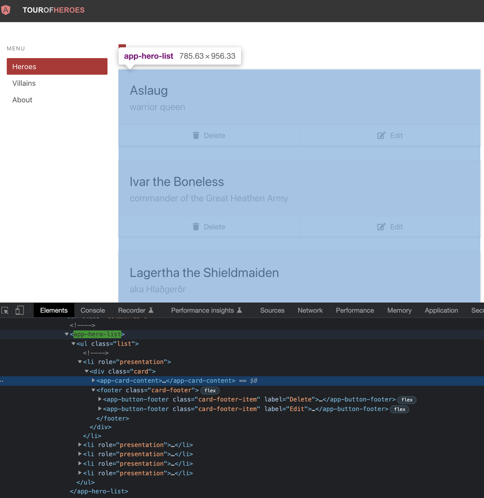

# HeroList

In the Angular version of the app, we see a list of heroes. Each item in the list is a `div` that wraps our `CardContent` component and two `ButtonFooter` components for editing or deleting the list item.




Create a branch `feat/HeroList`. Create 2 files under `src/heroes/` folder; `HeroList.cy.tsx`, `HeroList.tsx`. As usual, start minimal with a component rendering; copy the below to the files and execute the test after opening the runner with `yarn cy:open-ct`.

```tsx
// src/components/HeroList.cy.tsx
import HeroList from "./HeroList";
import '../styles.scss'

describe("HeroList", () => {
  it("should", () => {
    cy.mount(<HeroList />);
  });
});
```

```tsx
// src/components/HeroList.tsx
export default function HeroList() {
  return <div>hello</div>;
}
```

