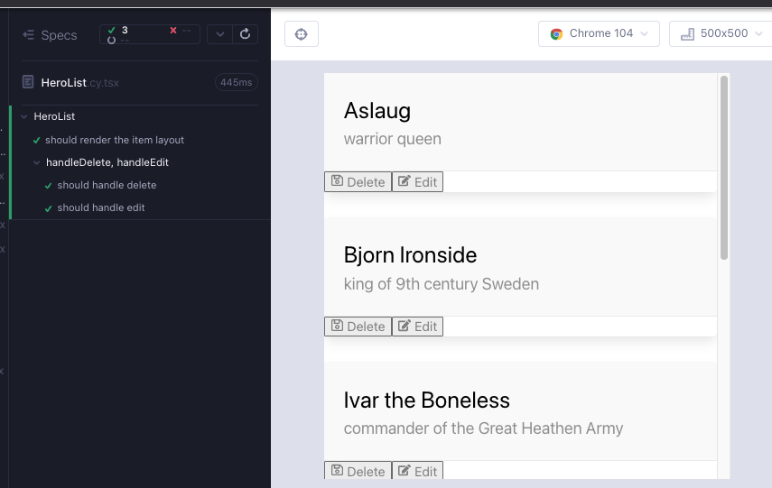

# HeroList

`HeroList` is the second of our more complex components, parent components. In the Angular version of the app, we see a list of heroes. Each item in the list is a `div` that wraps our `CardContent` component and two `ButtonFooter` components for editing or deleting the list item.


Create a branch `feat/HeroList`. Create 2 files under `src/heroes/` folder; `HeroList.cy.tsx`, `HeroList.tsx`. As usual, start minimal with a component rendering; copy the below to the files and execute the test after opening the runner with `yarn cy:open-ct`.

```tsx
// src/heroes/HeroList.cy.tsx
import HeroList from "./HeroList";
import "../styles.scss";

describe("HeroList", () => {
  it("should", () => {
    cy.mount(<HeroList />);
  });
});
```

```tsx
// src/heroes/HeroList.tsx
export default function HeroList() {
  return <div>hello</div>;
}
```

## One list item

When creating a list component in React, it is easier to start with one item at first, and then build up to the list. We will start with the `div`. Here is the outline we wish for:

- div
  - `CardContent`
  - `footer`
    - 2 x`ButtonFooter`

We start with a test for `CardContent` render (Red 1).

```tsx
// src/heroes/HeroList.cy.tsx
import HeroList from "./HeroList";
import "../styles.scss";

describe("HeroList", () => {
  it("should", () => {
    cy.mount(<HeroList />);

    cy.getByCy("card-content");
  });
});
```

After adding the child component, the test passes but we get a compiler warning about missing props name and description from `CardContent`. For now we can add the props with empty strings.

```tsx
// src/heroes/HeroList.tsx
import CardContent from "components/CardContent";

export default function HeroList() {
  return (
    <div>
      <CardContent name="" description="" />
    </div>
  );
}
```

Now we can add a failing test checking for the prop values (Red 2).

```tsx
// src/heroes/HeroList.cy.tsx
import HeroList from "./HeroList";
import "../styles.scss";

describe("HeroList", () => {
  it("should", () => {
    cy.mount(<HeroList />);

    cy.getByCy("card-content");
    cy.contains("Aslaug");
    cy.contains("warrior queen");
  });
});
```

And we can add the hard-coded prop values to the component to make the test pass (Green 2).

```tsx
// src/heroes/HeroList.tsx
import CardContent from "components/CardContent";

export default function HeroList() {
  return (
    <div>
      <CardContent name="Aslaug" description="warrior queen" />
    </div>
  );
}
```

We get a hint from the usage that `hero` is a piece of data that we get from the network. For now we can create a `hero` object and copy it to both the test and the component (Refactor 2).

```tsx
// src/heroes/HeroList.cy.tsx
import HeroList from "./HeroList";
import { Hero } from "models/Hero";
import "../styles.scss";

describe("HeroList", () => {
  const hero: Hero = {
    id: "HeroAslaug",
    name: "Aslaug",
    description: "warrior queen",
  };
  it("should", () => {
    cy.mount(<HeroList />);

    cy.getByCy("card-content");
    cy.contains(hero.name);
    cy.contains(hero.description);
  });
});
```

```tsx
// src/heroes/HeroList.tsx
import CardContent from "components/CardContent";
import { Hero } from "models/Hero";

export default function HeroList() {
  const hero: Hero = {
    id: "HeroAslaug",
    name: "Aslaug",
    description: "warrior queen",
  };
  return (
    <div>
      <CardContent name={hero.name} description={hero.description} />
    </div>
  );
}
```


We can create a new test that checks for the render of `cancel` and `edit` buttons, which are variants of the `ButtonFooter` component. Checking for the `footer` and making sure that the buttons are inside it is optional; we could just check for the components instead. Testing is always a call between cost and confidence, and how much we test depends. In this case "Will the `footer` tag ever change," "Is it a high amount of work to use the `within` api?" "How much more confidence do we get by testing this detail" are some of the questions that can determine our decision (Red 3).

```tsx
// src/heroes/HeroList.cy.tsx
import HeroList from "./HeroList";
import { Hero } from "models/Hero";
import "../styles.scss";

describe("HeroList", () => {
  const hero: Hero = {
    id: "HeroAslaug",
    name: "Aslaug",
    description: "warrior queen",
  };
  it("should", () => {
    cy.mount(<HeroList />);

    cy.getByCy("card-content");
    cy.contains(hero.name);
    cy.contains(hero.description);

    cy.get("footer")
      .first()
      .within(() => {
        cy.getByCy("delete-button");
        cy.getByCy("edit-button");
      });
  });
});
```

As we add the `ButtonFooter` child to the component, we get a compiler warning about missing props, as well as a failing test (Red3).

```tsx
// src/heroes/HeroList.tsx
import CardContent from "components/CardContent";
import ButtonFooter from "components/ButtonFooter";
import { Hero } from "models/Hero";

export default function HeroList() {
  const hero: Hero = {
    id: "HeroAslaug",
    name: "Aslaug",
    description: "warrior queen",
  };
  return (
    <div>
      <CardContent name={hero.name} description={hero.description} />
      <footer>
        <ButtonFooter />
        <ButtonFooter />
      </footer>
    </div>
  );
}
```

We can take advantage of the `ButtonFooter` types to add the missing props to pass the test. For now we can leave the `onClick` values empty (Green 3).

```tsx
// src/heroes/HeroList.tsx
import CardContent from "components/CardContent";
import ButtonFooter from "components/ButtonFooter";
import { FaEdit, FaRegSave } from "react-icons/fa";
import { Hero } from "models/Hero";

export default function HeroList() {
  const hero: Hero = {
    id: "HeroAslaug",
    name: "Aslaug",
    description: "warrior queen",
  };

  return (
    <div>
      <CardContent name={hero.name} description={hero.description} />
      <footer>
        <ButtonFooter label="Delete" IconClass={FaRegSave} onClick={""} />
        <ButtonFooter label="Edit" IconClass={FaEdit} onClick={""} />
      </footer>
    </div>
  );
}
```


**In the TDD mindset, when we have green tests, we want to prefer adding more tests or refactoring versus adding additional source code**. Let's write a failing test for handling the delete and select hero events. Similar to the test `heroes/HeroDetail.cy.tsx` for now we can spy on a `console.log` to ensure that something happens when the button is clicked. We can use the `beforeEach` hook and a `context` block like we did so in the previous chapters (Red 4).

```tsx
// src/heroes/HeroList.cy.tsx
import HeroList from "./HeroList";
import { Hero } from "models/Hero";
import "../styles.scss";

describe("HeroList", () => {
  const hero: Hero = {
    id: "HeroAslaug",
    name: "Aslaug",
    description: "warrior queen",
  };
  it("should render the item layout", () => {
    cy.mount(<HeroList />);

    cy.getByCy("card-content");
    cy.contains(hero.name);
    cy.contains(hero.description);

    cy.get("footer")
      .first()
      .within(() => {
        cy.getByCy("delete-button");
        cy.getByCy("edit-button");
      });
  });

  context("handleDeleteHero, handleSelectHero", () => {
    beforeEach(() => {
      cy.window()
        .its("console")
        .then((console) => cy.spy(console, "log").as("log"));

      cy.mount(<HeroList />);
    });
    it("should handle delete", () => {
      cy.getByCy("delete-button").click();
      cy.get("@log").should("have.been.calledWith", "handleDeleteHero");
    });
    it("should handle edit", () => {
      cy.getByCy("edit-button").click();
      cy.get("@log").should("have.been.calledWith", "handleSelectHero");
    });
  });
});
```

All we need to make the test pass is fill in functions that return console.logs with the respective arguments `handleDeleteHero` & `handleSelectHero` (Green 4).

```tsx
// src/heroes/HeroList.tsx
import CardContent from "components/CardContent";
import ButtonFooter from "components/ButtonFooter";
import { FaEdit, FaRegSave } from "react-icons/fa";
import { Hero } from "models/Hero";

export default function HeroList() {
  const hero: Hero = {
    id: "HeroAslaug",
    name: "Aslaug",
    description: "warrior queen",
  };

  return (
    <div>
      <CardContent name={hero.name} description={hero.description} />
      <footer>
        <ButtonFooter
          label="Delete"
          IconClass={FaRegSave}
          onClick={() => console.log("handleDeleteHero")}
        />
        <ButtonFooter
          label="Edit"
          IconClass={FaEdit}
          onClick={() => console.log("handleSelectHero")}
        />
      </footer>
    </div>
  );
}
```

Now is a good time to refactor the `onClick` events into functions and add styles (Refactor 4).

```tsx
// src/heroes/HeroList.tsx
import CardContent from "components/CardContent";
import ButtonFooter from "components/ButtonFooter";
import { FaEdit, FaRegSave } from "react-icons/fa";
import { Hero } from "models/Hero";

export default function HeroList() {
  const hero: Hero = {
    id: "HeroAslaug",
    name: "Aslaug",
    description: "warrior queen",
  };

  const handleDeleteHero = () => console.log("handleDeleteHero");
  const handleSelectHero = () => console.log("handleSelectHero");

  return (
    <div className="card">
      <CardContent name={hero.name} description={hero.description} />
      <footer className="card-footer">
        <ButtonFooter
          label="Delete"
          IconClass={FaRegSave}
          onClick={handleDeleteHero}
        />
        <ButtonFooter
          label="Edit"
          IconClass={FaEdit}
          onClick={handleSelectHero}
        />
      </footer>
    </div>
  );
}
```

## Creating the list

Wrap the top `div` in a `ul` and `li`. The component still renders. What we need is a list / array of data that we can map over.

```tsx
// src/heroes/HeroList.tsx
import CardContent from "components/CardContent";
import ButtonFooter from "components/ButtonFooter";
import { FaEdit, FaRegSave } from "react-icons/fa";
import { Hero } from "models/Hero";

export default function HeroList() {
  const hero: Hero = {
    id: "HeroAslaug",
    name: "Aslaug",
    description: "warrior queen",
  };

  const handleDeleteHero = () => console.log("handleDeleteHero");
  const handleSelectHero = () => console.log("handleSelectHero");

  return (
    <ul>
      {/* need some data here, an array of objects */}
      <li>
        <div className="card">
          <CardContent name={hero.name} description={hero.description} />
          <footer className="card-footer">
            <ButtonFooter
              label="Delete"
              IconClass={FaRegSave}
              onClick={handleDeleteHero}
            />
            <ButtonFooter
              label="Edit"
              IconClass={FaEdit}
              onClick={handleSelectHero}
            />
          </footer>
        </div>
      </li>
    </ul>
  );
}
```

Remember the statement we made about data while developing the `HeroDetail` component; _"Instead of the hard coded `hero` object in the component, we can pass in data with a prop. We either manipulate our components via props or what wraps them, and a prop is the easier choice at the moment."_ We can stay consistent with that approach and pass a prop to the component; an array of 2 `hero` objects.

We start by modifying the test. Instead of one `hero` object, we have a `heroes` array of 2 `hero` objects. To check the string values for `name` and `description`, we refer to `heroes[0]` instead of `hero`. The test still passes but have a TS error because the prop `heroes` does not exist yet in the component (Red 5).

```tsx
// src/heroes/HeroList.cy.tsx
import HeroList from "./HeroList";
import { Hero } from "models/Hero";
import "../styles.scss";

describe("HeroList", () => {
  const heroes: Hero[] = [
    {
      id: "HeroAslaug",
      name: "Aslaug",
      description: "warrior queen",
    },
    {
      id: "HeroBjorn",
      name: "Bjorn Ironside",
      description: "king of 9th century Sweden",
    },
  ];
  it("should render the item layout", () => {
    cy.mount(<HeroList heroes={heroes} />);

    cy.getByCy("card-content");
    cy.contains(heroes[0].name);
    cy.contains(heroes[0].description);

    cy.get("footer").first().within(()
      .first()
      .within(() => {
        cy.getByCy("delete-button");
        cy.getByCy("edit-button");
      });
  });

  context("handleDelete, handleEdit", () => {
    beforeEach(() => {
      cy.window()
        .its("console")
        .then((console) => cy.spy(console, "log").as("log"));

      cy.mount(<HeroList heroes={heroes} />);
    });
    it("should handle delete", () => {
      cy.getByCy("delete-button").click();
      cy.get("@log").should("have.been.calledWith", "handleDeleteHero");
    });
    it("should handle edit", () => {
      cy.getByCy("edit-button").click();
      cy.get("@log").should("have.been.calledWith", "handleSelectHero");
    });
  });
});
```

We pass the `heroes` array as a prop, and our prop type has to be an array of heroes (Green 5).

```tsx
// src/heroes/HeroList.tsx
import CardContent from "components/CardContent";
import ButtonFooter from "components/ButtonFooter";
import { FaEdit, FaRegSave } from "react-icons/fa";
import { Hero } from "models/Hero";

type HeroListProps = {
  heroes: Hero[];
};

export default function HeroList({ heroes }: HeroListProps) {
  const hero: Hero = {
    id: "HeroAslaug",
    name: "Aslaug",
    description: "warrior queen",
  };

  const handleDeleteHero = () => console.log("handleDeleteHero");
  const handleSelectHero = () => console.log("handleSelectHero");

  return (
    <ul>
      {/* an array of objects */}
      <li>
        <div className="card">
          <CardContent name={hero.name} description={hero.description} />
          <footer className="card-footer">
            <ButtonFooter
              label="Delete"
              IconClass={FaRegSave}
              onClick={handleDeleteHero}
            />
            <ButtonFooter
              label="Edit"
              IconClass={FaEdit}
              onClick={handleSelectHero}
            />
          </footer>
        </div>
      </li>
    </ul>
  );
}
```

We have addressed the compiler error, but we are still using the hard coded `hero` object in the component and not using the data passed to the component with the `heroes` prop. Removing the `hero` object fails the test and gives compiler errors for the usage of `hero.name` and `hero.description` (Red 6).

To address the failures temporarily, we use `heroes[0]` instead of the `hero` reference (Green 6).

```tsx
// src/heroes/HeroList.tsx
import CardContent from "components/CardContent";
import ButtonFooter from "components/ButtonFooter";
import { FaEdit, FaRegSave } from "react-icons/fa";
import { Hero } from "models/Hero";
type HeroListProps = {
  heroes: Hero[];
};

export default function HeroList({ heroes }: HeroListProps) {
  const handleDeleteHero = () => console.log("handleDeleteHero");
  const handleSelectHero = () => console.log("handleSelectHero");

  return (
    <ul>
      {/* an array of objects */}
      <li>
        <div className="card">
          <CardContent
            name={heroes[0].name}
            description={heroes[0].description}
          />
          <footer className="card-footer">
            <ButtonFooter
              label="Delete"
              IconClass={FaRegSave}
              onClick={handleDeleteHero}
            />
            <ButtonFooter
              label="Edit"
              IconClass={FaEdit}
              onClick={handleSelectHero}
            />
          </footer>
        </div>
      </li>
    </ul>
  );
}
```

This begs the question; how do we display multiple list items? Do we have to copy paste the entire `li` and reference `heroes[1]` in it? This works (try it out) but we all know that is not good because it is not DRY and it does not scale.

What we need is to render a list in a smarter way. In React, similar to JS, we do this by mapping over the array / the data. The only difference is the need to use JSX notation to wrap the `li` with syntax. Think of these `{` `}` like a template literal `${ }` without the dollar sign. Now instead of referencing array indexes, we can reference what the map yields; a single `hero` that maps to each index of the array. If `map` is confusing, think of it like a better version of `forEach` that returns and does not mutate, but creates a new array (Refactor 6).

```tsx
// src/heroes/HeroList.tsx
import CardContent from "components/CardContent";
import ButtonFooter from "components/ButtonFooter";
import { FaEdit, FaRegSave } from "react-icons/fa";
import { Hero } from "models/Hero";
type HeroListProps = {
  heroes: Hero[];
};

export default function HeroList({ heroes }: HeroListProps) {
  const handleDeleteHero = () => console.log("handleDeleteHero");
  const handleSelectHero = () => console.log("handleSelectHero");

  return (
    <ul>
      {heroes.map((hero) => (
        <li>
          <div className="card">
            <CardContent name={hero.name} description={hero.description} />
            <footer className="card-footer">
              <ButtonFooter
                label="Delete"
                IconClass={FaRegSave}
                onClick={handleDeleteHero}
              />
              <ButtonFooter
                label="Edit"
                IconClass={FaEdit}
                onClick={handleSelectHero}
              />
            </footer>
          </div>
        </li>
      ))}
    </ul>
  );
}
```

That was a good refactor, the render is looking good but the test is failing for `Delete` and `Edit` clicks because now there are multiples of them we can make a quick tweak to use the `first()` instance on the list when clicking. We can also move the data out to a Cypress fixture, a json file under `./cypress/fixtures`. Create the file `./cypress/fixtures/heroes.json` and paste the below content to it.

```json
[
  {
    "id": "HeroAslaug",
    "name": "Aslaug",
    "description": "warrior queen"
  },
  {
    "id": "HeroBjorn",
    "name": "Bjorn Ironside",
    "description": "king of 9th century Sweden"
  },
  {
    "id": "HeroIvar",
    "name": "Ivar the Boneless",
    "description": "commander of the Great Heathen Army"
  },
  {
    "id": "HeroLagertha",
    "name": "Lagertha the Shieldmaiden",
    "description": "aka Hlaðgerðr"
  },
  {
    "id": "HeroRagnar",
    "name": "Ragnar Lothbrok",
    "description": "aka Ragnar Sigurdsson"
  },
  {
    "id": "HeroThora",
    "name": "Thora Town-hart",
    "description": "daughter of Earl Herrauðr of Götaland"
  }
]
```

We can refactor the test to use this data instead (Refactor 6).

```tsx
// src/heroes/HeroList.cy.tsx
import HeroList from "./HeroList";
import "../styles.scss";
import heroes from "../../cypress/fixtures/heroes.json";

describe("HeroList", () => {
  it("should render the item layout", () => {
    cy.mount(<HeroList heroes={heroes} />);

    cy.getByCy("card-content");
    cy.contains(heroes[0].name);
    cy.contains(heroes[0].description);

    cy.get("footer")
      .first()
      .within(() => {
        cy.getByCy("delete-button");
        cy.getByCy("edit-button");
      });
  });

  context("handleDelete, handleEdit", () => {
    beforeEach(() => {
      cy.window()
        .its("console")
        .then((console) => cy.spy(console, "log").as("log"));

      cy.mount(<HeroList heroes={heroes} />);
    });
    it("should handle delete", () => {
      cy.getByCy("delete-button").first().click();
      cy.get("@log").should("have.been.calledWith", "handleDeleteHero");
    });
    it("should handle edit", () => {
      cy.getByCy("edit-button").first().click();
      cy.get("@log").should("have.been.calledWith", "handleSelectHero");
    });
  });
});
```



Let's add a new test that verifies that the length of the list is as long as the length of the data (Red 7)

```tsx
// src/heroes/HeroList.cy.tsx
import HeroList from "./HeroList";
import "../styles.scss";
import heroes from "../../cypress/fixtures/heroes.json";

describe("HeroList", () => {
  it("should render the item layout", () => {
    cy.mount(<HeroList heroes={heroes} />);

    cy.getByCyLike("hero-list-item").should("have.length", heroes.length);

    cy.getByCy("card-content");
    cy.contains(heroes[0].name);
    cy.contains(heroes[0].description);

    cy.get("footer")
      .first()
      .within(() => {
        cy.getByCy("delete-button");
        cy.getByCy("edit-button");
      });
  });

  context("handleDelete, handleEdit", () => {
    beforeEach(() => {
      cy.window()
        .its("console")
        .then((console) => cy.spy(console, "log").as("log"));

      cy.mount(<HeroList heroes={heroes} />);
    });
    it("should handleDeleteHero", () => {
      cy.getByCy("delete-button").first().click();
      cy.get("@log").should("have.been.calledWith", "handleDeleteHero");
    });
    it("should handleSelectHero", () => {
      cy.getByCy("edit-button").first().click();
      cy.get("@log").should("have.been.calledWith", "handleSelectHero");
    });
  });
});
```

While adding the `data-cy` attribute to the component, we will also cover an important topic about the `key` attribute.

JS' `map` takes a second argument `index`. We can utilize this with a template literal and be able to use `data-cy` selectors on `nth` item in the list like so :

```tsx
// component
{heroes.map((hero, index) => (
  <li data-cy={`hero-list-item-${index}`} >
}
```

```tsx
// component test
cy.getByCy(`hero-list-item-2`);
```

When React is (re)rendering a list, the `key` attribute is used to determine which list items have changed. Per the [docs](https://reactjs.org/docs/lists-and-keys.html#keys) the recommended way is to use a unique value for the key as opposed to the index, because using the index can negatively impact performance.

```tsx
// not preferred
{heroes.map((hero, index) => (
  <li data-cy={`hero-list-item-${index}`} key={index}>
}
```

```tsx
// preferred, because hero.id is always unique
{heroes.map((hero, index) => (
  <li data-cy={`hero-list-item-${index}`} key={hero.id}>
}
```

We will modify the component with a `data-cy` attribute to pass the test, and add a `key` attribute with a value that will always be unique (Green 7).

```tsx
import CardContent from "components/CardContent";
import ButtonFooter from "components/ButtonFooter";
import { FaEdit, FaRegSave } from "react-icons/fa";
import { Hero } from "models/Hero";
type HeroListProps = {
  heroes: Hero[];
};

export default function HeroList({ heroes }: HeroListProps) {
  const handleDeleteHero = () => console.log("handleDeleteHero");
  const handleSelectHero = () => console.log("handleSelectHero");

  return (
    <ul data-cy="hero-list" className="list">
      {heroes.map((hero, index) => (
        <li data-cy={`hero-list-item-${index}`} key={hero.id}>
          <div className="card">
            <CardContent name={hero.name} description={hero.description} />
            <footer className="card-footer">
              <ButtonFooter
                label="Delete"
                IconClass={FaRegSave}
                onClick={handleDeleteHero}
              />
              <ButtonFooter
                label="Edit"
                IconClass={FaEdit}
                onClick={handleSelectHero}
              />
            </footer>
          </div>
        </li>
      ))}
    </ul>
  );
}
```

## Summary

### One list item

Before tackling the list we decided to write test for a single list item.

We wrote a test that renders the child component `CardContent`, and used hard-coded prop values to pass the test (Red 1, Green 1, Red 2, Green 2). We used a hard-coded data both in the component and the test to imitate state (Refactor 2)

</br>

We added a test for rendering the other child component `ButtonFooter` (Red 3).

We took advantage of TS to add the missing props (Green 3).

</br>

We added tests for handling the delete and select hero events, spying on `console.log` (Red 4).

We added functions that console.log the respective events, and we completed the single item with styles (Green 4, Refactor 4).

</br>

### The list

We decided to pass an array of heroes to the component as a prop and saw TS error (Red 5). We used the `Hero[]` type in `HeroListProps` to resolve the TS error (Green 5).

</br>

We removed the hard-coded `hero` object from the test, which caused a failure (Red 6), instead we referenced the first index of the `heroes` array with `heroes[0]` (Green 6).

We contemplated about the pattern to render lists in React; using `map`. We modified the array index reference instead to the map callback argument, which is the `hero` object for each array item. We also began to use a Cypress fixture to render a larger list in the component test (Refactor 6).

</br>

We added a test that verifies the length of the entire list (Red 7).

We contemplated about the `key` attribute in lists, which is used by React to determine and optimize render updates. We modified the component with this knowledge (Green 7).

## Takeaways

- When creating a list component in React, it is easier to start with one item at first, and then build up to the list.
- When rendering lists in React and mapping over the data, the recommended value for the key attribute is supposed to be unique, such as `hero.id` as opposed to the index of the mapped array. The index however is useful in a `data-cy` attribute to refer to the nth item to select
- Cypress' fixtures can be imported as json and used in place of data in tests.
- In the TDD mindset, when we have green tests, we want to prefer adding more tests or refactoring versus adding additional source code
- Testing is always a call between cost and confidence, and how much we test depends. Some of the questions that can determine our decision are:
  - _How often will the code under test change?_
  - _Is it a high amount of work to write the more scrutinizing test code now?_
  - _How much more confidence do we get by testing this detail?_
