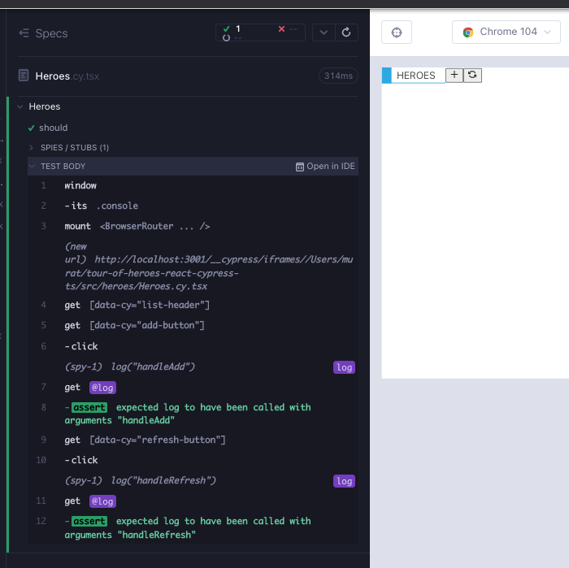

# Heroes part1 - lifting state

`Heroes` component utilizes the other hero components and is the most complex so far. Looking at the Angular version of the app, we can come up with a bullet list of the DOM elements.

- `ListHeader` child component
- `div`
  - A route that switches between `HeroList` and `HeroDetail`
- `ModalYesNo` component (for delete operation)


Create a branch `feat/Heroes`. Create 2 files under `src/heroes/` folder; `Heroes.cy.tsx`, `Heroes.tsx`. As usual, start minimal with a component rendering; copy the below to the files and execute the test after opening the runner with `yarn cy:open-ct`.

```tsx
// src/components/Heroes.cy.tsx
import Heroes from "./Heroes";
import "../styles.scss";

describe("Heroes", () => {
  it("should", () => {
    cy.mount(<Heroes />);
  });
});
```

```
// src/components/Heroes.tsx
export default function Heroes() {
  return <div>hello</div>;
}
```

## `ListHeader` child component

We start with a test that checks for the `ListHeader` component (Red 1).

```tsx
// src/components/Heroes.cy.tsx
import Heroes from "./Heroes";
import "../styles.scss";

describe("Heroes", () => {
  it("should", () => {
    cy.mount(<Heroes />);

    cy.getByCy("list-header");
  });
});
```

To make the test work, we need to include the child component in the render, and add the necessary attributes; `title`, `handleAdd`, `handleRefresh`. Any value will do for now (Red 1).

```tsx
// src/components/Heroes.tsx
import ListHeader from "../components/ListHeader";

export default function Heroes() {
  return (
    <div data-cy="heroes">
      <ListHeader title="Heroes" handleAdd={""} handleRefresh={""} />
    </div>
  );
}
```

We still get a test error, and it is a familiar one about routing. It is because the child component `ListHeader` is using `react-router`. Recall from `ListHeader` and `HeaderBarBrand` components that any time we are using `react-router`, we have to wrap the mounted component in `BrowserRouter` in the component test (Green 1).

```tsx
// src/components/Heroes.cy.tsx
import Heroes from "./Heroes";
import { BrowserRouter } from "react-router-dom";
import "../styles.scss";

describe("Heroes", () => {
  it("should", () => {
    cy.mount(
      <BrowserRouter>
        <Heroes />
      </BrowserRouter>
    );

    cy.getByCy("list-header");
  });
});
```


Click the icons and we get type errors. Recall that while testing `ListHeader` component in isolation, we used `cy.stub` for `handleAdd` and `handleRefresh`. Now the component is being used as a child, and React cannot use `cy.stub`. The parent / the consumer of the child has to implement this handler function.

Let's improve the tests with the two clicks that trigger the failures. For now it suffices to spy on console logs as we did in the tests `HeroDetail.cy.tsx` and `HeroList.cy.tsx` (Red 2).

```tsx
// src/components/Heroes.cy.tsx
import Heroes from "./Heroes";
import { BrowserRouter } from "react-router-dom";
import "../styles.scss";

describe("Heroes", () => {
  it("should handle hero add and refresh", () => {
    cy.window()
      .its("console")
      .then((console) => cy.spy(console, "log").as("log"));

    cy.mount(
      <BrowserRouter>
        <Heroes />
      </BrowserRouter>
    );

    cy.getByCy("list-header");
    cy.getByCy("add-button").click();
    cy.get("@log").should("have.been.calledWith", "handleAdd");
    cy.getByCy("refresh-button").click();
    cy.get("@log").should("have.been.calledWith", "handleRefresh");
  });
});
```

To make the test pass, we need to add functions that `console.log` with the respective strings (Green 2).

```tsx
// src/components/Heroes.tsx
import ListHeader from "../components/ListHeader";

export default function Heroes() {
  return (
    <div data-cy="heroes">
      <ListHeader
        title="Heroes"
        handleAdd={() => console.log("handleAdd")}
        handleRefresh={() => console.log("handleRefresh")}
      />
    </div>
  );
}
```

We can refactor those into their own functions and that suffices for the `ListHeader` for now (Refactor 2).

```tsx
// src/components/Heroes.tsx
import ListHeader from "../components/ListHeader";

export default function Heroes() {
  const addNewHero = () => console.log("handleAdd");
  const handleRefresh = () => console.log("handleRefresh");

  return (
    <div data-cy="heroes">
      <ListHeader
        title="Heroes"
        handleAdd={addNewHero}
        handleRefresh={handleRefresh}
      />
    </div>
  );
}
```



When we render `Heroes`, at first `ListHeader` and the `HeroList` display. If we Edit a hero, the `HeroDetail` displays. If we Delete a hero, `ModalYesNo` is shown. We will first focus on the `HeroList`, then the modal. We will tackle `HeroDetail` after setting up routing in a later chapter.

## `HeroList` child component

We start simple with a test that checks for the `HeroList` render (Red 3).

```tsx
// src/components/Heroes.cy.tsx
import Heroes from "./Heroes";
import { BrowserRouter } from "react-router-dom";
import "../styles.scss";

describe("Heroes", () => {
  it("should handle hero add and refresh", () => {
    cy.window()
      .its("console")
      .then((console) => cy.spy(console, "log").as("log"));

    cy.mount(
      <BrowserRouter>
        <Heroes />
      </BrowserRouter>
    );

    cy.getByCy("list-header");
    cy.getByCy("add-button").click();
    cy.get("@log").should("have.been.calledWith", "handleAdd");
    cy.getByCy("refresh-button").click();
    cy.get("@log").should("have.been.calledWith", "handleRefresh");
  });

  it("should display hero list on render", () => {
    cy.mount(
      <BrowserRouter>
        <Heroes />
      </BrowserRouter>
    );

    cy.getByCy("hero-list");
  });
});
```

We add the child `HeroList` to our component. It requires a heroes prop. One idea is to look at the component tests for children, see how they are used, and work off of that documentation when writing the tests for the parent component. We do not need to repeat any tests at the parent, but we can use the help to give an idea about how the child should be mounted. Take a look at `HeroList.cy.tsx`. We are importing a Cypress fixture and passing it as a prop. We can repeat a similar process, and delay the decisions about data and state to a later time until we have to make them (Green 3).

If a component is importing a file from outside the source folder, the component will work in isolation but the greater app will not compile. Make a copy of `heroes.json` from `cypress/fixtures/` in `src/heroes` and update `Heroes` component to use this file instead. We will handle this gracefully later when working with network data.

```tsx
// src/components/Heroes.tsx
import ListHeader from "../components/ListHeader";
import HeroList from "./HeroList";
import heroes from "./heroes.json";

export default function Heroes() {
  const addNewHero = () => console.log("handleAdd");
  const handleRefresh = () => console.log("handleRefresh");

  return (
    <div data-cy="heroes">
      <ListHeader
        title="Heroes"
        handleAdd={addNewHero}
        handleRefresh={handleRefresh}
      />
      <div>
        <div>
          <HeroList heroes={heroes} />
        </div>
      </div>
    </div>
  );
}
```


## `ModalYesNo` child component

Once again we can look at the component tests for children, see how they are used, and work off of that documentation when writing the tests for the parent component. `ModalYesNo.cy.tsx` has props for a `message` string, `onYes` and `onNo` events. It also supports an internal state which allows the modal to be toggled.

Let's write a failing test. For now, we do not have a toggle for the modal, so we should only run the new modal test (Red 4).

```tsx
// src/components/Heroes.cy.tsx
import Heroes from "./Heroes";
import { BrowserRouter } from "react-router-dom";
import "../styles.scss";

describe("Heroes", () => {
  it("should handle hero add and refresh", () => {
    cy.window()
      .its("console")
      .then((console) => cy.spy(console, "log").as("log"));

    cy.mount(
      <BrowserRouter>
        <Heroes />
      </BrowserRouter>
    );

    cy.getByCy("list-header");
    cy.getByCy("add-button").click();
    cy.get("@log").should("have.been.calledWith", "handleAdd");
    cy.getByCy("refresh-button").click();
    cy.get("@log").should("have.been.calledWith", "handleRefresh");
  });

  it("should display hero list on render", () => {
    cy.mount(
      <BrowserRouter>
        <Heroes />
      </BrowserRouter>
    );

    cy.getByCy("hero-list");
  });

  it.only("should display the modal", () => {
    cy.mount(
      <BrowserRouter>
        <Heroes />
      </BrowserRouter>
    );

    cy.getByCy("modal-yes-no");
  });
});
```

To render the child component, we just have to add the props `message`, `onNo`, `onYes`. For now it is all right for them to be empty strings (Green 4).

```tsx
// src/components/Heroes.tsx
import ListHeader from "../components/ListHeader";
import ModalYesNo from "components/ModalYesNo";
import HeroList from "./HeroList";
import heroes from "./heroes.json";

export default function Heroes() {
  const addNewHero = () => console.log("handleAdd");
  const handleRefresh = () => console.log("handleRefresh");

  return (
    <div data-cy="heroes">
      <ListHeader
        title="Heroes"
        handleAdd={addNewHero}
        handleRefresh={handleRefresh}
      />
      <div>
        <div>
          <HeroList heroes={heroes} />
        </div>
      </div>

      <ModalYesNo
        message="Would you like to delete the hero?"
        onNo={""}
        onYes={""}
      />
    </div>
  );
}
```


Having run that test, we really want a way to close that modal and see our `Heroes` component. Let's write a failing test for this need (Red 5).

> From here onwards, for the sake of brevity, when a test is executed with `.only` we will only be showing the code for the relevant portion.

```tsx
// src/components/Heroes.cy.tsx
it.only("should display the modal", () => {
  cy.mount(
    <BrowserRouter>
      <Heroes />
    </BrowserRouter>
  );

  cy.getByCy("modal-yes-no");
  cy.getByCy("button-no").click();
});
```

We get an error in the Cypress runner `func.apply is not a function`. Become familiar with this error, it means our event handler isn't doing anything. To resolve it, for now use a function that `console.log`s (Green 5).

```tsx
// src/components/Heroes.tsx
import ListHeader from "../components/ListHeader";
import ModalYesNo from "components/ModalYesNo";
import HeroList from "./HeroList";
import heroes from "./heroes.json";

export default function Heroes() {
  const addNewHero = () => console.log("handleAdd");
  const handleRefresh = () => console.log("handleRefresh");

  return (
    <div data-cy="heroes">
      <ListHeader
        title="Heroes"
        handleAdd={addNewHero}
        handleRefresh={handleRefresh}
      />
      <div>
        <div>
          <HeroList heroes={heroes} />
        </div>
      </div>

      <ModalYesNo
        message="Would you like to delete the hero?"
        onNo={() => console.log("handleCloseModal")}
        onYes={""}
      />
    </div>
  );
}
```

We can refactor that into its own function (Refactor 5).

```tsx
// src/components/Heroes.tsx
import ListHeader from "../components/ListHeader";
import ModalYesNo from "components/ModalYesNo";
import HeroList from "./HeroList";
import heroes from "./heroes.json";

export default function Heroes() {
  const addNewHero = () => console.log("handleAdd");
  const handleRefresh = () => console.log("handleRefresh");
  const handleCloseModal = () => () => console.log("handleCloseModal");

  return (
    <div data-cy="heroes">
      <ListHeader
        title="Heroes"
        handleAdd={addNewHero}
        handleRefresh={handleRefresh}
      />
      <div>
        <div>
          <HeroList heroes={heroes} />
        </div>
      </div>

      <ModalYesNo
        message="Would you like to delete the hero?"
        onNo={handleCloseModal}
        onYes={""}
      />
    </div>
  );
}
```

We covered the `useState` hook in the `HeroDetail` function. There were two key takeaways in that chapter. First was that we can simplify our UI state management into two categories:

1. UI state: modal is open, item is highlighted, etc.
2. Server data.

In the case of the modal, it is category 1; UI state.

The second key takeaway was that we prefer to manage state where it is most relevant. In this case whether the modal is open or closed is most relevant in the `Heroes` component, and `useState` hook is the simplest way to satisfy that.

We have 3 requirements about the modal. The flow goes as such:

- We would like the modal to be closed when `Heroes` is rendered
- When we want to delete a hero, we want to display the modal.
- We would like the modal to go away when clicking No in the modal

Let's write a failing test for the first step of the flow; when rendering the component the modal should be closed. We slightly modify the `it` block with comments (Red 6).

```tsx
// src/components/Heroes.cy.tsx

it.only("should display the modal", () => {
  cy.mount(
    <BrowserRouter>
      <Heroes />
    </BrowserRouter>
  );

  cy.getByCy("modal-yes-no").should("not.exist");

  // delete the hero
  // cy.getByCy('modal-yes-no').should('be.visible')

  // select no
  // cy.getByCy('button-no').click()
  // cy.getByCy('modal-yes-no').should('not.exist')
});
```

To make the test pass, we can just use a `false` chain before the `ModalYesNo` component (Green 6).

```tsx
// src/components/Heroes.tsx
import ListHeader from "../components/ListHeader";
import ModalYesNo from "components/ModalYesNo";
import HeroList from "./HeroList";
import heroes from "./heroes.json";

export default function Heroes() {
  const addNewHero = () => console.log("handleAdd");
  const handleRefresh = () => console.log("handleRefresh");
  const handleCloseModal = () => () => {
    console.log("handleCloseModal");
  };

  return (
    <div data-cy="heroes">
      <ListHeader
        title="Heroes"
        handleAdd={addNewHero}
        handleRefresh={handleRefresh}
      />
      <div>
        <div>
          <HeroList heroes={heroes} />
        </div>
      </div>

      {false && (
        <ModalYesNo
          message="Would you like to delete the hero?"
          onNo={handleCloseModal}
          onYes={""}
        />
      )}
    </div>
  );
}
```

Let's continue writing the test. We need to click the button, and the modal should pop up (Red 7).

```tsx
// src/components/Heroes.cy.tsx
it.only("should display the modal", () => {
  cy.mount(
    <BrowserRouter>
      <Heroes />
    </BrowserRouter>
  );

  cy.getByCy("modal-yes-no").should("not.exist");

  cy.getByCy("delete-button").first().click();
  cy.getByCy("modal-yes-no").should("be.visible");

  // select no
  // cy.getByCy('button-no').click()
  // cy.getByCy('modal-yes-no').should('not.exist')
});
```

To make this state toggle work, we need to use `useState`. We do not like that hard-coded `false` and it can be used as the initial state of the hook. At this point in time, the test is still expected to fail.

```tsx
// src/components/Heroes.tsx
import ListHeader from "../components/ListHeader";
import ModalYesNo from "components/ModalYesNo";
import HeroList from "./HeroList";
import heroes from "./heroes.json";
import { useState } from "react";

export default function Heroes() {
  const [showModal, setShowModal] = useState(false);
  const addNewHero = () => console.log("handleAdd");
  const handleRefresh = () => console.log("handleRefresh");
  const handleCloseModal = () => () => {
    console.log("handleCloseModal");
  };

  return (
    <div data-cy="heroes">
      <ListHeader
        title="Heroes"
        handleAdd={addNewHero}
        handleRefresh={handleRefresh}
      />
      <div>
        <div>
          <HeroList heroes={heroes} />
        </div>
      </div>

      {showModal && (
        <ModalYesNo
          message="Would you like to delete the hero?"
          onNo={handleCloseModal}
          onYes={() => console.log("handleOnYes")}
        />
      )}
    </div>
  );
}
```

## Lifting state from `HeroList` & `ModalYesNo` into `Heroes`

`showModal` looks great in there, but we need to be able to `setShowModal` to true when clicking the `Delete` button. Take a look at the console, `handleDeleteHero` is called and this function lives in `HeroList` component. This is a hint that the two child components are sharing state.


We will reference Kent C. Dodds' [Application State Management with React](https://kentcdodds.com/blog/application-state-management-with-react) and give you the gist of the article:

- If components are sharing state, lift the state up to their closest common ancestor.
- If the common ancestor is too deep and lifting state results in prop-drilling, use React's context api.
- Beyond that, use state management libraries.

In our case `Heroes` component hosts two children `HeroList` and `ModalYesNo`; lifting state up to the parent is the easiest choice.

`ModalYesNo` component is already relaying its `onYes` and `onNo` `onClick` handlers above. On the other hand, `HeroList` implements its own `handleDeleteHero` `onClick` handler. Instead we need to pass a prop `handleDeleteHero` to `HeroList` which is driven by `setShowModal` in `Heroes` component. Therefore we have to make a modification to `HeroList` component. We remove the self-implemented `handleDeleteHero` function, and instead pass it as a prop. We leave the prop type generic for the time being.

```tsx
// src/components/HeroList.tsx
import CardContent from "../components/CardContent";
import ButtonFooter from "../components/ButtonFooter";
import { FaEdit, FaRegSave } from "react-icons/fa";
import { Hero } from "models/Hero";
type HeroListProps = {
  heroes: Hero[];
  handleDeleteHero: () => void; // TODO: consider better type
};

export default function HeroList({ heroes, handleDeleteHero }: HeroListProps) {
  const handleSelectHero = () => console.log("handleSelectHero");

  return (
    <ul data-cy="hero-list" className="list">
      {heroes.map((hero, index) => (
        <li data-cy={`hero-list-item-${index}`} key={hero.id}>
          <div className="card">
            <CardContent name={hero.name} description={hero.description} />
            <footer className="card-footer">
              <ButtonFooter
                label="Delete"
                IconClass={FaRegSave}
                onClick={handleDeleteHero}
              />
              <ButtonFooter
                label="Edit"
                IconClass={FaEdit}
                onClick={handleSelectHero}
              />
            </footer>
          </div>
        </li>
      ))}
    </ul>
  );
}
```

We update the matching test to accept the new `handleDeleteHero` prop. It suffices to use `cy.stub` to ensure that it is called on click.

```tsx
// src/components/HeroList.cy.tsx
import HeroList from "./HeroList";
import "../styles.scss";
import heroes from "./heroes.json";

describe("HeroList", () => {
  it("should render the item layout", () => {
    cy.mount(
      <HeroList
        heroes={heroes}
        handleDeleteHero={cy.stub().as("handleDeleteHero")}
      />
    );

    cy.getByCyLike("hero-list-item").should("have.length", heroes.length);

    cy.getByCy("card-content");
    cy.contains(heroes[0].name);
    cy.contains(heroes[0].description);

    cy.get("footer")
      .first()
      .within(() => {
        cy.getByCy("delete-button");
        cy.getByCy("edit-button");
      });
  });

  context("handleDelete, handleEdit", () => {
    beforeEach(() => {
      cy.window()
        .its("console")
        .then((console) => cy.spy(console, "log").as("log"));

      cy.mount(
        <HeroList
          heroes={heroes}
          handleDeleteHero={cy.stub().as("handleDeleteHero")}
        />
      );
    });
    it("should handle delete", () => {
      cy.getByCy("delete-button").first().click();
      cy.get("@handleDeleteHero").should("have.been.called");
    });
    it("should handle edit", () => {
      cy.getByCy("edit-button").first().click();
      cy.get("@log").should("have.been.calledWith", "handleSelectHero");
    });
  });
});
```

Back in the parent component `Heroes`, now we can pass a prop `handleDeleteHero`. The value of it needs to be a function that returns `setShowModal(<a boolean arg>)`. Why do all the click handlers have to be functions? Per the [React docs](https://reactjs.org/docs/handling-events.html) when using JSX you pass a function as the event handler, rather than a string. After the changes, the test passes. (Green 7).

```tsx
// src/components/Heroes.tsx
import ListHeader from "../components/ListHeader";
import ModalYesNo from "components/ModalYesNo";
import HeroList from "./HeroList";
import heroes from "./heroes.json";
import { useState } from "react";

export default function Heroes() {
  const [showModal, setShowModal] = useState(false);
  const addNewHero = () => console.log("handleAdd");
  const handleRefresh = () => console.log("handleRefresh");
  const handleCloseModal = () => () => {
    console.log("handleCloseModal");
  };

  return (
    <div data-cy="heroes">
      <ListHeader
        title="Heroes"
        handleAdd={addNewHero}
        handleRefresh={handleRefresh}
      />
      <div>
        <div>
          <HeroList
            heroes={heroes}
            handleDeleteHero={() => setShowModal(true)}
          />
        </div>
      </div>

      {showModal && (
        <ModalYesNo
          message="Would you like to delete the hero?"
          onNo={handleCloseModal}
          onYes={() => console.log("handleOnYes")}
        />
      )}
    </div>
  );
}
```

We can refactor `() => setShowModal(true)` into its own function. We can also remove the `.only` in the component test (Refactor 7).

```tsx
// src/components/Heroes.tsx
import ListHeader from "../components/ListHeader";
import ModalYesNo from "components/ModalYesNo";
import HeroList from "./HeroList";
import heroes from "./heroes.json";
import { useState } from "react";

export default function Heroes() {
  const [showModal, setShowModal] = useState<boolean>(false);
  const addNewHero = () => console.log("handleAdd");
  const handleRefresh = () => console.log("handleRefresh");
  const handleCloseModal = () => {
    console.log("handleCloseModal");
  };
  const handleDeleteHero = () => {
    setShowModal(true);
  };

  return (
    <div data-cy="heroes">
      <ListHeader
        title="Heroes"
        handleAdd={addNewHero}
        handleRefresh={handleRefresh}
      />
      <div>
        <div>
          <HeroList heroes={heroes} handleDeleteHero={handleDeleteHero} />
        </div>
      </div>

      {showModal && (
        <ModalYesNo
          message="Would you like to delete the hero?"
          onNo={handleCloseModal}
          onYes={() => console.log("handleOnYes")}
        />
      )}
    </div>
  );
}
```

Time for the next failing test in the modal flow; when `button-no` is clicked the modal should go away (Red 8).

```tsx
// src/components/Heroes.cy.tsx
import Heroes from "./Heroes";
import { BrowserRouter } from "react-router-dom";
import "../styles.scss";

describe("Heroes", () => {
  it("should handle hero add and refresh", () => {
    cy.window()
      .its("console")
      .then((console) => cy.spy(console, "log").as("log"));

    cy.mount(
      <BrowserRouter>
        <Heroes />
      </BrowserRouter>
    );

    cy.getByCy("list-header");
    cy.getByCy("add-button").click();
    cy.get("@log").should("have.been.calledWith", "handleAdd");
    cy.getByCy("refresh-button").click();
    cy.get("@log").should("have.been.calledWith", "handleRefresh");
  });

  it("should display hero list on render", () => {
    cy.mount(
      <BrowserRouter>
        <Heroes />
      </BrowserRouter>
    );

    cy.getByCy("hero-list");
  });

  it("should display the modal", () => {
    cy.mount(
      <BrowserRouter>
        <Heroes />
      </BrowserRouter>
    );

    cy.getByCy("modal-yes-no").should("not.exist");

    cy.getByCy("delete-button").first().click();
    cy.getByCy("modal-yes-no").should("be.visible");

    cy.getByCy("button-no").click();
    cy.getByCy("modal-yes-no").should("not.exist");
  });
});
```

To make this work, we use `setShowModal(false)` in the already existing `handleCloseModal` function (Green 8).

```tsx
// src/components/Heroes.tsx
import ListHeader from "../components/ListHeader";
import ModalYesNo from "components/ModalYesNo";
import HeroList from "./HeroList";
import heroes from "./heroes.json";
import { useState } from "react";

export default function Heroes() {
  const [showModal, setShowModal] = useState<boolean>(false);
  const addNewHero = () => console.log("handleAdd");
  const handleRefresh = () => console.log("handleRefresh");
  const handleCloseModal = () => {
    setShowModal(false);
  };
  const handleDeleteHero = () => {
    setShowModal(true);
  };

  return (
    <div data-cy="heroes">
      <ListHeader
        title="Heroes"
        handleAdd={addNewHero}
        handleRefresh={handleRefresh}
      />
      <div>
        <div>
          <HeroList heroes={heroes} handleDeleteHero={handleDeleteHero} />
        </div>
      </div>

      {showModal && (
        <ModalYesNo
          message="Would you like to delete the hero?"
          onNo={handleCloseModal}
          onYes={() => console.log("handleOnYes")}
        />
      )}
    </div>
  );
}
```

While we are here, we can cover the other branch of the modal flow; when clicking yes on the confirmation, we should close the modal and for now at least `console.log` something (Red 10).

```tsx
// src/components/Heroes.cy.tsx
import Heroes from "./Heroes";
import { BrowserRouter } from "react-router-dom";
import "../styles.scss";

describe("Heroes", () => {
  it("should handle hero add and refresh", () => {
    cy.window()
      .its("console")
      .then((console) => cy.spy(console, "log").as("log"));

    cy.mount(
      <BrowserRouter>
        <Heroes />
      </BrowserRouter>
    );

    cy.getByCy("list-header");
    cy.getByCy("add-button").click();
    cy.get("@log").should("have.been.calledWith", "handleAdd");
    cy.getByCy("refresh-button").click();
    cy.get("@log").should("have.been.calledWith", "handleRefresh");
  });

  it("should display hero list on render", () => {
    cy.mount(
      <BrowserRouter>
        <Heroes />
      </BrowserRouter>
    );

    cy.getByCy("hero-list");
  });

  const invokeHeroDelete = () => {
    cy.getByCy("delete-button").first().click();
    cy.getByCy("modal-yes-no").should("be.visible");
  };
  it("should go through the modal flow", () => {
    cy.window()
      .its("console")
      .then((console) => cy.spy(console, "log").as("log"));

    cy.mount(
      <BrowserRouter>
        <Heroes />
      </BrowserRouter>
    );

    cy.getByCy("modal-yes-no").should("not.exist");

    cy.log("do not delete flow");
    invokeHeroDelete();
    cy.getByCy("button-no").click();
    cy.getByCy("modal-yes-no").should("not.exist");

    cy.log("delete flow");
    invokeHeroDelete();
    cy.getByCy("button-yes").click();
    cy.getByCy("modal-yes-no").should("not.exist");
    cy.get("@log").should("have.been.calledWith", "handleDeleteFromModal");
  });
});
```

To pass this test, for now we just need function that toggles the modal off and console.logs the string "handleDeleteFromModal" (Green 9).

```tsx
// src/components/Heroes.tsx
import ListHeader from "../components/ListHeader";
import ModalYesNo from "components/ModalYesNo";
import HeroList from "./HeroList";
import heroes from "./heroes.json";
import { useState } from "react";

export default function Heroes() {
  const [showModal, setShowModal] = useState<boolean>(false);
  const addNewHero = () => console.log("handleAdd");
  const handleRefresh = () => console.log("handleRefresh");
  const handleCloseModal = () => {
    setShowModal(false);
  };
  const handleDeleteHero = () => {
    setShowModal(true);
  };
  const handleDeleteFromModal = () => {
    setShowModal(false);
    console.log("handleDeleteFromModal");
  };

  return (
    <div data-cy="heroes">
      <ListHeader
        title="Heroes"
        handleAdd={addNewHero}
        handleRefresh={handleRefresh}
      />
      <div>
        <div>
          <HeroList heroes={heroes} handleDeleteHero={handleDeleteHero} />
        </div>
      </div>

      {showModal && (
        <ModalYesNo
          message="Would you like to delete the hero?"
          onNo={handleCloseModal}
          onYes={handleDeleteFromModal}
        />
      )}
    </div>
  );
}
```

## `HeroDetail` component

Continued after routing chapter.

## Summary

We added a test to render `ListHeader` child component (wrapped in `BrowserRouter`), and added to component with empty props to make the test pass (Red 1, Green 1).

</br>

We added tests checking for console.logs upon clicking he add and refresh buttons (Red 2).

We used functions that console.log the function name to make the tests Pass (Green 2, Refactor 2).

</br>

We added a failing test for another child `HeroList` and included the child component in the render (Red 3, Green 3). We used hard coded data for the time being.

</br>

We added a failing test for rendering the modal (Red 4). We added mostly empty string props to make the test work (Green 4).

We wrote another test to be able to close the modal and got an error `func.apply is not a function`, which means our event handler isn't doing anything. To solve it we used console.logging for the event handler functions and refactored them (Green 5, Refactor 5).

</br>

We wrote a pseudo test for the modal flow; with the initial step that the modal should be closed (Red 6).

We hard coded a `false` with a blueprint for conditional rendering to make the test pass (Green 6).

</br>

We added a new test to the flow; to check that the modal gets opened on delete button click (Red 7).

We realized that the children `HeroList` and `ModalYesNo` components share state, and lifted state up to our `Heroes` component which is their parent.

`HeroList` then had a prop `handleDeleteHero`, and we set its value with `() => setShowModal(true)`, to show the modal when delete is clicked (Green 7).

As before, we refactored the click handler to its own function (Refactor 7).

</br>

We wrote the next test in the modal flow, when `button-no` is clicked the modal should go away (Red 8).

All we needed was to instead use `setShowModal(false)` instead of the existing console.log in the `handleCloseModal` function (Green 8).

</br>

We added a test for the other branch of the modal; the delete flow (Red 9).

We added a function that toggles the modal off and console.logs the string `handleDeleteFromModal` and used it on the `onYes` handler of the modal (Green 9).

## Takeaways

- As we repeatedly saw in the previous chapters, while designing the component, you can delay the decisions about network state and use hard coded data. For event handlers we can use functions that console.log. These will help when components that share state get used in other components. Note that per the [React docs](https://reactjs.org/docs/handling-events.html) when using JSX you pass a function as the event handler, rather than a string.
- Look at the component tests for child components, see how they are used, and work off of that documentation when writing the tests for the parent component. We do not need to repeat any tests at the parent, but we can use the help to give an idea about how the child should be mounted.
- In a Cypress component test, the error `func.apply is not a function` usually means the click handlers are not doing anything.
- In React, all the click handlers have to be functions. Per the [React docs](https://reactjs.org/docs/handling-events.html) when using JSX you pass a function as the event handler, rather than a string.
- When testing child components in isolation (ex: `ListHeader`), we can mock the click events with `cy.stub`. When the child component is being consumed by a parent, React obviously cannot mock anything. Therefore The parent / the consumer of the child has to implement the handler function and test it. Again, `console.log` is acceptable until more about the component is known.
- From Kent C. Dodds:
  - If components are sharing state, lift the state up to their closest common ancestor.
  - If the common ancestor is too deep and lifting state results in prop-drilling, use React's context api.
  - Beyond that, use state management libraries.
