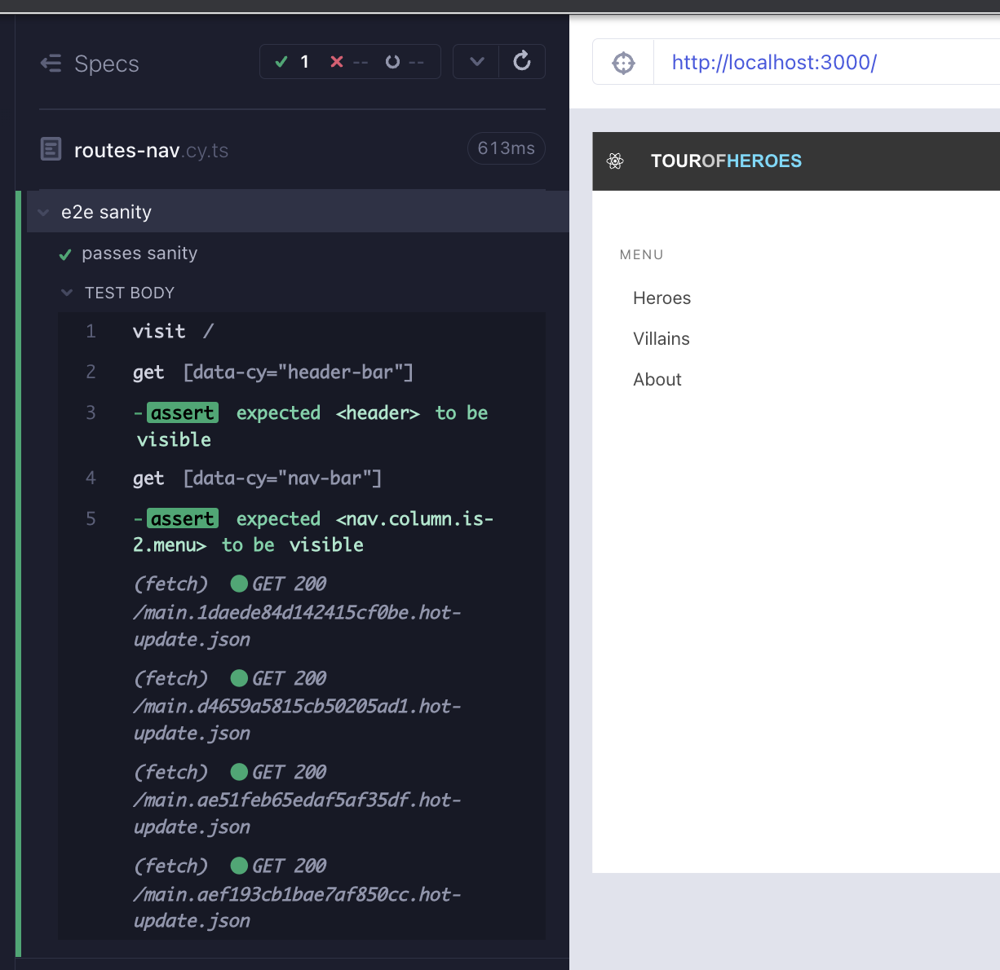

# [`react-router`](https://reactrouter.com/en/v6.3.0/getting-started/overview) 

Our `Heroes` component is needing to take advantage of routes, but we have not set that up in our app yet. Until now, every component has been designed in isolation. While the real app launches on the generic page, a user cannot do much with it. We will be setting up [`react-router`](https://reactrouter.com/en/v6.3.0/getting-started/overview) using e2e to test it.

#### Minor overhead

If a component is importing a file from outside the source folder, the app will not compile. Make a copy `heroes.json` from `cypress/fixtures/` to `src/heroes` and update `Heroes` component to use this file instead. We will handle this gracefully later.

## Using e2e

We can test some of the routing capability in components, if those components have navigation links in them. We implemented examples of these in `HeaderBar` and `NavBar` components. Moving past that, the most confident way to test routing is using e2e tests because it lets us cover the apps routing features in full. 

We start the e2e runner with  `yarn cy:open-e2e`. This command internally runs `yarn start` which also serves the app on `localhost:3000`. At the moment we are seeing the generic React app when running the `spec` file. We can rename that to `routes-nav.cy.ts`.


Our requirement is to serve our app, be able to click on the links, land on the right urls and render the respective components. 

> We have not implemented Villains component yet, that is okay for now.

## 

Starting top down, our first failing test is to see if we can render the `HeaderBar` component (Red 1).

```tsx
// cypress/e2e/routes-nav.cy.ts
describe('e2e sanity', () => {
  it('passes sanity', () => {
    cy.visit('/')
    cy.getByCy('header-bar').should('be.visible')
  })
})
```

Whenever we are testing a component that includes other components, we have a best practice to take a look at the child component source and the component test. This is all the same when testing the app with e2e. `src/components/HeaderBar.cy.tsx` uses `BrowserRouter` to wrap the `HeaderBar` while mounting it, that means our main app will need `BrowserRouter` as well (Green 1).

```tsx
// src/App.tsx
import HeaderBar from 'components/HeaderBar'
import {BrowserRouter} from 'react-router-dom'
import './styles.scss'

function App() {
  return (
    <BrowserRouter>
      <HeaderBar />
    </BrowserRouter>
  )
}

export default App
```

Our second requirement is to display the `NavBar` component (Red 2).

```tsx
// cypress/e2e/routes-nav.cy.ts
describe('e2e sanity', () => {
  it('should render header bar and nav bar', () => {
    cy.visit('/')
    cy.getByCy('header-bar').should('be.visible')
    cy.getByCy('nav-bar').should('be.visible')
  })
})
```

Add the `NavBar />` to our app and the test is passing (Green 2).

```tsx
// src/App.tsx
import HeaderBar from 'components/HeaderBar'
import NavBar from 'components/NavBar'
import {BrowserRouter} from 'react-router-dom'
import './styles.scss'

function App() {
  return (
    <BrowserRouter>
      <HeaderBar />
      <NavBar />
    </BrowserRouter>
  )
}

export default App
```

We can fine tune the render by adding some of the css from the original app (Refactor 2).

```tsx
// src/App.tsx
import HeaderBar from 'components/HeaderBar'
import NavBar from 'components/NavBar'
import {BrowserRouter} from 'react-router-dom'
import './styles.scss'

function App() {
  return (
    <BrowserRouter>
      <HeaderBar />
      <div className="section columns">
        <NavBar />
      </div>
    </BrowserRouter>
  )
}
export default App

```



Looking at `NavBar.cy.tsx` we see that we already covered click navigation to heroes, villains, and about. We do not have to repeat this test in e2e. **Always check the test coverage of lower level tests and prefer not to duplicate the effort at a higher level, because it will have extra cost but might not provide extra confidence**. 

 Whether using e2e or component tests, the flow is the same. The main distinction is scale; with e2e we need to be even more careful to have small incremental steps because the impact in the large scale of the app can be higher, failures harder to diagnose. **The obvious, but hard to implement, practice in test driven design is to write very small incremental tests at a time**.

## Routing features

Write a failing test that checks that we render the `NotFound` component when visiting a non-existing route (Red 3).

```tsx
// cypress/e2e/routes-nav.cy.ts
describe('e2e sanity', () => {
  it('should render header bar and nav bar', () => {
    cy.visit('/')
    cy.getByCy('header-bar').should('be.visible')
    cy.getByCy('nav-bar').should('be.visible')
  })
  it('should land on not found when visiting an non-existing route', () => {
    cy.visit('/route48')
    cy.getByCy('not-found').should('be.visible')
  })
})
```

To use `react-router` we need to  import and wrap our component in a `Routes` component. Each component becomes an `element` prop in a `Route` component. We map the component to a `path` prop. `*` means that anything that does not match other routes will fall-over to this one (Green 3)

```tsx
// src/App.tsx
import HeaderBar from 'components/HeaderBar'
import NavBar from 'components/NavBar'
import NotFound from 'components/NotFound'
import {BrowserRouter, Routes, Route} from 'react-router-dom'
import './styles.scss'

function App() {
  return (
    <BrowserRouter>
      <HeaderBar />
      <div className="section columns">
        <NavBar />
        <Routes>
          <Route path="*" element={<NotFound />} />
        </Routes>
      </div>
    </BrowserRouter>
  )
}
export default App

```

We can slightly enhance the render with styling (Refactor 3).

```tsx
// src/App.tsx
import HeaderBar from 'components/HeaderBar'
import NavBar from 'components/NavBar'
import NotFound from 'components/NotFound'
import {BrowserRouter, Routes, Route} from 'react-router-dom'
import './styles.scss'

function App() {
  return (
    <BrowserRouter>
      <HeaderBar />
      <div className="section columns">
        <NavBar />
        <main className="column">
          <Routes>
            <Route path="*" element={<NotFound />} />
          </Routes>
        </main>
      </div>
    </BrowserRouter>
  )
}

export default App
```


Let's make the route setup a bit more interesting by adding the `About` component. Copy the below into `src/About.tsx`

```tsx
// src/About.tsx
import React from 'react'

const About = () => (
  <div data-cy="about" className="content-container">
    <div className="content-title-group not-found">
      <h2 className="title">Tour of Heroes</h2>
      <p>
        This project was created to provide a perspective on Test Driven Design
        using Cypress component and e2e testing to develop a React application.
        There are many versions of Angular's Tour of Heroes tutorial and John
        Papa has re-created them in Angular, Vue and React. The 3 apps are
        consistent in their styles and design decisions. This up inspires from
        them, uses CCTDD and takes variances along the way.
      </p>

      <br />
      <h2 className="title">Live applications by John Papa</h2>

      <ul>
        <li>
          <a href="https://papa-heroes-angular.azurewebsites.net">
            Tour of Heroes with Angular
          </a>
        </li>
        <li>
          <a href="https://papa-heroes-react.azurewebsites.net">
            Tour of Heroes with React
          </a>
        </li>
        <li>
          <a href="https://papa-heroes-vue.azurewebsites.net">
            Tour of Heroes with Vue
          </a>
        </li>
      </ul>
    </div>
  </div>
)

export default About
```

Now we can write a failing test that directly navigates to the route. Recall that we already wrote the click-nav version in the `NavBar` component test and we are not repeating that in the e2e (Red 4).

```tsx
// cypress/e2e/routes-nav.cy.ts
describe('e2e sanity', () => {
  it('should render header bar and nav bar', () => {
    cy.visit('/')
    cy.getByCy('header-bar').should('be.visible')
    cy.getByCy('nav-bar').should('be.visible')
  })
  it('should land on not found when visiting an non-existing route', () => {
    cy.visit('/route48')
    cy.getByCy('not-found').should('be.visible')
  })

  it('should direct-navigate to about', () => {
    cy.visit('/about')
    cy.getByCy('about').contains('CCTDD')
  })
})
```

We setup the `About` component for the `/about` route to pass the test (Green 4).

```tsx
// src/App.tsx
import About from 'About'
import HeaderBar from 'components/HeaderBar'
import NavBar from 'components/NavBar'
import NotFound from 'components/NotFound'
import {BrowserRouter, Routes, Route} from 'react-router-dom'
import './styles.scss'

function App() {
  return (
    <BrowserRouter>
      <HeaderBar />
      <div className="section columns">
        <NavBar />
        <main className="column">
          <Routes>
            <Route path="/about" element={<About />} />
            <Route path="*" element={<NotFound />} />
          </Routes>
        </main>
      </div>
    </BrowserRouter>
  )
}

export default App
```


Any time we have passing tests, we want to consider a refactor or add more tests before adding more source code. We can supplement the tests with url checks, in addition to the component render when navigating to a url (Refactor 4).

> Here `cy.url().should('include', route)` could also be `cy.url().should('contain', route)`, but `cy.url().contains(route)` will not work because  that is a different API for checking text content on the page.

```tsx
// cypress/e2e/routes-nav.cy.ts
describe('e2e sanity', () => {
  it('should render header bar and nav bar', () => {
    cy.visit('/')
    cy.getByCy('header-bar').should('be.visible')
    cy.getByCy('nav-bar').should('be.visible')
  })
  it('should land on not found when visiting an non-existing route', () => {
    const route = '/route48'
    cy.visit(route)
    cy.url().should('include', route)
    cy.getByCy('not-found').should('be.visible')
  })

  it('should direct-navigate to about', () => {
    const route = '/about'
    cy.visit(route)
    cy.url().should('include', route)
    cy.getByCy('about').contains('CCTDD')
  })
})
```

The first test begs the question, what should the default url be for our app? The most involved component is `Heroes`, so that is an appropriate choice. We want to be redirected to `/heroes` route and display `Heroes` component when navigating to an empty route. Let's add a failing test for this need (Red 5).

```tsx
// cypress/e2e/routes-nav.cy.ts
describe('e2e sanity', () => {
  it('should render header bar and nav bar', () => {
    cy.visit('/')
    cy.getByCy('header-bar').should('be.visible')
    cy.getByCy('nav-bar').should('be.visible')

    cy.url().should('include', 'heroes')
  })
  it('should land on not found when visiting an non-existing route', () => {
    const route = '/route48'
    cy.visit(route)
    cy.url().should('include', route)
    cy.getByCy('not-found').should('be.visible')
  })

  it('should direct-navigate to about', () => {
    const route = '/about'
    cy.visit(route)
    cy.url().should('include', route)
    cy.getByCy('about').contains('CCTDD')
  })
})
```

The way to implement this feature in `react-router` is by using `Navigate` component. We also need the `/heroes` route now so that it can be navigated to (Green 5).

```tsx
// src/App.tsx
import About from 'About'
import HeaderBar from 'components/HeaderBar'
import NavBar from 'components/NavBar'
import NotFound from 'components/NotFound'
import Heroes from 'heroes/Heroes'
import {BrowserRouter, Routes, Route, Navigate} from 'react-router-dom'
import './styles.scss'

function App() {
  return (
    <BrowserRouter>
      <HeaderBar />
      <div className="section columns">
        <NavBar />
        <main className="column">
          <Routes>
            <Route path="/" element={<Navigate replace to="/heroes" />} />
            <Route path="/heroes" element={<Heroes />} />
            <Route path="/about" element={<About />} />
            <Route path="*" element={<NotFound />} />
          </Routes>
        </main>
      </div>
    </BrowserRouter>
  )
}

export default App
```

We can tweak the initial test that checks for `HeaderBar` and  `NavBar`render, which are true in all routing tests. Here it is preferred to add on to the test rather than writing a new one for redirect. **Always look for opportunities to tweak what test is already existing as opposed to writing partially duplicated tests for new specs. What matters from a test perspective is the beginning state of a test; if reaching that state is common, then it is an opportunity for a test enhancement vs partial test duplication**. We can also add a new test checking the direct-navigation functionality for `/heroes` route (Refactor 5).

```tsx
// cypress/e2e/routes-nav.cy.ts
describe('Routes and navigation', () => {
  it('should land on baseUrl, redirect to /heroes', () => {
    cy.visit('/')
    cy.getByCy('header-bar').should('be.visible')
    cy.getByCy('nav-bar').should('be.visible')

    cy.url().should('include', '/heroes')
    cy.getByCy('heroes').should('be.visible')
  })

  it('should direct-navigate to /heroes', () => {
    const route = '/heroes'
    cy.visit(route)
    cy.url().should('include', route)
    cy.getByCy('heroes').should('be.visible')
  })

  it('should land on not found when visiting an non-existing route', () => {
    const route = '/route48'
    cy.visit(route)
    cy.url().should('include', route)
    cy.getByCy('not-found').should('be.visible')
  })

  it('should direct-navigate to about', () => {
    const route = '/about'
    cy.visit(route)
    cy.url().should('include', route)
    cy.getByCy('about').contains('CCTDD')
  })
})

```

What other tests can we think of at this point? How about route history? We can add a test for it, because it is low cost and confident to cover in an e2e test. We can also make the test a bit more interesting by using a different order of routes than heroes -> villains -> about  (Refactor 5).

```tsx
// cypress/e2e/routes-nav.cy.ts
describe('e2e sanity', () => {
  it('should land on baseUrl, redirect to /heroes', () => {
    cy.visit('/')
    cy.getByCy('header-bar').should('be.visible')
    cy.getByCy('nav-bar').should('be.visible')

    cy.url().should('include', '/heroes')
    cy.getByCy('heroes').should('be.visible')
  })

  it('should direct-navigate to /heroes', () => {
    const route = '/heroes'
    cy.visit(route)
    cy.url().should('include', route)
    cy.getByCy('heroes').should('be.visible')
  })

  it('should land on not found when visiting an non-existing route', () => {
    const route = '/route48'
    cy.visit(route)
    cy.url().should('include', route)
    cy.getByCy('not-found').should('be.visible')
  })

  it('should direct-navigate to about', () => {
    const route = '/about'
    cy.visit(route)
    cy.url().should('include', route)
    cy.getByCy('about').contains('CCTDD')
  })

  it('should cover route history with browser back and forward', () => {
    const routes = ['villains', 'heroes', 'about']
    cy.wrap(routes).each((route: string) =>
      cy.get(`[href="/${route}"]`).click(),
    )

    const lastIndex = routes.length - 1
    cy.url().should('include', routes[lastIndex])
    cy.go('back')
    cy.url().should('include', routes[lastIndex - 1])
    cy.go('back')
    cy.url().should('include', routes[lastIndex - 2])
    cy.go('forward').go('forward')
    cy.url().should('include', routes[lastIndex])
  })
})
```

