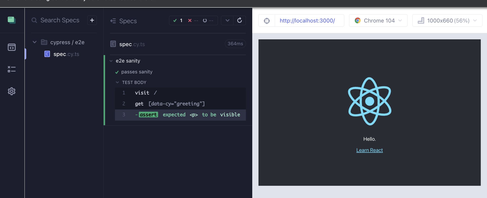
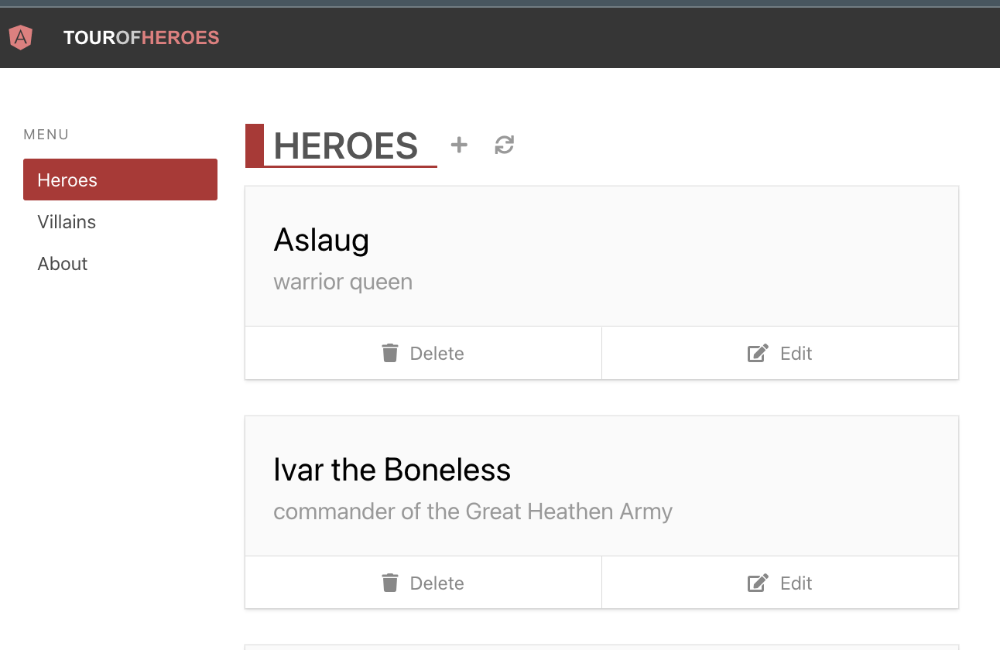
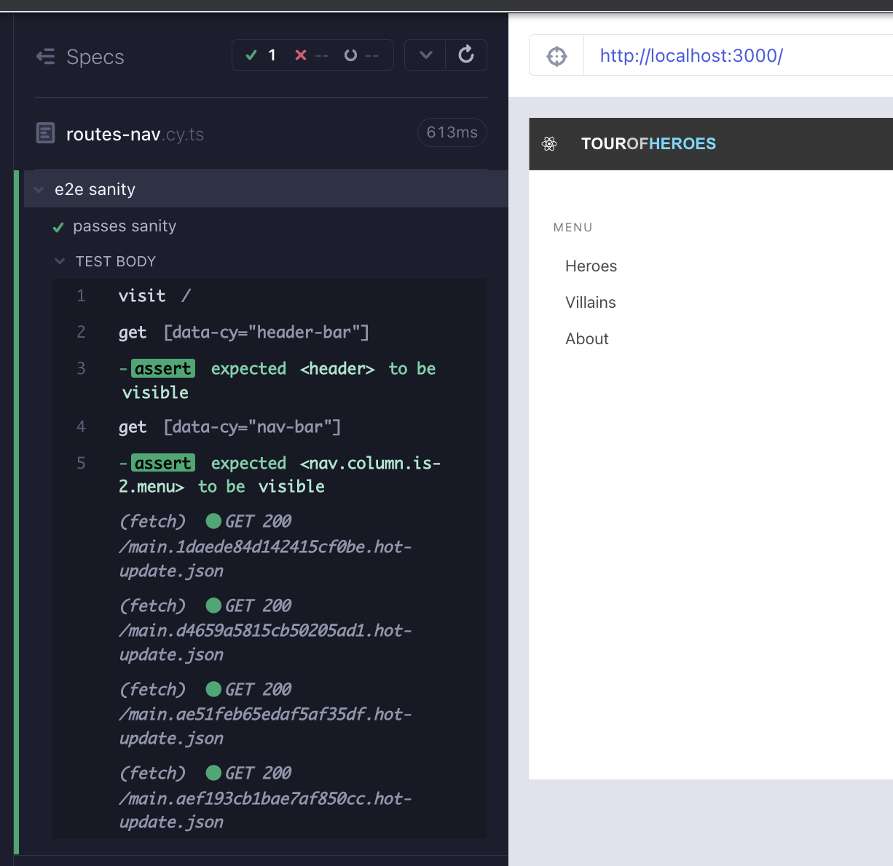
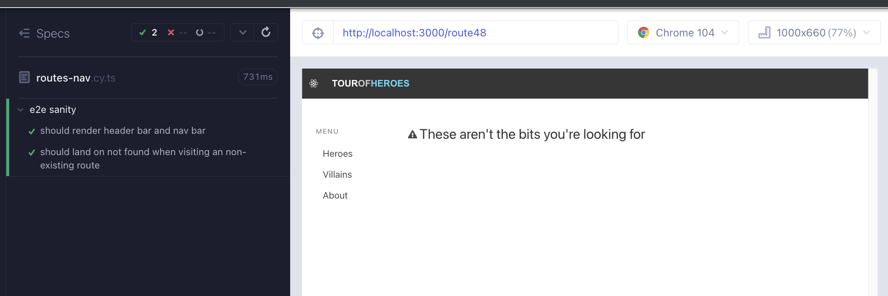
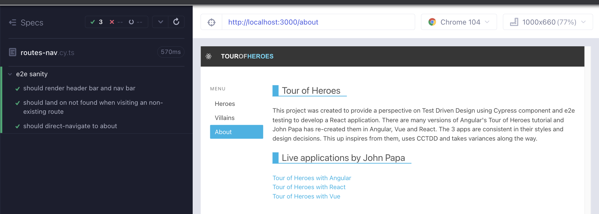
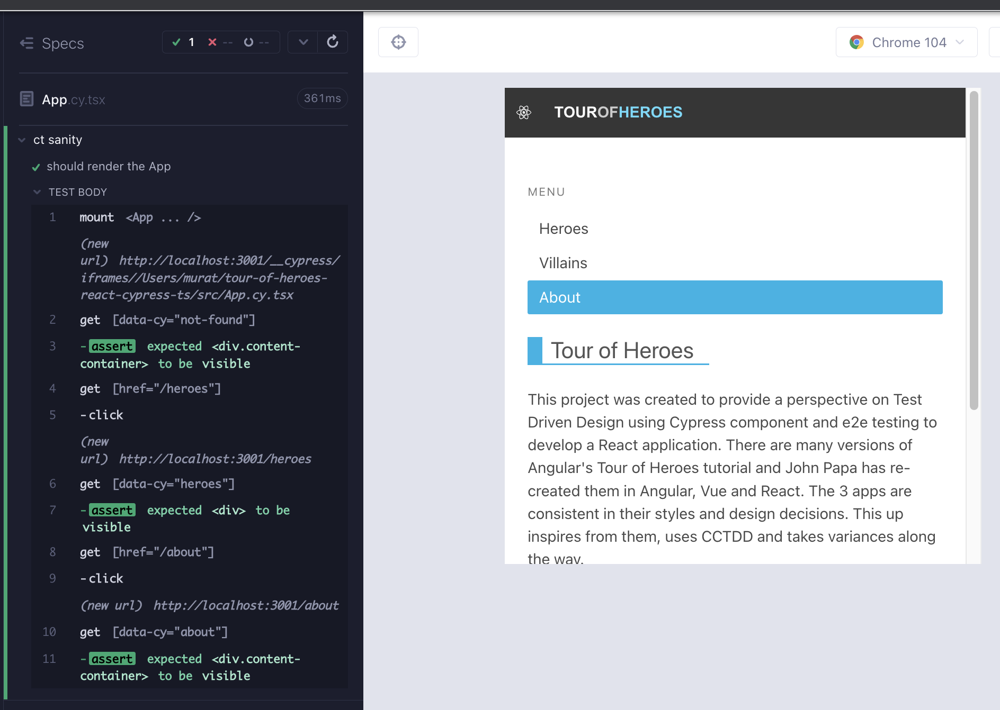

# react-router

Our `Heroes` component is needing to take advantage of routes, but we have not set that up in our app yet. Until now, every component has been designed in isolation. Meanwhile, the real app launches on the generic page, and a user cannot do much with it. During this section we will be setting up [`react-router`](https://reactrouter.com/en/v6.3.0/getting-started/overview) and we will be using e2e to test it.

> `react-router-dom` and `react-router-native` are included in `react-router`. We will be referring to `react-router-dom` as `react-router` since we are in working on a web app.

## Using e2e

We can test some of the routing capability in components in a component test, if those components have navigation links in them. We implemented examples of these in `HeaderBar` and `NavBar` components. Moving past that, the most confident way to test routing is using e2e tests because it lets us cover the app's routing features and possible flows entirely.

We start the e2e runner with `yarn cy:open-e2e`. This command internally runs `yarn start` which also serves the app on `localhost:3000`. At the moment we are seeing the generic React app when running the `spec` file. We can rename that to `routes-nav.cy.ts`.



Our requirement is to serve our app, be able to click on the links, land on the right urls and render the respective components.

> We have not implemented Villains component yet, that is okay for now.

## 

Starting top down, our first failing test is to see if we can render the `HeaderBar` component (Red 1).

```tsx
// cypress/e2e/routes-nav.cy.ts
describe("e2e sanity", () => {
  it("passes sanity", () => {
    cy.visit("/");
    cy.getByCy("header-bar").should("be.visible");
  });
});
```

Whenever we are testing a component that includes other components, we have a best practice to take a look at the child component source and the component test. This is all the same when testing the app with e2e. `src/components/HeaderBar.cy.tsx` uses `BrowserRouter` to wrap the `HeaderBar` while mounting it, that means our main app will need `BrowserRouter` as well (Green 1).

```tsx
// src/App.tsx
import HeaderBar from "components/HeaderBar";
import { BrowserRouter } from "react-router-dom";
import "./styles.scss";

function App() {
  return (
    <BrowserRouter>
      <HeaderBar />
    </BrowserRouter>
  );
}

export default App;
```

Our second requirement is to display the `NavBar` component (Red 2).

```tsx
// cypress/e2e/routes-nav.cy.ts
describe("e2e sanity", () => {
  it("should render header bar and nav bar", () => {
    cy.visit("/");
    cy.getByCy("header-bar").should("be.visible");
    cy.getByCy("nav-bar").should("be.visible");
  });
});
```

Add the `NavBar />` to our app and the test is passing (Green 2).

```tsx
// src/App.tsx
import HeaderBar from "components/HeaderBar";
import NavBar from "components/NavBar";
import { BrowserRouter } from "react-router-dom";
import "./styles.scss";

function App() {
  return (
    <BrowserRouter>
      <HeaderBar />
      <NavBar />
    </BrowserRouter>
  );
}

export default App;
```

We can fine tune the render by adding some of the css from the original app (Refactor 2).

```tsx
// src/App.tsx
import HeaderBar from "components/HeaderBar";
import NavBar from "components/NavBar";
import { BrowserRouter } from "react-router-dom";
import "./styles.scss";

function App() {
  return (
    <BrowserRouter>
      <HeaderBar />
      <div className="section columns">
        <NavBar />
      </div>
    </BrowserRouter>
  );
}
export default App;
```



Looking at `NavBar.cy.tsx` we see that we already covered click navigation to heroes, villains, and about. We do not have to repeat this test in e2e. Always check the test coverage of lower level tests and prefer not to duplicate the effort at a higher level, because it will have extra cost but might not provide extra confidence.

Whether using e2e or component tests, the flow of TDD is the same; start with something failing, do the mimimum to get it to work, and then make it better. The main distinction is scale; with e2e we need to be even more careful to have small incremental steps because the impact on the large scale of the app can be higher, making failures harder to diagnose. The obvious, but hard to implement, practice in test driven design is to write very small incremental tests at a time.

## Routing

Write a failing test that checks that we render the `NotFound` component when visiting a non-existing route (Red 3).

```tsx
// cypress/e2e/routes-nav.cy.ts
describe("e2e sanity", () => {
  it("should render header bar and nav bar", () => {
    cy.visit("/");
    cy.getByCy("header-bar").should("be.visible");
    cy.getByCy("nav-bar").should("be.visible");
  });
  it("should land on not found when visiting an non-existing route", () => {
    cy.visit("/route48");
    cy.getByCy("not-found").should("be.visible");
  });
});
```

To use `react-router` we need to import and wrap our component in a `Routes` component. Each component becomes an `element` prop in a `Route` component. We map the component to a `path` prop. `*` means that anything that does not match other routes will fall-over to this one (Green 3)

```tsx
// src/App.tsx
import HeaderBar from "components/HeaderBar";
import NavBar from "components/NavBar";
import NotFound from "components/NotFound";
import { BrowserRouter, Routes, Route } from "react-router-dom";
import "./styles.scss";

function App() {
  return (
    <BrowserRouter>
      <HeaderBar />
      <div className="section columns">
        <NavBar />
        <Routes>
          <Route path="*" element={<NotFound />} />
        </Routes>
      </div>
    </BrowserRouter>
  );
}
export default App;
```

We can slightly enhance the render with styling (Refactor 3).

```tsx
// src/App.tsx
import HeaderBar from "components/HeaderBar";
import NavBar from "components/NavBar";
import NotFound from "components/NotFound";
import { BrowserRouter, Routes, Route } from "react-router-dom";
import "./styles.scss";

function App() {
  return (
    <BrowserRouter>
      <HeaderBar />
      <div className="section columns">
        <NavBar />
        <main className="column">
          <Routes>
            <Route path="*" element={<NotFound />} />
          </Routes>
        </main>
      </div>
    </BrowserRouter>
  );
}

export default App;
```



Let's make the route setup a bit more interesting by adding the `About` component. Copy the below into `src/About.tsx`

```tsx
// src/About.tsx
import React from "react";

const About = () => (
  <div data-cy="about" className="content-container">
    <div className="content-title-group not-found">
      <h2 className="title">Tour of Heroes</h2>
      <p>
        This project was created to provide a perspective on Test Driven Design
        using Cypress component and e2e testing to develop a React application.
        There are many versions of Angular's Tour of Heroes tutorial and John
        Papa has re-created them in Angular, Vue and React. The 3 apps are
        consistent in their styles and design decisions. This one inspires from
        them, uses CCTDD and takes variances along the way.
      </p>

      </br>
      <h2 className="title">Live applications by John Papa</h2>

      <ul>
        <li>
          <a href="https://papa-heroes-angular.azurewebsites.net">
            Tour of Heroes with Angular
          </a>
        </li>
        <li>
          <a href="https://papa-heroes-react.azurewebsites.net">
            Tour of Heroes with React
          </a>
        </li>
        <li>
          <a href="https://papa-heroes-vue.azurewebsites.net">
            Tour of Heroes with Vue
          </a>
        </li>
      </ul>
    </div>
  </div>
);

export default About;
```

Now we can write a failing test that directly navigates to the route. Recall that we already wrote the click-nav version in the `NavBar` component test and we are not repeating that in the e2e (Red 4).

```tsx
// cypress/e2e/routes-nav.cy.ts
describe("e2e sanity", () => {
  it("should render header bar and nav bar", () => {
    cy.visit("/");
    cy.getByCy("header-bar").should("be.visible");
    cy.getByCy("nav-bar").should("be.visible");
  });
  it("should land on not found when visiting an non-existing route", () => {
    cy.visit("/route48");
    cy.getByCy("not-found").should("be.visible");
  });

  it("should direct-navigate to about", () => {
    cy.visit("/about");
    cy.getByCy("about").contains("CCTDD");
  });
});
```

We setup the `About` component for the `/about` route to pass the test (Green 4).

```tsx
// src/App.tsx
import About from "About";
import HeaderBar from "components/HeaderBar";
import NavBar from "components/NavBar";
import NotFound from "components/NotFound";
import { BrowserRouter, Routes, Route } from "react-router-dom";
import "./styles.scss";

function App() {
  return (
    <BrowserRouter>
      <HeaderBar />
      <div className="section columns">
        <NavBar />
        <main className="column">
          <Routes>
            <Route path="/about" element={<About />} />
            <Route path="*" element={<NotFound />} />
          </Routes>
        </main>
      </div>
    </BrowserRouter>
  );
}

export default App;
```



Any time we have passing tests, we want to consider a refactor or add more tests before adding more source code. We can supplement the tests with url checks, in addition to the component render when navigating to a url (Refactor 4).

```tsx
// cypress/e2e/routes-nav.cy.ts
describe("e2e sanity", () => {
  it("should render header bar and nav bar", () => {
    cy.visit("/");
    cy.getByCy("header-bar").should("be.visible");
    cy.getByCy("nav-bar").should("be.visible");
  });
  it("should land on not found when visiting an non-existing route", () => {
    const route = "/route48";
    cy.visit(route);
    cy.location('pathname').should('eq', route);
    cy.getByCy("not-found").should("be.visible");
  });

  it("should direct-navigate to about", () => {
    const route = "/about";
    cy.visit(route);
    cy.location('pathname').should('eq' route);
    cy.getByCy("about").contains("CCTDD");
  });
});
```

The first test begs the question, what should the default url be for our app? The most involved component is `Heroes`, so that is an appropriate choice. We want to be redirected to `/heroes` route and display `Heroes` component when navigating to an empty route. Let's add a failing test for this need (Red 5).

```tsx
// cypress/e2e/routes-nav.cy.ts
describe("e2e sanity", () => {
  it("should render header bar and nav bar", () => {
    cy.visit("/");
    cy.getByCy("header-bar").should("be.visible");
    cy.getByCy("nav-bar").should("be.visible");

    cy.location('pathname').should('eq' "heroes");
  });
  it("should land on not found when visiting an non-existing route", () => {
    const route = "/route48";
    cy.visit(route);
    cy.location('pathname').should('eq' route);
    cy.getByCy("not-found").should("be.visible");
  });

  it("should direct-navigate to about", () => {
    const route = "/about";
    cy.visit(route);
    cy.location('pathname').should('eq' route);
    cy.getByCy("about").contains("CCTDD");
  });
});
```

The way to implement this feature in `react-router` is by using `Navigate` component. We also need the `/heroes` route now so that it can be navigated to (Green 5).

```tsx
// src/App.tsx
import About from "About";
import HeaderBar from "components/HeaderBar";
import NavBar from "components/NavBar";
import NotFound from "components/NotFound";
import Heroes from "heroes/Heroes";
import { BrowserRouter, Routes, Route, Navigate } from "react-router-dom";
import "./styles.scss";

function App() {
  return (
    <BrowserRouter>
      <HeaderBar />
      <div className="section columns">
        <NavBar />
        <main className="column">
          <Routes>
            <Route path="/" element={<Navigate replace to="/heroes" />} />
            <Route path="/heroes" element={<Heroes />} />
            <Route path="/about" element={<About />} />
            <Route path="*" element={<NotFound />} />
          </Routes>
        </main>
      </div>
    </BrowserRouter>
  );
}

export default App;
```

We can tweak the initial test that checks for `HeaderBar` and `NavBar` render, which are true in all routing tests. Here it is preferred to add on to the test rather than writing a new one for redirect. Always look for opportunities to tweak what test is already existing as opposed to writing partially duplicated tests for new specs. What matters from a test perspective is the beginning state of a test; if reaching that state is common, then it is an opportunity for a test enhancement vs partial test duplication. We can also add a new test checking the direct-navigation functionality for `/heroes` route (Refactor 5).

```tsx
// cypress/e2e/routes-nav.cy.ts
describe("Routes and navigation", () => {
  it("should land on baseUrl, redirect to /heroes", () => {
    cy.visit("/");
    cy.getByCy("header-bar").should("be.visible");
    cy.getByCy("nav-bar").should("be.visible");

    cy.location('pathname').should('eq' "/heroes");
    cy.getByCy("heroes").should("be.visible");
  });

  it("should direct-navigate to /heroes", () => {
    const route = "/heroes";
    cy.visit(route);
    cy.location('pathname').should('eq' route);
    cy.getByCy("heroes").should("be.visible");
  });

  it("should land on not found when visiting an non-existing route", () => {
    const route = "/route48";
    cy.visit(route);
    cy.location('pathname').should('eq' route);
    cy.getByCy("not-found").should("be.visible");
  });

  it("should direct-navigate to about", () => {
    const route = "/about";
    cy.visit(route);
    cy.location('pathname').should('eq' route);
    cy.getByCy("about").contains("CCTDD");
  });
});
```

What other tests can we think of at this point? How about route history? We can add a test for it, because it is low cost and confident to cover in an e2e test. We can also make the test a bit more interesting by using a different order of routes than heroes -> villains -> about (Refactor 5).

```tsx
// cypress/e2e/routes-nav.cy.ts
describe("e2e sanity", () => {
  it("should land on baseUrl, redirect to /heroes", () => {
    cy.visit("/");
    cy.getByCy("header-bar").should("be.visible");
    cy.getByCy("nav-bar").should("be.visible");

    cy.location('pathname').should('eq' "/heroes");
    cy.getByCy("heroes").should("be.visible");
  });

  it("should direct-navigate to /heroes", () => {
    const route = "/heroes";
    cy.visit(route);
    cy.location('pathname').should('eq' route);
    cy.getByCy("heroes").should("be.visible");
  });

  it("should land on not found when visiting an non-existing route", () => {
    const route = "/route48";
    cy.visit(route);
    cy.location('pathname').should('eq' route);
    cy.getByCy("not-found").should("be.visible");
  });

  it("should direct-navigate to about", () => {
    const route = "/about";
    cy.visit(route);
    cy.location('pathname').should('eq' route);
    cy.getByCy("about").contains("CCTDD");
  });

  it("should cover route history with browser back and forward", () => {
    cy.visit("/");
    const routes = ["villains", "heroes", "about"];
    cy.wrap(routes).each((route: string) =>
      cy.get(`[href="/${route}"]`).click()
    );

    const lastIndex = routes.length - 1;
    cy.location('pathname').should('eq' routes[lastIndex]);
    cy.go("back");
    cy.location('pathname').should('eq' routes[lastIndex - 1]);
    cy.go("back");
    cy.location('pathname').should('eq' routes[lastIndex - 2]);
    cy.go("forward").go("forward");
    cy.location('pathname').should('eq' routes[lastIndex]);
  });
});
```

## Using component testing

We are very confident about direct-navigation & routing related tests with e2e. We also covered click navigation in `src/components/NotFound.cy.tsx`. In a component test, the url does not exist upon mount, and we cannot use `cy.visit`. But we can use click navigation. We can update `App.cy.tsx` as such. Switch to component testing from Cypress runner, or start it with `yarn cy:open-ct`.

```tsx
import App from "./App";

describe("ct sanity", () => {
  it("should render the App", () => {
    cy.mount(<App />);
    cy.getByCy("not-found").should("be.visible");

    cy.getByCy("nav-bar").within(() => {
      cy.contains("p", "Menu");

      const routes = ["heroes", "villains", "about"];
      cy.getByCy("menu-list").children().should("have.length", routes.length);

      routes.forEach((route: string) => {
        cy.get(`[href="/${route}"]`)
          .contains(route, { matchCase: false })
          .click()
          .should("have.class", "active-link")
          .siblings()
          .should("not.have.class", "active-link");

        cy.location("pathname").should("eq", route);
      });
    });
  });
});
```

We check that upon mount the url is uncertain using `cy.getByCy('not-found').should('be.visible')`. The rest of the test is a copy paste from `src/components/NotFound.cy.tsx`. We could instead check the render of the child components of App component.

```tsx
import App from "./App";

describe("ct sanity", () => {
  it("should render the App", () => {
    cy.mount(<App />);
    cy.getByCy("not-found").should("be.visible");

    cy.contains("Heroes").click();
    cy.getByCy("heroes").should("be.visible");

    cy.contains("About").click();
    cy.getByCy("about").should("be.visible");
  });
});
```



This test does not add additional confidence, because it does not do anything extra over the existing e2e and component tests. At best, it can serve as a sanity test. We will keep it for now for a side project where we will compare Cypress component testing to React Testing library. Here is the initial RTL replica of the same test.

```tsx
// src/App.test.tsx
import { render, screen } from "@testing-library/react";
import userEvent from "@testing-library/user-event";
import App from "./App";

test("renders tour of heroes", async () => {
  render(<App />);

  await userEvent.click(screen.getByText("About"));
  expect(screen.getByTestId("about")).toBeVisible();

  await userEvent.click(screen.getByText("Heroes"));
  expect(screen.getByTestId("heroes")).toBeVisible();
});

// CT vs RTL: src/App.cy.tsx
```

Update `src/setupTests.ts` to overwrite the default test id selector as `data-cy`.

```tsx
// src/setupTests.ts
import "@testing-library/jest-dom";

import { configure } from "@testing-library/react";

configure({ testIdAttribute: "data-cy" });
```

Execute the unit test with `yarn test`.

## Summary

We wrote an e2e test to check if we can render some of the main components when the app is served (Red 1, Red 2)

We added `BrowserRouter` wrapping the main component to pass the tests (Green 1, Green 2).

We added styles (Refactor 2).

</br>

We added a failing test for an invalid route, rendering the `NotFound` component (Red 3).

We created the backbone of the route setup; a Routes component wrapping a Route component, with an element prop of `NotFound` (Green 3).

We added styles (Refactor 3).

</br>

We added a test for a direct navigation to /about routes (Red 4).

We setup the route for `About` component (Green 4).

</br>

We added a test for the initial redirect of the app from / to /heroes (Red 5).

We enhanced the setup of routes with `Navigate` (Green 5).

We added a test to check the direct navigation to /heroes, and another to test the route history (Refactor 5).

</br>

We had a look at the test `App.cy.tsx`, and discussed test duplication. We deemed the test okay to keep as a sanity although it does not do anything extra over another component test or the e2e. The other reason to keep it was to start a study of 1:1 comparisons of CT with RTL. We updated the App RTL test to mirror the App sanity component test.

### Takeaways

- E2e testing lets us cover the app's routing features and possible flows in a better way.
- Whether using e2e or component tests, the main idea of TDD is the same; start with something failing, do the mimimum to get it to work, and then make it better.
- The obvious, but hard to implement, practice in test driven design is to write very small incremental tests at a time. Be more considerate about smaller increments with e2e tests, because of the higher impact radius of the changes.
- Whenever we are testing a component that includes other components, take a look at the child component source and the component test. The same rule applies to e2e as well. Always check the test coverage of lower level tests and prefer not to duplicate the effort at a higher level, because it will have extra cost but might not provide extra confidence.
- Any time we have passing tests, we want to prefer to refactor or add more tests before adding more source code.
- Always look for opportunities to tweak what test is already existing as opposed to writing partially duplicated tests for new specs. What matters from a test perspective is the beginning state of a test; if reaching that state is common, then it is an opportunity for a test enhancement vs partial test duplication.
