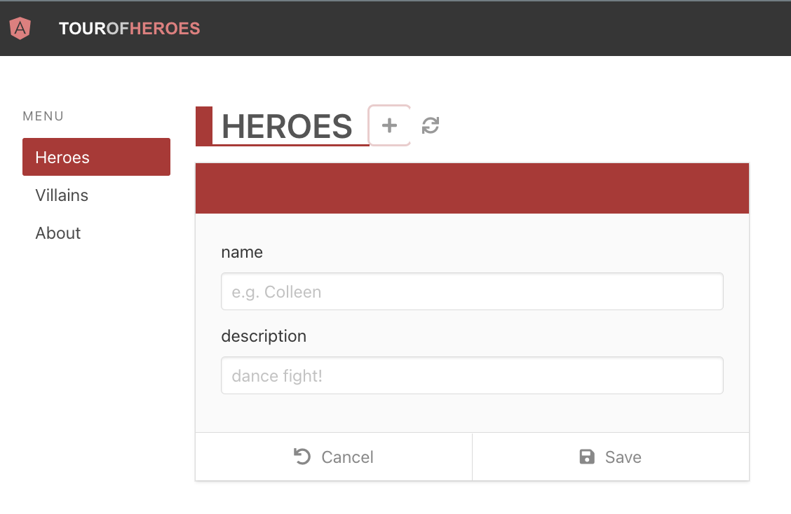

# Heroes part 2 - descendant routes

We are back in the `Heroes` component, this time we have routing capabilities. On initial render, `Heroes` displays its child `HeroList` component. We need it to be able to display `HeroDetail` when clicking the + button of the `ListHeader`. Then we need `HeroList` displayed again when clicking the refresh button of the `ListHeader`.



For the time being, instead of switching between `HeroList` and `HerdoDetail`, we can display them both together. Let's write the test (Red 1).

```tsx
// src/heroes/Heroes.cy.tsx
import Heroes from './Heroes'
import {BrowserRouter} from 'react-router-dom'
import '../styles.scss'

describe('Heroes', () => {
  it('should handle hero add and refresh', () => {
    cy.window()
      .its('console')
      .then(console => cy.spy(console, 'log').as('log'))

    cy.mount(
      <BrowserRouter>
        <Heroes />
      </BrowserRouter>,
    )

    cy.getByCy('list-header')
    cy.getByCy('add-button').click()
    cy.get('@log').should('have.been.calledWith', 'handleAdd')
    cy.getByCy('refresh-button').click()
    cy.get('@log').should('have.been.calledWith', 'handleRefresh')
  })

  it.only('should display hero list on render', () => {
    cy.mount(
      <BrowserRouter>
        <Heroes />
      </BrowserRouter>,
    )

    cy.getByCy('hero-list')
    cy.getByCy('hero-detail')
  })

  const invokeHeroDelete = () => {
    cy.getByCy('delete-button').first().click()
    cy.getByCy('modal-yes-no').should('be.visible')
  }
  it('should go through the modal flow', () => {
    cy.window()
      .its('console')
      .then(console => cy.spy(console, 'log').as('log'))

    cy.mount(
      <BrowserRouter>
        <Heroes />
      </BrowserRouter>,
    )

    cy.getByCy('modal-yes-no').should('not.exist')

    cy.log('do not delete flow')
    invokeHeroDelete()
    cy.getByCy('button-no').click()
    cy.getByCy('modal-yes-no').should('not.exist')

    cy.log('delete flow')
    invokeHeroDelete()
    cy.getByCy('button-yes').click()
    cy.getByCy('modal-yes-no').should('not.exist')
    cy.get('@log').should('have.been.calledWith', 'handleDeleteFromModal')
  })
})
```

To pass the test, we add the `HeroDetail` near `HeroList`. It has a prop `hero`, which can be just index 0 of the `heroes` array for now (Green 1).

```tsx
// src/heroes/Heroes.tsx
import ListHeader from '../components/ListHeader'
import ModalYesNo from 'components/ModalYesNo'
import HeroList from './HeroList'
import heroes from './heroes.json'
import {useState} from 'react'
import HeroDetail from './HeroDetail'

export default function Heroes() {
  const [showModal, setShowModal] = useState<boolean>(false)
  const addNewHero = () => console.log('handleAdd')
  const handleRefresh = () => console.log('handleRefresh')
  const handleCloseModal = () => {
    setShowModal(false)
  }
  const handleDeleteHero = () => {
    setShowModal(true)
  }
  const handleDeleteFromModal = () => {
    setShowModal(false)
    console.log('handleDeleteFromModal')
  }

  return (
    <div data-cy="heroes">
      <ListHeader
        title="Heroes"
        handleAdd={addNewHero}
        handleRefresh={handleRefresh}
      />
      <div>
        <div>
          <HeroList heroes={heroes} handleDeleteHero={handleDeleteHero} />
          <HeroDetail hero={heroes[0]} />
        </div>
      </div>

      {showModal && (
        <ModalYesNo
          message="Would you like to delete the hero?"
          onNo={handleCloseModal}
          onYes={handleDeleteFromModal}
        />
      )}
    </div>
  )
}
```


We want to switch the displayed component when the route changes. What drives this in React is first the route, then the child component, as we saw in the `react-router` chapter. In a component test, on the initial mount there is no url, but when clicking a link the route changes. We can drive the test with the refresh and + buttons to check the route. We will use `cy.location` in this test to check for the pathname. Here is an excerpt from [Gleb Bahmutov's Cypress tips](https://glebbahmutov.com/cypress-examples/9.7.0/commands/location.html#cy-hash):

```js
cy.visit(
  'https://example.cypress.io/commands/location?search=value#top',
)
// yields a specific part of the location
cy.location('protocol').should('equal', 'https:')
cy.location('hostname').should('equal', 'example.cypress.io')
cy.location('pathname').should('equal', '/commands/location')
cy.location('search').should('equal', '?search=value')
cy.location('hash').should('equal', '#top')
```

For brevity, we will keep the test code focused on the `.only` section. We write a test that checks that when clicking the refresh button the path becomes `/heroes` (Red 2).

```tsx
// src/heroes/Heroes.cy.tsx
it.only('should display hero list on render', () => {
  cy.mount(
    <BrowserRouter>
      <Heroes />
    </BrowserRouter>,
  )

  cy.getByCy('hero-list')
  cy.getByCy('hero-detail')
  cy.getByCy('refresh-button').click()
  cy.location('pathname').should('eq', '/heroes')
})
```

 The test fails, but in the console we see `handleRefresh` log. Instead of the log, we can have something that changes the url. React-router's [`useNavigate`](https://reactrouter.com/en/v6.3.0/api#usenavigate) can be used for this purpose which lets us programmatically navigate to any url (Green 2).

```tsx
// src/heroes/Heroes.tsx
import {useNavigate} from 'react-router-dom'
import ListHeader from '../components/ListHeader'
import ModalYesNo from 'components/ModalYesNo'
import HeroList from './HeroList'
import heroes from './heroes.json'
import {useState} from 'react'
import HeroDetail from './HeroDetail'

export default function Heroes() {
  const [showModal, setShowModal] = useState<boolean>(false)
  const addNewHero = () => console.log('handleAdd')
  const navigate = useNavigate()
  const handleRefresh = () => navigate('/heroes')

  const handleCloseModal = () => {
    setShowModal(false)
  }
  const handleDeleteHero = () => {
    setShowModal(true)
  }
  const handleDeleteFromModal = () => {
    setShowModal(false)
    console.log('handleDeleteFromModal')
  }

  return (
    <div data-cy="heroes">
      <ListHeader
        title="Heroes"
        handleAdd={addNewHero}
        handleRefresh={handleRefresh}
      />
      <div>
        <div>
          <HeroList heroes={heroes} handleDeleteHero={handleDeleteHero} />
          <HeroDetail hero={heroes[0]} />
        </div>
      </div>

      {showModal && (
        <ModalYesNo
          message="Would you like to delete the hero?"
          onNo={handleCloseModal}
          onYes={handleDeleteFromModal}
        />
      )}
    </div>
  )
}
```

We can now try another test that clicks on the add button and checks the url. We wish for that path to be `add-hero `(Red 3).

```tsx
// src/heroes/Heroes.cy.tsx
it.only('should display hero list on render', () => {
  cy.mount(
    <BrowserRouter>
      <Heroes />
    </BrowserRouter>,
  )

  cy.getByCy('hero-list')
  cy.getByCy('hero-detail')
  
  cy.getByCy('refresh-button').click()
  cy.location('pathname').should('eq', '/heroes')

  cy.getByCy('add-button').click()
  cy.location('pathname').should('eq', '/heroes/add-hero')
})
```

 Similar to the previous cycle, we see `handleAdd` being console.logged. We can utilize `useNavigate` once more (Green 3).

```tsx
// src/heroes/Heroes.tsx
import {useNavigate} from 'react-router-dom'
import ListHeader from '../components/ListHeader'
import ModalYesNo from 'components/ModalYesNo'
import HeroList from './HeroList'
import heroes from './heroes.json'
import {useState} from 'react'
import HeroDetail from './HeroDetail'

export default function Heroes() {
  const [showModal, setShowModal] = useState<boolean>(false)
  const navigate = useNavigate()
  const addNewHero = () => navigate('/heroes/add-hero')
  const handleRefresh = () => navigate('/heroes')

  const handleCloseModal = () => {
    setShowModal(false)
  }
  const handleDeleteHero = () => {
    setShowModal(true)
  }
  const handleDeleteFromModal = () => {
    setShowModal(false)
    console.log('handleDeleteFromModal')
  }

  return (
    <div data-cy="heroes">
      <ListHeader
        title="Heroes"
        handleAdd={addNewHero}
        handleRefresh={handleRefresh}
      />
      <div>
        <div>
          <HeroList heroes={heroes} handleDeleteHero={handleDeleteHero} />
          <HeroDetail hero={heroes[0]} />
        </div>
      </div>

      {showModal && (
        <ModalYesNo
          message="Would you like to delete the hero?"
          onNo={handleCloseModal}
          onYes={handleDeleteFromModal}
        />
      )}
    </div>
  )
}
```

Our pathnames are looking good, but what we need is rendering different components based on the route. 

1. On initial render we wan to see `HeroList`.
2. On clicking add button of  `ListHeader`, we want to see `HeroDetail`.
3. On clicking refresh button of `ListHeader`, we want to see `HeroList` again, so on and so forth.

We nee some React Router v6 knowledge here. Remember our `react-router` setup in the top app component. We are concerned about `/heroes` route here. When the pathname is just `/heroes` we want to display `HeroesList`, when it is `/heroes/addd-hero` we want to display `HeroDetail`. That means `/heroes` will need a descendent route.

```tsx
// src/App.tsx
import About from 'About'
import HeaderBar from 'components/HeaderBar'
import NavBar from 'components/NavBar'
import NotFound from 'components/NotFound'
import Heroes from 'heroes/Heroes'
import {BrowserRouter, Routes, Route, Navigate} from 'react-router-dom'
import './styles.scss'

function App() {
  return (
    <BrowserRouter>
      <HeaderBar />
      <div className="section columns">
        <NavBar />
        <main className="column">
          <Routes>
            <Route path="/" element={<Navigate replace to="/heroes" />} />
            {/* WE ARE CONCERNED ABOUT HEROES ROUTE */}
            <Route path="/heroes" element={<Heroes />} />
            <Route path="/about" element={<About />} />
            <Route path="*" element={<NotFound />} />
          </Routes>
        </main>
      </div>
    </BrowserRouter>
  )
}

export default App

```

In `react-router v6` we need a trailing `*` when there is another `<Routes>` somewhere in that route's descendant tree. In that case, the descendant `<Routes>` will match on the portion of the pathname that remains. We need to modify our `App.tsx` file for the `path="/heroes"` prop to `path="heroes/*"`. This lets the descendant `Routes` component we are adding to take over.

```tsx
// src/App.tsx
import About from 'About'
import HeaderBar from 'components/HeaderBar'
import NavBar from 'components/NavBar'
import NotFound from 'components/NotFound'
import Heroes from 'heroes/Heroes'
import {BrowserRouter, Routes, Route, Navigate} from 'react-router-dom'
import './styles.scss'

function App() {
  return (
    <BrowserRouter>
      <HeaderBar />
      <div className="section columns">
        <NavBar />
        <main className="column">
          <Routes>
            <Route path="/" element={<Navigate replace to="/heroes" />} />
            <Route path="/heroes/*" element={<Heroes />} />
            <Route path="/about" element={<About />} />
            <Route path="*" element={<NotFound />} />
          </Routes>
        </main>
      </div>
    </BrowserRouter>
  )
}

export default App
```

In the `Heroes` component what we need is to go from this:

```tsx
<HeroList heroes={heroes} handleDeleteHero={handleDeleteHero} />
<HeroDetail hero={heroes[0]} />
```

To this:

```tsx
<Routes>
  <Route
    path=""
    element={
      <HeroList heroes={heroes} handleDeleteHero={handleDeleteHero} />
    }
  />

  <Route path="/add-hero" element={<HeroDetail />} />

</Routes>
```

If the route is `/heroes/add-hero`, we display the `HeroDetail`

If the route is `/heroes`, we display the `HeroList`.

With that setup we have 2 failures; our test fails because it doesn't render anything, TS gives an error because `HeroDetail` wants to have a `hero` prop with a defined `hero` (Red 4). We had setup the `HeroDetail` to be used in two conditions; render the heroId field if `heroId` exists or not. Therefore we should be able to use the component for adding a new hero. All we need to do is to make the prop optional, and have a default hero object with empty `id`, `name` and `description` properties. Here is how `HeroDetail` should look:

```tsx
// src/heroes/HeroDetail.tsx
import InputDetail from '../components/InputDetail'
import {useState, ChangeEvent} from 'react'
import ButtonFooter from '../components/ButtonFooter'
import {FaUndo, FaRegSave} from 'react-icons/fa'

export type Hero = {
  id: string
  name: string
  description: string
}
type HeroDetailProps = {
  hero?: Hero
}

export default function HeroDetail({
  hero: initHero = {
    id: '',
    name: '',
    description: '',
  },
}: HeroDetailProps) {
  const [hero, setHero] = useState<Hero>({...initHero})

  const handleCancel = () => console.log('handleCancel')
  const updateHero = () => console.log('updateHero')
  const saveHero = () => console.log('saveHero')
  const handleSave = () => {
    console.log('handleSave')
    return hero.name ? updateHero() : saveHero()
  }

  const handleNameChange = (e: ChangeEvent<HTMLInputElement>) => {
    setHero({...hero, name: e.target.value})
  }
  const handleDescriptionChange = (e: ChangeEvent<HTMLInputElement>) => {
    setHero({...hero, description: e.target.value})
  }

  return (
    <div data-cy="hero-detail" className="card edit-detail">
      <header className="card-header">
        <p className="card-header-title">{hero.name}</p>
        &nbsp;
      </header>
      <div className="card-content">
        <div className="content">
          {hero.id && (
            <InputDetail
              name={'id'}
              value={hero.id}
              readOnly={true}
            ></InputDetail>
          )}
          <InputDetail
            name={'name'}
            value={hero.name}
            placeholder="e.g. Colleen"
            onChange={handleNameChange}
          ></InputDetail>
          <InputDetail
            name={'description'}
            value={hero.description}
            placeholder="e.g. dance fight!"
            onChange={handleDescriptionChange}
          ></InputDetail>
        </div>
      </div>
      <footer className="card-footer">
        <ButtonFooter
          label="Cancel"
          IconClass={FaUndo}
          onClick={handleCancel}
        />
        <ButtonFooter label="Save" IconClass={FaRegSave} onClick={handleSave} />
      </footer>
    </div>
  )
}
```

It is great that `HeroDetail.cy.tsx` passes after that change. Our only concern is that we broke our `Heroes` test.

```tsx
// src/heroes/Heroes.cy.tsx
it.only('should display hero list on render', () => {
  cy.mount(
    <BrowserRouter>
      <Heroes />
    </BrowserRouter>,
  )

  cy.getByCy('hero-list').should('be.visible')

  cy.getByCy('add-button').click()
  cy.location('pathname').should('eq', '/heroes/add-hero')

  cy.getByCy('refresh-button').click()
  cy.location('pathname').should('eq', '/heroes')
})
```


We recall from `react-router` chapter that a component test has no idea about routes, and unless we click navigate in the test, the route is uncertain. This also justifies a test for an invalid heroes route, for example `heroes/foo42`. When such is the case, we are looking for a heroId that does not exist, we would like to view the `HeroList`. We need to add a new `Route` element that renders the `HeroList` with path being *.

```tsx
// src/heroes/HeroDetail.tsx
import {useNavigate, Routes, Route, Navigate} from 'react-router-dom'
import ListHeader from '../components/ListHeader'
import ModalYesNo from 'components/ModalYesNo'
import HeroList from './HeroList'
import heroes from './heroes.json'
import {useState} from 'react'
import HeroDetail from './HeroDetail'

export default function Heroes() {
  const [showModal, setShowModal] = useState<boolean>(false)
  const navigate = useNavigate()
  const addNewHero = () => navigate('/heroes/add-hero')
  const handleRefresh = () => navigate('/heroes')

  const handleCloseModal = () => {
    setShowModal(false)
  }
  const handleDeleteHero = () => {
    setShowModal(true)
  }
  const handleDeleteFromModal = () => {
    setShowModal(false)
    console.log('handleDeleteFromModal')
  }

  return (
    <div data-cy="heroes">
      <ListHeader
        title="Heroes"
        handleAdd={addNewHero}
        handleRefresh={handleRefresh}
      />
      <div>
        <div>
          <Routes>
            <Route
              path=""
              element={
                <HeroList heroes={heroes} handleDeleteHero={handleDeleteHero} />
              }
            />
            <Route path="/add-hero" element={<HeroDetail />} />
            <Route
              path="*"
              element={
                <HeroList heroes={heroes} handleDeleteHero={handleDeleteHero} />
              }
            />
          </Routes>
        </div>
      </div>

      {showModal && (
        <ModalYesNo
          message="Would you like to delete the hero?"
          onNo={handleCloseModal}
          onYes={handleDeleteFromModal}
        />
      )}
    </div>
  )
}
```

Because the url is uncertain on component mount in a test, we also need to change the url verification to checking that `HeroList` renders (Green 4).

```tsx
// src/heroes/Heroes.cy.tsx
it.only('should display the hero list on render', () => {
  cy.mount(
    <BrowserRouter>
      <Heroes />
    </BrowserRouter>,
  )

  cy.getByCy('hero-list').should('be.visible')

  cy.getByCy('add-button').click()
  cy.location('pathname').should('eq', '/heroes/add-hero')

  cy.getByCy('refresh-button').click()
  cy.location('pathname').should('eq', '/heroes')
})
```

That change makes the test work, but the suite is not making cohesive sense between the first two `it` blocks. The first test that was checking for the `console.log` on `handleAdd` and `handleRefresh` is not valid, nor needed anymore, since we are changing the route with `useNavigate`. We could spy on `useNavigate`, but that is implementation detail and we are already checking that the url is changing; **we are testing things in a better way, at a higher level, without extra cost**. Here is the refactor to the test (Refactor 4):

```tsx
// src/heroes/Heroes.cy.tsx
import Heroes from './Heroes'
import {BrowserRouter} from 'react-router-dom'
import '../styles.scss'

describe('Heroes', () => {
  it('should display the hero list on render, and go through hero add & refresh flow', () => {
    cy.mount(
      <BrowserRouter>
        <Heroes />
      </BrowserRouter>,
    )

    cy.getByCy('list-header').should('be.visible')
    cy.getByCy('hero-list').should('be.visible')

    cy.getByCy('add-button').click()
    cy.location('pathname').should('eq', '/heroes/add-hero')

    cy.getByCy('refresh-button').click()
    cy.location('pathname').should('eq', '/heroes')
  })

  const invokeHeroDelete = () => {
    cy.getByCy('delete-button').first().click()
    cy.getByCy('modal-yes-no').should('be.visible')
  }
  it('should go through the modal flow', () => {
    cy.window()
      .its('console')
      .then(console => cy.spy(console, 'log').as('log'))

    cy.mount(
      <BrowserRouter>
        <Heroes />
      </BrowserRouter>,
    )

    cy.getByCy('modal-yes-no').should('not.exist')

    cy.log('do not delete flow')
    invokeHeroDelete()
    cy.getByCy('button-no').click()
    cy.getByCy('modal-yes-no').should('not.exist')

    cy.log('delete flow')
    invokeHeroDelete()
    cy.getByCy('button-yes').click()
    cy.getByCy('modal-yes-no').should('not.exist')
    cy.get('@log').should('have.been.calledWith', 'handleDeleteFromModal')
  })
})
```

In the `react-router` chapter, we came to the decision that the best way to test routing is with e2e tests. We are testing the pathnames in the component here, but we cannot test that the right child component is being rendered when the route changes. We can start the e2e test covering a similar flow, which will also serve as a larger test that covers the CRUD hero flow in the future. **When there is functionality that we cannot test, or cannot test confidently at a lower level, we move up in the test pyramid**, in this case from a component test to an e2e test.

```tsx
// cypress/e2e/create-hero.cy.ts
// TODO: enhance this test when the backend is operational

describe('Create hero', () => {
  beforeEach(() => cy.visit('/'))
  it('should go through the cancel flow', () => {
    cy.location('pathname').should('eq', '/heroes')

    cy.getByCy('add-button').click()
    cy.location('pathname').should('eq', '/heroes/add-hero')
    cy.getByCy('hero-detail').should('be.visible')
    cy.getByCy('input-detail-id').should('not.exist')

    cy.getByCy('refresh-button').click()
    cy.location('pathname').should('eq', '/heroes')
    cy.getByCy('hero-list').should('be.visible')
  })
})
```

This test enables us to check that `HeroDetail` renders on add, and that it renders without the `id` field since this is a new hero. The cancel create hero flow gives us a new idea; whether the backend is operational or not, the cancel flow for hero edit should also work. **After having reached a certain milestone, e2e tests, or simply ad-hoc usage of  the app can often give us new ideas for features. This is the scientific method after all, we know more and now we can try for more, and that in essence captures the original mindset behind agile**.

## Summary

We added a failing test to render `HeroDetail` together with `HeroList` (Red 1), and added the two components to the `Heroes` (Green 1).

<br />

We wrote a test that scrutinizes the url when clicking the refresh button on `ListHeader` (Red 2).

We used react-router's `useNavigate` to programmatically navigate to the url we need upon clicking refresh (Green 2).

<br />

We added a similar test for the add button, scrutinizing the url, again utilizing `useNavigate` (Red 3, Green 3).

<br />

We configured `react-router` for descendant routes, updated TS and the test to ensure everything still works (Red 4, Green 4). We refactored the test to be more cohesive and meaningful (Refactor 4).

Recalling `react-router` chapter, and that routing is best tested with e2e, we added an e2e test to increase confidence in our component; verify more than the pathname, that the child components render a certain way.

## Takeaways

* It is ideal to test at higher level than implementation details, without extra costs. For example, we can test the consequences of the hooks vs if the hook is called; `useNavigate` & check url instead of spying on `useNavigate`.

* When there is functionality that we cannot test, or cannot test confidently at a lower level, we move up in the test pyramid.

* After having reached a certain milestone, e2e tests, or simply ad-hoc usage of  the app can often give us a higher level perspective, with new ideas for features. This is the scientific method after all, we know more and now we can try for more, and that in essence captures the original mindset behind agile.