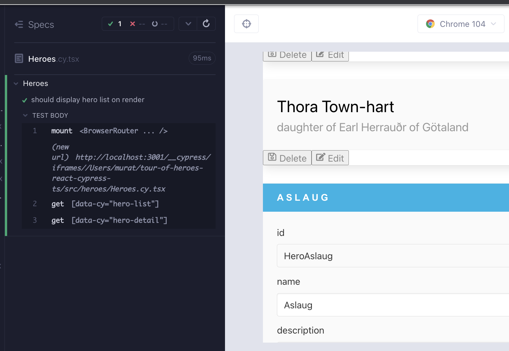
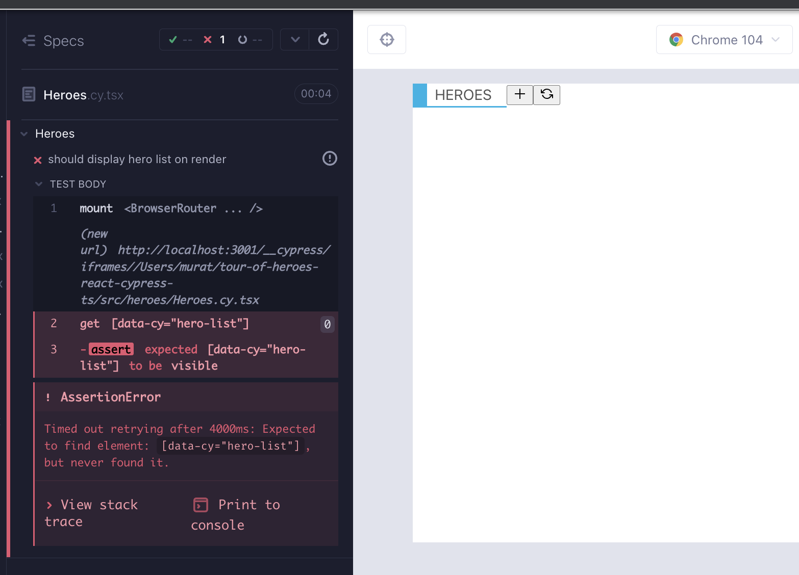

# Heroes part 2 - react-router

We are back in the `Heroes` component, and this time we have routing capabilities. On initial render, `Heroes` displays its child `HeroList` component. We need it to be able to display `HeroDetail` when clicking the + button of the `ListHeader`. Then we need `HeroList` displayed again when clicking the refresh button of the `ListHeader`. `Cancel` button should go back from `HeroDetail` to `HeroList`. Create a new branch `feat/Heroes-part2`


For the time being, instead of switching between `HeroList` and `HerdoDetail` depending on the route, we can display them both together. Let's write the test (Red 1).

```tsx
// src/heroes/Heroes.cy.tsx
import Heroes from "./Heroes";
import { BrowserRouter } from "react-router-dom";
import "../styles.scss";

describe("Heroes", () => {
  it("should handle hero add and refresh", () => {
    cy.window()
      .its("console")
      .then((console) => cy.spy(console, "log").as("log"));

    cy.mount(
      <BrowserRouter>
        <Heroes />
      </BrowserRouter>
    );

    cy.getByCy("list-header");
    cy.getByCy("add-button").click();
    cy.get("@log").should("have.been.calledWith", "handleAdd");
    cy.getByCy("refresh-button").click();
    cy.get("@log").should("have.been.calledWith", "handleRefresh");
  });

  it.only("should display hero list on render", () => {
    cy.mount(
      <BrowserRouter>
        <Heroes />
      </BrowserRouter>
    );

    cy.getByCy("hero-list");
    cy.getByCy("hero-detail");
  });

  const invokeHeroDelete = () => {
    cy.getByCy("delete-button").first().click();
    cy.getByCy("modal-yes-no").should("be.visible");
  };
  it("should go through the modal flow", () => {
    cy.window()
      .its("console")
      .then((console) => cy.spy(console, "log").as("log"));

    cy.mount(
      <BrowserRouter>
        <Heroes />
      </BrowserRouter>
    );

    cy.getByCy("modal-yes-no").should("not.exist");

    cy.log("do not delete flow");
    invokeHeroDelete();
    cy.getByCy("button-no").click();
    cy.getByCy("modal-yes-no").should("not.exist");

    cy.log("delete flow");
    invokeHeroDelete();
    cy.getByCy("button-yes").click();
    cy.getByCy("modal-yes-no").should("not.exist");
    cy.get("@log").should("have.been.calledWith", "handleDeleteFromModal");
  });
});
```

To pass the test, we add the `HeroDetail` near `HeroList`. It has a prop `hero`, which can temporarily be index 0 of the `heroes` array (Green 1).

```tsx
// src/heroes/Heroes.tsx
import ListHeader from "components/ListHeader";
import ModalYesNo from "components/ModalYesNo";
import HeroList from "./HeroList";
import heroes from "./heroes.json";
import { useState } from "react";
import HeroDetail from "./HeroDetail";

export default function Heroes() {
  const [showModal, setShowModal] = useState<boolean>(false);
  const addNewHero = () => console.log("handleAdd");
  const handleRefresh = () => console.log("handleRefresh");
  const handleCloseModal = () => {
    setShowModal(false);
  };
  const handleDeleteHero = () => {
    setShowModal(true);
  };
  const handleDeleteFromModal = () => {
    setShowModal(false);
    console.log("handleDeleteFromModal");
  };

  return (
    <div data-cy="heroes">
      <ListHeader
        title="Heroes"
        handleAdd={addNewHero}
        handleRefresh={handleRefresh}
      />
      <div>
        <div>
          <HeroList heroes={heroes} handleDeleteHero={handleDeleteHero} />
          <HeroDetail hero={heroes[0]} />
        </div>
      </div>

      {showModal && (
        <ModalYesNo
          message="Would you like to delete the hero?"
          onNo={handleCloseModal}
          onYes={handleDeleteFromModal}
        />
      )}
    </div>
  );
}
```



## [`useNavigate`](https://reactrouter.com/en/main/hooks/use-navigate)

We want to switch the displayed component when the route changes. What drives this in React is first the route, then the child component, as we saw in the `react-router` chapter. In a component test, on the initial mount there is no url, but when clicking a link the route changes. We can drive the test with the refresh and + buttons to check the route. We will use `cy.location` in this test to check for the pathname. Here is an excerpt from [Gleb Bahmutov's Cypress tips](https://glebbahmutov.com/cypress-examples/9.7.0/commands/location.html#cy-hash):

```tsx
cy.visit("https://example.cypress.io/commands/location?search=value#top");
// yields a specific part of the location
cy.location("protocol").should("equal", "https:");
cy.location("hostname").should("equal", "example.cypress.io");
cy.location("pathname").should("equal", "/commands/location");
cy.location("search").should("equal", "?search=value");
cy.location("hash").should("equal", "#top");
```

For brevity, we will keep the test code focused on the `.only` section. We write a test that checks that when clicking the refresh button the path becomes `/heroes` (Red 2).

```tsx
// src/heroes/Heroes.cy.tsx
it.only("should display hero list on render", () => {
  cy.mount(
    <BrowserRouter>
      <Heroes />
    </BrowserRouter>
  );

  cy.getByCy("hero-list");
  cy.getByCy("hero-detail");
  cy.getByCy("refresh-button").click();
  cy.location("pathname").should("eq", "/heroes");
});
```

The test fails, but in the console we see `handleRefresh` log. Instead of the log, we can have something that changes the url. React-router's [`useNavigate`](https://reactrouter.com/en/v6.3.0/api#usenavigate) can be used for this purpose which lets us programmatically navigate to any url (Green 2).

```tsx
// src/heroes/Heroes.tsx
import { useNavigate } from "react-router-dom";
import ListHeader from "components/ListHeader";
import ModalYesNo from "components/ModalYesNo";
import HeroList from "./HeroList";
import heroes from "./heroes.json";
import { useState } from "react";
import HeroDetail from "./HeroDetail";

export default function Heroes() {
  const [showModal, setShowModal] = useState<boolean>(false);
  const addNewHero = () => console.log("handleAdd");
  const navigate = useNavigate();
  const handleRefresh = () => navigate("/heroes");

  const handleCloseModal = () => {
    setShowModal(false);
  };
  const handleDeleteHero = () => {
    setShowModal(true);
  };
  const handleDeleteFromModal = () => {
    setShowModal(false);
    console.log("handleDeleteFromModal");
  };

  return (
    <div data-cy="heroes">
      <ListHeader
        title="Heroes"
        handleAdd={addNewHero}
        handleRefresh={handleRefresh}
      />
      <div>
        <div>
          <HeroList heroes={heroes} handleDeleteHero={handleDeleteHero} />
          <HeroDetail hero={heroes[0]} />
        </div>
      </div>

      {showModal && (
        <ModalYesNo
          message="Would you like to delete the hero?"
          onNo={handleCloseModal}
          onYes={handleDeleteFromModal}
        />
      )}
    </div>
  );
}
```

We can now try another test that clicks on the add button and checks the url. We wish for that path to be `add-hero` (Red 3).

```tsx
// src/heroes/Heroes.cy.tsx
it.only("should display hero list on render", () => {
  cy.mount(
    <BrowserRouter>
      <Heroes />
    </BrowserRouter>
  );

  cy.getByCy("hero-list");
  cy.getByCy("hero-detail");

  cy.getByCy("refresh-button").click();
  cy.location("pathname").should("eq", "/heroes");

  cy.getByCy("add-button").click();
  cy.location("pathname").should("eq", "/heroes/add-hero");
});
```

Similar to the previous cycle, we see `handleAdd` being console.logged. We can utilize `useNavigate` once more (Green 3).

```tsx
// src/heroes/Heroes.tsx
import { useNavigate } from "react-router-dom";
import ListHeader from "components/ListHeader";
import ModalYesNo from "components/ModalYesNo";
import HeroList from "./HeroList";
import heroes from "./heroes.json";
import { useState } from "react";
import HeroDetail from "./HeroDetail";

export default function Heroes() {
  const [showModal, setShowModal] = useState<boolean>(false);
  const navigate = useNavigate();
  const addNewHero = () => navigate("/heroes/add-hero");
  const handleRefresh = () => navigate("/heroes");

  const handleCloseModal = () => {
    setShowModal(false);
  };
  const handleDeleteHero = () => {
    setShowModal(true);
  };
  const handleDeleteFromModal = () => {
    setShowModal(false);
    console.log("handleDeleteFromModal");
  };

  return (
    <div data-cy="heroes">
      <ListHeader
        title="Heroes"
        handleAdd={addNewHero}
        handleRefresh={handleRefresh}
      />
      <div>
        <div>
          <HeroList heroes={heroes} handleDeleteHero={handleDeleteHero} />
          <HeroDetail hero={heroes[0]} />
        </div>
      </div>

      {showModal && (
        <ModalYesNo
          message="Would you like to delete the hero?"
          onNo={handleCloseModal}
          onYes={handleDeleteFromModal}
        />
      )}
    </div>
  );
}
```

Our pathnames are looking good, but what we need is rendering different components based on the route.

## `react-router` descendant routes

1. On initial render we want to see `HeroList`.
2. On clicking add button of `ListHeader`, we want to see `HeroDetail`.
3. On clicking refresh button of `ListHeader`, we want to see `HeroList` again, so on and so forth.

We need some React Router v6 knowledge here. Remember our `react-router` setup in the top app component. We are concerned about `/heroes` route here. When the pathname is just `/heroes` we want to display `HeroesList`, when it is `/heroes/addd-hero` we want to display `HeroDetail`. That means `/heroes` will need a descendent route.

```tsx
// src/App.tsx
import About from "About";
import HeaderBar from "components/HeaderBar";
import NavBar from "components/NavBar";
import NotFound from "components/NotFound";
import Heroes from "heroes/Heroes";
import { BrowserRouter, Routes, Route, Navigate } from "react-router-dom";
import "./styles.scss";

function App() {
  return (
    <BrowserRouter>
      <HeaderBar />
      <div className="section columns">
        <NavBar />
        <main className="column">
          <Routes>
            <Route path="/" element={<Navigate replace to="/heroes" />} />
            {/* WE ARE CONCERNED ABOUT HEROES ROUTE */}
            <Route path="/heroes" element={<Heroes />} />
            <Route path="/about" element={<About />} />
            <Route path="*" element={<NotFound />} />
          </Routes>
        </main>
      </div>
    </BrowserRouter>
  );
}

export default App;
```

In `react-router v6` we need a trailing `*` when there is another `<Routes>` somewhere in that route's descendant tree. In that case, the descendant `<Routes>` will match the portion of the pathname that remains. We need to modify our `App.tsx` file for the `path="/heroes"` prop to `path="heroes/*"`. This will let the descendant `Routes` component we will be adding to take over the route control.

```tsx
// src/App.tsx
import About from "About";
import HeaderBar from "components/HeaderBar";
import NavBar from "components/NavBar";
import NotFound from "components/NotFound";
import Heroes from "heroes/Heroes";
import { BrowserRouter, Routes, Route, Navigate } from "react-router-dom";
import "./styles.scss";

function App() {
  return (
    <BrowserRouter>
      <HeaderBar />
      <div className="section columns">
        <NavBar />
        <main className="column">
          <Routes>
            <Route path="/" element={<Navigate replace to="/heroes" />} />
            <Route path="/heroes/*" element={<Heroes />} />
            <Route path="/about" element={<About />} />
            <Route path="*" element={<NotFound />} />
          </Routes>
        </main>
      </div>
    </BrowserRouter>
  );
}

export default App;
```

In the `Heroes` component what we need is to go from this:

```tsx
<HeroList heroes={heroes} handleDeleteHero={handleDeleteHero} />
<HeroDetail hero={heroes[0]} />
```

To this:

```tsx
<Routes>
  <Route
    path=""
    element={<HeroList heroes={heroes} handleDeleteHero={handleDeleteHero} />}
  />

  <Route path="/add-hero" element={<HeroDetail />} />
</Routes>
```

If the route is `/heroes`, we display the `HeroList`.

If the route is `/heroes/add-hero`, we display the `HeroDetail`.

```tsx
// src/heroes/Heroes.tsx
import { Route, Routes, useNavigate } from "react-router-dom";
import ListHeader from "components/ListHeader";
import ModalYesNo from "components/ModalYesNo";
import HeroList from "./HeroList";
import heroes from "./heroes.json";
import { useState } from "react";
import HeroDetail from "./HeroDetail";

export default function Heroes() {
  const [showModal, setShowModal] = useState<boolean>(false);
  const navigate = useNavigate();
  const addNewHero = () => navigate("/heroes/add-hero");
  const handleRefresh = () => navigate("/heroes");

  const handleCloseModal = () => {
    setShowModal(false);
  };
  const handleDeleteHero = () => {
    setShowModal(true);
  };
  const handleDeleteFromModal = () => {
    setShowModal(false);
    console.log("handleDeleteFromModal");
  };

  return (
    <div data-cy="heroes">
      <ListHeader
        title="Heroes"
        handleAdd={addNewHero}
        handleRefresh={handleRefresh}
      />
      <div>
        <div>
          <Routes>
            <Route
              path=""
              element={
                <HeroList heroes={heroes} handleDeleteHero={handleDeleteHero} />
              }
            />

            <Route path="/add-hero" element={<HeroDetail />} />
          </Routes>
        </div>
      </div>

      {showModal && (
        <ModalYesNo
          message="Would you like to delete the hero?"
          onNo={handleCloseModal}
          onYes={handleDeleteFromModal}
        />
      )}
    </div>
  );
}
```

With that setup we have 2 failures; our test fails because it doesn't render anything, TS gives an error because `HeroDetail` wants to have a `hero` prop with a defined `hero` (Red 4).

We had setup the `HeroDetail` to be used in two conditions; render the heroId field if `heroId` exists or not. Therefore we should be able to use the component for adding a new hero. For now we can make the prop optional, and have a default hero object with empty `id`, `name` and `description` properties. Here is how `HeroDetail` should look for the time being:

```tsx
// src/heroes/HeroDetail.tsx
import InputDetail from "components/InputDetail";
import { useState, ChangeEvent } from "react";
import ButtonFooter from "components/ButtonFooter";
import { FaUndo, FaRegSave } from "react-icons/fa";

export type Hero = {
  id: string;
  name: string;
  description: string;
};
type HeroDetailProps = {
  hero?: Hero;
};

export default function HeroDetail({
  hero: initHero = {
    id: "",
    name: "",
    description: "",
  },
}: HeroDetailProps) {
  const [hero, setHero] = useState<Hero>({ ...initHero });

  const handleCancel = () => console.log("handleCancel");
  const updateHero = () => console.log("updateHero");
  const createHero = () => console.log("createHero");
  const handleSave = () => {
    console.log("handleSave");
    return hero.name ? updateHero() : createHero();
  };

  const handleNameChange = (e: ChangeEvent<HTMLInputElement>) => {
    console.log("handleNameChange");
    setHero({ ...hero, name: e.target.value });
  };
  const handleDescriptionChange = (e: ChangeEvent<HTMLInputElement>) => {
    console.log("handleDescriptionChange");
    setHero({ ...hero, description: e.target.value });
  };

  return (
    <div data-cy="hero-detail" className="card edit-detail">
      <header className="card-header">
        <p className="card-header-title">{hero.name}</p>
        &nbsp;
      </header>
      <div className="card-content">
        <div className="content">
          {hero.id && (
            <InputDetail
              name={"id"}
              value={hero.id}
              readOnly={true}
            ></InputDetail>
          )}
          <InputDetail
            name={"name"}
            value={hero.name}
            placeholder="e.g. Colleen"
            onChange={handleNameChange}
          ></InputDetail>
          <InputDetail
            name={"description"}
            value={hero.description}
            placeholder="e.g. dance fight!"
            onChange={handleDescriptionChange}
          ></InputDetail>
        </div>
      </div>
      <footer className="card-footer">
        <ButtonFooter
          label="Cancel"
          IconClass={FaUndo}
          onClick={handleCancel}
        />
        <ButtonFooter label="Save" IconClass={FaRegSave} onClick={handleSave} />
      </footer>
    </div>
  );
}
```

It is great that `HeroDetail.cy.tsx` passes after that change. Our only concern is that we broke our `Heroes` test.

```tsx
// src/heroes/Heroes.cy.tsx
it.only("should display hero list on render", () => {
  cy.mount(
    <BrowserRouter>
      <Heroes />
    </BrowserRouter>
  );

  cy.getByCy("hero-list").should("be.visible");

  cy.getByCy("add-button").click();
  cy.location("pathname").should("eq", "/heroes/add-hero");

  cy.getByCy("refresh-button").click();
  cy.location("pathname").should("eq", "/heroes");
});
```



We recall from `react-router` chapter that a component test has no idea about routes, and unless we click navigate in the test, the route is uncertain. This also justifies a test for an invalid heroes route, for example `heroes/foo42`. When such is the case, we are looking for a heroId that does not exist, we would like to view the `HeroList`. We need to add a new `Route` element that renders the `HeroList` with path being \*.

```tsx
// src/heroes/Heroes.tsx
import { useNavigate, Routes, Route, Navigate } from "react-router-dom";
import ListHeader from "components/ListHeader";
import ModalYesNo from "components/ModalYesNo";
import HeroList from "./HeroList";
import heroes from "./heroes.json";
import { useState } from "react";
import HeroDetail from "./HeroDetail";

export default function Heroes() {
  const [showModal, setShowModal] = useState<boolean>(false);
  const navigate = useNavigate();
  const addNewHero = () => navigate("/heroes/add-hero");
  const handleRefresh = () => navigate("/heroes");

  const handleCloseModal = () => {
    setShowModal(false);
  };
  const handleDeleteHero = () => {
    setShowModal(true);
  };
  const handleDeleteFromModal = () => {
    setShowModal(false);
    console.log("handleDeleteFromModal");
  };

  return (
    <div data-cy="heroes">
      <ListHeader
        title="Heroes"
        handleAdd={addNewHero}
        handleRefresh={handleRefresh}
      />
      <div>
        <div>
          <Routes>
            <Route
              path=""
              element={
                <HeroList heroes={heroes} handleDeleteHero={handleDeleteHero} />
              }
            />
            <Route path="/add-hero" element={<HeroDetail />} />
            <Route
              path="*"
              element={
                <HeroList heroes={heroes} handleDeleteHero={handleDeleteHero} />
              }
            />
          </Routes>
        </div>
      </div>

      {showModal && (
        <ModalYesNo
          message="Would you like to delete the hero?"
          onNo={handleCloseModal}
          onYes={handleDeleteFromModal}
        />
      )}
    </div>
  );
}
```

Because the url is uncertain on component mount in a test, we also need to change the url verification to checking that `HeroList` renders (Green 4).

```tsx
// src/heroes/Heroes.cy.tsx
it.only("should display the hero list on render", () => {
  cy.mount(
    <BrowserRouter>
      <Heroes />
    </BrowserRouter>
  );

  cy.getByCy("hero-list").should("be.visible");

  cy.getByCy("add-button").click();
  cy.location("pathname").should("eq", "/heroes/add-hero");

  cy.getByCy("refresh-button").click();
  cy.location("pathname").should("eq", "/heroes");
});
```

That change makes the test work, but the suite is not making cohesive sense between the first two `it` blocks. The first test that was checking for the `console.log` on `handleAdd` and `handleRefresh` is not valid, nor needed anymore, since we are changing the route with `useNavigate`. We could spy on `useNavigate`, but that is implementation detail and we are already checking that the url is changing; **we are testing things in a better way, at a higher level, without extra cost**. Here is the refactor to the test (Refactor 4):

```tsx
// src/heroes/Heroes.cy.tsx
import Heroes from "./Heroes";
import { BrowserRouter } from "react-router-dom";
import "../styles.scss";

describe("Heroes", () => {
  it("should display the hero list on render, and go through hero add & refresh flow", () => {
    cy.mount(
      <BrowserRouter>
        <Heroes />
      </BrowserRouter>
    );

    cy.getByCy("list-header").should("be.visible");
    cy.getByCy("hero-list").should("be.visible");

    cy.getByCy("add-button").click();
    cy.location("pathname").should("eq", "/heroes/add-hero");

    cy.getByCy("refresh-button").click();
    cy.location("pathname").should("eq", "/heroes");
  });

  const invokeHeroDelete = () => {
    cy.getByCy("delete-button").first().click();
    cy.getByCy("modal-yes-no").should("be.visible");
  };
  it("should go through the modal flow", () => {
    cy.window()
      .its("console")
      .then((console) => cy.spy(console, "log").as("log"));

    cy.mount(
      <BrowserRouter>
        <Heroes />
      </BrowserRouter>
    );

    cy.getByCy("modal-yes-no").should("not.exist");

    cy.log("do not delete flow");
    invokeHeroDelete();
    cy.getByCy("button-no").click();
    cy.getByCy("modal-yes-no").should("not.exist");

    cy.log("delete flow");
    invokeHeroDelete();
    cy.getByCy("button-yes").click();
    cy.getByCy("modal-yes-no").should("not.exist");
    cy.get("@log").should("have.been.calledWith", "handleDeleteFromModal");
  });
});
```

In the `react-router` chapter, we concluded that the best way to test routing is with e2e tests. We are testing the pathnames in the component here, but we cannot test that the right child component is being rendered when the route changes. We can start the e2e test covering a similar flow, which will also serve as a larger test that covers the CRUD hero flow in the future. **When there is functionality that we cannot test, or cannot test confidently at a lower level, we move up in the test pyramid**, in this case from a component test to an e2e test. Start the e2e runner with `yarn cy:open-e2e`. Create a new e2e test `cypress/e2e/create-hero.cy.ts`.

```tsx
// cypress/e2e/create-hero.cy.ts

describe("Create hero", () => {
  beforeEach(() => cy.visit("/"));
  it("should go through the refresh flow", () => {
    cy.location("pathname").should("eq", "/heroes");

    cy.getByCy("add-button").click();
    cy.location("pathname").should("eq", "/heroes/add-hero");
    cy.getByCy("hero-detail").should("be.visible");
    cy.getByCy("input-detail-id").should("not.exist");

    cy.getByCy("refresh-button").click();
    cy.location("pathname").should("eq", "/heroes");
    cy.getByCy("hero-list").should("be.visible");
  });
});
```

This test enables us to check that `HeroDetail` renders on add, and that it renders without the `id` field since this is a new hero. The refresh create hero flow gives us a new idea; whether the backend is operational or not, the cancel flow for hero edit or add should also work. After having reached a certain milestone, e2e tests, or simply ad-hoc usage of the app can often give us new ideas for features. This is the scientific method after all, we know more and now we can try for more, and that in essence captures the original mindset behind TDD, as well as agile.

Let's add a failing e2e test for edit hero cancel flow (Red 5). Create a file `cypress/e2e/edit-hero.cy.ts`. It starts similarly to the add flow, but instead clicks the Edit button and expects to be in a relevant route.

```tsx
// cypress/e2e/edit-hero.cy.ts
describe("Edit hero", () => {
  beforeEach(() => cy.visit("/"));
  it("should go through the cancel flow", () => {
    cy.location("pathname").should("eq", "/heroes");

    cy.getByCy("edit-button").first().click();
    cy.location("pathname").should("eq", "/heroes/edit-hero/HeroAslaug");
  });
});
```

When it was not certain what to do with click handlers in our app, we started them off with `console.log`. In the console of the e2e test we can see `handleSelectHero`. This function resides in `HeroList` component. We just need to enhance it to utilize `useNavigate` like we did so in the parent `Heroes` component (Green 5).

```tsx
// src/heroes/HeroList.tsx
import { useNavigate } from "react-router-dom";
import CardContent from "components/CardContent";
import ButtonFooter from "components/ButtonFooter";
import { FaEdit, FaRegSave } from "react-icons/fa";
import { Hero } from "models/Hero";
type HeroListProps = {
  heroes: Hero[];
  handleDeleteHero: () => void; // TODO: consider better type
};

export default function HeroList({ heroes, handleDeleteHero }: HeroListProps) {
  const navigate = useNavigate();
  const handleSelectHero = () => navigate("/heroes/edit-hero/HeroAslaug");

  return (
    <ul data-cy="hero-list" className="list">
      {heroes.map((hero, index) => (
        <li data-cy={`hero-list-item-${index}`} key={hero.id}>
          <div className="card">
            <CardContent name={hero.name} description={hero.description} />
            <footer className="card-footer">
              <ButtonFooter
                label="Delete"
                IconClass={FaRegSave}
                onClick={handleDeleteHero}
              />
              <ButtonFooter
                label="Edit"
                IconClass={FaEdit}
                onClick={handleSelectHero}
              />
            </footer>
          </div>
        </li>
      ))}
    </ul>
  );
}
```

We can navigate to the first hero, but can we navigate to another and end up on the right url? Let's write a test for it (Red 6).

```tsx
// cypress/e2e/edit-hero.cy.ts
describe("Edit hero", () => {
  beforeEach(() => cy.visit("/"));
  it("should go through the cancel flow", () => {
    cy.location("pathname").should("eq", "/heroes");

    cy.getByCy("edit-button").first().click();
    cy.location("pathname").should("eq", "/heroes/edit-hero/HeroAslaug");
  });
  it("should go through the cancel flow for another hero", () => {
    cy.location("pathname").should("eq", "/heroes");

    cy.getByCy("edit-button").eq(1).click();
    cy.location("pathname").should("eq", "/heroes/edit-hero/HeroBjorn");
  });
});
```

The test fails, because `react-router` needs a way to know the route parameter. We need to be able to do something better than a hardcoded `heroId` navigation. When we are editing the hero, we should be able to acquire that `heroId` from the `heroes` prop that gets passed to this component. `handleSelectHero` should take the `id` as an argument, and nav to it.

```tsx
const handleSelectHero = (heroId: string) =>
  navigate(`/heroes/edit-hero/${heroId}`);
```

That change causes a type error in the `ButtonFooer` because now `handleSelectHero` expects an argument. We can update the component like so (Green 6):

```tsx
// src/heroes/HeroList.tsx
import { useNavigate } from "react-router-dom";
import CardContent from "components/CardContent";
import ButtonFooter from "components/ButtonFooter";
import { FaEdit, FaRegSave } from "react-icons/fa";
import { Hero } from "models/Hero";
type HeroListProps = {
  heroes: Hero[];
  handleDeleteHero: () => void; // TODO: consider better type
};

export default function HeroList({ heroes, handleDeleteHero }: HeroListProps) {
  const navigate = useNavigate();
  const handleSelectHero = (heroId: string) =>
    navigate(`/heroes/edit-hero/${heroId}`);

  return (
    <ul data-cy="hero-list" className="list">
      {heroes.map((hero, index) => (
        <li data-cy={`hero-list-item-${index}`} key={hero.id}>
          <div className="card">
            <CardContent name={hero.name} description={hero.description} />
            <footer className="card-footer">
              <ButtonFooter
                label="Delete"
                IconClass={FaRegSave}
                onClick={handleDeleteHero}
              />
              <ButtonFooter
                label="Edit"
                IconClass={FaEdit}
                onClick={() => handleSelectHero(hero.id)}
              />
            </footer>
          </div>
        </li>
      ))}
    </ul>
  );
}
```

Let us enhance the test and check that when were are editing a hero, not only we have the right url path, but also we display the `HeroDetail` (Red 7).

```tsx
// cypress/e2e/edit-hero.cy.ts
describe("Edit hero", () => {
  beforeEach(() => cy.visit("/"));
  it("should go through the cancel flow", () => {
    cy.location("pathname").should("eq", "/heroes");

    cy.getByCy("edit-button").first().click();
    cy.location("pathname").should("eq", "/heroes/edit-hero/HeroAslaug");
    cy.location("pathname").should("include", "/heroes/edit-hero/");
    cy.getByCy("hero-detail").should("be.visible");
  });
  it("should go through the cancel flow for another hero", () => {
    cy.location("pathname").should("eq", "/heroes");

    cy.getByCy("edit-button").eq(1).click();
    cy.location("pathname").should("eq", "/heroes/edit-hero/HeroBjorn");
    cy.location("pathname").should("include", "/heroes/edit-hero/");
    cy.getByCy("hero-detail").should("be.visible");
  });
});
```

## Path attributes & [`useParams`](https://reactrouter.com/en/main/hooks/use-params)

We need a way to extract `heroId` in the path and let the component know about it. In `react-router` we can take advantage of path attributes and the `useParam` hook. Here is a simple example showing how path attributes work. Assume that our data is `milkshake` and the data model looks as such:

```json
{
  "flavor": "vanilla",
  "size": "medium"
}
```

If we setup our rotes like this:

```tsx
<Route path="/milkshake/:flavor/:size" element={<Milkshake />} />
```

The url path will be `/milkshake/vanilla/medium`.

To replicate that configuration, our `edit-hero` path needs a path attribute of `id`, and we need a way to extract that path attribute from the url. React-router's `useParam` returns an object with properties corresponding to URL parameters.

```tsx
const { flavor, size } = useParams();
```

Mirroring that information to our app, the data looks as such:

```json
{
  "id": "HeroAslaug",
  "name": "Aslaug",
  "description": "warrior queen"
},
```

Routes look so in comparison:

```tsx
<Route path="/milkshake/:flavor/:size" element={<Milkshake />} />
<Route path="/edit-hero/:id" element={<HeroDetail />} />
```

`useParams()` may be:

```typescript
const { id } = useParams();
```

Modify the `HeroDetail` route in Heroes component by adding a route parameter `:id` to `edit-hero` path (Green 7).

```tsx
// src/heroes/Heroes.tsx
import { useNavigate, Routes, Route } from "react-router-dom";
import ListHeader from "components/ListHeader";
import ModalYesNo from "components/ModalYesNo";
import HeroList from "./HeroList";
import heroes from "./heroes.json";
import { useState } from "react";
import HeroDetail from "./HeroDetail";

export default function Heroes() {
  const [showModal, setShowModal] = useState<boolean>(false);
  const navigate = useNavigate();
  const addNewHero = () => navigate("/heroes/add-hero");
  const handleRefresh = () => navigate("/heroes");

  const handleCloseModal = () => {
    setShowModal(false);
  };
  const handleDeleteHero = () => {
    setShowModal(true);
  };
  const handleDeleteFromModal = () => {
    setShowModal(false);
    console.log("handleDeleteFromModal");
  };

  return (
    <div data-cy="heroes">
      <ListHeader
        title="Heroes"
        handleAdd={addNewHero}
        handleRefresh={handleRefresh}
      />
      <div>
        <div>
          <Routes>
            <Route
              path=""
              element={
                <HeroList heroes={heroes} handleDeleteHero={handleDeleteHero} />
              }
            />
            <Route path="/add-hero" element={<HeroDetail />} />
            <Route path="/edit-hero/:id" element={<HeroDetail />} />
            <Route
              path="*"
              element={
                <HeroList heroes={heroes} handleDeleteHero={handleDeleteHero} />
              }
            />
          </Routes>
        </div>
      </div>

      {showModal && (
        <ModalYesNo
          message="Would you like to delete the hero?"
          onNo={handleCloseModal}
          onYes={handleDeleteFromModal}
        />
      )}
    </div>
  );
}
```

The test is passing, we have the right url with the `heroId`, we are displaying `HeroDetails`, but the `heroId` field is not being displayed.


We write one more line of a test to ensure that the `heroId` field is visible when we are editing a hero (Red 8).

```tsx
// cypress/e2e/edit-hero.cy.ts
describe("Edit hero", () => {
  beforeEach(() => cy.visit("/"));
  it("should go through the cancel flow", () => {
    cy.location("pathname").should("eq", "/heroes");

    cy.getByCy("edit-button").first().click();
    cy.location("pathname").should("eq", "/heroes/edit-hero/HeroAslaug");
    cy.location("pathname").should("include", "/heroes/edit-hero/");
    cy.getByCy("hero-detail").should("be.visible");
    cy.getByCy("input-detail-id").should("be.visible");
  });
  it("should go through the cancel flow for another hero", () => {
    cy.location("pathname").should("eq", "/heroes");

    cy.getByCy("edit-button").eq(1).click();
    cy.location("pathname").should("eq", "/heroes/edit-hero/HeroBjorn");
    cy.location("pathname").should("include", "/heroes/edit-hero/");
    cy.getByCy("hero-detail").should("be.visible");
    cy.getByCy("input-detail-id").should("be.visible");
  });
});
```

In order to use the path attribute, destructure the `id` out of `useParams()` with `const { id } = useParams()`, this is what binds the route setup to the component. Instead of relying on the hero data, we want to rely on the path attribute that we get from the url, and `useParams` is the hook for that. We also have side benefit of being able to directly navigate to a url (Green 8).

```tsx
// src/heroes/HeroDetail.tsx
import { useState, ChangeEvent } from "react";
import { useParams } from "react-router-dom";
import { FaUndo, FaRegSave } from "react-icons/fa";
import InputDetail from "components/InputDetail";
import ButtonFooter from "components/ButtonFooter";

export type Hero = {
  id: string;
  name: string;
  description: string;
};
type HeroDetailProps = {
  hero?: Hero;
};

export default function HeroDetail({
  hero: initHero = {
    id: "",
    name: "",
    description: "",
  },
}: HeroDetailProps) {
  const { id } = useParams();
  const [hero, setHero] = useState<Hero>({ ...initHero });

  const handleCancel = () => console.log("handleCancel");
  const updateHero = () => console.log("updateHero");
  const createHero = () => console.log("createHero");
  const handleSave = () => {
    console.log("handleSave");
    return hero.name ? updateHero() : createHero();
  };

  const handleNameChange = (e: ChangeEvent<HTMLInputElement>) => {
    console.log("handleNameChange");
    setHero({ ...hero, name: e.target.value });
  };
  const handleDescriptionChange = (e: ChangeEvent<HTMLInputElement>) => {
    console.log("handleDescriptionChange");
    setHero({ ...hero, description: e.target.value });
  };

  return (
    <div data-cy="hero-detail" className="card edit-detail">
      <header className="card-header">
        <p className="card-header-title">{hero.name}</p>
        &nbsp;
      </header>
      <div className="card-content">
        <div className="content">
          {id && (
            <InputDetail name={"id"} value={id} readOnly={true}></InputDetail>
          )}
          <InputDetail
            name={"name"}
            value={hero.name}
            placeholder="e.g. Colleen"
            onChange={handleNameChange}
          ></InputDetail>
          <InputDetail
            name={"description"}
            value={hero.description}
            placeholder="e.g. dance fight!"
            onChange={handleDescriptionChange}
          ></InputDetail>
        </div>
      </div>
      <footer className="card-footer">
        <ButtonFooter
          label="Cancel"
          IconClass={FaUndo}
          onClick={handleCancel}
        />
        <ButtonFooter label="Save" IconClass={FaRegSave} onClick={handleSave} />
      </footer>
    </div>
  );
}
```

No matter the edited hero, the id field displays with the value of the path attribute.


If we can get the id of the hero from the url, why should we not be able to get name and description as well? Let's enhance the tests to check that name and description fields are also populated (Red 9). We can fake the data by using the `fixtures/heroes.json` file. We want to verify that the data for name and description are displayed in the fields (Red 9).

```tsx
// cypress/e2e/edit-hero.cy.ts
describe("Edit hero", () => {
  beforeEach(() => cy.visit("/"));
  it("should go through the cancel flow", () => {
    cy.location("pathname").should("eq", "/heroes");

    cy.fixture("heroes").then((heroes) => {
      cy.getByCy("edit-button").eq(0).click();
      cy.location("pathname").should(
        "include",
        `/heroes/edit-hero/${heroes[0].id}`
      );
      cy.getByCy("hero-detail").should("be.visible");
      cy.getByCy("input-detail-id").should("be.visible");
      cy.findByDisplayValue(heroes[0].id);
      cy.findByDisplayValue(heroes[0].name);
      cy.findByDisplayValue(heroes[0].description);
    });
  });

  it("should go through the cancel flow for another hero", () => {
    cy.location("pathname").should("eq", "/heroes");

    cy.fixture("heroes").then((heroes) => {
      cy.getByCy("edit-button").eq(1).click();
      cy.location("pathname").should(
        "include",
        `/heroes/edit-hero/${heroes[1].id}`
      );
      cy.getByCy("hero-detail").should("be.visible");
      cy.getByCy("input-detail-id").should("be.visible");
      cy.findByDisplayValue(heroes[1].id);
      cy.findByDisplayValue(heroes[1].name);
      cy.findByDisplayValue(heroes[1].description);
    });
  });
});
```

`HeroList` component knows about all the heroes, and clicking on the `Edit` can take us to the relevant hero. Previously we expressed this with:

```tsx
const handleSelectHero = (heroId: string) => {
  navigate(`/heroes/edit-hero/${heroId}`);
};
```

We could add more route parameters by modifying `Heroes` route path like so : `<Route *path*="/edit-hero/:id/:name/:description" *element*={<HeroDetail />} />.`

However, it would be better if we used search parameters and not have to change the `react-router` setup. Here is how `handleSelectHero` would look with search parameters:

```typescript
const handleSelectHero = (heroId: string) => {
  navigate(
    `/heroes/edit-hero/${heroId}?name=${hero.name}&description=${hero.description}`
  );
};
```

Given the `heroes` array which gets passed as a prop to the component, we need a way to extract the `hero.name` and `hero.description` from a `heroId`, Array.find method could get us the hero we need :

```typescript
const hero = heroes.find((h: Hero) => h.id === heroId);
```

Update `HeroList` accordingly.

```tsx
// src/heroes/HeroList.tsx
import { useNavigate } from "react-router-dom";
import CardContent from "components/CardContent";
import ButtonFooter from "components/ButtonFooter";
import { FaEdit, FaRegSave } from "react-icons/fa";
import { Hero } from "models/Hero";
type HeroListProps = {
  heroes: Hero[];
  handleDeleteHero: () => void; // TODO: consider better type
};

export default function HeroList({ heroes, handleDeleteHero }: HeroListProps) {
  const navigate = useNavigate();
  const handleSelectHero = (heroId: string) => {
    const hero = heroes.find((h: Hero) => h.id === heroId);
    navigate(
      `/heroes/edit-hero/${hero?.id}?name=${hero?.name}&description=${hero?.description}`
    );
  };

  return (
    <ul data-cy="hero-list" className="list">
      {heroes.map((hero, index) => (
        <li data-cy={`hero-list-item-${index}`} key={hero.id}>
          <div className="card">
            <CardContent name={hero.name} description={hero.description} />
            <footer className="card-footer">
              <ButtonFooter
                label="Delete"
                IconClass={FaRegSave}
                onClick={handleDeleteHero}
              />
              <ButtonFooter
                label="Edit"
                IconClass={FaEdit}
                onClick={() => handleSelectHero(hero.id)}
              />
            </footer>
          </div>
        </li>
      ))}
    </ul>
  );
}
```

The test is still failing, but upon clicking `Edit` on `HeroList`, now `HeroDetail` has all the relevant data in the url.


Now we need a way to extract the search parameters from the url when looking at `HeroDetail`, so that we can grab all the `hero` state (id, name, description) from the url.

## [`useSearchParams`](https://reactrouter.com/en/main/hooks/use-search-params)

React router's `useSearchParams` hook can be utilized to extract the search parameters from the url.

Given a url such as:

`/heroes/edit-hero/${hero.id}?name=${hero.name}&description=${hero.description}`

- `useParams()` -> gets the route parameters -> yields `hero.id.`
- useSearchParams() -> gets the search params -> `hero.name`, `hero.description`.

The interface looks like so:

```
const [searchParams] = useSearchParams();
const name = searchParams.get("name");
const description = searchParams.get("description");
```

Modify the `HeroDetail` component with this knowledge (Green 9).

```tsx
// src/heroes/HeroDetail.tsx
import { useState, ChangeEvent } from "react";
import { useParams, useSearchParams } from "react-router-dom";
import { FaUndo, FaRegSave } from "react-icons/fa";
import InputDetail from "components/InputDetail";
import ButtonFooter from "components/ButtonFooter";

export type Hero = {
  id: string;
  name: string;
  description: string;
};
type HeroDetailProps = {
  hero?: Hero;
};

export default function HeroDetail({
  hero: initHero = {
    id: "",
    name: "",
    description: "",
  },
}: HeroDetailProps) {
  const { id } = useParams();
  const [searchParams] = useSearchParams();
  const name = searchParams.get("name");
  const description = searchParams.get("description");
  const [hero, setHero] = useState<Hero>({ ...initHero });

  const handleCancel = () => console.log("handleCancel");
  const updateHero = () => console.log("updateHero");
  const createHero = () => console.log("createHero");
  const handleSave = () => {
    console.log("handleSave");
    return hero.name ? updateHero() : createHero();
  };

  const handleNameChange = (e: ChangeEvent<HTMLInputElement>) => {
    console.log("handleNameChange");
    setHero({ ...hero, name: e.target.value });
  };
  const handleDescriptionChange = (e: ChangeEvent<HTMLInputElement>) => {
    console.log("handleDescriptionChange");
    setHero({ ...hero, description: e.target.value });
  };

  return (
    <div data-cy="hero-detail" className="card edit-detail">
      <header className="card-header">
        <p className="card-header-title">{hero.name}</p>
        &nbsp;
      </header>
      <div className="card-content">
        <div className="content">
          {id && (
            <InputDetail name={"id"} value={id} readOnly={true}></InputDetail>
          )}
          <InputDetail
            name={"name"}
            value={name ? name : ""}
            placeholder="e.g. Colleen"
            onChange={handleNameChange}
          ></InputDetail>
          <InputDetail
            name={"description"}
            value={description ? description : ""}
            placeholder="e.g. dance fight!"
            onChange={handleDescriptionChange}
          ></InputDetail>
        </div>
      </div>
      <footer className="card-footer">
        <ButtonFooter
          label="Cancel"
          IconClass={FaUndo}
          onClick={handleCancel}
        />
        <ButtonFooter label="Save" IconClass={FaRegSave} onClick={handleSave} />
      </footer>
    </div>
  );
}
```

We have a passing test. The hero state is taken entirely from the url. The flow of data was as such:

- `Heroes` component gets the data `hero`, and passes it to `HeroList` as a prop.
- `HeroList` navigates to a url with this data: `/edit-hero/${hero?.id}?name=${hero?.name}&description=${hero?.description}`
- `HeroDetail` grabs the data/state from the url with `useParams` and `useSearchParams`, and displays it.


## [`useNavigate`](https://reactrouter.com/en/main/hooks/use-navigate) to cancel changes

When we hit `Cancel` on `HeroDetails`, we should have the `HeroList` display. Here is our failing test (Red 10).

```tsx
// cypress/e2e/edit-hero.cy.ts
describe("Edit hero", () => {
  beforeEach(() => cy.visit("/"));
  it("should go through the cancel flow", () => {
    cy.location("pathname").should("eq", "/heroes");

    cy.fixture("heroes").then((heroes) => {
      cy.getByCy("edit-button").eq(0).click();
      cy.location("pathname").should(
        "include",
        `/heroes/edit-hero/${heroes[0].id}`
      );
      cy.getByCy("hero-detail").should("be.visible");
      cy.getByCy("input-detail-id").should("be.visible");
      cy.findByDisplayValue(heroes[0].id);
      cy.findByDisplayValue(heroes[0].name);
      cy.findByDisplayValue(heroes[0].description);

      cy.getByCy("cancel-button").click();
      cy.location("pathname").should("eq", "/heroes");
      cy.getByCy("hero-list").should("be.visible");
    });
  });

  it("should go through the cancel flow for another hero", () => {
    cy.location("pathname").should("eq", "/heroes");

    cy.fixture("heroes").then((heroes) => {
      cy.getByCy("edit-button").eq(1).click();
      cy.location("pathname").should(
        "include",
        `/heroes/edit-hero/${heroes[1].id}`
      );
      cy.getByCy("hero-detail").should("be.visible");
      cy.getByCy("input-detail-id").should("be.visible");
      cy.findByDisplayValue(heroes[1].id);
      cy.findByDisplayValue(heroes[1].name);
      cy.findByDisplayValue(heroes[1].description);

      cy.getByCy("cancel-button").click();
      cy.location("pathname").should("eq", "/heroes");
      cy.getByCy("hero-list").should("be.visible");
    });
  });
});
```

If we check the console, we see that `handleCancel` is called. That function lives in `HeroDetail` component as well. We can once again utilize `useNavigate` to change the url to `/heroes` on clicking cancel (Green 10).

```tsx
// src/heroes/HeroDetail.tsx
import { useState, ChangeEvent } from "react";
import { useNavigate, useParams, useSearchParams } from "react-router-dom";
import { FaUndo, FaRegSave } from "react-icons/fa";
import InputDetail from "components/InputDetail";
import ButtonFooter from "components/ButtonFooter";

export type Hero = {
  id: string;
  name: string;
  description: string;
};
type HeroDetailProps = {
  hero?: Hero;
};

export default function HeroDetail({
  hero: initHero = {
    id: "",
    name: "",
    description: "",
  },
}: HeroDetailProps) {
  const { id } = useParams();
  const [searchParams] = useSearchParams();
  const name = searchParams.get("name");
  const description = searchParams.get("description");
  const navigate = useNavigate();
  const [hero, setHero] = useState<Hero>({ ...initHero });

  const handleCancel = () => navigate("/heroes");
  const updateHero = () => console.log("updateHero");
  const createHero = () => console.log("createHero");
  const handleSave = () => {
    console.log("handleSave");
    return hero.name ? updateHero() : createHero();
  };

  const handleNameChange = (e: ChangeEvent<HTMLInputElement>) => {
    console.log("handleNameChange");
    setHero({ ...hero, name: e.target.value });
  };
  const handleDescriptionChange = (e: ChangeEvent<HTMLInputElement>) => {
    console.log("handleDescriptionChange");
    setHero({ ...hero, description: e.target.value });
  };

  return (
    <div data-cy="hero-detail" className="card edit-detail">
      <header className="card-header">
        <p className="card-header-title">{hero.name}</p>
        &nbsp;
      </header>
      <div className="card-content">
        <div className="content">
          {id && (
            <InputDetail name={"id"} value={id} readOnly={true}></InputDetail>
          )}
          <InputDetail
            name={"name"}
            value={name ? name : ""}
            placeholder="e.g. Colleen"
            onChange={handleNameChange}
          ></InputDetail>
          <InputDetail
            name={"description"}
            value={description ? description : ""}
            placeholder="e.g. dance fight!"
            onChange={handleDescriptionChange}
          ></InputDetail>
        </div>
      </div>
      <footer className="card-footer">
        <ButtonFooter
          label="Cancel"
          IconClass={FaUndo}
          onClick={handleCancel}
        />
        <ButtonFooter label="Save" IconClass={FaRegSave} onClick={handleSave} />
      </footer>
    </div>
  );
}
```

The cancel flow in `edit-hero` e2e test also applies to the `add-hero` flow. We can add a test to `add-hero` without duplicating the checks in refresh flow, and by using direct navigation instead of click navigation (Refactor 10).

```tsx
// cypress/e2e/create-hero.cy.ts
describe("Create hero", () => {
  it("should go through the refresh flow", () => {
    cy.visit("/");
    cy.location("pathname").should("eq", "/heroes");

    cy.getByCy("add-button").click();
    cy.location("pathname").should("eq", "/heroes/add-hero");
    cy.getByCy("hero-detail").should("be.visible");
    cy.getByCy("input-detail-id").should("not.exist");

    cy.getByCy("refresh-button").click();
    cy.location("pathname").should("eq", "/heroes");
    cy.getByCy("hero-list").should("be.visible");
  });

  it("should go through the cancel flow and perform direct navigation", () => {
    cy.visit("/heroes/add-hero");

    cy.getByCy("cancel-button").click();
    cy.location("pathname").should("eq", "/heroes");
    cy.getByCy("hero-list").should("be.visible");
  });
});
```

## Final refactors

Having a look at the `HeroDetail` component, we are getting all the data we need from the url, utilizing `useParams` and `useSearchParams`. We do not need any data to be passed as a prop anymore, since we have the `id`, `name` and `description`. They could get initialized in `useState`. Here is the refactor:

```tsx
// src/heroes/HeroDetail.tsx
import { useState, ChangeEvent } from "react";
import { useNavigate, useParams, useSearchParams } from "react-router-dom";
import { FaUndo, FaRegSave } from "react-icons/fa";
import InputDetail from "components/InputDetail";
import ButtonFooter from "components/ButtonFooter";

export default function HeroDetail() {
  const { id } = useParams();
  const [searchParams] = useSearchParams();
  const name = searchParams.get("name");
  const description = searchParams.get("description");
  const navigate = useNavigate();
  const [hero, setHero] = useState({ id, name, description });

  const handleCancel = () => navigate("/heroes");
  const updateHero = () => console.log("updateHero");
  const createHero = () => console.log("createHero");
  const handleSave = () => {
    console.log("handleSave");
    return hero.name ? updateHero() : createHero();
  };

  const handleNameChange = (e: ChangeEvent<HTMLInputElement>) => {
    console.log("handleNameChange");
    setHero({ ...hero, name: e.target.value });
  };
  const handleDescriptionChange = (e: ChangeEvent<HTMLInputElement>) => {
    console.log("handleDescriptionChange");
    setHero({ ...hero, description: e.target.value });
  };

  return (
    <div data-cy="hero-detail" className="card edit-detail">
      <header className="card-header">
        <p className="card-header-title">{hero.name}</p>
        &nbsp;
      </header>
      <div className="card-content">
        <div className="content">
          {id && (
            <InputDetail name={"id"} value={id} readOnly={true}></InputDetail>
          )}
          <InputDetail
            name={"name"}
            value={name ? name : ""}
            placeholder="e.g. Colleen"
            onChange={handleNameChange}
          ></InputDetail>
          <InputDetail
            name={"description"}
            value={description ? description : ""}
            placeholder="e.g. dance fight!"
            onChange={handleDescriptionChange}
          ></InputDetail>
        </div>
      </div>
      <footer className="card-footer">
        <ButtonFooter
          label="Cancel"
          IconClass={FaUndo}
          onClick={handleCancel}
        />
        <ButtonFooter label="Save" IconClass={FaRegSave} onClick={handleSave} />
      </footer>
    </div>
  );
}
```

We get a type error because `HeroDetail` component tests are still passing in the `hero` prop. Looking at `HeroDetail.cy.tsx` and `HeroList.cy.tsx` component tests with, we also get an error about `useNavigate` needing to be used under a `<Router>` component. In `src/heroes/HeroList.cy.tsx` we wrap the mounts in `BrowserRouter`. We remove the `console.log`, and now can actually assert the url when `edit-button` is clicked, which should be `/heroes/edit-hero/<someHeroId>`.

We also realize an anti-pattern; we have been spying on `useState` when typing hero name and description into the fields. This is an implementation detail, and if we change state management, the test would need maintenance. We could lean more towards black box to avoid testing an implementation detail and have better confidence about how the component should work. Here is the updated test:

```tsx
// src/heroes/HeroList.cy.tsx
import { BrowserRouter } from "react-router-dom";
import HeroList from "./HeroList";
import "../styles.scss";
import heroes from "../../cypress/fixtures/heroes.json";

describe("HeroList", () => {
  it("should render the item layout", () => {
    cy.mount(
      <BrowserRouter>
        <HeroList
          heroes={heroes}
          handleDeleteHero={cy.stub().as("handleDeleteHero")}
        />
      </BrowserRouter>
    );

    cy.getByCyLike("hero-list-item").should("have.length", heroes.length);

    cy.getByCy("card-content");
    cy.contains(heroes[0].name);
    cy.contains(heroes[0].description);

    cy.get("footer")
      .first()
      .within(() => {
        cy.getByCy("delete-button");
        cy.getByCy("edit-button");
      });
  });

  context("handleDelete, handleEdit", () => {
    beforeEach(() => {
      cy.mount(
        <BrowserRouter>
          <HeroList
            heroes={heroes}
            handleDeleteHero={cy.stub().as("handleDeleteHero")}
          />
        </BrowserRouter>
      );
    });
    it("should handle delete", () => {
      cy.getByCy("delete-button").first().click();
      cy.get("@handleDeleteHero").should("have.been.called");
    });
    it("should handle edit", () => {
      cy.getByCy("edit-button").first().click();
      cy.location("pathname").should("eq", "/heroes/edit-hero/" + heroes[0].id);
    });
  });
});
```

```tsx
// src/heroes/HeroDetail.cy.tsx
import HeroDetail from "./HeroDetail";
import "../styles.scss";
import React from "react";
import { BrowserRouter } from "react-router-dom";

describe("HeroDetail", () => {
  context("handleSave, handleCancel", () => {
    beforeEach(() => {
      cy.mount(
        <BrowserRouter>
          <HeroDetail />
        </BrowserRouter>
      );
    });
    it("should handle Save", () => {
      cy.getByCy("save-button").click();
      // TODO spy on something when the network request is made in the future
    });

    it("should handle Cancel", () => {
      cy.getByCy("cancel-button").click();
      cy.location("pathname").should("eq", "/heroes");
    });
  });

  context("handleNameChange, handleDescriptionChange", () => {
    beforeEach(() => {
      cy.mount(
        <BrowserRouter>
          <HeroDetail />
        </BrowserRouter>
      );
    });

    it("should handle name change", () => {
      const newHeroName = "abc";
      cy.getByCy("input-detail-name").type(newHeroName);

      cy.findByDisplayValue(newHeroName).should("be.visible");
    });

    it("should handle description change", () => {
      const newHeroDescription = "123";
      cy.getByCy("input-detail-description").type(newHeroDescription);

      cy.findByDisplayValue(newHeroDescription).should("be.visible");
    });
  });

  context("state: should verify the layout of the component", () => {
    it("id: false, name: false - should verify the minimal state of the component", () => {
      cy.mount(
        <BrowserRouter>
          <HeroDetail />{" "}
        </BrowserRouter>
      );

      cy.get("p").then(($el) => cy.wrap($el.text()).should("equal", ""));
      cy.getByCyLike("input-detail").should("have.length", 2);
      cy.getByCy("input-detail-id").should("not.exist");

      cy.findByPlaceholderText("e.g. Colleen").should("be.visible");
      cy.findByPlaceholderText("e.g. dance fight!").should("be.visible");

      cy.getByCy("save-button").should("be.visible");
      cy.getByCy("cancel-button").should("be.visible");
    });
  });
});
```

### Currying events

In `HeroList` component, take a look at the footer section:

```tsx
const handleSelectHero = (heroId: string) => {
  const hero = heroes.find((h: Hero) => h.id === heroId)
  navigate(
    `/heroes/edit-hero/${hero?.id}?name=${hero?.name}&description=${hero?.description}`,
  )
}

// ....

<ButtonFooter
   label="Delete"
   IconClass={FaRegSave}
   // pretty
   onClick={handleDeleteHero}
   />
<ButtonFooter
  label="Edit"
  IconClass={FaEdit}
  // not pretty
  onClick={() => handleSelectHero(hero.id)}
/>
```

This is a nice use case for currying. The outer function can take our custom arg and returns a function that accepts the event. We can refactor `HeroList` like so:

```tsx
// src/heroes/HeroList.tsx
import { useNavigate } from "react-router-dom";
import CardContent from "components/CardContent";
import ButtonFooter from "components/ButtonFooter";
import { FaEdit, FaRegSave } from "react-icons/fa";
import { Hero } from "models/Hero";

type HeroListProps = {
  heroes: Hero[];
  handleDeleteHero: () => void;
};

export default function HeroList({ heroes, handleDeleteHero }: HeroListProps) {
  const navigate = useNavigate();
  // currying: the outer fn takes our custom arg and returns a fn that takes the event
  const handleSelectHero = (id: string) => () => {
    const hero = heroes.find((h: Hero) => h.id === id);
    navigate(
      `/heroes/edit-hero/${id}?name=${hero?.name}&description=${hero?.description}`
    );
  };

  return (
    <ul data-cy="hero-list" className="list">
      {heroes.map((hero, index) => (
        <li data-cy={`hero-list-item-${index}`} key={hero.id}>
          <div className="card">
            <CardContent name={hero.name} description={hero.description} />
            <footer className="card-footer">
              <ButtonFooter
                label="Delete"
                IconClass={FaRegSave}
                onClick={handleDeleteHero}
              />
              <ButtonFooter
                label="Edit"
                IconClass={FaEdit}
                onClick={handleSelectHero(hero.id)}
              />
            </footer>
          </div>
        </li>
      ))}
    </ul>
  );
}
```

We also update the `ButtonFooter` props for `onClick`:

```tsx
// src/components/ButtonFooter.tsx
import { FaUndo, FaRegSave, FaEdit, FaTrash } from "react-icons/fa";
import { MouseEvent } from "react";
import "../styles.scss";

type ButtonFooterProps = {
  label: "Cancel" | "Save" | "Edit" | "Delete";
  IconClass: typeof FaUndo | typeof FaRegSave | typeof FaEdit | typeof FaTrash;
  onClick: (e: MouseEvent<HTMLButtonElement>) => void;
};

export default function ButtonFooter({
  label,
  IconClass,
  onClick,
}: ButtonFooterProps) {
  return (
    <button
      data-cy={`${label.toLowerCase()}-button`}
      aria-label={label}
      onClick={onClick}
    >
      <IconClass />
      &nbsp;
      <span>{label}</span>
    </button>
  );
}
```

#### Aside: the 3 event types in React

- Change event (_onChange_): `React.ChangeEvent<HTMLInputElement>`, `React.ChangeEvent<HTMLSelectElement>`
- Clickevent (_onClick_): `React.MouseEvent<HTMLButtonElement>`, `React.MouseEvent<HTMLAnchorElement>`
- Form submitevent (_onSubmit_): `React.FormEvent`

### Custom hook

We can extract the 3 lines related to `useSearchParams` into a custom hook, which can help us abstract it away.

```tsx
// src/heroes/HeroDetail.tsx
const [searchParams] = useSearchParams();
const name = searchParams.get("name");
const description = searchParams.get("description");
```

Create a new file `src/hooks/useHeroParams.ts` and move the code to the hook. The only difference is that we are returning an object with what we need out of this hook.

```tsx
import { useSearchParams } from "react-router-dom";

export function useHeroParams() {
  const [searchParams] = useSearchParams();
  const name = searchParams.get("name");
  const description = searchParams.get("description");

  return { name, description };
}
```

Import the hook, remove the `useSearchParams` import, and replace the 3 lines with a one-liner `const {name, description} = useHeroParams()`:

```tsx
// src/heroes/HeroDetail.tsx
import { useState, ChangeEvent } from "react";
import { useNavigate, useParams } from "react-router-dom";
import { FaUndo, FaRegSave } from "react-icons/fa";
import InputDetail from "components/InputDetail";
import ButtonFooter from "components/ButtonFooter";
import { useHeroParams } from "hooks/useHeroParams";

export default function HeroDetail() {
  const { id } = useParams();
  const { name, description } = useHeroParams();
  const navigate = useNavigate();
  const [hero, setHero] = useState({ id, name, description });

  const handleCancel = () => navigate("/heroes");
  const updateHero = () => console.log("updateHero");
  const createHero = () => console.log("createHero");
  const handleSave = () => {
    console.log("handleSave");
    return hero.name ? updateHero() : createHero();
  };

  const handleNameChange = (e: ChangeEvent<HTMLInputElement>) => {
    console.log("handleNameChange");
    setHero({ ...hero, name: e.target.value });
  };
  const handleDescriptionChange = (e: ChangeEvent<HTMLInputElement>) => {
    console.log("handleDescriptionChange");
    setHero({ ...hero, description: e.target.value });
  };

  return (
    <div data-cy="hero-detail" className="card edit-detail">
      <header className="card-header">
        <p className="card-header-title">{hero.name}</p>
        &nbsp;
      </header>
      <div className="card-content">
        <div className="content">
          {id && (
            <InputDetail name={"id"} value={id} readOnly={true}></InputDetail>
          )}
          <InputDetail
            name={"name"}
            value={name ? name : ""}
            placeholder="e.g. Colleen"
            onChange={handleNameChange}
          ></InputDetail>
          <InputDetail
            name={"description"}
            value={description ? description : ""}
            placeholder="e.g. dance fight!"
            onChange={handleDescriptionChange}
          ></InputDetail>
        </div>
      </div>
      <footer className="card-footer">
        <ButtonFooter
          label="Cancel"
          IconClass={FaUndo}
          onClick={handleCancel}
        />
        <ButtonFooter label="Save" IconClass={FaRegSave} onClick={handleSave} />
      </footer>
    </div>
  );
}
```

## Summary

We added a failing test to render `HeroDetail` together with `HeroList` (Red 1), and added the two components to the `Heroes` (Green 1).

</br>

We wrote a test that scrutinizes the url when clicking the refresh button on `ListHeader` (Red 2).

We used react-router's `useNavigate` to programmatically navigate to the url we need upon clicking refresh (Green 2).

</br>

We added a similar test for the add button, scrutinizing the url, again utilizing `useNavigate` (Red 3, Green 3).

</br>

We configured `react-router` for descendant routes, updated TS and the test to ensure everything still works (Red 4, Green 4). We refactored the test to be more cohesive and meaningful (Refactor 4).

Recalling `react-router` chapter that routing is best tested with e2e, we added an e2e test to increase confidence in our component; verify more than the pathname, that the child components render a certain way. Our e2e test for create hero cancel flow worked great.

</br>

Next, we saw a similarity in the edit hero cancel flow and added a failing e2e test for it When the edit button is clicked, we wanted to land on a route such as `/heroes/edit-hero/HeroAslaug`(Red 5)

We utilized `useNavigate` in the already existing `handleSelectHero` function of `HeroList` component, hard coding the same url (Green 5).

</br>

We added a test to check if we can edit any hero and end up at the correct route (Red 6).

We removed the hard coded /HeroAslaug from the `navigate` at HeroList`, instead made` handleSelectHero`a function driven by a`heroId\` argument (Green 6).

</br>

We enhanced the test to check that `HeroDetail` is displayed in addition to being at the correct route (Red 7)

We made use of route parameter `:id` at `Heroes` edit-hero route. Once the `:id` was matching the `heroId` argument of `handleSelectHero`, we had a passing test (Green 7).

</br>

We enhanced the test for conditional rendering of the id field; if there is a heroId, there should be a field (Red 8).

We made use of `useParams` and matched the `:id` router parameter by using `const {id} = useParams()` at `HeroDetail`. In the conditional rendering we used `id` instead of `hero.id` (Green 8).

</br>

We enhanced the test by checking that name and description are displayed in `HeroDetail` when editing a hero (Red 9).

We decided to use search params in `HeroList` `handleSelectHero` instead of adding additional routes. `useSearchParams` helped grab the search parameters from the url (Green 9)

</br>

We added enhanced the test to check that cancel button lands us on `HeroList` component from `HeroDetails` (Red 10).

We enhanced `HeroDetail` to utilize `useNavigate` to `/heroes` route when cancel is clicked (Green 10).

We also added a test to the add hero flow, since the `HeroDetails` to `HeroList` navigation on `Cancel` is the same (Refactor 10).

</br>

## Takeaways

- It is ideal to test at higher level than implementation details, without extra costs. For example, we can test the consequences of the hooks vs if the hook is called; `useNavigate` & check url instead of spying on `useNavigate`.
- When there is functionality that we cannot test, or cannot test confidently at a lower level, we move up in the test pyramid.
- After having reached a certain milestone, e2e tests, or simply ad-hoc usage of the app can often give us a higher level perspective, with new ideas for features. This is the scientific method after all, we know more and now we can try for more, and that in essence captures the original mindset behind TDD, as well as agile.
- In TDD, it is encouraged to use hard coded values to make the tests pass.
- In component tests, we can lean more towards black box to avoid testing implementation details and have better confidence about how the component should work.
- We can use currying to refactor event handlers : `onClick={() => handleSelectHero(hero.id)}` vs `onClick={handleSelectHero(hero.id)}`.
- We can use custom hooks to abstract away some of the logic in components.
