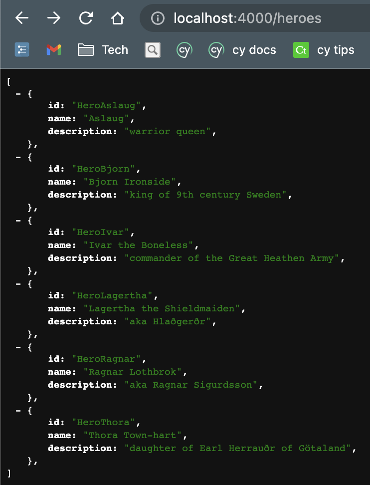
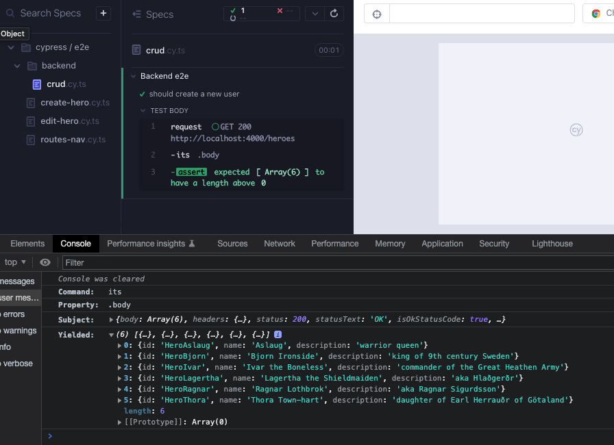
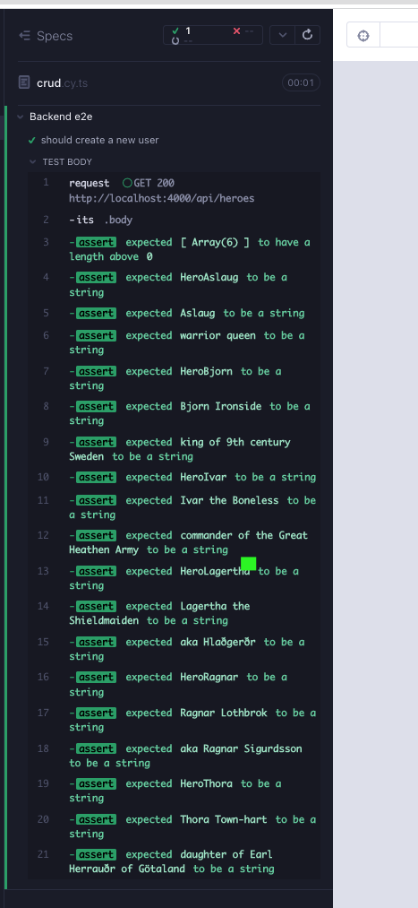
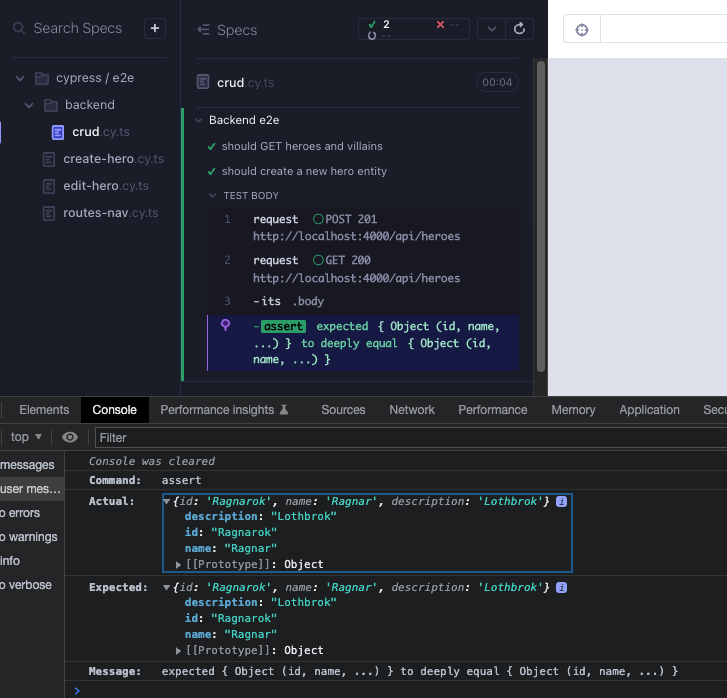

# json-server

### [`json-server`](https://github.com/typicode/json-server)

We have been using a json file `src/heroes/heroes.json` in the `Heroes` component. Our app is not talking to a backend. It would be ideal to have a fake REST API instead, and `json-server` can enable that. Add the following packages to our app:

```bash
yarn add -D concurrently json-server
```

Create a `db.json` file in the project root and copy the below content to it.

```json
{
  "heroes": [
    {
      "id": "HeroAslaug",
      "name": "Aslaug",
      "description": "warrior queen"
    },
    {
      "id": "HeroBjorn",
      "name": "Bjorn Ironside",
      "description": "king of 9th century Sweden"
    },
    {
      "id": "HeroIvar",
      "name": "Ivar the Boneless",
      "description": "commander of the Great Heathen Army"
    },
    {
      "id": "HeroLagertha",
      "name": "Lagertha the Shieldmaiden",
      "description": "aka Hlaðgerðr"
    },
    {
      "id": "HeroRagnar",
      "name": "Ragnar Lothbrok",
      "description": "aka Ragnar Sigurdsson"
    },
    {
      "id": "HeroThora",
      "name": "Thora Town-hart",
      "description": "daughter of Earl Herrauðr of Götaland"
    }
  ],
  "villains": [
    {
      "id": "VillainMadelyn",
      "name": "Madelyn",
      "description": "the cat whisperer"
    },
    {
      "id": "VillainHaley",
      "name": "Haley",
      "description": "pen wielder"
    },
    {
      "id": "VillainElla",
      "name": "Ella",
      "description": "fashionista"
    },
    {
      "id": "VillainLandon",
      "name": "Landon",
      "description": "Mandalorian mauler"
    }
  ]
}
```

Add a script to `package.json` near to the `"start"` script. This will usr the `db.json` file and respond with that content at `localhost:4000`, with a 1 second simulated network delay.

```json
{
  "scripts": {
    "start:api": "json-server --watch db.json --port 4000 --delay 1000"
  }
}
```

`yarn start:api` and browse to http://localhost:4000/heroes or http://localhost:4000/villains. We should see some data.



Update `package.json` scripts as below. The changes make it so that the UI server is always served together with the api server. This way the repo user can abstract away the backend needs while using the repo.

```json
"scripts": {
  "start": "react-scripts start",
  "start:api": "json-server --watch db.json --port 4000 --delay 1000",
  "dev": "concurrently -k yarn:start yarn:start:api",
  "build": "react-scripts build",
  "test": "react-scripts test",
  "test:coverage": "yarn test --watchAll=false --coverage",
  "test:debug": "node --inspect-brk ./node_modules/jest/bin/jest.js --watch --runInBand",
  "format": "prettier --ignore-path .gitignore --write \"**/*.+(js|json|css|md|mdx|html)\"",
  "lint": "eslint . --cache-location node_modules/.cache/eslint",
  "typecheck": "tsc --noEmit",
  "validate": "npm-run-all --parallel format lint typecheck build",
  "cy:open": "cypress open --e2e --browser chrome",
  "cy:open-e2e": "concurrently -k yarn:start:api 'server-test 3000 cy:open'",
  "cy:run-e2e": "concurrently -k yarn:start:api 'server-test 3000 cy:run'",
  "cy:open-ct": "cypress open --component --browser chrome",
  "cy:run-ct": "cypress run --component --browser chrome"
},
```

For CI, update `.github/workflows/main.yml` `cypress-e2e-test` section > Cypress GitHub action command > `start` property from `yarn start` to `yarn dev`. This will ensure that the start command not only starts the UI server, but also the backend.

```yaml
cypress-e2e-test:
  needs: [install-dependencies]
  runs-on: ubuntu-latest
  container: cypress/included:10.7.0 # or whatever is the latest
  steps:
    - uses: actions/checkout@v3

    - uses: bahmutov/npm-install@v1.8.21
      with: { useRollingCache: true }

    - name: Cypress e2e tests 🧪
      uses: cypress-io/github-action@v4.2.0
      with:
        install: false
        # update from yarn start to yarn dev
        start: yarn dev
        wait-on: "http://localhost:3000"
        browser: chrome
      env:
        GITHUB_TOKEN: ${{ secrets.GITHUB_TOKEN }}
```

### Backend-e2e

Cypress is a great tool as an API client to test any live backend; check out [CRUD API testing a deployed service with Cypress](https://dev.to/muratkeremozcan/crud-api-testing-a-deployed-service-with-cypress-using-cy-api-spok-cypress-data-session-cypress-each-4mlg). We can write backend e2e tests that ensure that the backend works properly. With `json-server` this is not needed, but we want to showcase a real life example and also we will use some of these api commands in the UI e2e CRUD tests to setup and clean up state. In the real world, most likely the backend would be in a separate repo and host its own Cypress api e2e tests. The common commands that would also be used in the front end would most likely be hosted in an internal Cypress test package; check out a guide about that [here](https://dev.to/muratkeremozcan/how-to-create-an-internal-test-plugins-for-your-team-in-ts-implement-custom-commands-and-use-other-cypress-plugins-in-them-5lp).

We create a backend-e2e test to show case TDD with Cypress api testing. Create a file `cypress/e2e/backend/crud.cy.ts`, and request a simple `GET`.

```typescript
// cypress/e2e/backend/crud.cy.ts
describe("Backend e2e", () => {
  it("should ", () => {
    const url = "http://localhost:4000/heroes";

    cy.request({
      method: "GET",
      url,
    })
      .its("body")
      .should("have.length.gt", 0);
  });
});
```

Start the runner with `yarn cy:open-e2e` and execute the test. If we scrutinize the console, we can view the array of 6 heroes in the `body`.



We can test deeper and ensure that each entity has `id`, `name` and `description` properties.

```typescript
// cypress/e2e/backend/crud.cy.ts
describe("Backend e2e", () => {
  it("should ", () => {
    const url = "http://localhost:4000/heroes";
    type Hero = { id: string; name: string; description: string };

    cy.request({
      method: "GET",
      url,
    })
      .its("body")
      .should("have.length.gt", 0)
      .each((entity: Hero) => {
        expect(entity.id).to.be.a("string");
        expect(entity.name).to.be.a("string");
        expect(entity.description).to.be.a("string");
      });
  });
});
```

It would be more ideal to have the backend served on a `/api` route so that it is not confused by the front end, and it is more aligned with the convention. Modify the url with this change for a failing test (Red 1).

```typescript
// cypress/e2e/backend/crud.cy.ts
describe("Backend e2e", () => {
  it("should ", () => {
    const url = "http://localhost:4000/api/heroes";
    type Hero = { id: string; name: string; description: string };

    cy.request({
      method: "GET",
      url,
    })
      .its("body")
      .should("have.length.gt", 0)
      .each((entity: Hero) => {
        expect(entity.id).to.be.a("string");
        expect(entity.name).to.be.a("string");
        expect(entity.description).to.be.a("string");
      });
  });
});
```

To satisfy the change, we need 2 modifications. First, create a file `routes.json` at the project root:

```json
{
  "/api/*": "/$1"
}
```

Modify the `package.json` script by appending `--routes routes.json` so that this file is used.

```json
"start:api": "json-server --watch db.json --port 4000 --delay 1000 --routes routes.json",
```



We can have a similar test for `villains` with a slight refactor (Refactor 1).

```typescript
// cypress/e2e/backend/crud.cy.ts
describe("Backend e2e", () => {
  it("should GET heroes and villains ", () => {
    const apiUrl = "http://localhost:4000/api";
    type Hero = { id: string; name: string; description: string };

    cy.request({
      method: "GET",
      url: `${apiUrl}/heroes`,
    })
      .its("body")
      .should("have.length.gt", 0)
      .each((entity: Hero) => {
        expect(entity.id).to.be.a("string");
        expect(entity.name).to.be.a("string");
        expect(entity.description).to.be.a("string");
      });

    cy.request({
      method: "GET",
      url: `${apiUrl}/villains`,
    })
      .its("body")
      .should("have.length.gt", 0)
      .each((entity: Hero) => {
        expect(entity.id).to.be.a("string");
        expect(entity.name).to.be.a("string");
        expect(entity.description).to.be.a("string");
      });
  });
});
```

We can refactor that further to be DRYer.

```typescript
// cypress/e2e/backend/crud.cy.ts
describe("Backend e2e", () => {
  const apiUrl = "http://localhost:4000/api";
  type Hero = { id: string; name: string; description: string };

  const assertProperties = (entity: Hero) => {
    expect(entity.id).to.be.a("string");
    expect(entity.name).to.be.a("string");
    expect(entity.description).to.be.a("string");
  };

  const getRoute = (route: string) =>
    cy.request({
      method: "GET",
      url: `${apiUrl}/${route}`,
    });

  it("should GET heroes and villains ", () => {
    getRoute("heroes")
      .its("body")
      .should("have.length.gt", 0)
      .each(assertProperties);

    getRoute("villains")
      .its("body")
      .should("have.length.gt", 0)
      .each(assertProperties);
  });
});
```

Let's write a new test, this time adding a hero and verifying that it got added.

```typescript
// cypress/e2e/backend/crud.cy.ts
describe("Backend e2e", () => {
  const apiUrl = "http://localhost:4000/api";
  type Hero = { id: string; name: string; description: string };

  const assertProperties = (entity: Hero) => {
    expect(entity.id).to.be.a("string");
    expect(entity.name).to.be.a("string");
    expect(entity.description).to.be.a("string");
  };

  const getRoute = (route: string) =>
    cy.request({
      method: "GET",
      url: `${apiUrl}/${route}`,
    });
  it("should GET heroes and villains ", () => {
    getRoute("heroes")
      .its("body")
      .should("have.length.gt", 0)
      .each(assertProperties);

    getRoute("villains")
      .its("body")
      .should("have.length.gt", 0)
      .each(assertProperties);
  });

  const postRoute = (route: string, body: Hero) =>
    cy.request({
      method: "POST",
      url: `${apiUrl}/${route}`,
      body,
    });

  it("should create a new hero entity", () => {
    const newHero = { id: "Ragnarok", name: "Ragnar", description: "Lothbrok" };

    postRoute("heroes", newHero);

    getRoute("heroes")
      .its("body")
      .then((body) => {
        expect(body.at(-1)).to.deep.eq(newHero);
      });
  });
});
```

The test initially seems to work, alas rerunning it we get a 500 error, because the entity we created already exists (Red 2).



There are a few ways to handle this. We could randomize the entity, and or we could delete the entity at the end of the test. We will do those to demo best practices, however the sure proof way to deal with it is to reset the server state at the beginning of the test. We could additionally ensure that the test cleans up after itself, later.

Install [json-server-reset](https://github.com/bahmutov/json-server-reset) with `yarn add -D json-server-reset`. Modify the `package.json` by appending the middleware, which enables a `/reset` route for our api. Any time a `POST` request is made to the `reset` route with a payload, the `db.json` file resets to that payload.

```json
"start:api": "json-server --watch db.json --port 4000 --delay 1000 --routes routes.json --middlewares ./node_modules/json-server-reset"
```

Make sure to remove the additional entity added to db.json in our initial test, and reset the db to its original state. Remove:

```json
{
  "id": "Ragnarok",
  "name": "Ragnar",
  "description": "Lothbrok"
}
```

Now all we need is a payload, however if we import `db.json` to our test and also use it to reset itself, reset call will keep repeating infinitely. Make a copy of `db.json` to `cypress/fixtures/db.json`, so that we can import from there and also fully be able to stub our network later. We can modify our script to reset the data before each test as shown below (Green 2).

```typescript
// cypress/e2e/backend/crud.cy.ts
import data from "../../fixtures/db.json";

describe("Backend e2e", () => {
  const apiUrl = "http://localhost:4000/api";
  type Hero = { id: string; name: string; description: string };

  const assertProperties = (entity: Hero) => {
    expect(entity.id).to.be.a("string");
    expect(entity.name).to.be.a("string");
    expect(entity.description).to.be.a("string");
  };

  const getRoute = (route: string) =>
    cy.request({
      method: "GET",
      url: `${apiUrl}/${route}`,
    });

  const postRoute = (route: string | "reset", body: Hero | object) =>
    cy.request({
      method: "POST",
      url: `${apiUrl}/${route}`,
      body,
    });

  const resetData = () => postRoute("reset", data);

  beforeEach(resetData);

  it("should GET heroes and villains ", () => {
    getRoute("heroes")
      .its("body")
      .should("have.length.gt", 0)
      .each(assertProperties);

    getRoute("villains")
      .its("body")
      .should("have.length.gt", 0)
      .each(assertProperties);
  });

  it("should create a new hero entity", () => {
    const newHero = { id: "Ragnarok", name: "Ragnar", description: "Lothbrok" };

    postRoute("heroes", newHero);

    getRoute("heroes")
      .its("body")
      .then((body) => {
        expect(body.at(-1)).to.deep.eq(newHero);
      });
  });
});
```

We can now add the rest of the test to update and delete the hero. Note that we are able use the `id` property in a route to get, update or delete that entity directly. Since we have a passing test, we keep adding new tests until we run into a failure. We are effectively testing `json-server`, therefore failures are not likely. This is the common scenario when applying a TDD-like approach after the development is done, therefore the true value of TDD is realized during development. Let's enhance the test with an update and delete (Refactor 2).

```typescript
// cypress/e2e/backend/crud.cy.ts
import data from "../../fixtures/db.json";

describe("Backend e2e", () => {
  const apiUrl = "http://localhost:4000/api";
  type Hero = { id: string; name: string; description: string };

  const assertProperties = (entity: Hero) => {
    expect(entity.id).to.be.a("string");
    expect(entity.name).to.be.a("string");
    expect(entity.description).to.be.a("string");
  };

  const getRoute = (route: string) =>
    cy.request({
      method: "GET",
      url: `${apiUrl}/${route}`,
    });

  const postRoute = (route: string, body: Hero | object) =>
    cy.request({
      method: "POST",
      url: `${apiUrl}/${route}`,
      body,
    });

  const editRoute = (route: string, body: Hero | object) =>
    cy.request({
      method: "PUT",
      url: `${apiUrl}/${route}`,
      body,
    });

  const deleteRoute = (route: string) =>
    cy.request({
      method: "DELETE",
      url: `${apiUrl}/${route}`,
    });

  const resetData = () => postRoute("reset", data);

  beforeEach(resetData);

  it("should GET heroes and villains ", () => {
    getRoute("heroes")
      .its("body")
      .should("have.length.gt", 0)
      .each(assertProperties);

    getRoute("villains")
      .its("body")
      .should("have.length.gt", 0)
      .each(assertProperties);
  });

  it("should create a new hero entity", () => {
    const newHero = { id: "Ragnarok", name: "Ragnar", description: "Lothbrok" };

    postRoute("heroes", newHero);

    getRoute("heroes")
      .its("body")
      .then((body) => {
        expect(body.at(-1)).to.deep.eq(newHero);
      });

    const editedHero = { ...newHero, name: "Murat" };
    editRoute(`heroes/${editedHero.id}`, editedHero);
    getRoute(`heroes/${editedHero.id}`)
      .its("body")
      .should("deep.eq", editedHero);

    deleteRoute(`heroes/${editedHero.id}`);
  });
});
```

The test taking responsibility for the db state is a best practice. Here we have create update delete all under one block, but another approach could be like the below. The duplicated sub steps are highlighted in **bold**.

- Creation
  - **UI create**
  - **API delete**
- Update
  - **API create**
  - UI update
  - **API delete**
- Delete
  - **API create**
  - **UI delete**

As you can see, covering the update scenario satisfies it all, otherwise there is duplication between the tests.

After the final delete, we should ensure that the entity is removed from the database. Add a final get to check for this (Red 3).

```typescript
// cypress/e2e/backend/crud.cy.ts
import data from "../../fixtures/db.json";

describe("Backend e2e", () => {
  const apiUrl = "http://localhost:4000/api";
  type Hero = { id: string; name: string; description: string };

  const assertProperties = (entity: Hero) => {
    expect(entity.id).to.be.a("string");
    expect(entity.name).to.be.a("string");
    expect(entity.description).to.be.a("string");
  };

  const getRoute = (route: string) =>
    cy.request({
      method: "GET",
      url: `${apiUrl}/${route}`,
    });

  const postRoute = (route: string, body: Hero | object) =>
    cy.request({
      method: "POST",
      url: `${apiUrl}/${route}`,
      body,
    });

  const editRoute = (route: string, body: Hero | object) =>
    cy.request({
      method: "PUT",
      url: `${apiUrl}/${route}`,
      body,
    });

  const deleteRoute = (route: string) =>
    cy.request({
      method: "DELETE",
      url: `${apiUrl}/${route}`,
    });

  const resetData = () => postRoute("reset", data);

  beforeEach(resetData);

  it("should GET heroes and villains ", () => {
    getRoute("heroes")
      .its("body")
      .should("have.length.gt", 0)
      .each(assertProperties);

    getRoute("villains")
      .its("body")
      .should("have.length.gt", 0)
      .each(assertProperties);
  });

  it("should CRUD a new hero entity", () => {
    const newHero = { id: "Ragnarok", name: "Ragnar", description: "Lothbrok" };

    postRoute("heroes", newHero);

    getRoute("heroes")
      .its("body")
      .then((body) => {
        expect(body.at(-1)).to.deep.eq(newHero);
      });

    const editedHero = { ...newHero, name: "Murat" };
    editRoute(`heroes/${editedHero.id}`, editedHero);
    getRoute(`heroes/${editedHero.id}`)
      .its("body")
      .should("deep.eq", editedHero);

    deleteRoute(`heroes/${editedHero.id}`);
    getRoute(`heroes/${editedHero.id}`).its("status").should("eq", 404);
  });
});
```

We will get a failure about the 404 status because Cypress retries commands (for 4 seconds) until it succeeds. If we have a check for a non-200 code, we should allow the api calls to fail.

[cy.request](https://docs.cypress.io/api/commands/request) has two properties we love to control:

- `retryOnStatusCodeFailure`: Whether Cypress should automatically retry status code errors under the hood. Cypress will retry a request up to 4 times if this is set to true.
- `failOnStatusCode` : Whether to fail on response codes other than `2xx` and `3xx`

We can control those two together in an argument flag `allowedToFail` with default value of `false`. When we expect to have non-200 status codes, we can set that to true. Here is the api enhancement (Green 3).

```typescript
// cypress/e2e/backend/crud.cy.ts
import data from "../../fixtures/db.json";

describe("Backend e2e", () => {
  const apiUrl = "http://localhost:4000/api";
  type Hero = { id: string; name: string; description: string };

  const assertProperties = (entity: Hero) => {
    expect(entity.id).to.be.a("string");
    expect(entity.name).to.be.a("string");
    expect(entity.description).to.be.a("string");
  };

  const getRoute = (route: string, allowedToFail = false) =>
    cy.request({
      method: "GET",
      url: `${apiUrl}/${route}`,
      retryOnStatusCodeFailure: !allowedToFail,
      failOnStatusCode: !allowedToFail,
    });

  const postRoute = (route: string, body: Hero | object) =>
    cy.request({
      method: "POST",
      url: `${apiUrl}/${route}`,
      body,
    });

  const editRoute = (route: string, body: Hero | object) =>
    cy.request({
      method: "PUT",
      url: `${apiUrl}/${route}`,
      body,
    });

  const deleteRoute = (route: string) =>
    cy.request({
      method: "DELETE",
      url: `${apiUrl}/${route}`,
    });

  const resetData = () => postRoute("reset", data);

  beforeEach(resetData);

  it("should GET heroes and villains ", () => {
    getRoute("heroes")
      .its("body")
      .should("have.length.gt", 0)
      .each(assertProperties);

    getRoute("villains")
      .its("body")
      .should("have.length.gt", 0)
      .each(assertProperties);
  });

  it("should CRUD a new hero entity", () => {
    const newHero = { id: "Ragnarok", name: "Ragnar", description: "Lothbrok" };

    postRoute("heroes", newHero);

    getRoute("heroes")
      .its("body")
      .then((body) => {
        expect(body.at(-1)).to.deep.eq(newHero);
      });

    const editedHero = { ...newHero, name: "Murat" };
    editRoute(`heroes/${editedHero.id}`, editedHero);
    getRoute(`heroes/${editedHero.id}`)
      .its("body")
      .should("deep.eq", editedHero);

    deleteRoute(`heroes/${editedHero.id}`);
    getRoute(`heroes/${editedHero.id}`, true).its("status").should("eq", 404);
  });
});
```

We can refactor the api to be better readable and extendible by putting the options in an object. This way, if there are multiple options, their order does not matter. If no options are passed in, it defaults to an empty object. This refactor also allows us to add new options in the future, and the api user can pick and choose which ones to utilize.

We can also improve the type by casting the `cy.request` response, indicating the type of the value we will get.

```typescript
const getRoute = (
  // required args
  route: string,
  // options, some can have default values
  // {optional args}: {their types} = {}
  { allowedToFail = false }: { allowedToFail?: boolean } = {}
) =>
  cy.request<Hero[] & Hero>({
    method: "GET",
    url: `${apiUrl}/${route}`,
    retryOnStatusCodeFailure: !allowedToFail,
    failOnStatusCode: !allowedToFail,
  });
```

Here is the refactored test (Refactor 3).

```typescript
// cypress/e2e/backend/crud.cy.ts
import data from "../../fixtures/db.json";

describe("Backend e2e", () => {
  const apiUrl = "http://localhost:4000/api";
  type Hero = { id: string; name: string; description: string };

  const assertProperties = (entity: Hero) => {
    expect(entity.id).to.be.a("string");
    expect(entity.name).to.be.a("string");
    expect(entity.description).to.be.a("string");
  };

  const getRoute = (
    route: string,
    { allowedToFail = false }: { allowedToFail?: boolean } = {}
  ) =>
    cy.request<Hero[] & Hero>({
      method: "GET",
      url: `${apiUrl}/${route}`,
      retryOnStatusCodeFailure: !allowedToFail,
      failOnStatusCode: !allowedToFail,
    });

  const postRoute = (route: string, body: Hero | object) =>
    cy.request<Hero>({
      method: "POST",
      url: `${apiUrl}/${route}`,
      body,
    });

  const editRoute = (route: string, body: Hero | object) =>
    cy.request<Hero>({
      method: "PUT",
      url: `${apiUrl}/${route}`,
      body,
    });

  const deleteRoute = (route: string) =>
    cy.request<Hero>({
      method: "DELETE",
      url: `${apiUrl}/${route}`,
    });

  const resetData = () => postRoute("reset", data);

  beforeEach(resetData);

  it("should GET heroes and villains ", () => {
    getRoute("heroes")
      .its("body")
      .should("have.length.gt", 0)
      .each(assertProperties);

    getRoute("villains")
      .its("body")
      .should("have.length.gt", 0)
      .each(assertProperties);
  });

  it("should CRUD a new hero entity", () => {
    const newHero = { id: "Ragnarok", name: "Ragnar", description: "Lothbrok" };

    postRoute("heroes", newHero);

    getRoute("heroes")
      .its("body")
      .then((body) => {
        expect(body.at(-1)).to.deep.eq(newHero);
      });

    const editedHero = { ...newHero, name: "Murat" };
    editRoute(`heroes/${editedHero.id}`, editedHero);
    getRoute(`heroes/${editedHero.id}`)
      .its("body")
      .should("deep.eq", editedHero);

    deleteRoute(`heroes/${editedHero.id}`);
    getRoute(`heroes/${editedHero.id}`, { allowedToFail: true })
      .its("status")
      .should("eq", 404);
  });
});
```

That is a better readable api, but there is some duplication between the CRUD functions. Consider the below function that can do any crud operation, with type safety. `method` and `route` are required. `body` and `allowedToFail` flag are optional, if they are not passed in then `body` is empty but `allowedToFail` still is `false`. If the body is passed in and the method is `POST` or `PUT`, the payload will be taken, otherwise undefined for `GET` and `DELETE`.

```typescript
const crud = (
  // required args
  method: "GET" | "POST" | "PUT" | "DELETE",
  route: string,
  // optional args
  // {optional args}: {their types} = {}
  {
    body,
    allowedToFail = false,
  }: { body?: Hero | object; allowedToFail?: boolean } = {}
) =>
  cy.request<Hero[] & Hero>({
    method: method,
    url: `${apiUrl}/${route}`,
    body: method === "POST" || method === "PUT" ? body : undefined,
    retryOnStatusCodeFailure: !allowedToFail,
    failOnStatusCode: !allowedToFail,
  });
```

Here is the refactor using the above function (Refactor 4):

```typescript
import data from "../../fixtures/db.json";

describe("Backend e2e", () => {
  const apiUrl = "http://localhost:4000/api";
  type Hero = { id: string; name: string; description: string };

  const assertProperties = (entity: Hero) => {
    expect(entity.id).to.be.a("string");
    expect(entity.name).to.be.a("string");
    expect(entity.description).to.be.a("string");
  };

  const crud = (
    method: "GET" | "POST" | "PUT" | "DELETE",
    route: string,
    {
      body,
      allowedToFail = false,
    }: { body?: Hero | object; allowedToFail?: boolean } = {}
  ) =>
    cy.request<Hero[] & Hero>({
      method: method,
      url: `${apiUrl}/${route}`,
      body: method === "POST" || method === "PUT" ? body : undefined,
      retryOnStatusCodeFailure: !allowedToFail,
      failOnStatusCode: !allowedToFail,
    });

  const resetData = () => crud("POST", "reset", { body: data });

  beforeEach(resetData);

  it("should GET heroes and villains ", () => {
    crud("GET", "heroes")
      .its("body")
      .should("have.length.gt", 0)
      .each(assertProperties);

    crud("GET", "villains")
      .its("body")
      .should("have.length.gt", 0)
      .each(assertProperties);
  });

  it("should CRUD a new hero entity", () => {
    const newHero = { id: "Ragnarok", name: "Ragnar", description: "Lothbrok" };

    crud("POST", "heroes", { body: newHero });

    crud("GET", "heroes")
      .its("body")
      .then((body) => {
        expect(body.at(-1)).to.deep.eq(newHero);
      });

    const editedHero = { ...newHero, name: "Murat" };
    crud("PUT", `heroes/${editedHero.id}`, { body: editedHero });
    crud("GET", `heroes/${editedHero.id}`)
      .its("body")
      .should("deep.eq", editedHero);

    crud("DELETE", `heroes/${editedHero.id}`);
    crud("GET", `heroes/${editedHero.id}`, { allowedToFail: true })
      .its("status")
      .should("eq", 404);
  });
});
```

When we have ui e2e tests, we will want to use this command for setup and teardown. We can move it to a utility file, and import from there to each test that needs it. Usually the rule of the thumb is to use a utility file, and import the function from there if there are 2-3 imports. Anything beyond that is more suited from a Cypress command. Let's create a command to showcase how that can be achieved.

We kept adding tests, and got green repeatedly. Now we can keep refactoring until we are happy with the result.

Add the command `crud` and `resetData` to Cypress commands (Refactor 4).

```typescript
// cypress/support/commands.ts
import "@testing-library/cypress/add-commands";
import data from "../fixtures/db.json";

Cypress.Commands.add("getByCy", (selector, ...args) =>
  cy.get(`[data-cy="${selector}"]`, ...args)
);

Cypress.Commands.add("getByCyLike", (selector, ...args) =>
  cy.get(`[data-cy*=${selector}]`, ...args)
);

Cypress.Commands.add("getByClassLike", (selector, ...args) =>
  cy.get(`[class*=${selector}]`, ...args)
);

export type Hero = { id: string; name: string; description: string };
Cypress.Commands.add(
  "crud",
  (
    method: "GET" | "POST" | "PUT" | "DELETE",
    route: string,
    {
      body,
      allowedToFail = false,
    }: { body?: Hero | object; allowedToFail?: boolean } = {}
  ) =>
    cy.request<Hero[] & Hero>({
      method: method,
      url: `http://localhost:4000/api/${route}`,
      body: method === "POST" || method === "PUT" ? body : undefined,
      retryOnStatusCodeFailure: !allowedToFail,
      failOnStatusCode: !allowedToFail,
    })
);

Cypress.Commands.add("resetData", () =>
  cy.crud("POST", "reset", { body: data })
);
```

Add the type definition of the command to `./cypress.d.ts`.

````typescript
// cypress.d.ts

/* eslint-disable @typescript-eslint/no-explicit-any */
import { MountOptions, MountReturn } from "cypress/react";
import type { Hero } from "./cypress/support/commands";

export {};
declare global {
  namespace Cypress {
    interface Chainable {
      /** Yields elements with a data-cy attribute that matches a specified selector.
       * ```
       * cy.getByCy('search-toggle') // where the selector is [data-cy="search-toggle"]
       * ```
       */
      getByCy(qaSelector: string, args?: any): Chainable<JQuery<HTMLElement>>;

      /** Yields elements with data-cy attribute that partially matches a specified selector.
       * ```
       * cy.getByCyLike('chat-button') // where the selector is [data-cy="chat-button-start-a-new-claim"]
       * ```
       */
      getByCyLike(
        qaSelector: string,
        args?: any
      ): Chainable<JQuery<HTMLElement>>;

      /** Yields the element that partially matches the css class
       * ```
       * cy.getByClassLike('StyledIconBase') // where the class is class="StyledIconBase-ea9ulj-0 lbJwfL"
       * ```
       */
      getByClassLike(
        qaSelector: string,
        args?: any
      ): Chainable<JQuery<HTMLElement>>;

      /** Mounts a React node
       * @param component React Node to mount
       * @param options Additional options to pass into mount
       */
      mount(
        component: React.ReactNode,
        options?: MountOptions
      ): Cypress.Chainable<MountReturn>;

      /**
       * Performs crud operations GET, POST, PUT and DELETE.
       *
       * `body` and `allowedToFail are optional.
       *
       * If they are not passed in, body is empty but `allowedToFail` still is `false`.
       *
       * If the body is passed in and the method is `POST` or `PUT`, the payload will be taken,
       * otherwise undefined for `GET` and `DELETE`.
       * @param method
       * @param route
       * @param options: {body?: Hero | object; allowedToFail?: boolean}
       */
      crud(
        method: "GET" | "POST" | "PUT" | "DELETE",
        route: string,
        {
          body,
          allowedToFail = false,
        }: { body?: Hero | object; allowedToFail?: boolean } = {}
      ): Cypress.Chainable<Response<Hero[] & Hero>>;

      /**
       * Resets the data in the database to the initial data.
       */
      resetData(): Cypress.Chainable<Response<Hero[] & Hero>>;
    }
  }
}
````

Use the commands in the spec file. We will do a final touch up here to use [`faker`](https://fakerjs.dev/api/) for the data we are working with. `yarn add -D @faker-js/faker` (Refactor 4).

```typescript
// cypress/e2e/backend/crud.cy.ts
import type {Hero} from '../../support/commands'
import {faker} from '@faker-js/faker'

describe('Backend e2e', () => {
  const assertProperties = (entity: Hero) => {
    expect(entity.id).to.be.a('string')
    expect(entity.name).to.be.a('string')
    expect(entity.description).to.be.a('string')
  }

  beforeEach(() => cy.resetData())

  it('should GET heroes and villains ', () => {
    cy.crud('GET', 'heroes')
      .its('body')
      .should('have.length.gt', 0)
      .each(assertProperties)

    cy.crud('GET', 'villains')
      .its('body')
      .should('have.length.gt', 0)
      .each(assertProperties)
  })

  it('should CRUD a new hero entity', () => {
    const newHero = {
      id: faker.datatype.uuid(),
      name: faker.internet.userName(),
      description: `description ${faker.internet.userName()}`,
    }

    cy.crud('POST', 'heroes', {body: newHero}).its('status').should('eq', 201)

    cy.crud('GET', 'heroes')
      .its('body')
      .then(body => {
        expect(body.at(-1)).to.deep.eq(newHero)
      })

    const editedHero = {...newHero, name: 'Murat'}
    cy.crud('PUT', `heroes/${editedHero.id}`, {body: editedHero})
      .its('status')
      .should('eq', 200)
    cy.crud('GET', `heroes/${editedHero.id}`)
      .its('body')
      .should('deep.eq', editedHero)

    cy.crud('DELETE', `heroes/${editedHero.id}`).its('status').should('eq', 200)
    cy.crud('GET', `heroes/${editedHero.id}`, {allowedToFail: true})
      .its('status')
      .should('eq', 404)
  })
```

The final code may look sophisticated, but it took many cycles of getting the tests to work and refactoring to get there.

### Summary

We faked a backed server for our application to talk to using `json-server`.

This required to seed the database with a `db.json` file, also to start the api server when our app starts.

`package.json` scripts and the CI had to be modified.

We started with a `GET` test to verify the seeded data. We modified the backend to use a unique prefix `api`, and verified heroes and villains (Red 1, Green 1, Refactor 1)

</br>

We created a new test to add a hero. But because the test leaves state behind, rerunning it caused issues (Red 2).

We used `json-server-reset` to reset the db to its original form before each test (Green 2).

We enhanced the test with update and delete (Refactor 2)

</br>

We added a test to ensure that the deleted entity is removed from the DB (Red 3).

To verify non-200 status codes, we improved our test api (Green 3).

We further improved the api to be better readable and extendable using an object for the optional `allowedToFail` (Refactor 3).

We refactored the CRUD commands into a single functions (Refactor 4).

We reached a state where we kept adding tests, and got green repeatedly.

After that point we kept refactoring until we were happy with the result, using Cypress commands, faker, better types so on and so forth.

### Takeaways

The true value of TDD is realized during development. It can be applied after so, however the RedGreenRefactor cycles become more like GreenRefactor. The incremental, small steps moving forward towards more comprehensive tests and refactored code are still the same.

With Cypress the rule of the thumb is to use a utility file, and import the functions from there if there are 2-3 references / imports. Anything beyond that is more suited from a Cypress command where the function will be available in any spec without having to import. We opted to use a command to demo the more sophisticated approach that readers may not be familiar with.
