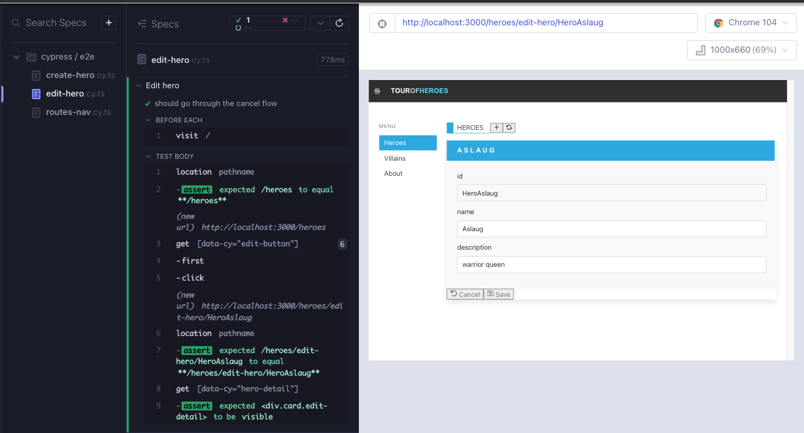

# Heroes part 3 - react-query

Let's add a failing e2e test for edit hero cancel flow (Red 5). Create a file `cypress/e2e/edit-hero.cy.ts`. It starts similarly to the add flow, but instead clicks the Edit button and expects to be in a relevant route.

```tsx
// cypress/e2e/edit-hero.cy.ts
describe("Edit hero", () => {
  beforeEach(() => cy.visit("/"));
  it("should go through the cancel flow", () => {
    cy.location("pathname").should("eq", "/heroes");

    cy.getByCy("edit-button").first().click();
    cy.location("pathname").should("eq", "/heroes/edit-hero");
  });
});
```

When it was not certain what to do with click handlers in our app, we started them off with `console.log`. In the console of the e2e test we can see `handleSelectHero`. This function resides in `HeroList` component. We just need to enhance it to utilize `useNavigate` like we did so in the parent `Heroes` component (Green 5).

```tsx
// src/heroes/HeroList.tsx
import { useNavigate } from "react-router-dom";
import CardContent from "../components/CardContent";
import ButtonFooter from "../components/ButtonFooter";
import { FaEdit, FaRegSave } from "react-icons/fa";
import type { Hero } from "./HeroDetail";
type HeroListProps = {
  heroes: Hero[];
  handleDeleteHero: () => void; // TODO: consider better type
};

export default function HeroList({ heroes, handleDeleteHero }: HeroListProps) {
  const navigate = useNavigate();
  const handleSelectHero = () => navigate("/heroes/edit-hero");

  return (
    <ul data-cy="hero-list" className="list">
      {heroes.map((hero, index) => (
        <li data-cy={`hero-list-item-${index}`} key={hero.id}>
          <div className="card">
            <CardContent name={hero.name} description={hero.description} />
            <footer className="card-footer">
              <ButtonFooter
                label="Delete"
                IconClass={FaRegSave}
                onClick={handleDeleteHero}
              />
              <ButtonFooter
                label="Edit"
                IconClass={FaEdit}
                onClick={handleSelectHero}
              />
            </footer>
          </div>
        </li>
      ))}
    </ul>
  );
}
```


The next feature we need is for `HeroDetail` component to render, as in the add hero flow, and this time show the `heroId` field (Red 6).

```tsx
// cypress/e2e/edit-hero.cy.ts
describe("Edit hero", () => {
  beforeEach(() => cy.visit("/"));
  it("should go through the cancel flow", () => {
    cy.location("pathname").should("eq", "/heroes");

    cy.getByCy("edit-button").first().click();
    cy.location("pathname").should("eq", "/heroes/edit-hero");
    cy.getByCy("hero-detail").should("be.visible");
  });
});
```

One of our components now needs to know to display the `HeroDetail` component when the route is `/edit-hero`. `Heroes` component is already handling the descendant route `add-hero`, so we can conveniently add a new route there (Green 6).

```tsx
// src/heroes/Heroes.tsx
import { useNavigate, Routes, Route } from "react-router-dom";
import ListHeader from "../components/ListHeader";
import ModalYesNo from "components/ModalYesNo";
import HeroList from "./HeroList";
import heroes from "./heroes.json";
import { useState } from "react";
import HeroDetail from "./HeroDetail";

export default function Heroes() {
  const [showModal, setShowModal] = useState<boolean>(false);
  const navigate = useNavigate();
  const addNewHero = () => navigate("/heroes/add-hero");
  const handleRefresh = () => navigate("/heroes");

  const handleCloseModal = () => {
    setShowModal(false);
  };
  const handleDeleteHero = () => {
    setShowModal(true);
  };
  const handleDeleteFromModal = () => {
    setShowModal(false);
    console.log("handleDeleteFromModal");
  };

  return (
    <div data-cy="heroes">
      <ListHeader
        title="Heroes"
        handleAdd={addNewHero}
        handleRefresh={handleRefresh}
      />
      <div>
        <div>
          <Routes>
            <Route
              path=""
              element={
                <HeroList heroes={heroes} handleDeleteHero={handleDeleteHero} />
              }
            />
            <Route path="/add-hero" element={<HeroDetail />} />
            <Route path="/edit-hero" element={<HeroDetail />} />
            <Route
              path="*"
              element={
                <HeroList heroes={heroes} handleDeleteHero={handleDeleteHero} />
              }
            />
          </Routes>
        </div>
      </div>

      {showModal && (
        <ModalYesNo
          message="Would you like to delete the hero?"
          onNo={handleCloseModal}
          onYes={handleDeleteFromModal}
        />
      )}
    </div>
  );
}
```

## 

Time for the next failing test. When we are editing a hero, the `heroId` for that hero must be in existence, therefore `HeroDetail` component must be displaying it (Red 7).

```tsx
// cypress/e2e/edit-hero.cy.ts
describe("Edit hero", () => {
  beforeEach(() => cy.visit("/"));
  it("should go through the cancel flow", () => {
    cy.location("pathname").should("eq", "/heroes");

    cy.getByCy("edit-button").first().click();
    cy.location("pathname").should("eq", "/heroes/edit-hero");
    cy.getByCy("hero-detail").should("be.visible");
    cy.getByCy("input-detail-id").should("be.visible");
  });
});
```

`HeroDetail` component takes an optional `hero` prop, if we pass in any of the heroes in the `heroes` array, the test should work (Green 7).

```tsx
// src/heroes/Heroes.tsx
import { useNavigate, Routes, Route } from "react-router-dom";
import ListHeader from "../components/ListHeader";
import ModalYesNo from "components/ModalYesNo";
import HeroList from "./HeroList";
import heroes from "./heroes.json";
import { useState } from "react";
import HeroDetail from "./HeroDetail";

export default function Heroes() {
  const [showModal, setShowModal] = useState<boolean>(false);
  const navigate = useNavigate();
  const addNewHero = () => navigate("/heroes/add-hero");
  const handleRefresh = () => navigate("/heroes");

  const handleCloseModal = () => {
    setShowModal(false);
  };
  const handleDeleteHero = () => {
    setShowModal(true);
  };
  const handleDeleteFromModal = () => {
    setShowModal(false);
    console.log("handleDeleteFromModal");
  };

  return (
    <div data-cy="heroes">
      <ListHeader
        title="Heroes"
        handleAdd={addNewHero}
        handleRefresh={handleRefresh}
      />
      <div>
        <div>
          <Routes>
            <Route
              path=""
              element={
                <HeroList heroes={heroes} handleDeleteHero={handleDeleteHero} />
              }
            />
            <Route path="/add-hero" element={<HeroDetail />} />
            <Route
              path="/edit-hero"
              element={<HeroDetail hero={heroes[0]} />}
            />
            <Route
              path="*"
              element={
                <HeroList heroes={heroes} handleDeleteHero={handleDeleteHero} />
              }
            />
          </Routes>
        </div>
      </div>

      {showModal && (
        <ModalYesNo
          message="Would you like to delete the hero?"
          onNo={handleCloseModal}
          onYes={handleDeleteFromModal}
        />
      )}
    </div>
  );
}
```

We can do a little better than hard-coding array index 0 as the value of the `hero` prop. We can go through the `heroes` array, find the hero by id using heroes.find(_h_ => _h_.id), and then display it (Refactor 7).

```tsx
// src/heroes/Heroes.tsx
import { useNavigate, Routes, Route } from "react-router-dom";
import ListHeader from "../components/ListHeader";
import ModalYesNo from "components/ModalYesNo";
import HeroList from "./HeroList";
import heroes from "./heroes.json";
import { useState } from "react";
import HeroDetail from "./HeroDetail";

export default function Heroes() {
  const hero = heroes.find((h) => h.id);

  const [showModal, setShowModal] = useState<boolean>(false);
  const navigate = useNavigate();
  const addNewHero = () => navigate("/heroes/add-hero");
  const handleRefresh = () => navigate("/heroes");

  const handleCloseModal = () => {
    setShowModal(false);
  };
  const handleDeleteHero = () => {
    setShowModal(true);
  };
  const handleDeleteFromModal = () => {
    setShowModal(false);
    console.log("handleDeleteFromModal");
  };

  return (
    <div data-cy="heroes">
      <ListHeader
        title="Heroes"
        handleAdd={addNewHero}
        handleRefresh={handleRefresh}
      />
      <div>
        <div>
          <Routes>
            <Route
              path=""
              element={
                <HeroList heroes={heroes} handleDeleteHero={handleDeleteHero} />
              }
            />
            <Route path="/add-hero" element={<HeroDetail />} />
            <Route path="/edit-hero" element={<HeroDetail hero={hero} />} />
            <Route
              path="*"
              element={
                <HeroList heroes={heroes} handleDeleteHero={handleDeleteHero} />
              }
            />
          </Routes>
        </div>
      </div>

      {showModal && (
        <ModalYesNo
          message="Would you like to delete the hero?"
          onNo={handleCloseModal}
          onYes={handleDeleteFromModal}
        />
      )}
    </div>
  );
}
```

We can also refactor the test to use less magic values (Refactor 7). We have no network yet to stub, but we have a duplicate `heroes.json` file in Cypress fixtures which we can use.

```tsx
// cypress/e2e/edit-hero.cy.ts
import heroes from "../fixtures/heroes.json";

describe("Edit hero", () => {
  beforeEach(() => cy.visit("/"));
  it("should go through the cancel flow", () => {
    cy.location("pathname").should("eq", "/heroes");

    const heroIndex = 0;

    cy.getByCy("edit-button").eq(heroIndex).click();
    cy.location("pathname").should("eq", "/heroes/edit-hero");
    cy.getByCy("hero-detail").should("be.visible");
    cy.getByCy("input-detail-id").should("be.visible");
    cy.findByDisplayValue(heroes[heroIndex].id).should("be.visible");
  });
});
```

Now, let's change that index to something other than 0, and we have our failing test. The displayed hero should now be array position 1, but it is still the hero at index 0 (Red 8).

```tsx
// cypress/e2e/edit-hero.cy.ts
import heroes from "../fixtures/heroes.json";

describe("Edit hero", () => {
  beforeEach(() => cy.visit("/"));
  it("should go through the cancel flow", () => {
    cy.location("pathname").should("eq", "/heroes");

    const heroIndex = 1;

    cy.getByCy("edit-button").eq(heroIndex).click();
    cy.location("pathname").should("eq", "/heroes/edit-hero");
    cy.getByCy("hero-detail").should("be.visible");
    cy.getByCy("input-detail-id").should("be.visible");
    cy.findByDisplayValue(heroes[heroIndex].id).should("be.visible");
  });
});
```

We need a way for the route to edit the nth hero. In `react-router` we can take advantage of path attributes.

Here is a simple example showing how path attributes work. Assume that our data is `milkshake` and the data model looks as such:

```tsx
{
  flavor: "vanilla",
  size: "medium"
}
```

If we setup our rotes like this:

```tsx
<Route path="/milkshake/:flavor/:size" element={<Milkshake />} />
```

The url path will be ` /milkshake/vanilla/medium`.

To replicate that configuration, our `edit-hero` path needs a path attribute of `id`, and we need a way to extract that path attribute from the url. React-router's `useParam` returns an object with properties corresponding to URL parameters.

```tsx
const { flavor, size } = useParams();
```
