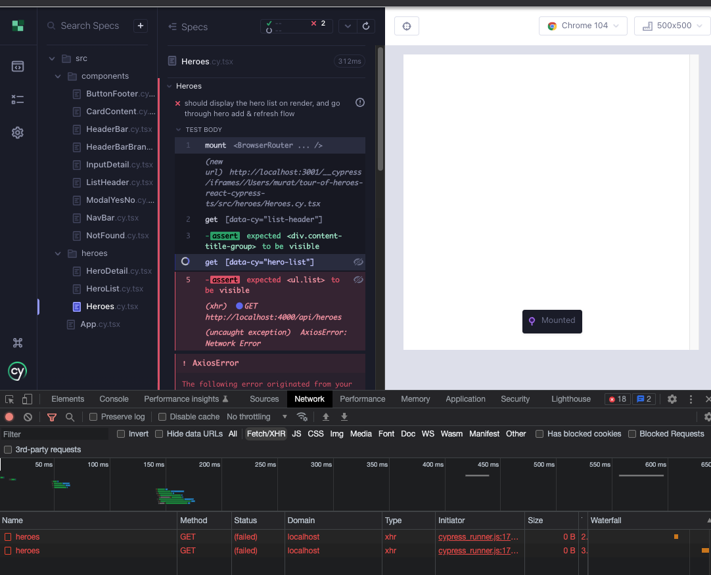

# Heroes part 3 - `useEffect` and HTTP

## edit-hero-cancel e2e flow

At the end of HeroesPart2 chapter, we created a test for the add-hero-cancel workflow. Similarly, we can add a failing e2e test for edit-hero-cancel flow (Red 1). Create a file `cypress/e2e/edit-hero.cy.ts`. It starts similarly to the add flow, clicking edit instead of add, but instead clicks the Edit button and expects to be in a relevant route.

```tsx
// cypress/e2e/edit-hero.cy.ts
describe("Edit hero", () => {
  beforeEach(() => cy.visit("/"));
  it("should go through the cancel flow", () => {
    cy.location("pathname").should("eq", "/heroes");

    cy.getByCy("edit-button").first().click();
    cy.location("pathname").should("eq", "/heroes/edit-hero/HeroAslaug");
  });
});
```

When it was not certain what to do with click handlers in our app, we started them off with `console.log`. In the console of the e2e test we can see `handleSelectHero`. This function resides in `HeroList` component. We just need to enhance it to utilize `useNavigate` like we did so in the parent `Heroes` component (Green 1).

```tsx
// src/heroes/HeroList.tsx
import { useNavigate } from "react-router-dom";
import CardContent from "../components/CardContent";
import ButtonFooter from "../components/ButtonFooter";
import { FaEdit, FaRegSave } from "react-icons/fa";
import { Hero } from "models/Hero";
type HeroListProps = {
  heroes: Hero[];
  handleDeleteHero: () => void; // TODO: consider better type
};

export default function HeroList({ heroes, handleDeleteHero }: HeroListProps) {
  const navigate = useNavigate();
  const handleSelectHero = () => navigate("/heroes/edit-hero/HeroAslaug");

  return (
    <ul data-cy="hero-list" className="list">
      {heroes.map((hero, index) => (
        <li data-cy={`hero-list-item-${index}`} key={hero.id}>
          <div className="card">
            <CardContent name={hero.name} description={hero.description} />
            <footer className="card-footer">
              <ButtonFooter
                label="Delete"
                IconClass={FaRegSave}
                onClick={handleDeleteHero}
              />
              <ButtonFooter
                label="Edit"
                IconClass={FaEdit}
                onClick={handleSelectHero}
              />
            </footer>
          </div>
        </li>
      ))}
    </ul>
  );
}
```


The next feature we need is for `HeroDetail` component to render, as in the add hero flow, and this time show the `heroId` field (Red 2).

```tsx
// cypress/e2e/edit-hero.cy.ts
describe("Edit hero", () => {
  beforeEach(() => cy.visit("/"));
  it("should go through the cancel flow", () => {
    cy.location("pathname").should("eq", "/heroes");

    cy.getByCy("edit-button").first().click();
    cy.location("pathname").should("eq", "/heroes/edit-hero/HeroAslaug");
    cy.getByCy("hero-detail").should("be.visible");
  });
});
```

One of our components now needs to know to display the `HeroDetail` component when the route is `/edit-hero`. `Heroes` component is already handling the descendant route `add-hero`, so we can conveniently add a new route there (Green 2).

```tsx
// src/heroes/Heroes.tsx
import { useNavigate, Routes, Route } from "react-router-dom";
import ListHeader from "../components/ListHeader";
import ModalYesNo from "components/ModalYesNo";
import HeroList from "./HeroList";
import heroes from "./heroes.json";
import { useState } from "react";
import HeroDetail from "./HeroDetail";

export default function Heroes() {
  const [showModal, setShowModal] = useState<boolean>(false);
  const navigate = useNavigate();
  const addNewHero = () => navigate("/heroes/add-hero");
  const handleRefresh = () => navigate("/heroes");

  const handleCloseModal = () => {
    setShowModal(false);
  };
  const handleDeleteHero = () => {
    setShowModal(true);
  };
  const handleDeleteFromModal = () => {
    setShowModal(false);
    console.log("handleDeleteFromModal");
  };

  return (
    <div data-cy="heroes">
      <ListHeader
        title="Heroes"
        handleAdd={addNewHero}
        handleRefresh={handleRefresh}
      />
      <div>
        <div>
          <Routes>
            <Route
              path=""
              element={
                <HeroList heroes={heroes} handleDeleteHero={handleDeleteHero} />
              }
            />
            <Route path="/add-hero" element={<HeroDetail />} />
            <Route path="/edit-hero/HeroAslaug" element={<HeroDetail />} />
            <Route
              path="*"
              element={
                <HeroList heroes={heroes} handleDeleteHero={handleDeleteHero} />
              }
            />
          </Routes>
        </div>
      </div>

      {showModal && (
        <ModalYesNo
          message="Would you like to delete the hero?"
          onNo={handleCloseModal}
          onYes={handleDeleteFromModal}
        />
      )}
    </div>
  );
}
```

## 

Time for the next failing test. When we are editing a hero, the `heroId` for that hero must be in existence, therefore `HeroDetail` component must be displaying it (Red 3).

```tsx
// cypress/e2e/edit-hero.cy.ts
describe("Edit hero", () => {
  beforeEach(() => cy.visit("/"));
  it("should go through the cancel flow", () => {
    cy.location("pathname").should("eq", "/heroes");

    cy.getByCy("edit-button").first().click();
    cy.location("pathname").should("eq", "/heroes/edit-hero");
    cy.getByCy("hero-detail").should("be.visible");
    cy.getByCy("input-detail-id").should("be.visible");
  });
});
```

`HeroDetail` component takes an optional `hero` prop, if we pass in any of the heroes in the `heroes` array, the test should work (Green 3).

```tsx
// src/heroes/Heroes.tsx
import { useNavigate, Routes, Route } from "react-router-dom";
import ListHeader from "../components/ListHeader";
import ModalYesNo from "components/ModalYesNo";
import HeroList from "./HeroList";
import heroes from "./heroes.json";
import { useState } from "react";
import HeroDetail from "./HeroDetail";

export default function Heroes() {
  const [showModal, setShowModal] = useState<boolean>(false);
  const navigate = useNavigate();
  const addNewHero = () => navigate("/heroes/add-hero");
  const handleRefresh = () => navigate("/heroes");

  const handleCloseModal = () => {
    setShowModal(false);
  };
  const handleDeleteHero = () => {
    setShowModal(true);
  };
  const handleDeleteFromModal = () => {
    setShowModal(false);
    console.log("handleDeleteFromModal");
  };

  return (
    <div data-cy="heroes">
      <ListHeader
        title="Heroes"
        handleAdd={addNewHero}
        handleRefresh={handleRefresh}
      />
      <div>
        <div>
          <Routes>
            <Route
              path=""
              element={
                <HeroList heroes={heroes} handleDeleteHero={handleDeleteHero} />
              }
            />
            <Route path="/add-hero" element={<HeroDetail />} />
            <Route
              path="/edit-hero/HeroAslaug"
              element={<HeroDetail hero={heroes[0]} />}
            />
            <Route
              path="*"
              element={
                <HeroList heroes={heroes} handleDeleteHero={handleDeleteHero} />
              }
            />
          </Routes>
        </div>
      </div>

      {showModal && (
        <ModalYesNo
          message="Would you like to delete the hero?"
          onNo={handleCloseModal}
          onYes={handleDeleteFromModal}
        />
      )}
    </div>
  );
}
```

We are landing on `HeroDetail` and we want to know cancel and go back to the hero list (Red 4).

```tsx
// cypress/e2e/edit-hero.cy.ts
describe("Edit hero", () => {
  beforeEach(() => cy.visit("/"));
  it("should go through the cancel flow", () => {
    cy.location("pathname").should("eq", "/heroes");

    cy.getByCy("edit-button").first().click();
    cy.location("pathname").should("eq", "/heroes/edit-hero/HeroAslaug");
    cy.getByCy("hero-detail").should("be.visible");
    cy.getByCy("input-detail-id").should("be.visible");

    cy.getByCy("cancel-button").click();
    cy.location("pathname").should("eq", "/heroes");
    cy.getByCy("hero-list").should("be.visible");
  });
});
```

The test fails, but we get a helpful log `handleCancel`. It is coming from `HeroDetail` component. We can once again utilize `useNavigate` to programmatically go the to the `/heroes` route on clicking cancel (Green 4). We are using `useNavigate` in `Heroes` to refresh and to add hero, we are also using it in `HeroList` to select a hero.

```ts
// src/heroes/HeroDetail.tsx
import { useNavigate } from "react-router-dom";
import InputDetail from "../components/InputDetail";
import { useState, ChangeEvent } from "react";
import ButtonFooter from "../components/ButtonFooter";
import { FaUndo, FaRegSave } from "react-icons/fa";

export type Hero = {
  id: string;
  name: string;
  description: string;
};
type HeroDetailProps = {
  hero?: Hero;
};

export default function HeroDetail({
  hero: initHero = {
    id: "",
    name: "",
    description: "",
  },
}: HeroDetailProps) {
  const [hero, setHero] = useState<Hero>({ ...initHero });

  const navigate = useNavigate();
  const handleCancel = () => navigate("/heroes");
  const updateHero = () => console.log("updateHero");
  const saveHero = () => console.log("saveHero");
  const handleSave = () => {
    console.log("handleSave");
    return hero.name ? updateHero() : saveHero();
  };

  const handleNameChange = (e: ChangeEvent<HTMLInputElement>) => {
    setHero({ ...hero, name: e.target.value });
  };
  const handleDescriptionChange = (e: ChangeEvent<HTMLInputElement>) => {
    setHero({ ...hero, description: e.target.value });
  };

  return (
    <div data-cy="hero-detail" className="card edit-detail">
      <header className="card-header">
        <p className="card-header-title">{hero.name}</p>
        &nbsp;
      </header>
      <div className="card-content">
        <div className="content">
          {hero.id && (
            <InputDetail
              name={"id"}
              value={hero.id}
              readOnly={true}
            ></InputDetail>
          )}
          <InputDetail
            name={"name"}
            value={hero.name}
            placeholder="e.g. Colleen"
            onChange={handleNameChange}
          ></InputDetail>
          <InputDetail
            name={"description"}
            value={hero.description}
            placeholder="e.g. dance fight!"
            onChange={handleDescriptionChange}
          ></InputDetail>
        </div>
      </div>
      <footer className="card-footer">
        <ButtonFooter
          label="Cancel"
          IconClass={FaUndo}
          onClick={handleCancel}
        />
        <ButtonFooter label="Save" IconClass={FaRegSave} onClick={handleSave} />
      </footer>
    </div>
  );
}
```


## HTTP requests

Until now we have been importing a json file at `src/heroes/Heroes.tsx`, recall `import heroes from './heroes.json'`. Now that we have a backend server, we can get the data from the network.

From Kent C. Dodds' Epic React:

_"HTTP requests are another common side-effect that we need to do in applications. This is no different from the side-effects we need to apply to a rendered DOM or when interacting with browser APIs like localStorage. In all these cases, we do that within a `useEffect` hook callback. This hook allows us to ensure that whenever certain changes take place, we apply the side-effects based on those changes."_

As we load the `HeroList`, we need our application to make a `GET` request to the backend. Let's write a failing e2e test for it (Red 5). For now we can name the file anything. We load the `HeroList` but at the moment there are not `GET` requests to the server.

```ts
// cypress/e2e/network.cy.ts
describe("network requests", () => {
  it("should ", () => {
    cy.intercept("GET", "http://localhost:4000/api/heroes").as("getHeroes");
    cy.visit("/");
    cy.wait("@getHeroes");
    cy.getByCy("heroes").should("be.visible");
    cy.getByCyLike("hero-list-item").should("have.length.gt", 0);
  });
});
```


We will opt to use `axios` instead of the built in `fetch` api. `yarn add -D axios`. Use `axios.get` in a `useEffect` hook to make a `GET` request to our server (Green 5). `useEffect` takes a clean up function that can help us know if the component unmount.

```ts
// src/heroes/Heroes.tsx
import { useNavigate, Routes, Route } from "react-router-dom";
import ListHeader from "../components/ListHeader";
import ModalYesNo from "components/ModalYesNo";
import HeroList from "./HeroList";
import heroes from "./heroes.json";
import { useState, useEffect } from "react";
import HeroDetail from "./HeroDetail";
import axios from "axios";

export default function Heroes() {
  const [showModal, setShowModal] = useState<boolean>(false);

  const getData = () =>
    axios.get("http://localhost:4000/api/heroes").then((res) => res.data);

  useEffect(() => {
    console.log("mounting");
    getData();

    return () => console.log("unmounting");
  });

  const navigate = useNavigate();
  const addNewHero = () => navigate("/heroes/add-hero");
  const handleRefresh = () => navigate("/heroes");

  const handleCloseModal = () => {
    setShowModal(false);
  };
  const handleDeleteHero = () => {
    setShowModal(true);
  };
  const handleDeleteFromModal = () => {
    setShowModal(false);
    console.log("handleDeleteFromModal");
  };

  return (
    <div data-cy="heroes">
      <ListHeader
        title="Heroes"
        handleAdd={addNewHero}
        handleRefresh={handleRefresh}
      />
      <div>
        <div>
          <Routes>
            <Route
              path=""
              element={
                <HeroList heroes={heroes} handleDeleteHero={handleDeleteHero} />
              }
            />
            <Route path="/add-hero" element={<HeroDetail />} />
            <Route
              path="/edit-hero/HeroAslaug"
              element={<HeroDetail hero={heroes[0]} />}
            />
            <Route
              path="*"
              element={
                <HeroList heroes={heroes} handleDeleteHero={handleDeleteHero} />
              }
            />
          </Routes>
        </div>
      </div>

      {showModal && (
        <ModalYesNo
          message="Would you like to delete the hero?"
          onNo={handleCloseModal}
          onYes={handleDeleteFromModal}
        />
      )}
    </div>
  );
}
```

The test passes, but looking at the console we see that the component gets mounted, unmounted, and mounted again. Meanwhile, there are 2 calls to the api. The first does not have anything in the response body, the second gets the heroes. We will drop a side note here regarding the`useEffect` dependency array and revisit the topic later.

- `useEffect(fn, [a, b, c])` -> run the effect when a, or b, or c change
- `useEffect(fn, [a])` -> run the effect when a changes
- `useEffect(fn, [])` -> run the effect when... nothing changes, that's why it runs just once
- `useEffect(fn)` -> run the effect at every render


## Removing the hard-coded json data

We have been importing the `heroes` data from `db.json` file. Time to get that from the network. Disabling the import , we get type errors in the component because the variable does not exist anymore, the test also fails because there are no heroes in the list (Red 6)

We are getting some data with useEffect, but we have to store that data in a state variable in the component. We will utilize `useState` as in `const [heroes, setHeroes] = useState([])` and set the heroes with what we get from the network.

```ts
// src/heroes/Heroes.tsx
import { useNavigate, Routes, Route } from "react-router-dom";
import ListHeader from "../components/ListHeader";
import ModalYesNo from "components/ModalYesNo";
import HeroList from "./HeroList";
import { useState, useEffect } from "react";
import HeroDetail from "./HeroDetail";
import axios from "axios";

export default function Heroes() {
  const [showModal, setShowModal] = useState<boolean>(false);
  const [heroes, setHeroes] = useState([]);

  const getData = () =>
    axios.get("http://localhost:4000/api/heroes").then((res) => res.data);

  useEffect(() => {
    console.log("mounting");
    getData().then((data) => {
      setHeroes(data.heroes);
    });

    return () => console.log("unmounting");
  });

  const navigate = useNavigate();
  const addNewHero = () => navigate("/heroes/add-hero");
  const handleRefresh = () => navigate("/heroes");

  const handleCloseModal = () => {
    setShowModal(false);
  };
  const handleDeleteHero = () => {
    setShowModal(true);
  };
  const handleDeleteFromModal = () => {
    setShowModal(false);
    console.log("handleDeleteFromModal");
  };

  return (
    <div data-cy="heroes">
      <ListHeader
        title="Heroes"
        handleAdd={addNewHero}
        handleRefresh={handleRefresh}
      />
      <div>
        <div>
          <Routes>
            <Route
              path=""
              element={
                <HeroList heroes={heroes} handleDeleteHero={handleDeleteHero} />
              }
            />
            <Route path="/add-hero" element={<HeroDetail />} />
            <Route
              path="/edit-hero/HeroAslaug"
              element={<HeroDetail hero={heroes[0]} />}
            />
            <Route
              path="*"
              element={
                <HeroList heroes={heroes} handleDeleteHero={handleDeleteHero} />
              }
            />
          </Routes>
        </div>
      </div>

      {showModal && (
        <ModalYesNo
          message="Would you like to delete the hero?"
          onNo={handleCloseModal}
          onYes={handleDeleteFromModal}
        />
      )}
    </div>
  );
}
```

That will work, but if we leave the test open we will see that we are making repeated `GET` requests to the server, and the component keeps mounting. We can use an empty `useEffect` dependency array to have the effect occur once when the component is rendered. For brevity, here is the changed code (Green 6):

```ts
useEffect(() => {
  console.log("mounting");
  getData().then((data) => {
    setHeroes(data.heroes);
  });

  return () => console.log("unmounting");
}, []); // empty array to have the effect occur only once
```

Now, go ahead and delete an item from `db.json` where the backend data is being received from. Nothing changes in the component. It would be ideal for the component to re-render when the data changes. We can try to address that by putting `getData` in the dependency array, it updates the list in a live manner, but we still see a network spam.

There is a useful lint error that tells us _"the 'getData' function makes the dependencies of useEffect Hook (at line 35) change on every render. Move it inside the useEffect callback. Alternatively, wrap the definition of 'getData' in its own useCallback()"_. Why `useCallback`? In short, custom functions get defined on every render and can cause network spam. `useCallback` lets us memoize such expensive operations, by preventing the redefinition or recalculation of values. The signature is `useCallBack(updaterFn, [dependencies])`. Let's use `useCallback` as the linter recommends (Refactor 6)

```ts
// src/heroes/Heroes.tsx
import { useNavigate, Routes, Route } from "react-router-dom";
import ListHeader from "../components/ListHeader";
import ModalYesNo from "components/ModalYesNo";
import HeroList from "./HeroList";
import { useState, useEffect, useCallback } from "react";
import HeroDetail from "./HeroDetail";
import axios from "axios";

export default function Heroes() {
  const [showModal, setShowModal] = useState<boolean>(false);
  const [heroes, setHeroes] = useState([]);

  const getData = useCallback(
    () => axios.get("http://localhost:4000/api/heroes").then((res) => res.data),
    []
  );

  useEffect(() => {
    console.log("mounting");
    getData().then((data) => {
      setHeroes(data.heroes);
    });

    return () => console.log("unmounting");
  }, [getData]);

  const navigate = useNavigate();
  const addNewHero = () => navigate("/heroes/add-hero");
  const handleRefresh = () => navigate("/heroes");

  const handleCloseModal = () => {
    setShowModal(false);
  };
  const handleDeleteHero = () => {
    setShowModal(true);
  };
  const handleDeleteFromModal = () => {
    setShowModal(false);
    console.log("handleDeleteFromModal");
  };

  return (
    <div data-cy="heroes">
      <ListHeader
        title="Heroes"
        handleAdd={addNewHero}
        handleRefresh={handleRefresh}
      />
      <div>
        <div>
          <Routes>
            <Route
              path=""
              element={
                <HeroList heroes={heroes} handleDeleteHero={handleDeleteHero} />
              }
            />
            <Route path="/add-hero" element={<HeroDetail />} />
            <Route
              path="/edit-hero/HeroAslaug"
              element={<HeroDetail hero={heroes[0]} />}
            />
            <Route
              path="*"
              element={
                <HeroList heroes={heroes} handleDeleteHero={handleDeleteHero} />
              }
            />
          </Routes>
        </div>
      </div>

      {showModal && (
        <ModalYesNo
          message="Would you like to delete the hero?"
          onNo={handleCloseModal}
          onYes={handleDeleteFromModal}
        />
      )}
    </div>
  );
}
```

We can do a little bit more of a refactor adding support for `axios` error messages.

```tsx
// src/heroes/Heroes.tsx
import { useNavigate, Routes, Route } from "react-router-dom";
import ListHeader from "../components/ListHeader";
import ModalYesNo from "components/ModalYesNo";
import HeroList from "./HeroList";
import { useState, useEffect, useCallback } from "react";
import HeroDetail from "./HeroDetail";
import axios, { AxiosResponse } from "axios";

export default function Heroes() {
  const [showModal, setShowModal] = useState<boolean>(false);
  const [heroes, setHeroes] = useState([]);

  // TODO: identify a better type later
  // eslint-disable-next-line @typescript-eslint/no-explicit-any
  const parseList = (response: AxiosResponse<any>) => {
    if (response.status !== 200) throw Error(response.statusText);
    let list = response.data;
    if (typeof list !== "object") {
      list = [];
    }
    console.log(list);
    return list;
  };

  const getData = useCallback(async () => {
    const response = await axios.get("http://localhost:4000/api/heroes");
    return parseList(response);
  }, []);

  useEffect(() => {
    console.log("mounting");
    getData().then((data) => {
      setHeroes(data.heroes);
    });

    return () => console.log("unmounting");
  }, [getData]);

  const navigate = useNavigate();
  const addNewHero = () => navigate("/heroes/add-hero");
  const handleRefresh = () => navigate("/heroes");

  const handleCloseModal = () => {
    setShowModal(false);
  };
  const handleDeleteHero = () => {
    setShowModal(true);
  };
  const handleDeleteFromModal = () => {
    setShowModal(false);
    console.log("handleDeleteFromModal");
  };

  return (
    <div data-cy="heroes">
      <ListHeader
        title="Heroes"
        handleAdd={addNewHero}
        handleRefresh={handleRefresh}
      />
      <div>
        <div>
          <Routes>
            <Route
              path=""
              element={
                <HeroList heroes={heroes} handleDeleteHero={handleDeleteHero} />
              }
            />
            <Route path="/add-hero" element={<HeroDetail />} />
            <Route
              path="/edit-hero/HeroAslaug"
              element={<HeroDetail hero={heroes[0]} />}
            />
            <Route
              path="*"
              element={
                <HeroList heroes={heroes} handleDeleteHero={handleDeleteHero} />
              }
            />
          </Routes>
        </div>
      </div>

      {showModal && (
        <ModalYesNo
          message="Would you like to delete the hero?"
          onNo={handleCloseModal}
          onYes={handleDeleteFromModal}
        />
      )}
    </div>
  );
}
```

## Updating the tests

Now that we are utilizing `useEffect` in the `Heroes` component, the component will be making a `axios` request. We can see the network call take place and fail when running the component test.



We need to be stubbing the network with some data, so that the component can render it. Add a `cy.intercept` in `src/heroes/Heroes.cy.tsx` and `src/App.cy,tsx` files, which both use the `Heroes` component.

```tsx
// src/heroes/Heroes.cy.tsx
import Heroes from "./Heroes";
import { BrowserRouter } from "react-router-dom";
import "../styles.scss";

describe("Heroes", () => {
  beforeEach(() => {
    cy.intercept("GET", "http://localhost:4000/api/heroes", {
      fixture: "heroes.json",
    }).as("getHeroes");
  });
  it("should display the hero list on render, and go through hero add & refresh flow", () => {
    cy.mount(
      <BrowserRouter>
        <Heroes />
      </BrowserRouter>
    );

    cy.wait("@getHeroes");

    cy.getByCy("list-header").should("be.visible");
    cy.getByCy("hero-list").should("be.visible");

    cy.getByCy("add-button").click();
    cy.location("pathname").should("eq", "/heroes/add-hero");

    cy.getByCy("refresh-button").click();
    cy.location("pathname").should("eq", "/heroes");
  });

  const invokeHeroDelete = () => {
    cy.getByCy("delete-button").first().click();
    cy.getByCy("modal-yes-no").should("be.visible");
  };
  it("should go through the modal flow", () => {
    cy.window()
      .its("console")
      .then((console) => cy.spy(console, "log").as("log"));

    cy.mount(
      <BrowserRouter>
        <Heroes />
      </BrowserRouter>
    );

    cy.getByCy("modal-yes-no").should("not.exist");

    cy.log("do not delete flow");
    invokeHeroDelete();
    cy.getByCy("button-no").click();
    cy.getByCy("modal-yes-no").should("not.exist");

    cy.log("delete flow");
    invokeHeroDelete();
    cy.getByCy("button-yes").click();
    cy.getByCy("modal-yes-no").should("not.exist");
    cy.get("@log").should("have.been.calledWith", "handleDeleteFromModal");
  });
});
```

```tsx
// src/App.tsx
import App from "./App";

describe("ct sanity", () => {
  it("should render the App", () => {
    cy.intercept("GET", "http://localhost:4000/api/heroes", {
      fixture: "heroes.json",
    }).as("getHeroes");

    cy.mount(<App />);
    cy.getByCy("not-found").should("be.visible");

    cy.contains("Heroes").click();
    cy.getByCy("heroes").should("be.visible");

    cy.contains("About").click();
    cy.getByCy("about").should("be.visible");
  });
});
```

We also have to update the unit test `src/App.test.tsx` that which mirrors `App.tsx`. Note that running the unit test it does not fail but the error will be a merge blocker. We only know what the problem is because either we have seen this before, or because we saw the network call happen on component mount in the component test runner using the real browser. **Component testing with Cypress, using the real browser, can help diagnose issues in the app that may be harder to do so using Jest / RTL.**


In RTL, the equivalent of `cy.intercept` is [`msw`](https://mswjs.io/). Install with ` yarn add -D msw`. Modify the file as such:

```tsx
// src/App.test.tsx
import { render, screen } from "@testing-library/react";
import userEvent from "@testing-library/user-event";
import App from "./App";
import data from "../db.json";

import { rest } from "msw";
import { setupServer } from "msw/node";

const handlers = [
  rest.get("http://localhost:4000/api/heroes", async (_req, res, ctx) => {
    return res(ctx.status(200), ctx.json({ data }));
  }),
];
const server = setupServer(...handlers);

beforeAll(() => {
  server.listen({
    onUnhandledRequest: "warn",
  });
});

afterEach(() => {
  server.resetHandlers();
});

afterAll(() => {
  server.close();
});

test("renders tour of heroes", async () => {
  render(<App />);
  // there is no concept of url in virtual DOM,
  // therefore 'not-found' component is not relevant here

  userEvent.click(screen.getByText("About"));
  expect(screen.getByTestId("about")).toBeVisible();

  userEvent.click(screen.getByText("Heroes"));
  expect(screen.getByTestId("heroes")).toBeVisible();
});
```

Finally, in all the e2e tests, now we have to wait for the network data after visiting the url. To ensure that the page is stable and has loaded the network data, in `create-hero.cy.tsx`, `edit-hero.cy.tsx` `network.cy.tsx` files, replace all instances of `cy.visit('/')` with:

```ts
cy.intercept("GET", "http://localhost:4000/api/heroes").as("getHeroes");
cy.visit("/");
cy.wait("@getHeroes");
```

## Path attributes

If we run any e2e tests right now they will fail. Looking at the served app we can see a failure about the lines we are hard coding with `heroes[0]`

```tsx
// src/Heroes.tsx, L 71-73
<Route path="/edit-hero/HeroAslaug" element={<HeroDetail hero={heroes[0]} />} />
```


We need a way for the route to edit the nth hero. In `react-router` we can take advantage of path attributes and the `useParam` hook. Here is a simple example showing how path attributes work. Assume that our data is `milkshake` and the data model looks as such:

```tsx
{
  flavor: "vanilla",
  size: "medium"
}
```

If we setup our rotes like this:

```tsx
<Route path="/milkshake/:flavor/:size" element={<Milkshake />} />
```

The url path will be ` /milkshake/vanilla/medium`.

To replicate that configuration, our `edit-hero` path needs a path attribute of `id`, and we need a way to extract that path attribute from the url. React-router's `useParam` returns an object with properties corresponding to URL parameters.

```tsx
const { flavor, size } = useParams();
```

Mirroring that information to our app, the data looks as such:

```js
{
  "id": "HeroAslaug",
  "name": "Aslaug",
  "description": "warrior queen"
},
```

Routes may look so in comparison:

```tsx
<Route path="/milkshake/:flavor/:size" element={<Milkshake />} />
<Route path="/edit-hero/:id" element={<HeroDetail hero={heroes[0]} />}
```

`useParams()` may be:

```ts
const { id } = useParams();
// or more if we need
const { id, name, description } = useParams();
```

The main missing part is how to express `heroes[0]`, to find the right hero in the array.

Change the route path from `/edit-hero/HeroAslaugh` to `/edit-hero/:id` , in order to use the path attribute. Destructure the `id` out of `useParams()` with `const { id } = useParams()`. Find the hero with `array.find` method.

```tsx
// src/heroes/Heroes.tsx
import { useNavigate, Routes, Route } from "react-router-dom";
import ListHeader from "../components/ListHeader";
import ModalYesNo from "components/ModalYesNo";
import HeroList from "./HeroList";
import { useState, useEffect, useCallback } from "react";
import { useParams } from "react-router-dom";
import HeroDetail, { Hero } from "./HeroDetail";
import axios, { AxiosResponse } from "axios";

export default function Heroes() {
  const [showModal, setShowModal] = useState<boolean>(false);
  const { id } = useParams<Hero>();
  const [heroes, setHeroes] = useState([]);
  const hero = heroes.find((h: Hero) => h.id === id);

  // TODO: identify a better type later
  // eslint-disable-next-line @typescript-eslint/no-explicit-any
  const parseList = (response: AxiosResponse<any>) => {
    if (response.status !== 200) throw Error(response.statusText);
    let list = response.data;
    if (typeof list !== "object") {
      list = [];
    }
    console.log(list);
    return list;
  };

  const getData = useCallback(async () => {
    const response = await axios.get("http://localhost:4000/api/heroes");
    return parseList(response);
  }, []);

  useEffect(() => {
    console.log("mounting");
    getData().then((data) => {
      setHeroes(data.heroes);
    });

    return () => console.log("unmounting");
  }, [getData]);

  const navigate = useNavigate();
  const addNewHero = () => navigate("/heroes/add-hero");
  const handleRefresh = () => navigate("/heroes");

  const handleCloseModal = () => {
    setShowModal(false);
  };
  const handleDeleteHero = () => {
    setShowModal(true);
  };
  const handleDeleteFromModal = () => {
    setShowModal(false);
    console.log("handleDeleteFromModal");
  };

  return (
    <div data-cy="heroes">
      <ListHeader
        title="Heroes"
        handleAdd={addNewHero}
        handleRefresh={handleRefresh}
      />
      <div>
        <div>
          <Routes>
            <Route
              path=""
              element={
                <HeroList heroes={heroes} handleDeleteHero={handleDeleteHero} />
              }
            />
            <Route path="/add-hero" element={<HeroDetail />} />
            <Route path="/edit-hero/:id" element={<HeroDetail hero={hero} />} />
            <Route
              path="*"
              element={
                <HeroList heroes={heroes} handleDeleteHero={handleDeleteHero} />
              }
            />
          </Routes>
        </div>
      </div>

      {showModal && (
        <ModalYesNo
          message="Would you like to delete the hero?"
          onNo={handleCloseModal}
          onYes={handleDeleteFromModal}
        />
      )}
    </div>
  );
}
```

We have a more clear failure about not being able to execute `find` method on an empty array regarding the statement `const hero = heroes.find((*h*: Hero) => *h*.id === id)`. As the network data begins to load, we need to show something meaningful.

////

We will use the `ErrorBoundary` + `Suspense` pattern.

`yarn add react-error-boundary`

Import it

Create and import ErrorComp
