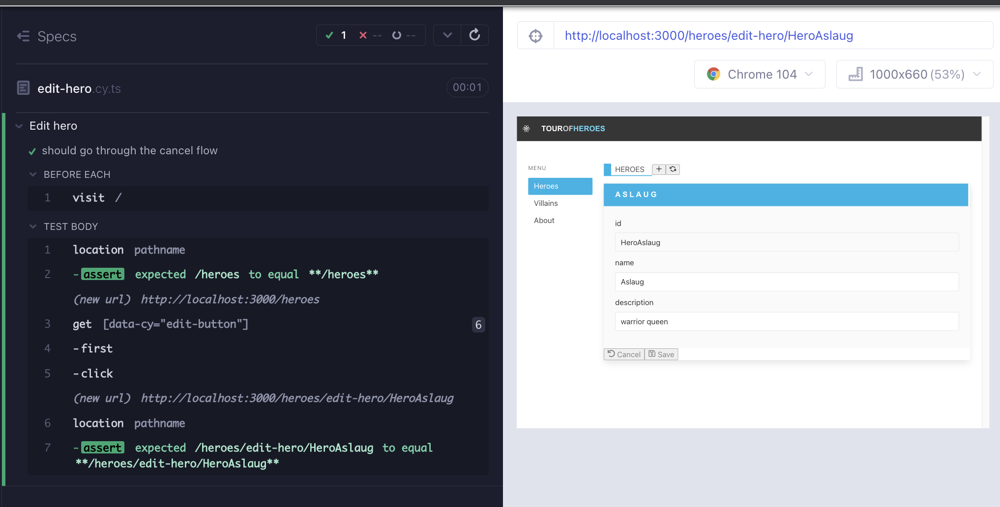
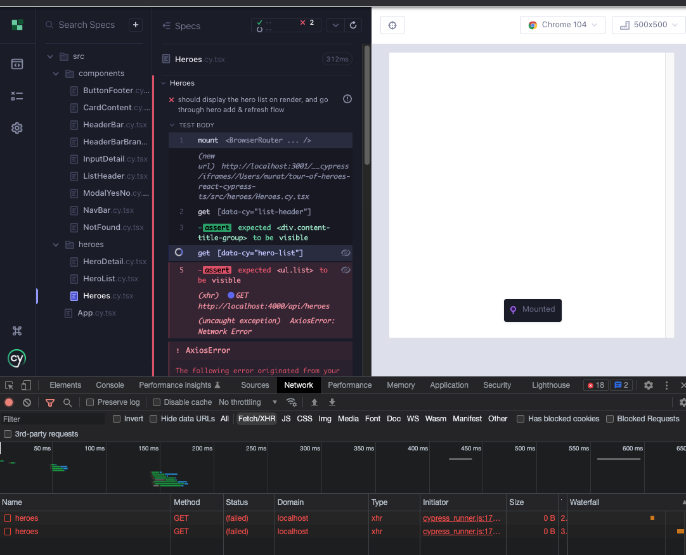
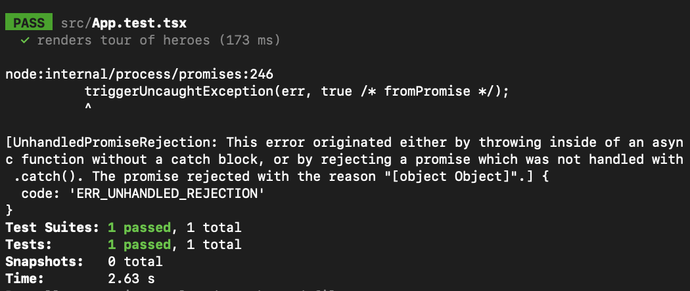
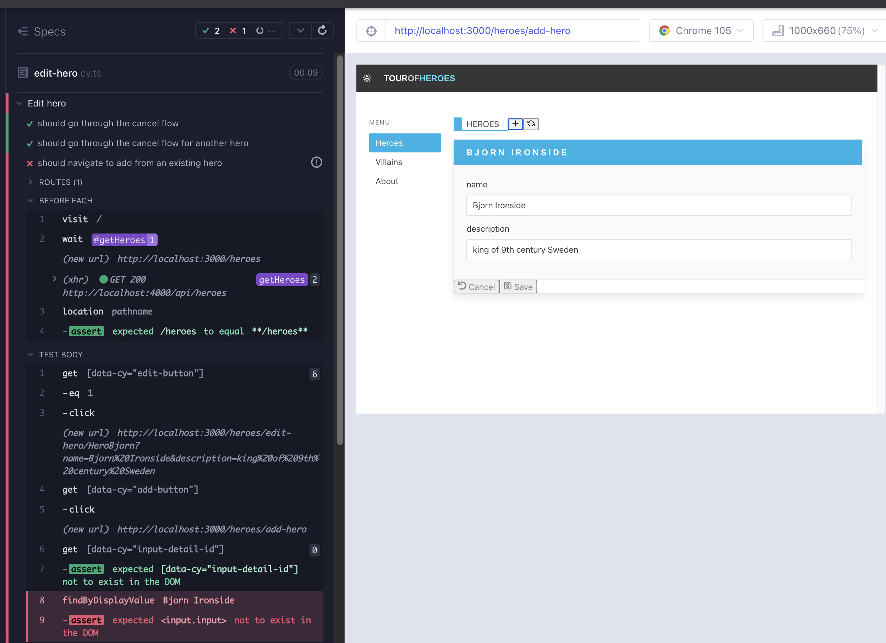

# Heroes part 3 - useEffect and HTTP

## HTTP requests

Until now we have been importing a json file at `src/heroes/Heroes.tsx`, recall `import heroes from './heroes.json'`. Now that we have a backend server, we can get the data from the network.

From Kent C. Dodds' Epic React:

_"HTTP requests are another common side-effect that we need to do in applications. This is no different from the side-effects we need to apply to a rendered DOM or when interacting with browser APIs like localStorage. In all these cases, we do that within a `useEffect` hook callback. This hook allows us to ensure that whenever certain changes take place, we apply the side-effects based on those changes."_

As we load the `HeroList`, we need our application to make a `GET` request to the backend. Let's write a failing e2e test for it (Red 1). For now we can name the file anything. We load the `HeroList` but at the moment there are not `GET` requests to the server.

```typescript
// cypress/e2e/network.cy.ts
describe("network requests", () => {
  it("should ", () => {
    cy.intercept("GET", "http://localhost:4000/api/heroes").as("getHeroes");
    cy.visit("/");
    cy.wait("@getHeroes");
    cy.getByCy("heroes").should("be.visible");
    cy.getByCyLike("hero-list-item").should("have.length.gt", 0);
  });
});
```


We will opt to use `axios` instead of the built in `fetch` api. `yarn add axios`. Use `axios.get` in a `useEffect` hook to make a `GET` request to our server (Green 1). `useEffect` takes a clean up function that can help us know if the component unmounted.

```typescript
// src/heroes/Heroes.tsx
import { useNavigate, Routes, Route } from "react-router-dom";
import ListHeader from "components/ListHeader";
import ModalYesNo from "components/ModalYesNo";
import HeroList from "./HeroList";
import heroes from "./heroes.json";
import { useEffect, useState } from "react";
import HeroDetail from "./HeroDetail";
import axios from "axios";

export default function Heroes() {
  const [showModal, setShowModal] = useState<boolean>(false);
  const getData = () =>
    axios.get("http://localhost:4000/api/heroes").then((res) => res.data);

  useEffect(() => {
    console.log("mounting");
    getData();

    return () => console.log("unmounting");
  });

  const navigate = useNavigate();
  const addNewHero = () => navigate("/heroes/add-hero");
  const handleRefresh = () => navigate("/heroes");

  const handleCloseModal = () => {
    setShowModal(false);
  };
  const handleDeleteHero = () => {
    setShowModal(true);
  };
  const handleDeleteFromModal = () => {
    setShowModal(false);
    console.log("handleDeleteFromModal");
  };

  return (
    <div data-cy="heroes">
      <ListHeader
        title="Heroes"
        handleAdd={addNewHero}
        handleRefresh={handleRefresh}
      />
      <div>
        <div>
          <Routes>
            <Route
              path=""
              element={
                <HeroList heroes={heroes} handleDeleteHero={handleDeleteHero} />
              }
            />
            <Route path="/add-hero" element={<HeroDetail />} />
            <Route path="/edit-hero/:id" element={<HeroDetail />} />
            <Route
              path="*"
              element={
                <HeroList heroes={heroes} handleDeleteHero={handleDeleteHero} />
              }
            />
          </Routes>
        </div>
      </div>

      {showModal && (
        <ModalYesNo
          message="Would you like to delete the hero?"
          onNo={handleCloseModal}
          onYes={handleDeleteFromModal}
        />
      )}
    </div>
  );
}
```

The test passes, but looking at the console we see that the component gets mounted, unmounted, and mounted again. Meanwhile, there are 2 calls to the api. The first does not have anything in the response body, the second gets the heroes. We will drop a side note here regarding the`useEffect` dependency array and revisit the topic later.

- `useEffect(fn, [a, b, c])` -> run the effect when a, or b, or c change
- `useEffect(fn, [a])` -> run the effect when a changes
- `useEffect(fn, [])` -> run the effect when... nothing changes, that's why it runs just once
- `useEffect(fn)` -> run the effect at every render



## Removing the hard-coded json data

We have been importing the `heroes` data from `db.json` file. Time to get that from the network. Disabling the import , we get type errors in the component because the variable does not exist anymore, the test also fails because there are no heroes in the list (Red 2)

We are getting some data with useEffect, but we have to store that data in a state variable in the component. We will utilize `useState` as in `const [heroes, setHeroes] = useState([])` and set the heroes with what we get from the network.

```typescript
// src/heroes/Heroes.tsx
import { useNavigate, Routes, Route } from "react-router-dom";
import ListHeader from "components/ListHeader";
import ModalYesNo from "components/ModalYesNo";
import HeroList from "./HeroList";
import { useEffect, useState } from "react";
import HeroDetail from "./HeroDetail";
import axios from "axios";

export default function Heroes() {
  const [showModal, setShowModal] = useState<boolean>(false);
  const [heroes, setHeroes] = useState([]);

  const getData = () =>
    axios.get("http://localhost:4000/api/heroes").then((res) => res.data);

  useEffect(() => {
    console.log("mounting");
    getData().then((data) => {
      setHeroes(data);
    });

    return () => console.log("unmounting");
  }, []); // empty array to have the effect occur only once

  const navigate = useNavigate();
  const addNewHero = () => navigate("/heroes/add-hero");
  const handleRefresh = () => navigate("/heroes");

  const handleCloseModal = () => {
    setShowModal(false);
  };
  const handleDeleteHero = () => {
    setShowModal(true);
  };
  const handleDeleteFromModal = () => {
    setShowModal(false);
    console.log("handleDeleteFromModal");
  };

  return (
    <div data-cy="heroes">
      <ListHeader
        title="Heroes"
        handleAdd={addNewHero}
        handleRefresh={handleRefresh}
      />
      <div>
        <div>
          <Routes>
            <Route
              path=""
              element={
                <HeroList heroes={heroes} handleDeleteHero={handleDeleteHero} />
              }
            />
            <Route path="/add-hero" element={<HeroDetail />} />
            <Route path="/edit-hero/:id" element={<HeroDetail />} />
            <Route
              path="*"
              element={
                <HeroList heroes={heroes} handleDeleteHero={handleDeleteHero} />
              }
            />
          </Routes>
        </div>
      </div>

      {showModal && (
        <ModalYesNo
          message="Would you like to delete the hero?"
          onNo={handleCloseModal}
          onYes={handleDeleteFromModal}
        />
      )}
    </div>
  );
}
```

That will work, but if we leave the test open we will see that we are making repeated `GET` requests to the server, and the component keeps mounting. We can use an empty `useEffect` dependency array to have the effect occur once when the component is rendered. For brevity, here is the changed code (Green 2):

```typescript
useEffect(() => {
  console.log("mounting");
  console.log("heroes is :", heroes);
  getData().then((data) => {
    setHeroes(data);
  });

  return () => console.log("unmounting");
}, []); // empty array to have the effect occur only once
```

We can do a little bit more of a refactor adding support for `axios` error messages, and wrapping the expensive `axios.get` in a `useCallBack`. Why `useCallback`? In short, custom functions get defined on every render and can be costly especially if the network state is the same. `useCallback` lets us memoize such expensive operations, by preventing the redefinition or recalculation of values. The signature is `useCallBack(updaterFn, [dependencies])` (Refactor 2).

```tsx
// src/heroes/Heroes.tsx
import { useNavigate, Routes, Route } from "react-router-dom";
import ListHeader from "components/ListHeader";
import ModalYesNo from "components/ModalYesNo";
import HeroList from "./HeroList";
import { useCallback, useEffect, useState } from "react";
import HeroDetail from "./HeroDetail";
import axios, { AxiosResponse } from "axios";

export default function Heroes() {
  const [showModal, setShowModal] = useState<boolean>(false);
  const [heroes, setHeroes] = useState([]);

  // TODO: identify a better type later
  // eslint-disable-next-line @typescript-eslint/no-explicit-any
  const parseList = (response: AxiosResponse<any>) => {
    if (response.status !== 200) throw Error(response.statusText);
    let list = response.data;
    if (typeof list !== "object") {
      list = [];
    }
    console.log(list);
    return list;
  };

  const getData = useCallback(async () => {
    const response = await axios.get("http://localhost:4000/api/heroes");
    return parseList(response);
  }, []);

  useEffect(() => {
    console.log("mounting");
    getData().then((data) => {
      setHeroes(data);
    });

    return () => console.log("unmounting");
  }, []); // empty array to have the effect occur only once

  const navigate = useNavigate();
  const addNewHero = () => navigate("/heroes/add-hero");
  const handleRefresh = () => navigate("/heroes");

  const handleCloseModal = () => {
    setShowModal(false);
  };
  const handleDeleteHero = () => {
    setShowModal(true);
  };
  const handleDeleteFromModal = () => {
    setShowModal(false);
    console.log("handleDeleteFromModal");
  };

  return (
    <div data-cy="heroes">
      <ListHeader
        title="Heroes"
        handleAdd={addNewHero}
        handleRefresh={handleRefresh}
      />
      <div>
        <div>
          <Routes>
            <Route
              path=""
              element={
                <HeroList heroes={heroes} handleDeleteHero={handleDeleteHero} />
              }
            />
            <Route path="/add-hero" element={<HeroDetail />} />
            <Route path="/edit-hero/:id" element={<HeroDetail />} />
            <Route
              path="*"
              element={
                <HeroList heroes={heroes} handleDeleteHero={handleDeleteHero} />
              }
            />
          </Routes>
        </div>
      </div>

      {showModal && (
        <ModalYesNo
          message="Would you like to delete the hero?"
          onNo={handleCloseModal}
          onYes={handleDeleteFromModal}
        />
      )}
    </div>
  );
}
```

## Updating the component tests with network awareness

We used the e2e test to to drive the design of http requests in the `Heroes` component. Now that we are utilizing `useEffect`, the component will be making an `axios` request. We can see the network call take place and fail when running the component test `Heroes.cy.tsx`.



We need to be stubbing the network with some data, so that the component can render it. Add a `cy.intercept` using a fixture file for the network data to `src/heroes/Heroes.cy.tsx` and `src/App.cy,tsx` files, which both use the `Heroes` component. The intercept will ensure that all `GET` requests to `http://localhost:4000/api/heroes` will respond with the stubbed data from `heroes.json` file in Cypress fixtures.

```tsx
// src/heroes/Heroes.cy.tsx
import Heroes from "./Heroes";
import { BrowserRouter } from "react-router-dom";
import "../styles.scss";

describe("Heroes", () => {
  beforeEach(() => {
    cy.intercept("GET", "http://localhost:4000/api/heroes", {
      fixture: "heroes.json",
    }).as("getHeroes");
  });
  it("should display the hero list on render, and go through hero add & refresh flow", () => {
    cy.mount(
      <BrowserRouter>
        <Heroes />
      </BrowserRouter>
    );

    cy.wait("@getHeroes");

    cy.getByCy("list-header").should("be.visible");
    cy.getByCy("hero-list").should("be.visible");

    cy.getByCy("add-button").click();
    cy.location("pathname").should("eq", "/heroes/add-hero");

    cy.getByCy("refresh-button").click();
    cy.location("pathname").should("eq", "/heroes");
  });

  const invokeHeroDelete = () => {
    cy.getByCy("delete-button").first().click();
    cy.getByCy("modal-yes-no").should("be.visible");
  };
  it("should go through the modal flow", () => {
    cy.window()
      .its("console")
      .then((console) => cy.spy(console, "log").as("log"));

    cy.mount(
      <BrowserRouter>
        <Heroes />
      </BrowserRouter>
    );

    cy.getByCy("modal-yes-no").should("not.exist");

    cy.log("do not delete flow");
    invokeHeroDelete();
    cy.getByCy("button-no").click();
    cy.getByCy("modal-yes-no").should("not.exist");

    cy.log("delete flow");
    invokeHeroDelete();
    cy.getByCy("button-yes").click();
    cy.getByCy("modal-yes-no").should("not.exist");
    cy.get("@log").should("have.been.calledWith", "handleDeleteFromModal");
  });
});
```

```tsx
// src/App.cy.tsx
import App from "./App";

describe("ct sanity", () => {
  it("should render the App", () => {
    cy.intercept("GET", "http://localhost:4000/api/heroes", {
      fixture: "heroes.json",
    }).as("getHeroes");

    cy.mount(<App />);
    cy.getByCy("not-found").should("be.visible");

    cy.contains("Heroes").click();
    cy.getByCy("heroes").should("be.visible");

    cy.contains("About").click();
    cy.getByCy("about").should("be.visible");
  });
});
```

We also have to update the RTL unit test `src/App.test.tsx` which mirrors `App.cy.tsx`. Note that running the unit test it does not fail but the error will be a merge blocker. We only know what the problem is because either we have seen this before, or because we saw the network call happen on component mount in the component test runner using the real browser. **Component testing with Cypress, using the real browser, can help diagnose issues in the app that may be harder to do using Jest / RTL.**



In RTL, the equivalent of `cy.intercept` is [`msw`](https://mswjs.io/). Install with `yarn add -D msw`. Modify the file as such:

```tsx
// src/App.test.tsx
import { render, screen } from "@testing-library/react";
import userEvent from "@testing-library/user-event";
import App from "./App";
import { heroes } from "../db.json";

import { rest } from "msw";
import { setupServer } from "msw/node";

const handlers = [
  rest.get("http://localhost:4000/api/heroes", async (_req, res, ctx) => {
    return res(ctx.status(200), ctx.json(heroes));
  }),
];
const server = setupServer(...handlers);

beforeAll(() => {
  server.listen({
    onUnhandledRequest: "warn",
  });
});

afterEach(() => {
  server.resetHandlers();
});

afterAll(() => {
  server.close();
});

test("renders tour of heroes", async () => {
  render(<App />);

  await userEvent.click(screen.getByText("About"));
  expect(screen.getByTestId("about")).toBeVisible();

  await userEvent.click(screen.getByText("Heroes"));
  expect(screen.getByTestId("heroes")).toBeVisible();
});
```

Finally, in all the e2e tests, now we have to wait for the network data after visiting the url. To ensure that the page is stable and has loaded the network data, in `create-hero.cy.tsx`, `edit-hero.cy.tsx` `network.cy.tsx` files, wrap all instances of `cy.visit` with an intercept and wait:

```typescript
cy.intercept("GET", "http://localhost:4000/api/heroes").as("getHeroes");
cy.visit("/");
cy.wait("@getHeroes");
```

## Testing the flows: alternate hero add

Using the `ListHeader` component's `+` button, we can add a hero from any screen. Our existing e2e test gets to `HeroDetails` by either navigating from hero list, or direct navigating to the url. Alas, we can also get to `HeroDetails` from edit hero, which is another render of `HeroDetais` with the hero data. This flow is interesting because the rendered Id field, and the data in the name and description fields need to clear upon clicking the `+` button. Let's write a test for it (Red 3).

```typescript
// cypress/e2e/edit-hero.cy.ts
describe("Edit hero", () => {
  beforeEach(() => {
    cy.intercept("GET", "http://localhost:4000/api/heroes").as("getHeroes");
    cy.visit("/");
    cy.wait("@getHeroes");
    cy.location("pathname").should("eq", "/heroes");
  });
  it("should go through the cancel flow", () => {
    cy.fixture("heroes").then((heroes) => {
      cy.getByCy("edit-button").eq(0).click();
      cy.location("pathname").should(
        "include",
        `/heroes/edit-hero/${heroes[0].id}`
      );
      cy.getByCy("hero-detail").should("be.visible");
      cy.getByCy("input-detail-id").should("be.visible");
      cy.findByDisplayValue(heroes[0].id).should("be.visible");
      cy.findByDisplayValue(heroes[0].name).should("be.visible");
      cy.findByDisplayValue(heroes[0].description).should("be.visible");

      cy.getByCy("cancel-button").click();
      cy.location("pathname").should("eq", "/heroes");
      cy.getByCy("hero-list").should("be.visible");
    });
  });

  it("should go through the cancel flow for another hero", () => {
    cy.fixture("heroes").then((heroes) => {
      cy.getByCy("edit-button").eq(1).click();
      cy.location("pathname").should(
        "include",
        `/heroes/edit-hero/${heroes[1].id}`
      );
      cy.getByCy("hero-detail").should("be.visible");
      cy.getByCy("input-detail-id").should("be.visible");
      cy.findByDisplayValue(heroes[1].id).should("be.visible");
      cy.findByDisplayValue(heroes[1].name).should("be.visible");
      cy.findByDisplayValue(heroes[1].description).should("be.visible");

      cy.getByCy("cancel-button").click();
      cy.location("pathname").should("eq", "/heroes");
      cy.getByCy("hero-list").should("be.visible");
    });
  });

  it("should navigate to add from an existing hero", () => {
    cy.fixture("heroes").then((heroes) => {
      cy.getByCy("edit-button").eq(1).click();

      cy.getByCy("add-button").click();
      cy.getByCy("input-detail-id").should("not.exist");
      cy.findByDisplayValue(heroes[1].name).should("not.exist");
      cy.findByDisplayValue(heroes[1].description).should("not.exist");
    });
  });
});
```

The test fails. The conditional rendering is working, but the state of the `InputDetail` component (child of `HeroDetail`) carries over.



Instead of taking the value and just displaying it, we need to make `InputDetail` aware of state. We can accomplish this by managing state where its most relevant, the component itself, and by utilizing a combination of `useState` and `useEffect`. We come up with a variable `shownValue` and a setter for it. As the component mounts, we utilize `useEffect` to set the value. We also specify a dependency array for the value (Green 3).

```tsx
// src/components/InputDetail.tsx
import { ChangeEvent, useEffect, useState } from "react";

type InputDetailProps = {
  name: string;
  value: string;
  placeholder?: string;
  onChange?: (e: ChangeEvent<HTMLInputElement>) => void;
  readOnly?: boolean;
};

export default function InputDetail({
  name,
  value,
  placeholder,
  onChange,
  readOnly,
}: InputDetailProps) {
  const [shownValue, setShownValue] = useState("");
  useEffect(() => {
    setShownValue(value);
  }, [value]);

  return (
    <div data-cy={`input-detail-${name}`} className="field">
      <label className="label" htmlFor={name}>
        {name}
      </label>
      <input
        name={name}
        role={name}
        defaultValue={shownValue}
        placeholder={placeholder}
        onChange={onChange}
        readOnly={readOnly}
        className="input"
        type="text"
      ></input>
    </div>
  );
}
```

Similar to routing, when our concerns about the app are higher level as in state management and flows, e2e tests are effective at catching defects that we might not be able to test with component tests. The e2e test now works, and the component test serves as a regression assurance. The `onChange` now gets called twice vs thrice, and that is the only update.

```tsx
// src/components/InputDetail.cy.tsx
import InputDetail from "./InputDetail";
import "../styles.scss";

describe("InputDetail", () => {
  const placeholder = "Aslaug";
  const name = "name";
  const value = "some value";
  const newValue = "42";

  it("should allow the input field to be modified", () => {
    cy.mount(
      <InputDetail
        name={name}
        value={value}
        placeholder={placeholder}
        onChange={cy.stub().as("onChange")}
      />
    );

    cy.contains("label", name);
    cy.findByPlaceholderText(placeholder).clear().type(newValue);
    cy.findByDisplayValue(newValue);
    cy.get("@onChange").its("callCount").should("eq", newValue.length);
  });

  it("should not allow the input field to be modified", () => {
    cy.mount(
      <InputDetail
        name={name}
        value={value}
        placeholder={placeholder}
        readOnly={true}
      />
    );

    cy.contains("label", name);
    cy.findByPlaceholderText(placeholder)
      .should("have.value", value)
      .and("have.attr", "readOnly");
  });
});
```

## Refactoring

### Environment variables

It is time to refactor all the references to `http://localhost:4000/api` with an environment variable. Create React App (CRA) comes with a `dotenv` package already installed. The only requirement is that variable names start with `REACT_APP_`. We can create an `.env` file right away with the api url.

```
REACT_APP_API_URL=http://localhost:4000/api
```

```tsx
// src/heroes/Heroes.tsx
const getData = useCallback(async () => {
  const response = await axios.get(`${process.env.REACT_APP_API_URL}/heroes`);
  return parseList(response);
}, []);
```

```tsx
// src/App.test.tsx
const handlers = [
  rest.get(
    `${process.env.REACT_APP_API_URL}/heroes`,
    async (_req, res, ctx) => {
      return res(ctx.status(200), ctx.json(heroes));
    }
  ),
];
```

The equivalent of `.env` is an `env` property in `./cypress.config.js` . It can be specific to `e2e`, `component` or both depending where the property is placed.

```tsx
// cypress.config.js

/* eslint-disable @typescript-eslint/no-unused-vars */
const { defineConfig } = require("cypress");

module.exports = defineConfig({
  experimentalSingleTabRunMode: true,
  retries: {
    runMode: 2,
    openMode: 0,
  },
  env: {
    API_URL: "http://localhost:4000/api",
  },
  e2e: {
    specPattern: "cypress/e2e/**/*.cy.{js,jsx,ts,tsx}",
    baseUrl: "http://localhost:3000",
    setupNodeEvents(_on, _config) {
      // implement node event listeners here
      // and load any plugins that require the Node environment
    },
  },

  component: {
    specPattern: "src/**/*.cy.{js,jsx,ts,tsx}",
    devServer: {
      framework: "create-react-app",
      bundler: "webpack",
      webpackConfig: {
        // workaround to react scripts 5 issue https://github.com/cypress-io/cypress/issues/22762#issuecomment-1185677066
        devServer: {
          port: 3001,
        },
      },
    },
  },
});
```

Similarly, replace instances of the string `http://localhost:4000/api` in the component and e2e tests with a template literal `${Cypress.env('API_URL')}`. The files that need changes are:

- _cypress/e2e/create-hero.cy.ts_
- _cypress/e2e/edit-hero.cy.ts_
- _cypress/e2e/network-hero.cy.ts_
- _cypress/support/commands.ts_
- _src/App.cy.tsx_
- _src/components/InputDetail.cy.tsx_
- _src/heroes/Heroes.cy.tsx_

### Custom hook `useAxios`

We can extract 20-30 lines of http logic into its own hook, and then use the hook in the `Heroes` component. Our hook accepts a route as the argument, returns an object of data, status & error. It also handles the concerns with `useEffect` cleanup. We will cover the details in the comments, and in the upcoming chapters promise to use a better solution.

```typescript
// src/hooks/useAxios.ts
import { useCallback, useEffect, useState } from "react";
import axios from "axios";

const getItem = (route: string) =>
  axios({
    method: "GET",
    baseURL: `${process.env.REACT_APP_API_URL}/${route}`,
  })
    .then((res) => res.data)
    .catch((err) => {
      throw Error(`There was a problem fetching data: ${err}`);
    });

/** Takes a url, returns an object of data, status & error */
export default function useAxios(url: string) {
  const [data, setData] = useState();
  const [error, setError] = useState(null);
  const [status, setStatus] = useState("idle");

  const getItemCb = useCallback((route: string) => {
    return getItem(route);
  }, []);

  // When fetching data within a call to useEffect,
  // combine a local variable and the cleanup function
  // in order to match a data request with its response:
  // If the component re-renders, the cleanup function for the previous render
  // will set the previous render’s doUpdate variable to false,
  // preventing the previous then method callback from performing updates with stale data.
  // eslint-disable-next-line @typescript-eslint/ban-ts-comment
  // @ts-ignore
  useEffect(() => {
    let doUpdate = true;

    setData(undefined);
    setError(null);
    setStatus("loading");

    getItemCb(url)
      .then((data) => {
        if (doUpdate) {
          setData(data);
          setStatus("success");
        }
      })
      .catch((error) => {
        if (doUpdate) {
          setError(error);
          setStatus("error");
        }
      });

    return () => (doUpdate = false);
  }, [url]);

  return { data, status, error };
}
```

At `Heroes` component, we do not need to utilize `useState` because now we get the data from `useAxios`. We just have to rename and initialize `data` variable into `heroes` .

```tsx
// src/heroes/Heroes.tsx
import { useNavigate, Routes, Route } from "react-router-dom";
import ListHeader from "components/ListHeader";
import ModalYesNo from "components/ModalYesNo";
import HeroList from "./HeroList";
import { useState } from "react";
import HeroDetail from "./HeroDetail";
import useAxios from "hooks/useAxios";

export default function Heroes() {
  const [showModal, setShowModal] = useState<boolean>(false);
  const { data: heroes = [] } = useAxios("heroes");

  const navigate = useNavigate();
  const addNewHero = () => navigate("/heroes/add-hero");
  const handleRefresh = () => navigate("/heroes");

  const handleCloseModal = () => {
    setShowModal(false);
  };
  const handleDeleteHero = () => {
    setShowModal(true);
  };
  const handleDeleteFromModal = () => {
    setShowModal(false);
    console.log("handleDeleteFromModal");
  };

  return (
    <div data-cy="heroes">
      <ListHeader
        title="Heroes"
        handleAdd={addNewHero}
        handleRefresh={handleRefresh}
      />
      <div>
        <div>
          <Routes>
            <Route
              path=""
              element={
                <HeroList heroes={heroes} handleDeleteHero={handleDeleteHero} />
              }
            />
            <Route path="/add-hero" element={<HeroDetail />} />
            <Route path="/edit-hero/:id" element={<HeroDetail />} />
            <Route
              path="*"
              element={
                <HeroList heroes={heroes} handleDeleteHero={handleDeleteHero} />
              }
            />
          </Routes>
        </div>
      </div>

      {showModal && (
        <ModalYesNo
          message="Would you like to delete the hero?"
          onNo={handleCloseModal}
          onYes={handleDeleteFromModal}
        />
      )}
    </div>
  );
}
```

## Summary

We wrote a failing e2e test spying on an expected http GET call to `/heroes` route as the application loads (Red 1).

We added a `useEffect` that gets the data with an `axios.get` call targeting the `/heroes` route (Green 1).

</br>

We removed the json file import to get the data, utilized `useState`, while setting the hero array within the `useEffect` (Red 2, Green 2).

</br>

Refactors:

We used an empty array to have the http GET effect occur only once. We showcased `useCallback` to wrap expensive functions.

We updated the component tests and the unit test to be network aware and stub the network with `cy.intercept` for Cypress and `msw` for RTL.

We updated the e2e tests to wait for the network so that ui assertions can begin after the DOM settles.

</br>

We added a new e2e test to cover an alternate hero add flow; navigating to add hero from edit hero (Red 3).

To address the failure, we managed the state where it is most relevant; `InputDetail` component. We only used `useState` and `useEffect`. (Green 3)

</br>

Refactors:

We refactored the hard coded api route to an environment variable.

We used a hook `useAxios` to yield the data at the component in an abstracted way.

</br>

## Takeaways

- From Kent Dodds: _"HTTP requests are another common side-effect that we need to do in applications. This is no different from the side-effects we need to apply to a rendered DOM or when interacting with browser APIs like localStorage. In all these cases, we do that within a `useEffect` hook callback. This hook allows us to ensure that whenever certain changes take place, we apply the side-effects based on those changes."_
- We can use the built in `fetch` api or `axios` to make http calls from the application to the backend.
- `useEffect` dependency array:
  - `useEffect(fn, [a, b, c])` -> run the effect when a, or b, or c change
  - `useEffect(fn, [a])` -> run the effect when a changes
  - `useEffect(fn, [])` -> run the effect when... nothing changes, that's why it runs just once
  - `useEffect(fn)` -> run the effect at every render
- Wrap expensive functions in `useCallback` to memoize repeated calls.
- We can manage most http state with `useState` & `useEffect`, however the implementation can grow as the app scales.
- Component testing with Cypress, using the real browser, can help diagnose issues in the app that may be harder to do using Jest/RTL.
- If component tests are making network calls, we can stub the network with the [`cy.intercept`](https://docs.cypress.io/api/commands/intercept) api. The contrast to `cy.intercept` is [`msw`](https://mswjs.io/docs/) for Jest/RTL .
- Similar to routing, when our concerns about the app are higher level as in state management and flows, e2e tests are effective at catching edge cases that we might not be able to cover with component tests.
