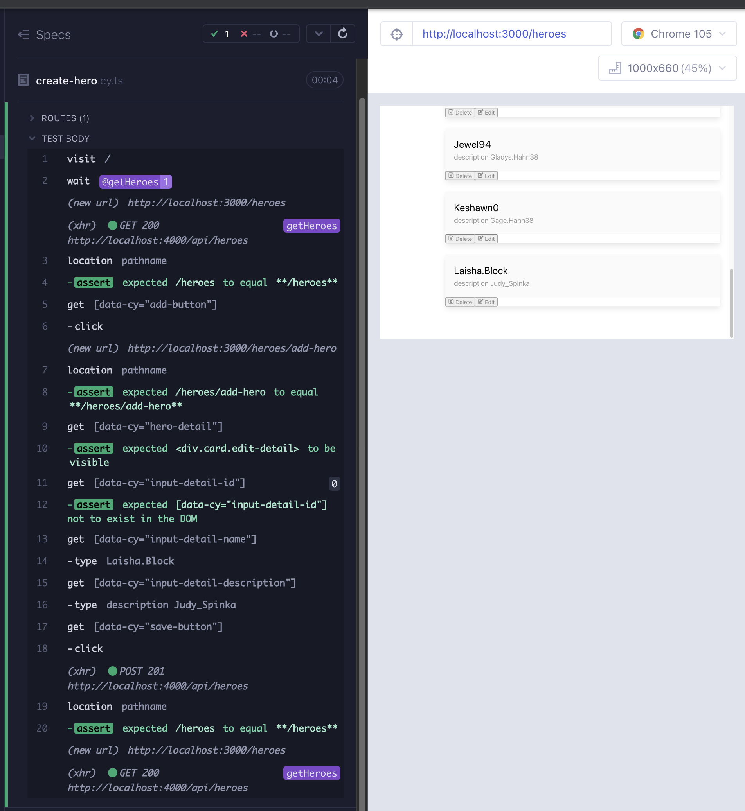
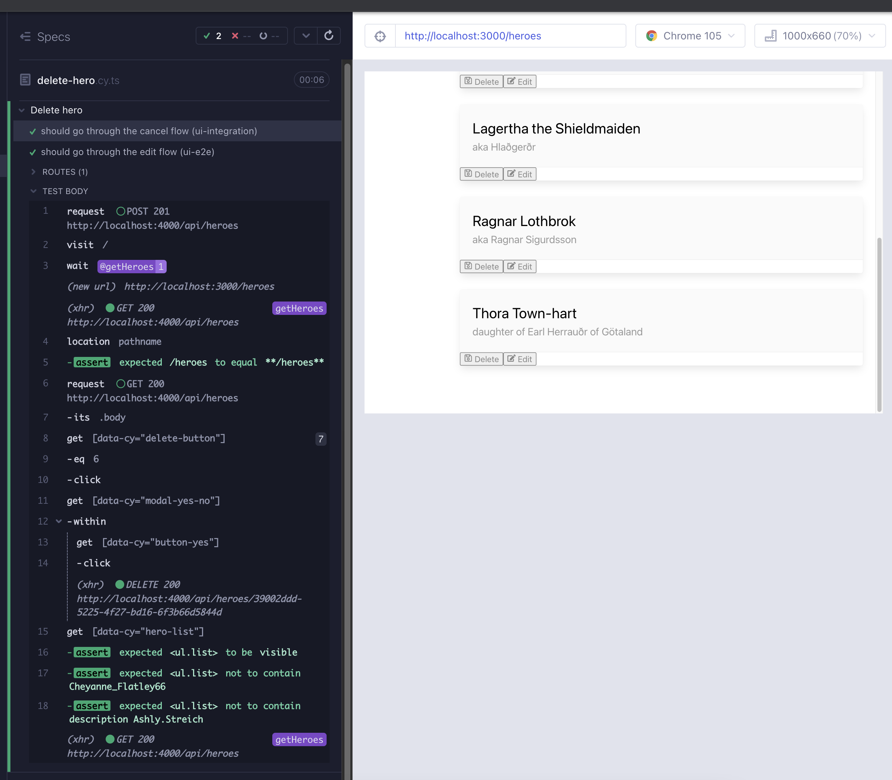

# react-query

### Caching and [`react-query`](https://react-query-v3.tanstack.com/overview)

Having learned well from Kent C. Dodds, In the previous chapters we stated that we can drastically simplify our UI state management if we split out the server cache into something separate. State can be lumped into two buckets:

1. UI state: Modal is open, item is highlighted, etc. _(we used `useState` hook for this)_
2. Server cache: User data, tweets, contacts, etc. _(`react-query` is useful here)_

Why `react-query`? To prevent duplicated data-fetching, we want to move all the data-fetching code into a central store and access that single source from the components that need it. With React Query, we don’t need to do any of the work involved in creating such a store. It lets us keep the data-fetching code in the components that need the data, but behind the scenes it manages a data cache, passing already-fetched data to components when they ask for them.

React-query's [`useQuery`](https://tanstack.com/query/v4/docs/reference/useQuery) hook is for fetching data by key and caching it, while updating cache. Think of it similar to a `GET` request. The key arg is a unique identifier for the query / data in cache; string, array or object. The 2nd arg an async function that returns the data.

`const { data, status, error } = useQuery(key, () => fetch(url))`

`useMutation` is the write mirror of `useQuery`. Think of it similar to our `PUT` and `POST` requests. `useMutation` yields data, status, error just like useQuery. The first arg is a function that that executes a non-idempotent request. The second arg is an object with onMutate property.

`const { dataToMutate, status, error } = useMutation((*url*) => fetch(*url*) {...})`

- `useQuery` fetches state: UI state <- server/url , and caches it.
- `useMutation` is just the opposite: UI state -> server , and still caches it.

In this chapter we will be creating our api, creating hooks for CRUD operations on heroes, and we will be using them in the components.

### API

We will be replicating the `getItem` function in the `useAxios` hook, and making it compatible with the rest of the CRUD requests. Create a file `src/hooks/api.ts` and paste in the following code. We have a type protected `client` function which wraps `Axios`, with which we can make any CRUD request. We wrap them again in functions with less arguments, which are easier to use.

```typescript
// src/hooks/api.ts
import axios from "axios";
import { Hero } from "models/Hero";

export type CrudType = "GET" | "POST" | "PUT" | "DELETE";
export type CrudOptions = { item?: Hero | object; config?: object };

export const client = (route: string, method: CrudType, item?: Hero | object) =>
  axios({
    method,
    baseURL: `${process.env.REACT_APP_API_URL}/${route}`,
    data: method === "POST" || method === "PUT" ? item : undefined,
  })
    .then((res) => res.data)
    .catch((err) => {
      throw Error(`There was a problem fetching data: ${err}`);
    });

export const createItem = (route: string, item: Hero | object) =>
  client(route, "POST", item);

export const editItem = (route: string, item: Hero | object) =>
  client(route, "PUT", item);

export const deleteItem = (route: string) => client(route, "DELETE");

export const getItem = (route: string) => client(route, "GET");
```

### `useGetHeroes`

We can create a simple hook and replace our complex `useAxios`, while showcasing the performance gains of cache management by `react-query`. `yarn add react-query`, and create a file `src/hooks/useGetHeroes.ts`. `react-query`'s [`useQuery`](https://tanstack.com/query/v4/docs/reference/useQuery) is similar to our custom useAxios: takes a url, returns an object of data, status & error.

`const { data, status, error } = useQuery(key, () => fetch(url))`

Compare to `useAxios`, which also returns a status and error that we did not use:

`const {data: heroes = []} = useAxios('heroes')`

Whenever any component subsequently calls useQuery with the key, `react-query` will return the previously fetched data from its cache and then fetch the latest data in the background (very similar to PWAs and service workers). Our query key here is the string `heroes` and the callback function is `getItem` from our api, calling the `/heroes` route. `useQuery` returns `data`, `status`, and `error`, we reshape those nicely for an easier use in our component.

```tsx
// src/hooks/useGetHeroes.ts
import { useQuery } from "react-query";
import { getItem } from "./api";

/**
 * Helper for GET to `/heroes` route
 * @returns {object} {heroes, status, getError}
 */
export const useGetHeroes = () => {
  const query = useQuery("heroes", () => getItem("heroes"));

  return {
    heroes: query.data,
    status: query.status,
    getError: query.error,
  };
};
```

Before replacing `useAxios` in `Heroes` component, we have to wrap our app JSX in a provider component called `QueryClientProvider` , instantiate a `queryClient` and use it as the `client` prop of `QueryClientProvider`. This is how we make the cache available for components to access and share.

```tsx
// src/App.tsx
import { BrowserRouter, Routes, Route, Navigate } from "react-router-dom";
import { QueryClient, QueryClientProvider } from "react-query";
import About from "About";
import HeaderBar from "components/HeaderBar";
import NavBar from "components/NavBar";
import NotFound from "components/NotFound";
import Heroes from "heroes/Heroes";
import "./styles.scss";

const queryClient = new QueryClient();

function App() {
  return (
    <BrowserRouter>
      <HeaderBar />
      <div className="section columns">
        <NavBar />
        <main className="column">
          <QueryClientProvider client={queryClient}>
            <Routes>
              <Route path="/" element={<Navigate replace to="/heroes" />} />
              <Route path="/heroes/*" element={<Heroes />} />
              <Route path="/about" element={<About />} />
              <Route path="*" element={<NotFound />} />
            </Routes>
          </QueryClientProvider>
        </main>
      </div>
    </BrowserRouter>
  );
}

export default App;
```

`useGetHeroes` is a drop-in replacement for `useAxios`, and it does not even need an argument. We will use `status` and `getError` in the next chapter.

```tsx
import { useNavigate, Routes, Route } from "react-router-dom";
import ListHeader from "components/ListHeader";
import ModalYesNo from "components/ModalYesNo";
import HeroList from "./HeroList";
import { useState } from "react";
import HeroDetail from "./HeroDetail";
import { useGetHeroes } from "hooks/useGetHeroes";

export default function Heroes() {
  const [showModal, setShowModal] = useState<boolean>(false);
  const { heroes, status, getError } = useGetHeroes();

  const navigate = useNavigate();
  const addNewHero = () => navigate("/heroes/add-hero");
  const handleRefresh = () => navigate("/heroes");

  const handleCloseModal = () => {
    setShowModal(false);
  };
  const handleDeleteHero = () => {
    setShowModal(true);
  };
  const handleDeleteFromModal = () => {
    setShowModal(false);
    console.log("handleDeleteFromModal");
  };

  return (
    <div data-cy="heroes">
      <ListHeader
        title="Heroes"
        handleAdd={addNewHero}
        handleRefresh={handleRefresh}
      />
      <div>
        <div>
          <Routes>
            <Route
              path=""
              element={
                <HeroList heroes={heroes} handleDeleteHero={handleDeleteHero} />
              }
            />
            <Route path="/add-hero" element={<HeroDetail />} />
            <Route path="/edit-hero/:id" element={<HeroDetail />} />
            <Route
              path="*"
              element={
                <HeroList heroes={heroes} handleDeleteHero={handleDeleteHero} />
              }
            />
          </Routes>
        </div>
      </div>

      {showModal && (
        <ModalYesNo
          message="Would you like to delete the hero?"
          onNo={handleCloseModal}
          onYes={handleDeleteFromModal}
        />
      )}
    </div>
  );
}
```

Serve the app with `yarn dev`, and toggle `useAxios` vs `useGetHeroes`. Switch between the tabs and observe the performance difference thanks to caching.

### `usePostHero`

Until now we have not had a feature to add a hero. Our backend supports it, but our front end does not. Let's start with a failing test which goes through the add hero flow. Our new test simply visits the main route, clicks the add button, verifies the new page, fills in randomized hero name and description, saves the changes (Red 1)

```tsx
// cypress/e2e/create-hero.cy.ts
import { faker } from "@faker-js/faker";
describe("Create hero", () => {
  it("should go through the refresh flow", () => {
    cy.intercept("GET", `${Cypress.env("API_URL")}/heroes`).as("getHeroes");
    cy.visit("/");
    cy.wait("@getHeroes");
    cy.location("pathname").should("eq", "/heroes");

    cy.getByCy("add-button").click();
    cy.location("pathname").should("eq", "/heroes/add-hero");
    cy.getByCy("hero-detail").should("be.visible");
    cy.getByCy("input-detail-id").should("not.exist");

    cy.getByCy("refresh-button").click();
    cy.location("pathname").should("eq", "/heroes");
    cy.getByCy("hero-list").should("be.visible");
  });

  it("should go through the cancel flow and perform direct navigation", () => {
    cy.intercept("GET", `${Cypress.env("API_URL")}/heroes`).as("getHeroes");
    cy.visit("/heroes/add-hero");
    cy.wait("@getHeroes");

    cy.getByCy("cancel-button").click();
    cy.location("pathname").should("eq", "/heroes");
    cy.getByCy("hero-list").should("be.visible");
  });

  it.only("should go through the add hero flow (ui-e2e)", () => {
    cy.intercept("GET", `${Cypress.env("API_URL")}/heroes`).as("getHeroes");
    cy.visit("/");
    cy.wait("@getHeroes");
    cy.location("pathname").should("eq", "/heroes");

    cy.getByCy("add-button").click();
    cy.location("pathname").should("eq", "/heroes/add-hero");
    cy.getByCy("hero-detail").should("be.visible");
    cy.getByCy("input-detail-id").should("not.exist");

    const newHero = {
      name: faker.internet.userName(),
      description: `description ${faker.internet.userName()}`,
    };
    cy.getByCy("input-detail-name").type(newHero.name);
    cy.getByCy("input-detail-description").type(newHero.description);
    cy.getByCy("save-button").click();
    // things work until here
    cy.location("pathname").should("eq", "/heroes");
  });
});
```

Let's remember [`useMutation`](https://tanstack.com/query/v4/docs/reference/useMutation) before proceeding further.

- useParams (from `react-router`) and useQuery (from `react-query`) fetch state:

  UI state <- server/url , and caches it

- useMutation is just the opposite:

  UI state -> server , and still caches it

`useMutation` yields data, status, error just like useQuery.

`const { mutate, status, error } = useMutation((item) => createItem(route, item)), {onSuccess: ...}`

The first arg is a function that that executes a non-idempotent request. The second arg is an object with onSuccess property.

Here is our incomplete hook we derive off of that knowledge. We expect that it will create something in the backend with our api call, it will log some new data, and it will navigate to `/heroes`

```tsx
// src/hooks/usePostHero.ts
import { Hero } from "models/Hero";
import { useMutation } from "react-query";
import { useNavigate } from "react-router-dom";
import { createItem } from "./api";

/**
 * Helper for simple POST to `/heroes` route
 * @returns {object} {mutate, status, error}
 */
export function usePostHero() {
  const navigate = useNavigate();

  return useMutation((item: Hero) => createItem("heroes", item), {
    onSuccess: (newData) => {
      console.log(newData);

      return navigate(`/heroes`);
    },
  });
}
```

In `HeroDetail` component we have a `createHero` function that `console.log`s. Our replacement `createHero` function can be the `mutate` value yielded from the hook. We can cast the return values of the hook like so:

`const {mutate: createHero, status: postStatus, error: postError} = usePostHero()`

We can remove `const createHero = () => console.log('createHero')`, instead use the `createHero` yielded from the hook. We need to pass to it an item argument. The type for it comes from our `usePostHero` hook's `useMutation` callback:

`useMutation((item: Hero) => createItem('heroes', item)`

We can pass it the `hero` we get from the already existing `useState`:

`const [hero, setHero] = useState({id, name, description})`

There is one final update for the ternary operator in `handleSave`. Currently it is working off of `hero.name`, and `hero` is driven by state, so `hero.name` is what we type in. It will always be true. We need to base it on something that does not exist in the case of a new hero, and that can be the name and description we get from the url:

`const {name, description} = useHeroParams()`

When there is no hero, there are no url search parameters. Therefore we can replace the ternary operator and the `{hero.name}` jsx for `card-header-title` with just `name`.

Here is the updated `HeroDetail` component (Green 1):

```tsx
// src/heroes/HeroDetail.tsx
import { useState, ChangeEvent } from "react";
import { useNavigate, useParams } from "react-router-dom";
import { FaUndo, FaRegSave } from "react-icons/fa";
import InputDetail from "components/InputDetail";
import ButtonFooter from "components/ButtonFooter";
import { useHeroParams } from "hooks/useHeroParams";
import { usePostHero } from "hooks/usePostHero";
import { Hero } from "models/Hero";

export default function HeroDetail() {
  const navigate = useNavigate();
  const { id } = useParams();
  const { name, description } = useHeroParams();
  const [hero, setHero] = useState({ id, name, description });
  const { mutate: createHero, status, error: postError } = usePostHero();

  const handleCancel = () => navigate("/heroes");
  const updateHero = () => console.log("updateHero");
  const handleSave = () => {
    console.log("handleSave");
    return name ? updateHero() : createHero(hero as Hero);
  };

  const handleNameChange = (e: ChangeEvent<HTMLInputElement>) => {
    console.log("handleNameChange");
    setHero({ ...hero, name: e.target.value });
  };
  const handleDescriptionChange = (e: ChangeEvent<HTMLInputElement>) => {
    console.log("handleDescriptionChange");
    setHero({ ...hero, description: e.target.value });
  };

  return (
    <div data-cy="hero-detail" className="card edit-detail">
      <header className="card-header">
        <p className="card-header-title">{name}</p>
        &nbsp;
      </header>
      <div className="card-content">
        <div className="content">
          {id && (
            <InputDetail name={"id"} value={id} readOnly={true}></InputDetail>
          )}
          <InputDetail
            name={"name"}
            value={name ? name : ""}
            placeholder="e.g. Colleen"
            onChange={handleNameChange}
          ></InputDetail>
          <InputDetail
            name={"description"}
            value={description ? description : ""}
            placeholder="e.g. dance fight!"
            onChange={handleDescriptionChange}
          ></InputDetail>
        </div>
      </div>
      <footer className="card-footer">
        <ButtonFooter
          label="Cancel"
          IconClass={FaUndo}
          onClick={handleCancel}
        />
        <ButtonFooter label="Save" IconClass={FaRegSave} onClick={handleSave} />
      </footer>
    </div>
  );
}
```



Now we can verify if the hero we just created appears in the list after the save. For brevity we are showing only the running test (Red 2).

```typescript
// cypress/e2e/create-hero.cy.ts
it.only("should go through the add hero flow (ui-e2e)", () => {
  cy.intercept("GET", `${Cypress.env("API_URL")}/heroes`).as("getHeroes");
  cy.visit("/");
  cy.wait("@getHeroes");
  cy.location("pathname").should("eq", "/heroes");

  cy.getByCy("add-button").click();
  cy.location("pathname").should("eq", "/heroes/add-hero");
  cy.getByCy("hero-detail").should("be.visible");
  cy.getByCy("input-detail-id").should("not.exist");

  const newHero = {
    name: faker.internet.userName(),
    description: `description ${faker.internet.userName()}`,
  };
  cy.getByCy("input-detail-name").type(newHero.name);
  cy.getByCy("input-detail-description").type(newHero.description);
  cy.getByCy("save-button").click();

  cy.location("pathname").should("eq", "/heroes");
  cy.getByCy("hero-list")
    .should("be.visible")
    .should("contain", newHero.name)
    .and("contain", newHero.description);
});
```

We see the new entity created at the backend (`db.json` got updated), and if we navigate to another tab and back we also see the newly created entity. Alas, it is not in the `HeroList` immediately after saving. This points to a shortcoming in cache management. When we mutate the backend, we also have to update the new cache. For this we use `queryClient`'s `setQueryData` method. [`setQueryData`](https://tanstack.com/query/v4/docs/reference/QueryClient#queryclientsetquerydata) takes a key as the first arg, the 2nd arg is a callback that takes the old query cache and returns the new one. With that enhancement, our test is passing (Green 2).

```typescript
// src/hooks/usePostHero.ts
import { Hero } from "models/Hero";
import { useMutation, useQueryClient } from "react-query";
import { useNavigate } from "react-router-dom";
import { createItem } from "./api";

/**
 * Helper for simple POST to `/heroes` route
 * @returns {object} {mutate, status, error}
 */
export function usePostHero() {
  const queryClient = useQueryClient();
  const navigate = useNavigate();
  return useMutation((item: Hero) => createItem("heroes", item), {
    onSuccess: (newData: Hero) => {
      queryClient.setQueryData(["heroes"], (oldData: Hero[] | undefined) => [
        ...(oldData || []),
        newData,
      ]);

      return navigate(`/heroes`);
    },
  });
}
```

Here is our e2e test at the moment:

```typescript
// cypress/e2e/create-hero.cy.ts
import { faker } from "@faker-js/faker";
describe("Create hero", () => {
  it("should go through the refresh flow", () => {
    cy.intercept("GET", `${Cypress.env("API_URL")}/heroes`).as("getHeroes");
    cy.visit("/");
    cy.wait("@getHeroes");
    cy.location("pathname").should("eq", "/heroes");

    cy.getByCy("add-button").click();
    cy.location("pathname").should("eq", "/heroes/add-hero");
    cy.getByCy("hero-detail").should("be.visible");
    cy.getByCy("input-detail-id").should("not.exist");

    cy.getByCy("refresh-button").click();
    cy.location("pathname").should("eq", "/heroes");
    cy.getByCy("hero-list").should("be.visible");
  });

  it("should go through the cancel flow and perform direct navigation", () => {
    cy.intercept("GET", `${Cypress.env("API_URL")}/heroes`).as("getHeroes");
    cy.visit("/heroes/add-hero");
    cy.wait("@getHeroes");

    cy.getByCy("cancel-button").click();
    cy.location("pathname").should("eq", "/heroes");
    cy.getByCy("hero-list").should("be.visible");
  });

  it("should go through the add hero flow (ui-e2e)", () => {
    cy.intercept("GET", `${Cypress.env("API_URL")}/heroes`).as("getHeroes");
    cy.visit("/");
    cy.wait("@getHeroes");
    cy.location("pathname").should("eq", "/heroes");

    cy.getByCy("add-button").click();
    cy.location("pathname").should("eq", "/heroes/add-hero");
    cy.getByCy("hero-detail").should("be.visible");
    cy.getByCy("input-detail-id").should("not.exist");

    const newHero = {
      name: faker.internet.userName(),
      description: `description ${faker.internet.userName()}`,
    };
    cy.getByCy("input-detail-name").type(newHero.name);
    cy.getByCy("input-detail-description").type(newHero.description);
    cy.getByCy("save-button").click();

    cy.location("pathname").should("eq", "/heroes");
    cy.getByCy("hero-list")
      .should("be.visible")
      .should("contain", newHero.name)
      .and("contain", newHero.description);
  });
});
```

#### ui-e2e vs ui-integration tests

Pay attention to the first two tests. They end the add flow with cancel or refresh. Neither of them sends a write request to the backend, they just read the data from it. The fact that we are reading the data from the backend, and the fact that we are writing to the backend is covered in the 3rd test, which should stay e2e. But the first two tests can entirely stub the network, and thereby become ui-integration tests. What are `ui-integration` tests? From [List of Test Methodologies](https://dev.to/muratkeremozcan/mostly-incomplete-list-of-test-methodologies-52no) post:

_These look like UI e2e tests but they fully stub the network, and they are run without hitting a real server. They are faster, and less brittle than traditional UI e2e tests since the network is not a concern. They are great for shift-left approach and to isolate the ui functionality prior to testing on deployments where the backend matters._

If you have been through Kent C. Dodd's [Epic React](https://epicreact.dev/login) you might have seen his version of integration tests, using React Testing Library. The distinction here is that we are using the real UI, and testing the integration of components at a higher level, only stubbing the network data. For some, seeing the real browser, in fact the real app itself is easier and more confident, and that is the path we will follow in this course.

Always evaluate if you need the backend to gain confidence in your app's functionality. You should only use true e2e tests when you need this confidence, and you should not have to repeat the same costly tests everywhere. Instead utilize ui-integration tests. If your backend is tested by its own e2e tests, your true e2e needs at the front end are even less; be careful not to duplicate the backend effort. In our repo, `cypress/e2e/backend/crud.cy.ts` is a good example of a backend e2e test. Coincidentally we will be using some of its commands in our e2e to reset or setup db state.

Let's refactor our test file to use ui-integration tests for cancel and refresh flows. Instead of the network data, we will use the `heroes.json` file under `cypress/fixtures`. We will also refactor some of the common navigation between the tests (Refactor 2).

```typescript
// cypress/e2e/create-hero.cy.ts
import { faker } from "@faker-js/faker";
describe("Create hero", () => {
  const navToAddHero = () => {
    cy.location("pathname").should("eq", "/heroes");
    cy.getByCy("add-button").click();
    cy.location("pathname").should("eq", "/heroes/add-hero");
    cy.getByCy("hero-detail").should("be.visible");
    cy.getByCy("input-detail-id").should("not.exist");
  };

  it("should go through the refresh flow (ui-integration)", () => {
    cy.intercept("GET", `${Cypress.env("API_URL")}/heroes`, {
      fixture: "heroes",
    }).as("stubbedGetHeroes");
    cy.visit("/");
    cy.wait("@stubbedGetHeroes");

    navToAddHero();

    cy.getByCy("refresh-button").click();
    cy.location("pathname").should("eq", "/heroes");
    cy.getByCy("hero-list").should("be.visible");
  });

  it("should go through the cancel flow and perform direct navigation (ui-integration)", () => {
    cy.intercept("GET", `${Cypress.env("API_URL")}/heroes`, {
      fixture: "heroes",
    }).as("stubbedGetHeroes");
    cy.visit("/heroes/add-hero");
    cy.wait("@stubbedGetHeroes");

    cy.getByCy("cancel-button").click();
    cy.location("pathname").should("eq", "/heroes");
    cy.getByCy("hero-list").should("be.visible");
  });

  it("should go through the add hero flow (ui-e2e)", () => {
    cy.intercept("GET", `${Cypress.env("API_URL")}/heroes`).as("getHeroes");
    cy.visit("/");
    cy.wait("@getHeroes");

    navToAddHero();

    const newHero = {
      name: faker.internet.userName(),
      description: `description ${faker.internet.userName()}`,
    };
    cy.getByCy("input-detail-name").type(newHero.name);
    cy.getByCy("input-detail-description").type(newHero.description);
    cy.getByCy("save-button").click();

    cy.location("pathname").should("eq", "/heroes");
    cy.getByCy("hero-list")
      .should("be.visible")
      .should("contain", newHero.name)
      .and("contain", newHero.description);
  });
});
```

Since our delay for `json-server` is 1 second, the test is now 2 seconds faster, less flakey, and our confidence has not reduced because we already cover the real `GET` request in the third test.

There are two more refactors remaining. We will be needing to visit the baseUrl in stubbed and natural ways, so those two can become Cypress commands. We are also bloating the db every time the third test is executed. We can use the delete command from the backend-e2e suite, and we can also reset the database just like the backend suite does.

Add 3 commands `getEntityByName`, `visitStubbedHeroes`, `visitHeroes` to the commands file.

```typescript
// cypress/support/commands.ts
import { Hero } from "../../src/models/Hero";
import data from "../fixtures/db.json";

Cypress.Commands.add("getByCy", (selector, ...args) =>
  cy.get(`[data-cy="${selector}"]`, ...args)
);

Cypress.Commands.add("getByCyLike", (selector, ...args) =>
  cy.get(`[data-cy*=${selector}]`, ...args)
);

Cypress.Commands.add("getByClassLike", (selector, ...args) =>
  cy.get(`[class*=${selector}]`, ...args)
);

Cypress.Commands.add(
  "crud",
  (
    method: "GET" | "POST" | "PUT" | "DELETE",
    route: string,
    {
      body,
      allowedToFail = false,
    }: { body?: Hero | object; allowedToFail?: boolean } = {}
  ) =>
    cy.request<Hero[] & Hero>({
      method: method,
      url: `${Cypress.env("API_URL")}/${route}`,
      body: method === "POST" || method === "PUT" ? body : undefined,
      retryOnStatusCodeFailure: !allowedToFail,
      failOnStatusCode: !allowedToFail,
    })
);

Cypress.Commands.add("resetData", () =>
  cy.crud("POST", "reset", { body: data })
);

const { _ } = Cypress;
Cypress.Commands.add("getEntityByName", (name: Hero["name"]) =>
  cy
    .crud("GET", "heroes")
    .its("body")
    .then((body: Hero[]) => _.filter(body, (hero: Hero) => hero.name === name))
    .its(0)
);

Cypress.Commands.add("visitStubbedHeroes", () => {
  cy.intercept("GET", `${Cypress.env("API_URL")}/heroes`, {
    fixture: "heroes",
  }).as("stubbedGetHeroes");
  cy.visit("/");
  cy.wait("@stubbedGetHeroes");
  return cy.location("pathname").should("eq", "/heroes");
});

Cypress.Commands.add("visitHeroes", () => {
  cy.intercept("GET", `${Cypress.env("API_URL")}/heroes`).as("getHeroes");
  cy.visit("/");
  cy.wait("@getHeroes");
  return cy.location("pathname").should("eq", "/heroes");
});
```

Add the type definitions to `cypress.d.ts`

````typescript
// cypress.d.ts
/* eslint-disable @typescript-eslint/no-explicit-any */
import { MountOptions, MountReturn } from "cypress/react";
import type { Hero } from "./cypress/support/commands";

export {};
declare global {
  namespace Cypress {
    interface Chainable {
      /** Yields elements with a data-cy attribute that matches a specified selector.
       * ```
       * cy.getByCy('search-toggle') // where the selector is [data-cy="search-toggle"]
       * ```
       */
      getByCy(qaSelector: string, args?: any): Chainable<JQuery<HTMLElement>>;

      /** Yields elements with data-cy attribute that partially matches a specified selector.
       * ```
       * cy.getByCyLike('chat-button') // where the selector is [data-cy="chat-button-start-a-new-claim"]
       * ```
       */
      getByCyLike(
        qaSelector: string,
        args?: any
      ): Chainable<JQuery<HTMLElement>>;

      /** Yields the element that partially matches the css class
       * ```
       * cy.getByClassLike('StyledIconBase') // where the class is class="StyledIconBase-ea9ulj-0 lbJwfL"
       * ```
       */
      getByClassLike(
        qaSelector: string,
        args?: any
      ): Chainable<JQuery<HTMLElement>>;

      /** Mounts a React node
       * @param component React Node to mount
       * @param options Additional options to pass into mount
       */
      mount(
        component: React.ReactNode,
        options?: MountOptions
      ): Cypress.Chainable<MountReturn>;

      /** Visits baseUrl, uses real network, verifies path */
      visitHeroes(): Cypress.Chainable<string>;

      /** Visits baseUrl, uses stubbed network, verifies path */
      visitStubbedHeroes(): Cypress.Chainable<string>;

      /**
       * Gets an entity by name.
       * ```js
       * cy.getEntityByName(newHero.name).then(myHero => ...)
       * ```
       * @param name: Hero['name']
       */
      getEntityByName(name: Hero["name"]): Cypress.Chainable<Hero>;

      /**
       * Performs crud operations GET, POST, PUT and DELETE.
       *
       * `body` and `allowedToFail are optional.
       *
       * If they are not passed in, body is empty but `allowedToFail` still is `false`.
       *
       * If the body is passed in and the method is `POST` or `PUT`, the payload will be taken,
       * otherwise undefined for `GET` and `DELETE`.
       * @param method
       * @param route
       * @param options: {body?: Hero | object; allowedToFail?: boolean}
       */
      crud(
        method: "GET" | "POST" | "PUT" | "DELETE",
        route: string,
        {
          body,
          allowedToFail = false,
        }: { body?: Hero | object; allowedToFail?: boolean } = {}
      ): Cypress.Chainable<Response<Hero[] & Hero>>;

      /**
       * Resets the data in the database to the initial data.
       */
      resetData(): Cypress.Chainable<Response<Hero[] & Hero>>;
    }
  }
}
````

In the refactored test we reset the db before every execution, we use the commands and helpers for initial navigation (Arrange), finally in the third test we extract the hero from the name we gave it and then delete it using an api command.

Before finishing, take a look at the test `cypress/e2e/network.cy.ts`. The main checks in this test are making sure the `Heroes` component and `HeroList` components are rendering:

```typescript
// cypress/e2e/network.cy.ts
cy.getByCy("heroes").should("be.visible");
cy.getByCyLike("hero-list-item").should("have.length.gt", 0);
```

We recall from chapter 13 takeaways:

_Always look for opportunities to tweak what test is already existing as opposed to writing partially duplicated tests for new specs. What matters from a test perspective is the beginning state of a test; if reaching that state is common, then it is an opportunity for a test enhancement vs partial test duplication._

We can include the two checks in the createhero e2e test when navigating back to heroes list, and we can remove the `cypress/e2e/network.cy.ts` entirely. We are saving 8 lines of code and a few seconds of testing, without adding any new time in testing; this would not be an easy call to make in a BDD framework.

```typescript
// cypress/e2e/create-hero.cy.ts
import { faker } from "@faker-js/faker";
describe("Create hero", () => {
  before(cy.resetData);

  const navToAddHero = () => {
    cy.location("pathname").should("eq", "/heroes");
    cy.getByCy("add-button").click();
    cy.location("pathname").should("eq", "/heroes/add-hero");
    cy.getByCy("hero-detail").should("be.visible");
    cy.getByCy("input-detail-id").should("not.exist");
  };

  it("should go through the refresh flow (ui-integration)", () => {
    cy.visitStubbedHeroes();
    navToAddHero();

    cy.getByCy("refresh-button").click();
    cy.location("pathname").should("eq", "/heroes");
    cy.getByCy("hero-list").should("be.visible");
  });

  it("should go through the cancel flow and perform direct navigation (ui-integration)", () => {
    cy.intercept("GET", `${Cypress.env("API_URL")}/heroes`, {
      fixture: "heroes",
    }).as("stubbedGetHeroes");
    cy.visit("/heroes/add-hero");
    cy.wait("@stubbedGetHeroes");

    cy.getByCy("cancel-button").click();
    cy.location("pathname").should("eq", "/heroes");
    cy.getByCy("hero-list").should("be.visible");
  });

  it("should go through the add hero flow (ui-e2e)", () => {
    cy.visitHeroes();
    navToAddHero();

    const newHero = {
      name: faker.internet.userName(),
      description: `description ${faker.internet.userName()}`,
    };
    cy.getByCy("input-detail-name").type(newHero.name);
    cy.getByCy("input-detail-description").type(newHero.description);
    cy.getByCy("save-button").click();

    cy.location("pathname").should("eq", "/heroes");

    cy.getByCy("heroes").should("be.visible");
    cy.getByCyLike("hero-list-item").should("have.length.gt", 0);
    cy.getByCy("hero-list")
      .should("contain", newHero.name)
      .and("contain", newHero.description);

    cy.getEntityByProperty(newHero.name).then((myHero) =>
      cy.crud("DELETE", `heroes/${myHero.id}`)
    );
  });
});
```

There is one more ui-integration enhancement we can make in `cypress/e2e/routes-nav.cy.ts`. The tests are simply covering the routes of the application, irrelevant of the back-end. So long as there is any data, they are satisfied. We can stub the network to make this one into a ui-integration test.

> Tip: In a large project, you might be separating `ui-integration` from `ui-e2e` tests in folders. And/or you might be applying other types of selective testing ([there are over 32](https://dev.to/muratkeremozcan/the-32-ways-of-selective-testing-with-cypress-a-unified-concise-approach-to-selective-testing-in-ci-and-local-machines-1c19)), such as tagging the tests with [`cypress-grep`](https://github.com/cypress-io/cypress-grep).

```typescript
// cypress/e2e/routes-nav.cy.ts
describe("routes navigation", () => {
  beforeEach(() => {
    cy.intercept("GET", `${Cypress.env("API_URL")}/heroes`, {
      fixture: "heroes",
    }).as("stubbedGetHeroes");
  });
  it("should land on baseUrl, redirect to /heroes", () => {
    cy.visit("/");
    cy.getByCy("header-bar").should("be.visible");
    cy.getByCy("nav-bar").should("be.visible");

    cy.location('pathname').should('eq' "/heroes");
    cy.getByCy("heroes").should("be.visible");
  });

  it("should direct-navigate to /heroes", () => {
    const route = "/heroes";
    cy.visit(route);
    cy.location('pathname').should('eq' route);
    cy.getByCy("heroes").should("be.visible");
  });

  it("should land on not found when visiting an non-existing route", () => {
    const route = "/route48";
    cy.visit(route);
    cy.location('pathname').should('eq' route);
    cy.getByCy("not-found").should("be.visible");
  });

  it("should direct-navigate to about", () => {
    const route = "/about";
    cy.visit(route);
    cy.location('pathname').should('eq' route);
    cy.getByCy("about").contains("CCTDD");
  });

  it("should cover route history with browser back and forward", () => {
    cy.visit("/");
    const routes = ["villains", "heroes", "about"];
    cy.wrap(routes).each((route: string) =>
      cy.get(`[href="/${route}"]`).click()
    );

    const lastIndex = routes.length - 1;
    cy.location('pathname').should('eq' routes[lastIndex]);
    cy.go("back");
    cy.location('pathname').should('eq' routes[lastIndex - 1]);
    cy.go("back");
    cy.location('pathname').should('eq' routes[lastIndex - 2]);
    cy.go("forward").go("forward");
    cy.location('pathname').should('eq' routes[lastIndex]);
  });
});
```

### `usePutHero`

We will start with a test that adds a hero via an api call, and then begins to edit it.

Start by adding `findHeroIndex` command and its type definition. For brevity we are showing only the new parts of the files.

```
// cypress/support/commands.ts
Cypress.Commands.add(
  "findHeroIndex",
  (property: Hero["name"] | Hero["description"] | Hero["id"]) =>
    cy
      .crud("GET", "heroes")
      .its("body")
      .then((body: Hero[]) =>
        _.findIndex(
          body,
          (hero: Hero) =>
            hero.name === property ||
            hero.description === property ||
            hero.id === property
        )
      )
);
```

```typescript
// cypress.d.ts
/**
* Given a hero property (name, description or id),
* returns the index of the hero in the collection
*/
findHeroIndex(
  property: Hero['name'] | Hero['description'] | Hero['id'],
  ): number
```

Now we can add a hero to the database via an api call, visit the app, get the hero index, and click on the nth Edit button. So far we are not testing anything relevant to the feature, just navigating to a hero which is existing functionality.

```typescript
// cypress/e2e/edit-hero.cy.ts
import { faker } from "@faker-js/faker";
import { Hero } from "../../src/models/Hero";
describe("Edit hero", () => {
  beforeEach(() => {
    cy.intercept("GET", `${Cypress.env("API_URL")}/heroes`).as("getHeroes");
    cy.visit("/");
    cy.wait("@getHeroes");
    cy.location("pathname").should("eq", "/heroes");
  });
  it("should go through the cancel flow", () => {
    cy.fixture("heroes").then((heroes) => {
      cy.getByCy("edit-button").eq(0).click();
      cy.location("pathname").should(
        "include",
        `/heroes/edit-hero/${heroes[0].id}`
      );
      cy.getByCy("hero-detail").should("be.visible");
      cy.getByCy("input-detail-id").should("be.visible");
      cy.findByDisplayValue(heroes[0].id).should("be.visible");
      cy.findByDisplayValue(heroes[0].name).should("be.visible");
      cy.findByDisplayValue(heroes[0].description).should("be.visible");

      cy.getByCy("cancel-button").click();
      cy.location("pathname").should("eq", "/heroes");
      cy.getByCy("hero-list").should("be.visible");
    });
  });

  it("should go through the cancel flow for another hero", () => {
    cy.fixture("heroes").then((heroes) => {
      cy.getByCy("edit-button").eq(1).click();
      cy.location("pathname").should(
        "include",
        `/heroes/edit-hero/${heroes[1].id}`
      );
      cy.getByCy("hero-detail").should("be.visible");
      cy.getByCy("input-detail-id").should("be.visible");
      cy.findByDisplayValue(heroes[1].id).should("be.visible");
      cy.findByDisplayValue(heroes[1].name).should("be.visible");
      cy.findByDisplayValue(heroes[1].description).should("be.visible");

      cy.getByCy("cancel-button").click();
      cy.location("pathname").should("eq", "/heroes");
      cy.getByCy("hero-list").should("be.visible");
    });
  });

  it("should navigate to add from an existing hero", () => {
    cy.fixture("heroes").then((heroes) => {
      cy.getByCy("edit-button").eq(1).click();

      cy.getByCy("add-button").click();
      cy.getByCy("input-detail-id").should("not.exist");
      cy.findByDisplayValue(heroes[1].name).should("not.exist");
      cy.findByDisplayValue(heroes[1].description).should("not.exist");
    });
  });

  it.only("should go through the edit flow (ui-e2e)", () => {
    const newHero: Hero = {
      id: faker.datatype.uuid(),
      name: faker.internet.userName(),
      description: `description ${faker.internet.userName()}`,
    };

    cy.crud("POST", "heroes", { body: newHero });
    cy.visitHeroes();
    cy.findHeroIndex(newHero.id).then((heroIndex) =>
      cy.getByCy("edit-button").eq(heroIndex).click()
    );
  });
});
```

If we look at the first two tests, we are already covering click-navigation from the `HeroList` to `HeroDetails` in them. We are repeating the same in the final test. We could instead direct-navigate via url. We can pass the query parameters to [`cy.visit`](https://docs.cypress.io/api/commands/visit#Arguments). With e2e tests, always think if you are duplicating the test effort covered elsewhere. If the cost does not add any confidence, then find opportunities to cover different functionalities. In this case we are gaining confidence on direct navigation but also being able to extract state from the url (remember `useParams` & `useSearchParams`).

```typescript
// cypress/e2e/edit-hero.cy.ts
it.only("should go through the edit flow (ui-e2e)", () => {
  const newHero: Hero = {
    id: faker.datatype.uuid(),
    name: faker.internet.userName(),
    description: `description ${faker.internet.userName()}`,
  };

  cy.crud("POST", "heroes", { body: newHero });

  cy.visit(`heroes/edit-hero/${newHero.id}`, {
    qs: { name: newHero.name, description: newHero.description },
  });
});
```

In the rest of the test all we have to do is change the name & description, hit save, end up on `HeroList` and verify the new data. Mind how spacing is used to communicate separation between the tasks to ease readability. This is our first failing test (Red 3).

```typescript
// cypress/e2e/edit-hero.cy.ts
it.only("should go through the edit flow (ui-e2e)", () => {
  const newHero: Hero = {
    id: faker.datatype.uuid(),
    name: faker.internet.userName(),
    description: `description ${faker.internet.userName()}`,
  };

  cy.crud("POST", "heroes", { body: newHero });

  cy.visit(`heroes/edit-hero/${newHero.id}`, {
    qs: { name: newHero.name, description: newHero.description },
  });

  const editedHero = {
    name: faker.internet.userName(),
    description: `description ${faker.internet.userName()}`,
  };

  cy.getByCy("input-detail-name")
    .find(".input")
    .clear()
    .type(`${editedHero.name}`);
  cy.getByCy("input-detail-description")
    .find(".input")
    .clear()
    .type(`${editedHero.description}`);
  cy.getByCy("save-button").click();

  cy.getByCy("hero-list")
    .should("be.visible")
    .should("contain", editedHero.name)
    .and("contain", editedHero.description);
});
```

Time for our custom hook `usePutHero`. Create a file `src/hooks/usePutHero.ts`. Replicate a similar usage to `usePostHero`, this time utilizing `editItem` from our api :

`(item: Hero) => editItem(`heroes/${_item_.id}`, item)`

For the return, instead of name aliasing the variables at the component, we can showcase how to return an object and alias in place.

```typescript
// src/hooks/usePutHero.ts
import { Hero } from "models/Hero";
import { useMutation } from "react-query";
import { useNavigate } from "react-router-dom";
import { editItem } from "./api";

/**
 * Helper for PUT to `/heroes` route
 * @returns {object} {updateHero, isUpdating, isUpdateError, updateError}
 */
export function usePutHero() {
  const navigate = useNavigate();

  const mutation = useMutation(
    (item: Hero) => editItem(`heroes/${item.id}`, item),
    {
      onSuccess: (updatedHero: Hero) => {
        console.log(updatedHero);
        navigate(`/heroes`);
      },
    }
  );

  return {
    updateHero: mutation.mutate,
    isUpdating: mutation.isLoading,
    isUpdateError: mutation.isError,
    updateError: mutation.error,
  };
}
```

We are back again to `HeroDetail`. We can remove our `updateHero` placeholder function:

`const updateHero = () => console.log('updateHero')`

We can instead use the `updateHero` returned from our hook. Similar to `usePostHero,` the `mutate` (which we cast as `createHero` and `updateHero` respectively) takes a hero argument, which is what `updateHero` is expecting.

With the below changes, we are sending out the `PUT` request and changing the hero after having edited it. We can confirm it in the runner, and in `db.json`. We also auto-navigate back to heroes list. However, we have a similar cache problem; if we navigate away and come back the edited item is there, but it does not update immediately.

```tsx
// src/heroes/HeroDetail.tsx
import { useState, ChangeEvent } from "react";
import { useNavigate, useParams } from "react-router-dom";
import { FaUndo, FaRegSave } from "react-icons/fa";
import InputDetail from "components/InputDetail";
import ButtonFooter from "components/ButtonFooter";
import { useHeroParams } from "hooks/useHeroParams";
import { usePostHero } from "hooks/usePostHero";
import { Hero } from "models/Hero";
import { usePutHero } from "hooks/usePutHero";

export default function HeroDetail() {
  const navigate = useNavigate();
  const { id } = useParams();
  const { name, description } = useHeroParams();
  const [hero, setHero] = useState({ id, name, description });
  const { mutate: createHero, status, error: postError } = usePostHero();
  const { updateHero, isUpdating, isUpdateError } = usePutHero();

  const handleCancel = () => navigate("/heroes");
  const handleSave = () => {
    console.log("handleSave");
    return name ? updateHero(hero as Hero) : createHero(hero as Hero);
  };

  const handleNameChange = (e: ChangeEvent<HTMLInputElement>) => {
    console.log("handleNameChange");
    setHero({ ...hero, name: e.target.value });
  };
  const handleDescriptionChange = (e: ChangeEvent<HTMLInputElement>) => {
    console.log("handleDescriptionChange");
    setHero({ ...hero, description: e.target.value });
  };

  return (
    <div data-cy="hero-detail" className="card edit-detail">
      <header className="card-header">
        <p className="card-header-title">{name}</p>
        &nbsp;
      </header>
      <div className="card-content">
        <div className="content">
          {id && (
            <InputDetail name={"id"} value={id} readOnly={true}></InputDetail>
          )}
          <InputDetail
            name={"name"}
            value={name ? name : ""}
            placeholder="e.g. Colleen"
            onChange={handleNameChange}
          ></InputDetail>
          <InputDetail
            name={"description"}
            value={description ? description : ""}
            placeholder="e.g. dance fight!"
            onChange={handleDescriptionChange}
          ></InputDetail>
        </div>
      </div>
      <footer className="card-footer">
        <ButtonFooter
          label="Cancel"
          IconClass={FaUndo}
          onClick={handleCancel}
        />
        <ButtonFooter label="Save" IconClass={FaRegSave} onClick={handleSave} />
      </footer>
    </div>
  );
}
```

We need a way to replace the hero in the cache with the updated version. First we get all the heroes from the cache. Then we find the index in the cache of the hero that's been edited. If the hero is found, replace the pre-edited hero with the updated one, else we do not do anything. With that change, our e2e edit test passes (Green 3)

```typescript
// src/hooks/usePutHero.ts
import { Hero } from "models/Hero";
import { useMutation, useQueryClient } from "react-query";
import type { QueryClient } from "react-query";
import { useNavigate } from "react-router-dom";
import { editItem } from "./api";

/**
 * Helper for PUT to `/heroes` route
 * @returns {object} {updateHero, isUpdating, isUpdateError, updateError}
 */
export function usePutHero() {
  const queryClient = useQueryClient();
  const navigate = useNavigate();
  const mutation = useMutation(
    (item: Hero) => editItem(`heroes/${item.id}`, item),
    {
      onSuccess: (updatedHero: Hero) => {
        updateHeroesCache(updatedHero, queryClient);
        navigate(`/heroes`);
      },
    }
  );

  return {
    updateHero: mutation.mutate,
    isUpdating: mutation.isLoading,
    isUpdateError: mutation.isError,
    updateError: mutation.error,
  };
}

/** Replace a hero in the cache with the updated version. */
function updateHeroesCache(updatedHero: Hero, queryClient: QueryClient) {
  // get all the heroes from the cache
  let heroesCache: Hero[] = queryClient.getQueryData("heroes") || [];

  // find the index in the cache of the hero that's been edited
  const heroIndex = heroesCache.findIndex((h) => h.id === updatedHero.id);

  if (heroIndex !== -1) {
    // if the hero is found, replace the pre-edited hero with the updated one
    // this is just replacing an array item in place,
    // while not mutating the original array
    heroesCache = heroesCache.map((preEditedHero) =>
      preEditedHero.id === updatedHero.id ? updatedHero : preEditedHero
    );
    // use queryClient's setQueryData to set the cache
    // takes a key as the first arg, the 2nd arg is the new cache
    return queryClient.setQueryData(["heroes"], heroesCache);
  } else return null;
}
```

We can begin to refactor our test and commands. Similar to add hero flow, the final test reads the real backend and writes to the real backend. The rest of the tests are cancel flows, and the edge case to cover navigating to add from an existing hero. In these tests, the backend is read, and it does not really matter what the data is, so long as there is some data. Therefore we can once again apply ui-integration testing.

We can also use randomization to cover hero n vs hero n + 1 index in the array; since the data is stubbed and constant, randomization is okay in this case.

Let's also not forget to reset the database in the beginning, and clean up after the e2e test by deleting the seeded hero as we did in the add hero flow. We can upgrade the command `getEntityByName` to get the entity by any property passed in.

Here are the refactored files (Refactor 3):

```typescript
// cypress/support/commands.ts
import { Hero } from "../../src/models/Hero";
import data from "../fixtures/db.json";

Cypress.Commands.add("getByCy", (selector, ...args) =>
  cy.get(`[data-cy="${selector}"]`, ...args)
);

Cypress.Commands.add("getByCyLike", (selector, ...args) =>
  cy.get(`[data-cy*=${selector}]`, ...args)
);

Cypress.Commands.add("getByClassLike", (selector, ...args) =>
  cy.get(`[class*=${selector}]`, ...args)
);

Cypress.Commands.add(
  "crud",
  (
    method: "GET" | "POST" | "PUT" | "DELETE",
    route: string,
    {
      body,
      allowedToFail = false,
    }: { body?: Hero | object; allowedToFail?: boolean } = {}
  ) =>
    cy.request<Hero[] & Hero>({
      method: method,
      url: `${Cypress.env("API_URL")}/${route}`,
      body: method === "POST" || method === "PUT" ? body : undefined,
      retryOnStatusCodeFailure: !allowedToFail,
      failOnStatusCode: !allowedToFail,
    })
);

Cypress.Commands.add("resetData", () =>
  cy.crud("POST", "reset", { body: data })
);

const { _ } = Cypress;

type HeroProperty = Hero["name"] | Hero["description"] | Hero["id"];

const propExists = (property: HeroProperty) => (hero: Hero) =>
  hero.name === property ||
  hero.description === property ||
  hero.id === property;

const getHeroes = () => cy.crud("GET", "heroes").its("body");

Cypress.Commands.add("getEntityByProperty", (property: HeroProperty) =>
  getHeroes()
    .then((body: Hero[]) => _.filter(body, propExists(property)))
    .its(0)
);

Cypress.Commands.add("findHeroIndex", (property: HeroProperty) =>
  getHeroes().then((body: Hero[]) => _.findIndex(body, propExists(property)))
);

Cypress.Commands.add("visitStubbedHeroes", () => {
  cy.intercept("GET", `${Cypress.env("API_URL")}/heroes`, {
    fixture: "heroes",
  }).as("stubbedGetHeroes");
  cy.visit("/");
  cy.wait("@stubbedGetHeroes");
  return cy.location("pathname").should("eq", "/heroes");
});

Cypress.Commands.add("visitHeroes", () => {
  cy.intercept("GET", `${Cypress.env("API_URL")}/heroes`).as("getHeroes");
  cy.visit("/");
  cy.wait("@getHeroes");
  return cy.location("pathname").should("eq", "/heroes");
});
```

````typescript
// cypress.d.ts
/* eslint-disable @typescript-eslint/no-explicit-any */
import { MountOptions, MountReturn } from "cypress/react";
import type { Hero } from "./cypress/support/commands";

export {};
declare global {
  namespace Cypress {
    interface Chainable {
      /** Yields elements with a data-cy attribute that matches a specified selector.
       * ```
       * cy.getByCy('search-toggle') // where the selector is [data-cy="search-toggle"]
       * ```
       */
      getByCy(qaSelector: string, args?: any): Chainable<JQuery<HTMLElement>>;

      /** Yields elements with data-cy attribute that partially matches a specified selector.
       * ```
       * cy.getByCyLike('chat-button') // where the selector is [data-cy="chat-button-start-a-new-claim"]
       * ```
       */
      getByCyLike(
        qaSelector: string,
        args?: any
      ): Chainable<JQuery<HTMLElement>>;

      /** Yields the element that partially matches the css class
       * ```
       * cy.getByClassLike('StyledIconBase') // where the class is class="StyledIconBase-ea9ulj-0 lbJwfL"
       * ```
       */
      getByClassLike(
        qaSelector: string,
        args?: any
      ): Chainable<JQuery<HTMLElement>>;

      /** Mounts a React node
       * @param component React Node to mount
       * @param options Additional options to pass into mount
       */
      mount(
        component: React.ReactNode,
        options?: MountOptions
      ): Cypress.Chainable<MountReturn>;

      /** Visits baseUrl, uses real network, verifies path */
      visitHeroes(): Cypress.Chainable<string>;

      /** Visits baseUrl, uses stubbed network, verifies path */
      visitStubbedHeroes(): Cypress.Chainable<string>;

      /**
       * Gets an entity by name.
       * ```js
       * cy.getEntityByName(newHero.name).then(myHero => ...)
       * ```
       * @param name: Hero['name']
       */
      getEntityByProperty(
        property: Hero["name"] | Hero["description"] | Hero["id"]
      ): Cypress.Chainable<Hero>;

      /**
       * Given a hero property (name, description or id),
       * returns the index of the hero in the collection
       */
      findHeroIndex(
        property: Hero["name"] | Hero["description"] | Hero["id"]
      ): Cypress.Chainable<number>;

      /**
       * Performs crud operations GET, POST, PUT and DELETE.
       *
       * `body` and `allowedToFail are optional.
       *
       * If they are not passed in, body is empty but `allowedToFail` still is `false`.
       *
       * If the body is passed in and the method is `POST` or `PUT`, the payload will be taken,
       * otherwise undefined for `GET` and `DELETE`.
       * @param method
       * @param route
       * @param options: {body?: Hero | object; allowedToFail?: boolean}
       */
      crud(
        method: "GET" | "POST" | "PUT" | "DELETE",
        route: string,
        {
          body,
          allowedToFail = false,
        }: { body?: Hero | object; allowedToFail?: boolean } = {}
      ): Cypress.Chainable<Response<Hero[] & Hero>>;

      /**
       * Resets the data in the database to the initial data.
       */
      resetData(): Cypress.Chainable<Response<Hero[] & Hero>>;
    }
  }
}
````

```typescript
// cypress/e2e/edit-hero.cy.ts
import { faker } from "@faker-js/faker";
import { Hero } from "../../src/models/Hero";
describe("Edit hero", () => {
  before(cy.resetData);

  /** Verifies hero info on Edit page */
  const verifyHero = (heroes: Hero[], heroIndex: number) => {
    cy.location("pathname").should("include", "/heroes/edit-hero/");
    cy.getByCy("hero-detail").should("be.visible");
    cy.getByCy("input-detail-id").should("be.visible");
    cy.findByDisplayValue(heroes[heroIndex].id);
    cy.findByDisplayValue(heroes[heroIndex].name);
    cy.findByDisplayValue(heroes[heroIndex].description);
  };

  const randomHeroIndex = (heroes: Hero[]) =>
    Cypress._.random(0, heroes.length - 1);

  it("should go through the cancel flow for a random hero (ui-integration)", () => {
    cy.visitStubbedHeroes();

    cy.fixture("heroes").then((heroes) => {
      const heroIndex = randomHeroIndex(heroes);
      cy.getByCy("edit-button").eq(heroIndex).click();
      verifyHero(heroes, heroIndex);
    });

    cy.getByCy("cancel-button").click();
    cy.location("pathname").should("eq", "/heroes");
    cy.getByCy("hero-list").should("be.visible");
  });

  it("should navigate to add from an existing hero (ui-integration)", () => {
    cy.visitStubbedHeroes();

    cy.fixture("heroes").then((heroes) => {
      const heroIndex = randomHeroIndex(heroes);
      cy.getByCy("edit-button").eq(heroIndex).click();
      verifyHero(heroes, heroIndex);

      cy.getByCy("add-button").click();
      cy.getByCy("input-detail-id").should("not.exist");
      cy.findByDisplayValue(heroes[heroIndex].name).should("not.exist");
      cy.findByDisplayValue(heroes[heroIndex].description).should("not.exist");
    });
  });

  it("should go through the edit flow (ui-e2e)", () => {
    const newHero: Hero = {
      id: faker.datatype.uuid(),
      name: faker.internet.userName(),
      description: `description ${faker.internet.userName()}`,
    };

    cy.crud("POST", "heroes", { body: newHero });

    cy.visit(`heroes/edit-hero/${newHero.id}`, {
      qs: { name: newHero.name, description: newHero.description },
    });

    const editedHero = {
      name: faker.internet.userName(),
      description: `description ${faker.internet.userName()}`,
    };

    cy.getByCy("input-detail-name")
      .find(".input")
      .clear()
      .type(`${editedHero.name}`);
    cy.getByCy("input-detail-description")
      .find(".input")
      .clear()
      .type(`${editedHero.description}`);
    cy.getByCy("save-button").click();

    cy.getByCy("hero-list")
      .should("be.visible")
      .should("contain", editedHero.name)
      .and("contain", editedHero.description);

    cy.getEntityByProperty(newHero.id).then((myHero) =>
      cy.crud("DELETE", `heroes/${myHero.id}`)
    );
  });
});
```

### `useDeleteHero`

We start the creation of our final hook with a test, as usual. We want to use the api to create a new hero, we want to know the hero's index, then we want to attempt to delete it. We have a `cy.findHeroIndex` command which gets all heroes and finds the index of the hero we are looking for. We can enhance it to return an object instead, which returns both the hero index and the heroes array. Modify the `findHeroIndex` command and the type definition as such:

```typescript
// cypress/support/commands.ts
Cypress.Commands.add("findHeroIndex", (property: HeroProperty) =>
  getHeroes().then((body: Hero[]) => ({
    heroIndex: _.findIndex(body, propExists(property)),
    heroesArray: body,
  }))
);
```

```typescript
// cypress.d.ts
/**
 * Given a hero property (name, description or id),
 * returns the index of the hero, and the entire collection, as an object.
*/
findHeroIndex(
  property: Hero['name'] | Hero['description'] | Hero['id'],
  ): Cypress.Chainable<{heroIndex: number; heroesArray: Hero[]}>
```

Here is our entire test. We are covering the cancel delete flow as a ui-integration test. We delete the hero and expect to not find it on the list (Red 4).

```typescript
// cypress/e2e/delete-hero.cy.ts
import { faker } from "@faker-js/faker";
import { Hero } from "../../src/models/Hero";
describe("Delete hero", () => {
  before(cy.resetData);

  it("should go through the cancel flow (ui-integration)", () => {
    cy.visitStubbedHeroes();

    cy.getByCy("delete-button").first().click();
    cy.getByCy("modal-yes-no").within(() => cy.getByCy("button-no").click());
    cy.getByCy("heroes").should("be.visible");
    cy.get("modal-yes-no").should("not.exist");
  });

  it("should go through the edit flow (ui-e2e)", () => {
    const hero: Hero = {
      id: faker.datatype.uuid(),
      name: faker.internet.userName(),
      description: `description ${faker.internet.userName()}`,
    };

    cy.crud("POST", "heroes", { body: hero });

    cy.visitHeroes();

    cy.findHeroIndex(hero.id).then(({ heroIndex, heroesArray }) => {
      cy.getByCy("delete-button").eq(heroIndex).click();
      cy.getByCy("modal-yes-no").within(() => cy.getByCy("button-yes").click());

      cy.getByCy("hero-list")
        .should("be.visible")
        .should("not.contain", heroesArray[heroIndex].name)
        .and("not.contain", heroesArray[heroIndex].description);
    });
  });
});
```

As the test fails, we see a `console.log` of `handleDeleteFromModal` which exists in the `Heroes` component. For our hook, we are going to utilize `useMutation` once again. We are using `deleteItem` from our api. `onSuccess`, which has used the first argument until now (the created / edited item) is going to be using the second argument which is the original (deleted) item. Cache will need management once again; we need to get all the heroes from the cache, and set the cache without the deleted hero. We should consistently use the same cache key which we used for `POST` and `PUT` operations; `['heroes']`. We will apply a similar return value to `usePutHero` hook.

```typescript
// src/hooks/useDeleteHero.ts
import { Hero } from "models/Hero";
import { useMutation, useQueryClient } from "react-query";
import { useNavigate } from "react-router-dom";
import { deleteItem } from "./api";

/**
 * Helper for DELETE to `/heroes` route
 * @returns {object} {deleteHero, isDeleting, isDeleteError, deleteError}
 */
export function useDeleteHero() {
  const navigate = useNavigate();
  const queryClient = useQueryClient();

  const mutation = useMutation(
    (item: Hero) => deleteItem(`heroes/${item.id}`),
    {
      // on success receives the original item as a second argument
      // if you recall, the first argument is the created item
      onSuccess: (_, deletedHero: Hero) => {
        // get all the heroes from the cache
        const heroes: Hero[] = queryClient.getQueryData(["heroes"]) || [];
        // set the heroes cache without the delete one
        queryClient.setQueryData(
          ["heroes"],
          heroes.filter((h) => h.id !== deletedHero.id)
        );

        navigate("/heroes");
      },
    }
  );

  return {
    deleteHero: mutation.mutate,
    isDeleting: mutation.isLoading,
    isDeleteError: mutation.isError,
    deleteError: mutation.error,
  };
}
```

Our `Heroes` component can begin to use the hook like so:

`const {deleteHero, isDeleteError} = useDeleteHero()`

Alas, in these two handler functions, we have to pass the hook a `hero` to mutate:

```typescript
// src/heroes/Heroes.tsx
const handleDeleteHero = () => {
  setShowModal(true);
};
const handleDeleteFromModal = () => {
  setShowModal(false);
  console.log("handleDeleteFromModal");
};
```

The component not only needs to know which hero to delete, it is displaying the whole list, but it also needs to tell `HeroList` that information in a prop `handleDeleteHero`. We can identify the hero via `useState`; in the beginning we do not know it, when we are letting `HeroList` know about it then we can identify the hero.

```typescript
// src/heroes/Heroes.tsx
const [heroToDelete, setHeroToDelete] = useState<Hero | null>(null);

const handleDeleteHero = (hero: Hero) => {
  setHeroToDelete(hero);
  setShowModal(true);
};

const handleDeleteFromModal = () => {
  eleteHero(heroToDelete!);
  setShowModal(false);
};
```

Before moving forward, we need to make a slight modification to `HeroList`. The prop `handleDeleteHero` needs to take a hero as an argument. Additionally the click handler for `handleDeleteHero` needs to become a function that returns `handleDeleteHero`, similar to `handleSelectHero`.

```tsx
// src/heroes/HeroList.tsx
import { useNavigate } from "react-router-dom";
import CardContent from "components/CardContent";
import ButtonFooter from "components/ButtonFooter";
import { FaEdit, FaRegSave } from "react-icons/fa";
import { Hero } from "models/Hero";

type HeroListProps = {
  heroes: Hero[];
  handleDeleteHero: (hero: Hero) => void; // TODO: consider better type
};

export default function HeroList({ heroes, handleDeleteHero }: HeroListProps) {
  const navigate = useNavigate();
  const handleSelectHero = (heroId: string) => {
    const hero = heroes.find((h: Hero) => h.id === heroId);
    navigate(
      `/heroes/edit-hero/${hero?.id}?name=${hero?.name}&description=${hero?.description}`
    );
  };

  return (
    <ul data-cy="hero-list" className="list">
      {heroes.map((hero, index) => (
        <li data-cy={`hero-list-item-${index}`} key={hero.id}>
          <div className="card">
            <CardContent name={hero.name} description={hero.description} />
            <footer className="card-footer">
              <ButtonFooter
                label="Delete"
                IconClass={FaRegSave}
                onClick={() => handleDeleteHero(hero)}
              />
              <ButtonFooter
                label="Edit"
                IconClass={FaEdit}
                onClick={() => handleSelectHero(hero.id)}
              />
            </footer>
          </div>
        </li>
      ))}
    </ul>
  );
}
```

Now we can apply the key changes to `Heroes` component (Green 4).

```typescript
// we identify the hero to delete as state
const [heroToDelete, setHeroToDelete] = useState<Hero | null>(null);
// we use the new hook
const { deleteHero, isDeleteError } = useDeleteHero();
// when closing the modal, we should negat the heroToDelete state
const handleCloseModal = () => {
  setHeroToDelete(null); // we
  setShowModal(false);
};
// we let the HeroList know about which hero to delete
// and HeroList decides the hero in its click handler
// onClick={() => handleDeleteHero(hero)}
const handleDeleteHero = (hero: Hero) => {
  setHeroToDelete(hero);
  setShowModal(true);
};
// on clicking Yes in the modal, we invoke the hook
const handleDeleteFromModal = () => {
  heroToDelete ? deleteHero(heroToDelete) : null;
  setShowModal(false);
};
```

```tsx
// src/heroes/Heroes.tsx
import { useNavigate, Routes, Route } from "react-router-dom";
import ListHeader from "components/ListHeader";
import ModalYesNo from "components/ModalYesNo";
import HeroList from "./HeroList";
import { useState } from "react";
import HeroDetail from "./HeroDetail";
import { useGetHeroes } from "hooks/useGetHeroes";
import { useDeleteHero } from "hooks/useDeleteHero";
import { Hero } from "models/Hero";

export default function Heroes() {
  const [showModal, setShowModal] = useState<boolean>(false);
  const { heroes, status, getError } = useGetHeroes();
  const [heroToDelete, setHeroToDelete] = useState<Hero | null>(null);
  const { deleteHero, isDeleteError } = useDeleteHero();

  const navigate = useNavigate();
  const addNewHero = () => navigate("/heroes/add-hero");
  const handleRefresh = () => navigate("/heroes");

  const handleCloseModal = () => {
    setHeroToDelete(null);
    setShowModal(false);
  };
  const handleDeleteHero = (hero: Hero) => {
    setHeroToDelete(hero);
    setShowModal(true);
  };

  const handleDeleteFromModal = () => {
    heroToDelete ? deleteHero(heroToDelete) : null;
    setShowModal(false);
  };

  return (
    <div data-cy="heroes">
      <ListHeader
        title="Heroes"
        handleAdd={addNewHero}
        handleRefresh={handleRefresh}
      />
      <div>
        <div>
          <Routes>
            <Route
              path=""
              element={
                <HeroList heroes={heroes} handleDeleteHero={handleDeleteHero} />
              }
            />
            <Route path="/add-hero" element={<HeroDetail />} />
            <Route path="/edit-hero/:id" element={<HeroDetail />} />
            <Route
              path="*"
              element={
                <HeroList heroes={heroes} handleDeleteHero={handleDeleteHero} />
              }
            />
          </Routes>
        </div>
      </div>

      {showModal && (
        <ModalYesNo
          message="Would you like to delete the hero?"
          onNo={handleCloseModal}
          onYes={handleDeleteFromModal}
        />
      )}
    </div>
  );
}
```

We can see the `DELETE` request going out, and the test verifies that the hero is removed from the list.

### 

We have a similar refactor opportunity with the event handlers in chapter 14. In `HeroList` we can change the event handlers like so:

```typescript
onClick={() => handleDeleteHero(hero)}

onClick{handleDeleteHero(hero)}
```

To accomplish that we need to curry `handleSelectHero`. Similar to chapter 14, the outer function takes our custom argument and returns a function that takes the event. We need to align the prop type to communicate that.

```tsx
import { useNavigate } from "react-router-dom";
import CardContent from "components/CardContent";
import ButtonFooter from "components/ButtonFooter";
import { FaEdit, FaRegSave } from "react-icons/fa";
import { MouseEvent } from "react";
import { Hero } from "models/Hero";

type HeroListProps = {
  heroes: Hero[];
  handleDeleteHero: (hero: Hero) => (e: MouseEvent<HTMLButtonElement>) => void;
};

export default function HeroList({ heroes, handleDeleteHero }: HeroListProps) {
  const navigate = useNavigate();
  // currying: the outer fn takes our custom arg and returns a fn that takes the event
  const handleSelectHero = (heroId: string) => () => {
    const hero = heroes.find((h: Hero) => h.id === heroId);
    navigate(
      `/heroes/edit-hero/${hero?.id}?name=${hero?.name}&description=${hero?.description}`
    );
  };

  return (
    <ul data-cy="hero-list" className="list">
      {heroes.map((hero, index) => (
        <li data-cy={`hero-list-item-${index}`} key={hero.id}>
          <div className="card">
            <CardContent name={hero.name} description={hero.description} />
            <footer className="card-footer">
              <ButtonFooter
                label="Delete"
                IconClass={FaRegSave}
                onClick={handleDeleteHero(hero)}
              />
              <ButtonFooter
                label="Edit"
                IconClass={FaEdit}
                onClick={handleSelectHero(hero.id)}
              />
            </footer>
          </div>
        </li>
      ))}
    </ul>
  );
}
```

We only need to apply the same refactor to `handleDeleteHero` in `Heroes` component (Refactor 4).

```typescript
// src/heroes/Heroes.tsx
import { useNavigate, Routes, Route } from "react-router-dom";
import ListHeader from "components/ListHeader";
import ModalYesNo from "components/ModalYesNo";
import HeroList from "./HeroList";
import { useState } from "react";
import HeroDetail from "./HeroDetail";
import { useGetHeroes } from "hooks/useGetHeroes";
import { useDeleteHero } from "hooks/useDeleteHero";
import { Hero } from "models/Hero";

export default function Heroes() {
  const [showModal, setShowModal] = useState<boolean>(false);
  const { heroes, status, getError } = useGetHeroes();
  const [heroToDelete, setHeroToDelete] = useState<Hero | null>(null);
  const { deleteHero, isDeleteError } = useDeleteHero();

  const navigate = useNavigate();
  const addNewHero = () => navigate("/heroes/add-hero");
  const handleRefresh = () => navigate("/heroes");

  const handleCloseModal = () => {
    setHeroToDelete(null);
    setShowModal(false);
  };
  // currying: the outer fn takes our custom arg and returns a fn that takes the event
  const handleDeleteHero = (hero: Hero) => () => {
    setHeroToDelete(hero);
    setShowModal(true);
  };

  const handleDeleteFromModal = () => {
    heroToDelete ? deleteHero(heroToDelete) : null;
    setShowModal(false);
  };

  return (
    <div data-cy="heroes">
      <ListHeader
        title="Heroes"
        handleAdd={addNewHero}
        handleRefresh={handleRefresh}
      />
      <div>
        <div>
          <Routes>
            <Route
              path=""
              element={
                <HeroList heroes={heroes} handleDeleteHero={handleDeleteHero} />
              }
            />
            <Route path="/add-hero" element={<HeroDetail />} />
            <Route path="/edit-hero/:id" element={<HeroDetail />} />
            <Route
              path="*"
              element={
                <HeroList heroes={heroes} handleDeleteHero={handleDeleteHero} />
              }
            />
          </Routes>
        </div>
      </div>

      {showModal && (
        <ModalYesNo
          message="Would you like to delete the hero?"
          onNo={handleCloseModal}
          onYes={handleDeleteFromModal}
        />
      )}
    </div>
  );
}
```

### Updating the component tests

Now that `react-query`'s `QueryClientProvider` is being used, `Heroes` and `HeroDetail` components will also need to be wrapped in `QueryClientProvider`. Running the component tests, we get an error: `(uncaught exception)**Error: No QueryClient set, use QueryClientProvider to set one`.

Update `HeroDetail` component test as below. When covering the test `should handle Save`, we now see an aborted `POST` going out which we can verify and satisfy the todo item. Other than that, the only change is that we are wrapping the component mounts in `QueryClientProvider`.

```tsx
// src/heroes/HeroDetail.cy.tsx
import HeroDetail from "./HeroDetail";
import { BrowserRouter } from "react-router-dom";
import { QueryClient, QueryClientProvider } from "react-query";
import "../styles.scss";

describe("HeroDetail", () => {
  let queryClient: QueryClient;
  context("handleSave, handleCancel", () => {
    beforeEach(() => {
      queryClient = new QueryClient();
      cy.mount(
        <QueryClientProvider client={queryClient}>
          <BrowserRouter>
            <HeroDetail />
          </BrowserRouter>
        </QueryClientProvider>
      );
    });

    it("should handle Save", () => {
      cy.intercept("POST", "*", { statusCode: 200 }).as("postHero");
      cy.getByCy("save-button").click();
      cy.wait("@postHero");
    });

    it("should handle Cancel", () => {
      cy.getByCy("cancel-button").click();
      cy.location("pathname").should("eq", "/heroes");
    });
  });

  context("handleNameChange, handleDescriptionChange", () => {
    beforeEach(() => {
      queryClient = new QueryClient();
      cy.mount(
        <QueryClientProvider client={queryClient}>
          <BrowserRouter>
            <HeroDetail />
          </BrowserRouter>
        </QueryClientProvider>
      );
    });

    it("should handle name change", () => {
      const newHeroName = "abc";
      cy.getByCy("input-detail-name").type(newHeroName);

      cy.findByDisplayValue(newHeroName).should("be.visible");
    });

    it("should handle description change", () => {
      const newHeroDescription = "123";
      cy.getByCy("input-detail-description").type(newHeroDescription);

      cy.findByDisplayValue(newHeroDescription).should("be.visible");
    });
  });

  context("state: should verify the layout of the component", () => {
    it("id: false, name: false - should verify the minimal state of the component", () => {
      queryClient = new QueryClient();
      cy.mount(
        <QueryClientProvider client={queryClient}>
          <BrowserRouter>
            <HeroDetail />
          </BrowserRouter>
        </QueryClientProvider>
      );

      cy.get("p").then(($el) => cy.wrap($el.text()).should("equal", ""));
      cy.getByCyLike("input-detail").should("have.length", 2);
      cy.getByCy("input-detail-id").should("not.exist");

      cy.findByPlaceholderText("e.g. Colleen").should("be.visible");
      cy.findByPlaceholderText("e.g. dance fight!").should("be.visible");

      cy.getByCy("save-button").should("be.visible");
      cy.getByCy("cancel-button").should("be.visible");
    });
  });
});
```

In `Heroes` component test, we wrap the component in `QueryClientProvider`. We can also stop spying on console.log and instead stub the `DELETE` request going out when going through the delete hero modal flow.

```tsx
// src/heroes/Heroes.cy.tsx
import Heroes from "./Heroes";
import { BrowserRouter } from "react-router-dom";
import { QueryClient, QueryClientProvider } from "react-query";
import "../styles.scss";

describe("Heroes", () => {
  let queryClient: QueryClient;
  beforeEach(() => {
    cy.intercept("GET", `${Cypress.env("API_URL")}/heroes`, {
      fixture: "heroes.json",
    }).as("getHeroes");

    queryClient = new QueryClient();
    cy.mount(
      <QueryClientProvider client={queryClient}>
        <BrowserRouter>
          <Heroes />
        </BrowserRouter>
      </QueryClientProvider>
    );
  });

  it("should display the hero list on render, and go through hero add & refresh flow", () => {
    cy.wait("@getHeroes");

    cy.getByCy("list-header").should("be.visible");
    cy.getByCy("hero-list").should("be.visible");

    cy.getByCy("add-button").click();
    cy.location("pathname").should("eq", "/heroes/add-hero");

    cy.getByCy("refresh-button").click();
    cy.location("pathname").should("eq", "/heroes");
  });

  const invokeHeroDelete = () => {
    cy.getByCy("delete-button").first().click();
    cy.getByCy("modal-yes-no").should("be.visible");
  };
  it("should go through the modal flow", () => {
    cy.getByCy("modal-yes-no").should("not.exist");

    cy.log("do not delete flow");
    invokeHeroDelete();
    cy.getByCy("button-no").click();
    cy.getByCy("modal-yes-no").should("not.exist");

    cy.log("delete flow");
    invokeHeroDelete();
    cy.intercept("DELETE", "*", { statusCode: 200 }).as("deleteHero");

    cy.getByCy("button-yes").click();
    cy.wait("@deleteHero");
    cy.getByCy("modal-yes-no").should("not.exist");
  });
});
```

### Summary

We replaced `useAxios` with `useGetHeroes` and saw performance increases thanks to caching.

</br>

We wrote an e2e test to add a hero with the UI and check the redirect (Red 1).

We wrote the `usePostHero` hook and used it in `HeroDetail` component (Green 1).

</br>

We enhanced the test to check that the new hero is in the list (Red 2).

We used `queryClient`'s `setQueryData` to update the cache in the `usePostHero` hook, so that the hero appears in the list upon adding it (Green 2).

We refactored some of our tests into ui-integration tests since they did not necessarily have to read backend data (Refactor 2).

We created commands to be able to use natural or stubbed data upon loading the baseUrl. We also ensured that the test are stateless; resetting the db before each test, and cleaning up after themselves using the api commands we created previously.

</br>

We wrote an e2e test to navigate to a hero, edit it, verify the redirect and the updated data on the hero list (Red 3).

We wrote the `usePutHero` hook, with caching support for update, and used it in `HeroDetail` component (Green 3).

We onced again refactored the tests that do not need the backend into ui-integration tests (Refactor 3).

</br>

We wrote a test to delete a hero (Red 4)

We wrote the `useDeleteHero` hook and used it in `Heroes` component (Green 4).

We refactored the event handlers with currying and updated the component tests (Refactor 4).

### Takeaways

- `useQuery` fetches state: UI state <- server/url , and caches it.
- `useMutation` is just the opposite: UI state -> server , and still caches it.
- When we mutate the backend, we also have to update the new cache.
- When using `react-query`, some of our component test mounts may need to be wrapped with `QueryClientProvider`.
- Always evaluate if you need the backend to gain confidence in your app's functionality. You should only use true e2e tests when you need this confidence, and you should not have to repeat the same costly e2e tests everywhere. Instead utilize ui-integration tests. If your backend is tested by its own e2e tests, your UI e2e needs at the front end are even less; be careful not to duplicate too much of the backend effort.
- Order-independent, stateless tests must be fundamental anywhere so that tests can pass and fail in isolation without side effects. This is especially important in e2e tests which make non-idempotent requests. This is why we reset the db before each test, and clean up after ourselves using the api commands we created previously.
- When writing tests, always think if you are duplicating the test effort covered elsewhere. If the cost does not add any confidence, then find opportunities to cover different functionalities. We removed a test that was duplicating the coverage that can be provided by another test. We used direct navigation to not repeat click navigation.
- Use spacing to communicate intent and separate tasks / actions within the e2e test.
