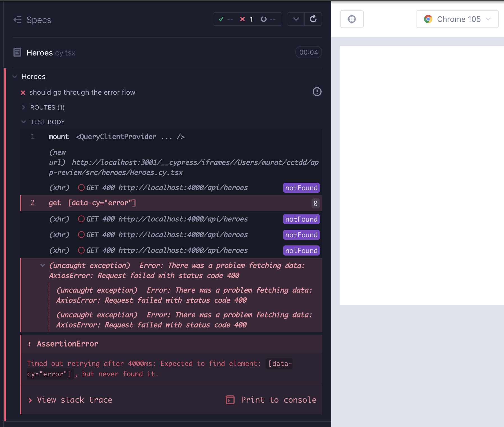
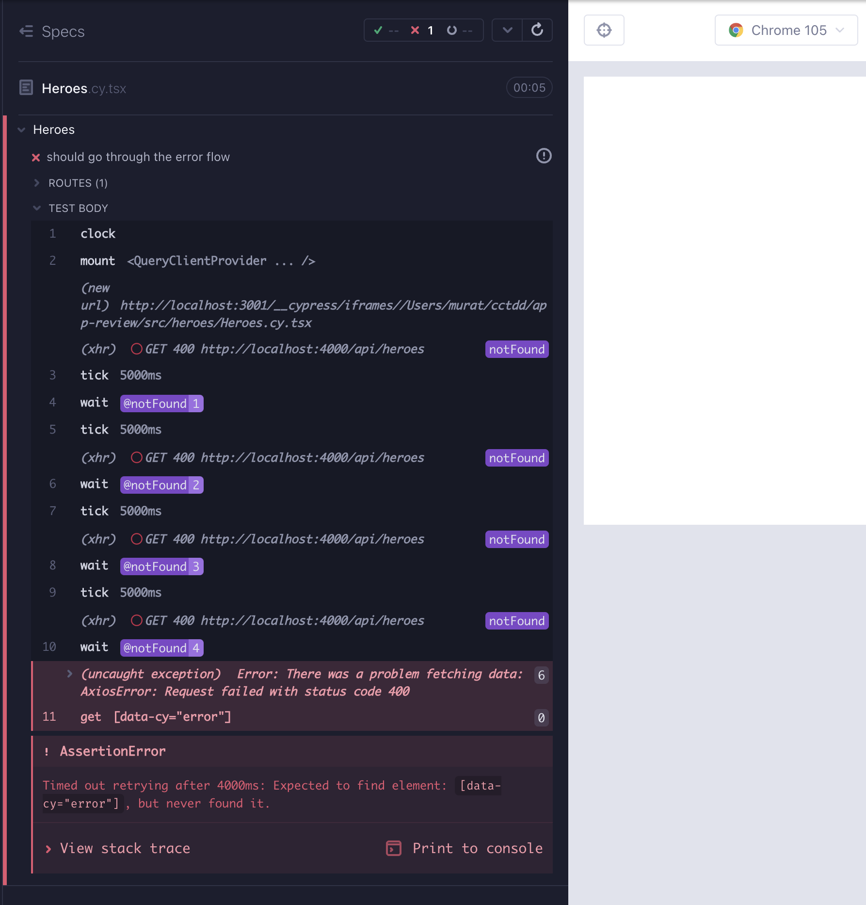

# Suspense, ErrorBoundary, Concurrency

In order to make better sense out of the new features, we start by adding 3 components - ErrorComp, PageSpinner, Spinner - and a new search filter feature for `HeroList`. We will need the components for Suspense and ErrorBoundary use cases.

```typescript
// src/components/ErrorComp.cy.tsx
import ErrorComp from "./ErrorComp";
import "../styles.scss";

describe("ErrorComp", () => {
  it("should render error", () => {
    cy.mount(<ErrorComp />);
    cy.getByCy("error").should("be.visible");
  });
});
```

```tsx
// src/components/ErrorComp.test.tsx
import ErrorComp from "./ErrorComp";
import { render, screen } from "@testing-library/react";

describe("ErrorComp", () => {
  it("should render error", async () => {
    render(<ErrorComp />);
    expect(await screen.findByTestId("error")).toBeVisible();
  });
});
```

```tsx
// src/components/ErrorComp.tsx
export default function ErrorComp() {
  return (
    <>
      <h1 data-cy="error">Something went wrong!</h1>
      <p>Try reloading the page.</p>
    </>
  );
}
```

```typescript
// src/components/Spinner.cy.tsx
import Spinner from "./Spinner";
import "../styles.scss";

describe("Spinner", () => {
  it("should render a spinner", () => {
    cy.mount(<Spinner />);
    cy.getByCy("spinner").should("be.visible");
  });
});
```

```tsx
// src/components/Spinner.test.tsx
import Spinner from "./Spinner";
import { render, screen } from "@testing-library/react";

describe("Spinner", () => {
  it("should render a spinner", async () => {
    render(<Spinner />);
    await screen.findByTestId("spinner");
  });
});
```

```tsx
// src/components/Spinner.tsx
import React from "react";
import { FaSpinner } from "react-icons/fa";

export default function Spinner(
  props: JSX.IntrinsicAttributes &
    React.ClassAttributes<HTMLSpanElement> &
    React.HTMLAttributes<HTMLSpanElement>
) {
  return (
    <span {...props}>
      <FaSpinner className="icon-loading" data-cy="spinner" />
    </span>
  );
}
```

```typescript
// src/components/PageSpinner.cy.tsx
import PageSpinner from "./PageSpinner";
import "../styles.scss";

describe("PageSpinner", () => {
  it("should render the page spinner", () => {
    cy.mount(<PageSpinner />);
    cy.getByCyLike("page-spinner").should("be.visible");
  });
});
```

```tsx
// src/components/PageSpinner.test.tsx
import PageSpinner from "./PageSpinner";
import { render, screen } from "@testing-library/react";

describe("PageSpinner", () => {
  it("should render a PageSpinner", async () => {
    render(<PageSpinner />);
    await screen.findByTestId("page-spinner");
  });
});
```

```tsx
// src/components/PageSpinner.tsx
import Spinner from "./Spinner";

export default function PageSpinner() {
  return (
    <p className="page-loading" data-cy="page-spinner">
      <Spinner />
    </p>
  );
}
```

## Search-filter for `HeroList`

We want a new feature for `HeroList` which will search and filter the heroes by their names or descriptions, so that later we can have a use case for the new React 18 hooks `useTransition` and `useDeferredValue`. Let's add a new test for it to `HeroList.cy.tsx`. When we type a hero name or description to search, we should only get that hero in the list. We can also move the mount to a `beforeEach` test hook since it is the same to all tests in this file (Red 1).

```typescript
// src/heroes/HeroList.cy.tsx
import { BrowserRouter } from "react-router-dom";
import HeroList from "./HeroList";
import "../styles.scss";
import heroes from "../../cypress/fixtures/heroes.json";

describe("HeroList", () => {
  beforeEach(() => {
    cy.mount(
      <BrowserRouter>
        <HeroList
          heroes={heroes}
          handleDeleteHero={cy.stub().as("handleDeleteHero")}
        />
      </BrowserRouter>
    );
  });

  it("should render the hero layout", () => {
    cy.getByCyLike("hero-list-item").should("have.length", heroes.length);

    cy.getByCy("card-content");
    cy.contains(heroes[0].name);
    cy.contains(heroes[0].description);

    cy.get("footer")
      .first()
      .within(() => {
        cy.getByCy("delete-button");
        cy.getByCy("edit-button");
      });
  });

  it.only("should search and filter hero by name and description", () => {
    cy.getByCy("search").type(heroes[0].name);
    cy.getByCyLike("hero-list-item")
      .should("have.length", 1)
      .contains(heroes[0].name);

    cy.getByCy("search").clear().type(heroes[2].description);
    cy.getByCyLike("hero-list-item")
      .should("have.length", 1)
      .contains(heroes[2].description);
  });

  context("handleDelete, handleEdit", () => {
    it("should handle delete", () => {
      cy.getByCy("delete-button").first().click();
      cy.get("@handleDeleteHero").should("have.been.called");
    });
    it("should handle edit", () => {
      cy.getByCy("edit-button").first().click();
      cy.location("pathname").should("eq", "/heroes/edit-hero/" + heroes[0].id);
    });
  });
});
```

When typing into the search field, we want to filter the heroes data to see if a name or description exists in the list. We already get the `heroes` data as a prop, which we can manage as state with `useState`:

`const [filteredList, setFilteredList] = useState(heroes)`

Now we have to set that state with the filtering logic. Here are two functions that help us do that:

```typescript
type HeroProperty = Hero["name"] | Hero["description"] | Hero["id"];

/** returns a boolean whether the hero properties exist in the search field */
const searchExists = (searchProperty: HeroProperty, searchField: string) =>
  String(searchProperty).toLowerCase().indexOf(searchField.toLowerCase()) !==
  -1;

/** given the data and the search field, returns the data in which the search field exists */
const searchProperties = (searchField: string, data: Hero[]) =>
  [...data].filter((item: Hero) =>
    Object.values(item).find((property: HeroProperty) =>
      searchExists(property, searchField)
    )
  );

/** filters the heroes data to see if the name or the description exists in the list */
const handleSearch =
  (data: Hero[]) => (event: ChangeEvent<HTMLInputElement>) => {
    const searchField = event.target.value;

    return setFilteredHeroes(searchProperties(searchField, data));
  };
```

Instead of rendering the list by `heroes.map`, we use `filteredHeroes`, which will get set by the `handleSearch` upon a change event.

```tsx
// src/heroes/HeroList.tsx
import { useNavigate } from "react-router-dom";
import CardContent from "components/CardContent";
import ButtonFooter from "components/ButtonFooter";
import { FaEdit, FaRegSave } from "react-icons/fa";
import { ChangeEvent, MouseEvent, useState } from "react";
import { Hero } from "models/Hero";

type HeroListProps = {
  heroes: Hero[];
  handleDeleteHero: (hero: Hero) => (e: MouseEvent<HTMLButtonElement>) => void;
};

export default function HeroList({ heroes, handleDeleteHero }: HeroListProps) {
  const [filteredHeroes, setFilteredHeroes] = useState(heroes);
  const navigate = useNavigate();

  // currying: the outer fn takes our custom arg and returns a fn that takes the event
  const handleSelectHero = (heroId: string) => () => {
    const hero = heroes.find((h: Hero) => h.id === heroId);
    navigate(
      `/heroes/edit-hero/${hero?.id}?name=${hero?.name}&description=${hero?.description}`
    );
  };

  type HeroProperty = Hero["name"] | Hero["description"] | Hero["id"];

  /** returns a boolean whether the hero properties exist in the search field */
  const searchExists = (searchProperty: HeroProperty, searchField: string) =>
    String(searchProperty).toLowerCase().indexOf(searchField.toLowerCase()) !==
    -1;

  /** given the data and the search field, returns the data in which the search field exists */
  const searchProperties = (searchField: string, data: Hero[]) =>
    [...data].filter((item: Hero) =>
      Object.values(item).find((property: HeroProperty) =>
        searchExists(property, searchField)
      )
    );

  /** filters the heroes data to see if the name or the description exists in the list */
  const handleSearch =
    (data: Hero[]) => (event: ChangeEvent<HTMLInputElement>) => {
      const searchField = event.target.value;

      return setFilteredHeroes(searchProperties(searchField, data));
    };

  return (
    <div>
      <div className="card-content">
        <span>Search </span>
        <input data-cy="search" onChange={handleSearch(heroes)} />
      </div>
      &nbsp;
      <ul data-cy="hero-list" className="list">
        {filteredHeroes.map((hero, index) => (
          <li data-cy={`hero-list-item-${index}`} key={hero.id}>
            <div className="card">
              <CardContent name={hero.name} description={hero.description} />
              <footer className="card-footer">
                <ButtonFooter
                  label="Delete"
                  IconClass={FaRegSave}
                  onClick={handleDeleteHero(hero)}
                />
                <ButtonFooter
                  label="Edit"
                  IconClass={FaEdit}
                  onClick={handleSelectHero(hero.id)}
                />
              </footer>
            </div>
          </li>
        ))}
      </ul>
    </div>
  );
}
```

We added a feature to a component that get used in other components. When adding major features, it is important to execute the CT as well as e2e test suites entirely to ensure there are no regressions; `yarn cy:run-ct`, `yarn cy:run-e2e`. In theory, nothing should go wrong. There are no component errors. `delete-hero` e2e test however is not clearing the newly added hero upon delete; we have to refresh to render the updated hero list. **Although they have a reputation of being "brittle", well-written, stable e2e tests have a high fault-finding capability, catching the defects that are not realized in a smaller focus**.

To address the defect, we have to render the `HeroList` whenever `heroes` change. That is achieved with `useEffect` and the state we rely on - _heroes_ - in the dependency array (Green 1).

`useEffect(() => setFilteredHeroes(heroes), [heroes])`

```tsx
// src/heroes/HeroList.tsx
import { useNavigate } from "react-router-dom";
import CardContent from "components/CardContent";
import ButtonFooter from "components/ButtonFooter";
import { FaEdit, FaRegSave } from "react-icons/fa";
import {
  ChangeEvent,
  MouseEvent,
  startTransition,
  useEffect,
  useState,
} from "react";
import { Hero } from "models/Hero";

type HeroListProps = {
  heroes: Hero[];
  handleDeleteHero: (hero: Hero) => (e: MouseEvent<HTMLButtonElement>) => void;
};

export default function HeroList({ heroes, handleDeleteHero }: HeroListProps) {
  const [filteredHeroes, setFilteredHeroes] = useState(heroes);
  const navigate = useNavigate();

  // needed to refresh the list after deleting a hero
  useEffect(() => setFilteredHeroes(heroes), [heroes]);

  // currying: the outer fn takes our custom arg and returns a fn that takes the event
  const handleSelectHero = (heroId: string) => () => {
    const hero = heroes.find((h: Hero) => h.id === heroId);
    navigate(
      `/heroes/edit-hero/${hero?.id}?name=${hero?.name}&description=${hero?.description}`
    );
  };

  type HeroProperty = Hero["name"] | Hero["description"] | Hero["id"];

  /** returns a boolean whether the hero properties exist in the search field */
  const searchExists = (searchProperty: HeroProperty, searchField: string) =>
    String(searchProperty).toLowerCase().indexOf(searchField.toLowerCase()) !==
    -1;

  /** given the data and the search field, returns the data in which the search field exists */
  const searchProperties = (searchField: string, data: Hero[]) =>
    [...data].filter((item: Hero) =>
      Object.values(item).find((property: HeroProperty) =>
        searchExists(property, searchField)
      )
    );

  /** filters the heroes data to see if the name or the description exists in the list */
  const handleSearch =
    (data: Hero[]) => (event: ChangeEvent<HTMLInputElement>) => {
      const searchField = event.target.value;

      return setFilteredHeroes(searchProperties(searchField, data));
    };

  return (
    <div>
      <div className="card-content">
        <span>Search </span>
        <input data-cy="search" onChange={handleSearch(heroes)} />
      </div>
      &nbsp;
      <ul data-cy="hero-list" className="list">
        {filteredHeroes.map((hero, index) => (
          <li data-cy={`hero-list-item-${index}`} key={hero.id}>
            <div className="card">
              <CardContent name={hero.name} description={hero.description} />
              <footer className="card-footer">
                <ButtonFooter
                  label="Delete"
                  IconClass={FaRegSave}
                  onClick={handleDeleteHero(hero)}
                />
                <ButtonFooter
                  label="Edit"
                  IconClass={FaEdit}
                  onClick={handleSelectHero(hero.id)}
                />
              </footer>
            </div>
          </li>
        ))}
      </ul>
    </div>
  );
}
```

## Concurrency with `useDeferredValue` & `useTransition`

The concept of Concurrency is new in React 18. While multiple state updates are occurring simultaneously, Concurrency refers to certain state updates having less priority over others, for the purpose of optimizing UI responsiveness. `useDeferredValue` & `useTransition` hooks are new in React 18. They are not needed in our application, but we will show where they may fit if we were loading vast amounts of data on a slow connection.

`useTransition()` can be used to specify which state updates have a lower priority than all other state updates.

`const [isPending, startTransition] = useTransition()`

`isPending` is a boolean value, signifying if the low-priority state update is still pending.

`startTransition` is a function that we wrap around the low-priority state update.

In our `HeroList` component, `setFilteredHeroes` can be treated as a low priority state update. This would make the user experience so that the search filter input stays responsive while the list is still loading, in case the hero list is very large and the network is very slow.

The first change is in the return segment of `handleSearch`. `startTransition` wraps a function that returns `setFilteredHeroes`.

```tsx
return startTransition(() =>
  setFilteredHeroes(
    [...data].filter(
      ({ name, description }: Hero) =>
        searchExists(searchField, name) ||
        searchExists(searchField, description)
    )
  )
);
```

We can reduce the opacity of the entire component in case the transition `isPending`:

```tsx
 return (
    <div
      style={{
        opacity: isPending ? 0.5 : 1,
      }}
    >
      <div className="card-content">
   	  ...
      </div>
     ...
   </div>
```

Here are the `useTransition` updates to the `HeroList` component.

```tsx
// src/heroes/HeroList.tsx
import { useNavigate } from "react-router-dom";
import CardContent from "components/CardContent";
import ButtonFooter from "components/ButtonFooter";
import { FaEdit, FaRegSave } from "react-icons/fa";
import {
  ChangeEvent,
  MouseEvent,
  useTransition,
  useEffect,
  useState,
} from "react";
import { Hero } from "models/Hero";

type HeroListProps = {
  heroes: Hero[];
  handleDeleteHero: (hero: Hero) => (e: MouseEvent<HTMLButtonElement>) => void;
};

export default function HeroList({ heroes, handleDeleteHero }: HeroListProps) {
  const [filteredHeroes, setFilteredHeroes] = useState(heroes);
  const navigate = useNavigate();
  const [isPending, startTransition] = useTransition();

  // needed to refresh the list after deleting a hero
  useEffect(() => setFilteredHeroes(heroes), [heroes]);

  // currying: the outer fn takes our custom arg and returns a fn that takes the event
  const handleSelectHero = (heroId: string) => () => {
    const hero = heroes.find((h: Hero) => h.id === heroId);
    navigate(
      `/heroes/edit-hero/${hero?.id}?name=${hero?.name}&description=${hero?.description}`
    );
  };

  type HeroProperty = Hero["name"] | Hero["description"] | Hero["id"];

  /** returns a boolean whether the hero properties exist in the search field */
  const searchExists = (searchProperty: HeroProperty, searchField: string) =>
    String(searchProperty).toLowerCase().indexOf(searchField.toLowerCase()) !==
    -1;

  /** given the data and the search field, returns the data in which the search field exists */
  const searchProperties = (searchField: string, data: Hero[]) =>
    [...data].filter((item: Hero) =>
      Object.values(item).find((property: HeroProperty) =>
        searchExists(property, searchField)
      )
    );

  /** filters the heroes data to see if the name or the description exists in the list */
  const handleSearch =
    (data: Hero[]) => (event: ChangeEvent<HTMLInputElement>) => {
      const searchField = event.target.value;

      return startTransition(() =>
        setFilteredHeroes(searchProperties(searchField, data))
      );
    };

  return (
    <div
      style={{
        opacity: isPending ? 0.5 : 1,
      }}
    >
      <div className="card-content">
        <span>Search </span>
        <input data-cy="search" onChange={handleSearch(heroes)} />
      </div>
      &nbsp;
      <ul data-cy="hero-list" className="list">
        {filteredHeroes.map((hero, index) => (
          <li data-cy={`hero-list-item-${index}`} key={hero.id}>
            <div className="card">
              <CardContent name={hero.name} description={hero.description} />
              <footer className="card-footer">
                <ButtonFooter
                  label="Delete"
                  IconClass={FaRegSave}
                  onClick={handleDeleteHero(hero)}
                />
                <ButtonFooter
                  label="Edit"
                  IconClass={FaEdit}
                  onClick={handleSelectHero(hero.id)}
                />
              </footer>
            </div>
          </li>
        ))}
      </ul>
    </div>
  );
}
```

With `useTransition` we have full control over the low priority code. Sometimes, we might not, for example if the data is coming in from the outside as a prop or if it is coming from external code. In such cases we can utilize `useDeferredValue`. In contrast to wrapping the state updating code with `useTransition` , with `useDeferredValue` we wrap the final value that got impacted. The end results of `useTransition` & `useDeferredValue` are the same; we tell React what the lower priority state updates are.

If you have access to the state updating code, prefer `useTransition`. If you do not have access to the code but only to the final value, utilize `useDeferredValue`.

In our `HeroList` component, the `hero` data is coming in as a prop, which is a good candidate for `useDeferredValue`.

```tsx
export default function HeroList({heroes, handleDeleteHero}: HeroListProps) {
  const deferredHeroes = useDeferredValue(heroes)
  const isStale = deferredHeroes !== heroes
  const [filteredHeroes, setFilteredHeroes] = useState(deferredHeroes)
```

We can utilize the `isStale` value in the CSS like so:

```tsx
<div
  style={{
    opacity: isPending ? 0.5 : 1,
    color: isStale ? 'dimgray' : 'black',
  }}
```

Here is the updated `HeroList` component (Refactor 1):

```tsx
// src/heroes/HeroList.tsx
import { useNavigate } from "react-router-dom";
import CardContent from "components/CardContent";
import ButtonFooter from "components/ButtonFooter";
import { FaEdit, FaRegSave } from "react-icons/fa";
import {
  ChangeEvent,
  MouseEvent,
  useTransition,
  useEffect,
  useState,
  useDeferredValue,
} from "react";
import { Hero } from "models/Hero";

type HeroListProps = {
  heroes: Hero[];
  handleDeleteHero: (hero: Hero) => (e: MouseEvent<HTMLButtonElement>) => void;
};

export default function HeroList({ heroes, handleDeleteHero }: HeroListProps) {
  const deferredHeroes = useDeferredValue(heroes);
  const isStale = deferredHeroes !== heroes;
  const [filteredHeroes, setFilteredHeroes] = useState(deferredHeroes);
  const navigate = useNavigate();
  const [isPending, startTransition] = useTransition();

  // needed to refresh the list after deleting a hero
  useEffect(() => setFilteredHeroes(deferredHeroes), [deferredHeroes]);

  // currying: the outer fn takes our custom arg and returns a fn that takes the event
  const handleSelectHero = (heroId: string) => () => {
    const hero = deferredHeroes.find((h: Hero) => h.id === heroId);
    navigate(
      `/heroes/edit-hero/${hero?.id}?name=${hero?.name}&description=${hero?.description}`
    );
  };

  type HeroProperty = Hero["name"] | Hero["description"] | Hero["id"];

  /** returns a boolean whether the hero properties exist in the search field */
  const searchExists = (searchProperty: HeroProperty, searchField: string) =>
    String(searchProperty).toLowerCase().indexOf(searchField.toLowerCase()) !==
    -1;

  /** given the data and the search field, returns the data in which the search field exists */
  const searchProperties = (searchField: string, data: Hero[]) =>
    [...data].filter((item: Hero) =>
      Object.values(item).find((property: HeroProperty) =>
        searchExists(property, searchField)
      )
    );

  /** filters the heroes data to see if the name or the description exists in the list */
  const handleSearch =
    (data: Hero[]) => (event: ChangeEvent<HTMLInputElement>) => {
      const searchField = event.target.value;

      return startTransition(() =>
        setFilteredHeroes(searchProperties(searchField, data))
      );
    };

  return (
    <div
      style={{
        opacity: isPending ? 0.5 : 1,
        color: isStale ? "dimgray" : "black",
      }}
    >
      <div className="card-content">
        <span>Search </span>
        <input data-cy="search" onChange={handleSearch(deferredHeroes)} />
      </div>
      &nbsp;
      <ul data-cy="hero-list" className="list">
        {filteredHeroes.map((hero, index) => (
          <li data-cy={`hero-list-item-${index}`} key={hero.id}>
            <div className="card">
              <CardContent name={hero.name} description={hero.description} />
              <footer className="card-footer">
                <ButtonFooter
                  label="Delete"
                  IconClass={FaRegSave}
                  onClick={handleDeleteHero(hero)}
                />
                <ButtonFooter
                  label="Edit"
                  IconClass={FaEdit}
                  onClick={handleSelectHero(hero.id)}
                />
              </footer>
            </div>
          </li>
        ))}
      </ul>
    </div>
  );
}
```

The conditional rendering gives another clue; do we need a search bar when there is no data? Let's add that feature, starting with a failing test. We will rearrange `HeroList.cy.tsx` a bit so that we can capture the test in two contexts; mount without hero data, and mount with hero data (Red 2).

```tsx
// src/heroes/HeroList.cy.tsx
import { BrowserRouter } from "react-router-dom";
import HeroList from "./HeroList";
import "../styles.scss";
import heroes from "../../cypress/fixtures/heroes.json";

describe("HeroList", () => {
  it("no heroes should not display a list nor search bar", () => {
    cy.mount(
      <BrowserRouter>
        <HeroList
          heroes={[]}
          handleDeleteHero={cy.stub().as("handleDeleteHero")}
        />
      </BrowserRouter>
    );

    cy.getByCy("hero-list").should("exist");
    cy.getByCyLike("hero-list-item").should("not.exist");
    cy.getByCy("search").should("not.exist");
  });

  context("with heroes in the list", () => {
    beforeEach(() => {
      cy.mount(
        <BrowserRouter>
          <HeroList
            heroes={heroes}
            handleDeleteHero={cy.stub().as("handleDeleteHero")}
          />
        </BrowserRouter>
      );
    });

    it("should render the hero layout", () => {
      cy.getByCyLike("hero-list-item").should("have.length", heroes.length);

      cy.getByCy("card-content");
      cy.contains(heroes[0].name);
      cy.contains(heroes[0].description);

      cy.get("footer")
        .first()
        .within(() => {
          cy.getByCy("delete-button");
          cy.getByCy("edit-button");
        });
    });

    it("should search and filter hero by name and description", () => {
      cy.getByCy("search").type(heroes[0].name);
      cy.getByCyLike("hero-list-item")
        .should("have.length", 1)
        .contains(heroes[0].name);

      cy.getByCy("search").clear().type(heroes[2].description);
      cy.getByCyLike("hero-list-item")
        .should("have.length", 1)
        .contains(heroes[2].description);
    });

    it("should handle delete", () => {
      cy.getByCy("delete-button").first().click();
      cy.get("@handleDeleteHero").should("have.been.called");
    });

    it("should handle edit", () => {
      cy.getByCy("edit-button").first().click();
      cy.location("pathname").should("eq", "/heroes/edit-hero/" + heroes[0].id);
    });
  });
});
```

To satisfy the test, all we need is conditional rendering for the search bar.

```tsx
{
  deferredHeroes.length > 0 && (
    <div className="card-content">
      <span>Search </span>
      <input data-cy="search" onChange={handleSearch(deferredHeroes)} />
    </div>
  );
}
```

Here is the `HeroList` component in its final form (Green 2):

```tsx
// src/heroes/HeroList.tsx
import { useNavigate } from "react-router-dom";
import CardContent from "components/CardContent";
import ButtonFooter from "components/ButtonFooter";
import { FaEdit, FaRegSave } from "react-icons/fa";
import {
  ChangeEvent,
  MouseEvent,
  useTransition,
  useEffect,
  useState,
  useDeferredValue,
} from "react";
import { Hero } from "models/Hero";

type HeroListProps = {
  heroes: Hero[];
  handleDeleteHero: (hero: Hero) => (e: MouseEvent<HTMLButtonElement>) => void;
};

export default function HeroList({ heroes, handleDeleteHero }: HeroListProps) {
  const deferredHeroes = useDeferredValue(heroes);
  const isStale = deferredHeroes !== heroes;
  const [filteredHeroes, setFilteredHeroes] = useState(deferredHeroes);
  const navigate = useNavigate();
  const [isPending, startTransition] = useTransition();

  // needed to refresh the list after deleting a hero
  useEffect(() => setFilteredHeroes(deferredHeroes), [deferredHeroes]);

  // currying: the outer fn takes our custom arg and returns a fn that takes the event
  const handleSelectHero = (heroId: string) => () => {
    const hero = deferredHeroes.find((h: Hero) => h.id === heroId);
    navigate(
      `/heroes/edit-hero/${hero?.id}?name=${hero?.name}&description=${hero?.description}`
    );
  };

  type HeroProperty = Hero["name"] | Hero["description"] | Hero["id"];

  /** returns a boolean whether the hero properties exist in the search field */
  const searchExists = (searchProperty: HeroProperty, searchField: string) =>
    String(searchProperty).toLowerCase().indexOf(searchField.toLowerCase()) !==
    -1;

  /** given the data and the search field, returns the data in which the search field exists */
  const searchProperties = (searchField: string, data: Hero[]) =>
    [...data].filter((item: Hero) =>
      Object.values(item).find((property: HeroProperty) =>
        searchExists(property, searchField)
      )
    );

  /** filters the heroes data to see if the any of the properties exist in the list */
  const handleSearch =
    (data: Hero[]) => (event: ChangeEvent<HTMLInputElement>) => {
      const searchField = event.target.value;

      return startTransition(() =>
        setFilteredHeroes(searchProperties(searchField, data))
      );
    };

  return (
    <div
      style={{
        opacity: isPending ? 0.5 : 1,
        color: isStale ? "dimgray" : "black",
      }}
    >
      {deferredHeroes.length > 0 && (
        <div className="card-content">
          <span>Search </span>
          <input data-cy="search" onChange={handleSearch(deferredHeroes)} />
        </div>
      )}
      &nbsp;
      <ul data-cy="hero-list" className="list">
        {filteredHeroes.map((hero, index) => (
          <li data-cy={`hero-list-item-${index}`} key={hero.id}>
            <div className="card">
              <CardContent name={hero.name} description={hero.description} />
              <footer className="card-footer">
                <ButtonFooter
                  label="Delete"
                  IconClass={FaRegSave}
                  onClick={handleDeleteHero(hero)}
                />
                <ButtonFooter
                  label="Edit"
                  IconClass={FaEdit}
                  onClick={handleSelectHero(hero.id)}
                />
              </footer>
            </div>
          </li>
        ))}
      </ul>
    </div>
  );
}
```

## Suspense & ErrorBoundary

### The setup

To manage the amount of code loaded upon application startup - the initial bundle - we can use code splitting which aims to load the app's code in chunks in order to improve UI responsiveness. In React, [Suspense](https://reactjs.org/docs/code-splitting.html) and lazy loading are used to accomplish code splitting. They are usually talked about together with `ErrorBoundary`, because `Suspense` and `ErrorBoundary` components let us decouple the loading and error UI from individual components. Here are the key ideas:

- While loading show the `Suspense` component, if error show the `ErrorBoundary` component, if success show the component we want to render.
- Use `React.lazy` to load components only when they are first rendered.

Converting a component to a lazy component with the `lazy` function:

```tsx
// staticly imported component
import Heroes from "heroes/Heroes";

// lazy loaded component
const Heroes = lazy(() => import("heroes/Heroes"));
```

Use the Suspense and ErrorBoundary components to wrap UI that contains one or more lazy components in its tree. Here is how they work together at a high level:

```tsx
<ErrorBoundary fallback={<ErrorComp />}>
  <Suspense fallback={<PageSpinner />}>
    <Routes>
      ..
      <lazy-loaded-components />
      ..
    </Routes>
  </Suspense>
</ErrorBoundary>
```

For setup, install `react-error-boundary` with `yarn add react-error-boundary`and update `App.tsx` like so:

```tsx
// src/App.tsx
import { lazy, Suspense } from "react";
import { BrowserRouter, Routes, Route, Navigate } from "react-router-dom";
import { QueryClient, QueryClientProvider } from "react-query";
import { ErrorBoundary } from "react-error-boundary";
import HeaderBar from "components/HeaderBar";
import NavBar from "components/NavBar";
import PageSpinner from "components/PageSpinner";
import ErrorComp from "components/ErrorComp";
import "./styles.scss";
const Heroes = lazy(() => import("heroes/Heroes"));
const NotFound = lazy(() => import("components/NotFound"));
const About = lazy(() => import("About"));

const queryClient = new QueryClient();

function App() {
  return (
    <BrowserRouter>
      <HeaderBar />
      <div className="section columns">
        <NavBar />
        <main className="column">
          <QueryClientProvider client={queryClient}>
            <ErrorBoundary fallback={<ErrorComp />}>
              <Suspense fallback={<PageSpinner />}>
                <Routes>
                  <Route path="/" element={<Navigate replace to="/heroes" />} />
                  <Route path="/heroes/*" element={<Heroes />} />
                  <Route path="/about" element={<About />} />
                  <Route path="*" element={<NotFound />} />
                </Routes>
              </Suspense>
            </ErrorBoundary>
          </QueryClientProvider>
        </main>
      </div>
    </BrowserRouter>
  );
}

export default App;
```

Update the `useGetHeroes` hook to take a 3rd argument for configuration. Passing `{suspense: true}` will enable `Suspense` mode in `react-query`'s `useQuery`.

```typescript
// src/hooks/useGetHeroes.ts
import { useQuery } from "react-query";
import { getItem } from "./api";

/**
 * Helper for GET to `/heroes` route
 * @returns {object} {heroes, status, getError}
 */
export const useGetHeroes = () => {
  const query = useQuery("heroes", () => getItem("heroes"), {
    suspense: true,
  });

  return {
    heroes: query.data,
    status: query.status,
    getError: query.error,
  };
};
```

### Tests for error cases

#### `HeroDetail` component

Now we can begin writing failing tests for error edge cases. Where do we start? Any component test that is covering the positive cases, spying on or stubbing the network with `cy.intercept()` is a good candidate . Those are `HeroDetail` and `Heroes` component tests.

Add a test to `HeroList` component test for a non-200 scenario. We use a delay option to be able to see the spinner (Red 3).

```typescript
it("should handle Save", () => {
  cy.intercept("POST", "*", { statusCode: 200 }).as("postHero");
  cy.getByCy("save-button").click();
  cy.wait("@postHero");
});

// the new test
it("should handle non-200 Save", () => {
  cy.intercept("POST", "*", { statusCode: 400, delay: 100 }).as("postHero");
  cy.getByCy("save-button").click();
  cy.getByCy("spinner");
});
```

```typescript
// src/heroes/HeroDetail.cy.tsx
import HeroDetail from "./HeroDetail";
import { BrowserRouter } from "react-router-dom";
import { QueryClient, QueryClientProvider } from "react-query";
import "../styles.scss";

describe("HeroDetail", () => {
  let queryClient: QueryClient;
  context("handleSave, handleCancel", () => {
    beforeEach(() => {
      queryClient = new QueryClient();
      cy.mount(
        <QueryClientProvider client={queryClient}>
          <BrowserRouter>
            <HeroDetail />
          </BrowserRouter>
        </QueryClientProvider>
      );
    });

    it("should handle Save", () => {
      cy.intercept("POST", "*", { statusCode: 200 }).as("postHero");
      cy.getByCy("save-button").click();
      cy.wait("@postHero");
    });

    it.only("should handle non-200 Save", () => {
      cy.intercept("POST", "*", { statusCode: 400, delay: 100 }).as("postHero");
      cy.getByCy("save-button").click();
      cy.getByCy("spinner");
    });

    it("should handle Cancel", () => {
      cy.getByCy("cancel-button").click();
      cy.location("pathname").should("eq", "/heroes");
    });
  });

  context("handleNameChange, handleDescriptionChange", () => {
    beforeEach(() => {
      queryClient = new QueryClient();
      cy.mount(
        <QueryClientProvider client={queryClient}>
          <BrowserRouter>
            <HeroDetail />
          </BrowserRouter>
        </QueryClientProvider>
      );
    });

    it("should handle name change", () => {
      const newHeroName = "abc";
      cy.getByCy("input-detail-name").type(newHeroName);

      cy.findByDisplayValue(newHeroName).should("be.visible");
    });

    it("should handle description change", () => {
      const newHeroDescription = "123";
      cy.getByCy("input-detail-description").type(newHeroDescription);

      cy.findByDisplayValue(newHeroDescription).should("be.visible");
    });
  });

  context("state: should verify the layout of the component", () => {
    it("id: false, name: false - should verify the minimal state of the component", () => {
      queryClient = new QueryClient();
      cy.mount(
        <QueryClientProvider client={queryClient}>
          <BrowserRouter>
            <HeroDetail />
          </BrowserRouter>
        </QueryClientProvider>
      );

      cy.get("p").then(($el) => cy.wrap($el.text()).should("equal", ""));
      cy.getByCyLike("input-detail").should("have.length", 2);
      cy.getByCy("input-detail-id").should("not.exist");

      cy.findByPlaceholderText("e.g. Colleen").should("be.visible");
      cy.findByPlaceholderText("e.g. dance fight!").should("be.visible");

      cy.getByCy("save-button").should("be.visible");
      cy.getByCy("cancel-button").should("be.visible");
    });
  });
});
```

Looking at the `HeroDetail` component, we have `status` from `usePostHero` and `isUpdating` from `usePutHero` hooks, which we can utilize. In case these are seen, render the `PageSpinner` (Green 2).

```
if (status === "loading" || isUpdating) {
  return <PageSpinner />;
}
```

```tsx
// src/heroes/HeroDetail.tsx
import { useState, ChangeEvent } from "react";
import { useNavigate, useParams } from "react-router-dom";
import { FaUndo, FaRegSave } from "react-icons/fa";
import InputDetail from "components/InputDetail";
import ButtonFooter from "components/ButtonFooter";
import { useHeroParams } from "hooks/useHeroParams";
import { usePostHero } from "hooks/usePostHero";
import { Hero } from "models/Hero";
import { usePutHero } from "hooks/usePutHero";
import PageSpinner from "components/PageSpinner";

export default function HeroDetail() {
  const { id } = useParams();
  const { name, description } = useHeroParams();
  const [hero, setHero] = useState({ id, name, description });
  const { mutate: createHero, status, error: postError } = usePostHero();
  const { updateHero, isUpdating, isUpdateError } = usePutHero();

  const navigate = useNavigate();
  const handleCancel = () => navigate("/heroes");
  const handleSave = () =>
    name ? updateHero(hero as Hero) : createHero(hero as Hero);
  const handleNameChange = (e: ChangeEvent<HTMLInputElement>) => {
    setHero({ ...hero, name: e.target.value });
  };
  const handleDescriptionChange = (e: ChangeEvent<HTMLInputElement>) => {
    setHero({ ...hero, description: e.target.value });
  };

  if (status === "loading" || isUpdating) {
    return <PageSpinner />;
  }

  return (
    <div data-cy="hero-detail" className="card edit-detail">
      <header className="card-header">
        <p className="card-header-title">{name}</p>
        &nbsp;
      </header>
      <div className="card-content">
        <div className="content">
          {id && (
            <InputDetail name={"id"} value={id} readOnly={true}></InputDetail>
          )}
          <InputDetail
            name={"name"}
            value={name ? name : ""}
            placeholder="e.g. Colleen"
            onChange={handleNameChange}
          ></InputDetail>
          <InputDetail
            name={"description"}
            value={description ? description : ""}
            placeholder="e.g. dance fight!"
            onChange={handleDescriptionChange}
          ></InputDetail>
        </div>
      </div>
      <footer className="card-footer">
        <ButtonFooter
          label="Cancel"
          IconClass={FaUndo}
          onClick={handleCancel}
        />
        <ButtonFooter label="Save" IconClass={FaRegSave} onClick={handleSave} />
      </footer>
    </div>
  );
}
```

Running the component test, we can verify the spinner by hovering over the Cypress time travel debug. We also realize the stubbed `POST` request going out, which we can verify with a `cy.wait()` (Refactor 2). Being able to see all the transitions of a component via Cypress time travel debugger can hep us improve our tests

```typescript
it.only("should handle non-200 Save", () => {
  cy.intercept("POST", "*", { statusCode: 400, delay: 100 }).as("postHero");
  cy.getByCy("save-button").click();
  cy.getByCy("spinner");
  cy.wait("@postHero");
});
```

Next we add a line to check for an error. The status code is 400, we should see some error in this test (Red 4).

```typescript
it.only("should handle non-200 Save", () => {
  cy.intercept("POST", "*", { statusCode: 400, delay: 100 }).as("postHero");
  cy.getByCy("save-button").click();
  cy.getByCy("spinner");
  cy.wait("@postHero");
  cy.getByCy("error");
});
```

Looking at the `HeroDetail` component, we have `postError` from `usePostHero` and `isUpdateError` from `usePutHero` hooks, which we can utilize (Green 3).

```
if (status === "loading" || isUpdating) {
  return <PageSpinner />;
}

if (postError || isUpdateError) {
  return <ErrorComp />;
}
```

```tsx
// src/heroes/HeroDetail.tsx
import { useState, ChangeEvent } from "react";
import { useNavigate, useParams } from "react-router-dom";
import { FaUndo, FaRegSave } from "react-icons/fa";
import InputDetail from "components/InputDetail";
import ButtonFooter from "components/ButtonFooter";
import PageSpinner from "components/PageSpinner";
import ErrorComp from "components/ErrorComp";
import { useHeroParams } from "hooks/useHeroParams";
import { usePostHero } from "hooks/usePostHero";
import { Hero } from "models/Hero";
import { usePutHero } from "hooks/usePutHero";

export default function HeroDetail() {
  const { id } = useParams();
  const { name, description } = useHeroParams();
  const [hero, setHero] = useState({ id, name, description });
  const { mutate: createHero, status, error: postError } = usePostHero();
  const { updateHero, isUpdating, isUpdateError } = usePutHero();

  const navigate = useNavigate();
  const handleCancel = () => navigate("/heroes");
  const handleSave = () =>
    name ? updateHero(hero as Hero) : createHero(hero as Hero);
  const handleNameChange = (e: ChangeEvent<HTMLInputElement>) => {
    setHero({ ...hero, name: e.target.value });
  };
  const handleDescriptionChange = (e: ChangeEvent<HTMLInputElement>) => {
    setHero({ ...hero, description: e.target.value });
  };

  if (status === "loading" || isUpdating) {
    return <PageSpinner />;
  }

  if (postError || isUpdateError) {
    return <ErrorComp />;
  }

  return (
    <div data-cy="hero-detail" className="card edit-detail">
      <header className="card-header">
        <p className="card-header-title">{name}</p>
        &nbsp;
      </header>
      <div className="card-content">
        <div className="content">
          {id && (
            <InputDetail name={"id"} value={id} readOnly={true}></InputDetail>
          )}
          <InputDetail
            name={"name"}
            value={name ? name : ""}
            placeholder="e.g. Colleen"
            onChange={handleNameChange}
          ></InputDetail>
          <InputDetail
            name={"description"}
            value={description ? description : ""}
            placeholder="e.g. dance fight!"
            onChange={handleDescriptionChange}
          ></InputDetail>
        </div>
      </div>
      <footer className="card-footer">
        <ButtonFooter
          label="Cancel"
          IconClass={FaUndo}
          onClick={handleCancel}
        />
        <ButtonFooter label="Save" IconClass={FaRegSave} onClick={handleSave} />
      </footer>
    </div>
  );
}
```

We do not have any way to check the update scenario in the component test, because we are not able to setup such state that would trigger a back-end modification. Any time we are not able to cover a test at a low level with component tests, move up to ui-integration tests. Most the time a ui-integration test will suffice, and when it is not enough we can use a true e2e that hits the backend. In our case ui-integration is preferred because it would be hard to have the backend respond with a 500 response. We also do not need a response from a real network to render the error . Therefore we can add a ui-integration test to `edit-hero.cy.ts` e2e test that covers the update scenario. We see the boundaries between test types begin to get thinner; we use the least costly kind of test to gain the highest confidence. Where they are in the pyramid is only relevant by the ability to perform that kind of test in the given context (Refactor 4).

The new test is similar to other ui-integration tests; we stub the network and visit the main route. We go to the edit page for any random hero. We setup the network stub that will happen on update via `cy.intercept`. Finally we repeat a similar spinner -> wait on network -> error flow from the component test. The only distinction here is `PUT` vs `POST`.

```typescript
it("should go through the PUT error flow (ui-integration)", () => {
  // Arrange: beginning state
  cy.visitStubbedHeroes();
  // verify that we are editing data already populated
  cy.fixture("heroes").then((heroes) => {
    const heroIndex = randomHeroIndex(heroes);
    cy.getByCy("edit-button").eq(heroIndex).click();
    verifyHero(heroes, heroIndex);
  });
  // setup network stub
  cy.intercept("PUT", `${Cypress.env("API_URL")}/heroes/*`, {
    statusCode: 500,
    delay: 100,
  }).as("isUpdateError");

  // Act
  cy.getByCy("save-button").click();

  // Assert
  cy.getByCy("spinner");
  cy.wait("@isUpdateError");
  cy.getByCy("error");
});
```

Here is the side by side with the component test for comparison. The Act and Assert are the same, the network stub is `POST` vs `PUT` with less of a need to specify the url. Predominantly setting up the Arrange is different.

```typescript
// Arrange: beginning state (mount the component in beforeEach)
beforeEach(() => {
  queryClient = new QueryClient();
  cy.mount(
    <QueryClientProvider client={queryClient}>
      <BrowserRouter>
        <HeroDetail />
      </BrowserRouter>
    </QueryClientProvider>
  );
});

it("should handle non-200 Save", () => {
  // setup network stub
  cy.intercept("POST", "*", { statusCode: 400, delay: 100 }).as("postHero");

  // Act
  cy.getByCy("save-button").click();

  // Assert
  cy.getByCy("spinner");
  cy.wait("@postHero");
  cy.getByCy("error");
});
```

Here is the full e2e test after the refactor.

```typescript
// cypress/e2e/edit-hero.cy.ts
import { faker } from "@faker-js/faker";
import { Hero } from "../../src/models/Hero";
describe("Edit hero", () => {
  before(cy.resetData);

  /** Verifies hero info on Edit page */
  const verifyHero = (heroes: Hero[], heroIndex: number) => {
    cy.location("pathname").should("include", "/heroes/edit-hero/");
    cy.getByCy("hero-detail").should("be.visible");
    cy.getByCy("input-detail-id").should("be.visible");
    cy.findByDisplayValue(heroes[heroIndex].id);
    cy.findByDisplayValue(heroes[heroIndex].name);
    cy.findByDisplayValue(heroes[heroIndex].description);
  };

  const randomHeroIndex = (heroes: Hero[]) =>
    Cypress._.random(0, heroes.length - 1);

  it("should go through the cancel flow for a random hero (ui-integration)", () => {
    cy.visitStubbedHeroes();

    cy.fixture("heroes").then((heroes) => {
      const heroIndex = randomHeroIndex(heroes);
      cy.getByCy("edit-button").eq(heroIndex).click();
      verifyHero(heroes, heroIndex);
    });

    cy.getByCy("cancel-button").click();
    cy.location("pathname").should("eq", "/heroes");
    cy.getByCy("hero-list").should("be.visible");
  });

  it("should go through the PUT error flow (ui-integration)", () => {
    cy.visitStubbedHeroes();

    cy.fixture("heroes").then((heroes) => {
      const heroIndex = randomHeroIndex(heroes);
      cy.getByCy("edit-button").eq(heroIndex).click();
      verifyHero(heroes, heroIndex);
    });

    cy.intercept("PUT", `${Cypress.env("API_URL")}/heroes/*`, {
      statusCode: 500,
      delay: 100,
    }).as("isUpdateError");

    cy.getByCy("save-button").click();
    cy.getByCy("spinner");
    cy.wait("@isUpdateError");
    cy.getByCy("error");
  });

  it("should navigate to add from an existing hero (ui-integration)", () => {
    cy.visitStubbedHeroes();

    cy.fixture("heroes").then((heroes) => {
      const heroIndex = randomHeroIndex(heroes);
      cy.getByCy("edit-button").eq(heroIndex).click();
      verifyHero(heroes, heroIndex);

      cy.getByCy("add-button").click();
      cy.getByCy("input-detail-id").should("not.exist");
      cy.findByDisplayValue(heroes[heroIndex].name).should("not.exist");
      cy.findByDisplayValue(heroes[heroIndex].description).should("not.exist");
    });
  });

  it("should go through the edit flow (ui-e2e)", () => {
    const newHero: Hero = {
      id: faker.datatype.uuid(),
      name: faker.internet.userName(),
      description: `description ${faker.internet.userName()}`,
    };

    cy.crud("POST", "heroes", { body: newHero });

    cy.visit(`heroes/edit-hero/${newHero.id}`, {
      qs: { name: newHero.name, description: newHero.description },
    });

    const editedHero = {
      name: faker.internet.userName(),
      description: `description ${faker.internet.userName()}`,
    };

    cy.getByCy("input-detail-name")
      .find(".input")
      .clear()
      .type(`${editedHero.name}`);
    cy.getByCy("input-detail-description")
      .find(".input")
      .clear()
      .type(`${editedHero.description}`);
    cy.getByCy("save-button").click();

    cy.getByCy("hero-list")
      .should("be.visible")
      .should("contain", editedHero.name)
      .and("contain", editedHero.description);

    cy.getEntityByProperty(newHero.id).then((myHero) =>
      cy.crud("DELETE", `heroes/${myHero.id}`)
    );
  });
});
```

#### `Heroes` component

The other component test that is using `cy.intercept` in a happy path flow is `Heroes.cy.tsx`. It is stubbing a `GET` call to `/heroes` route like so:

```tsx
cy.intercept("GET", `${Cypress.env("API_URL")}/heroes`, {
  fixture: "heroes.json",
}).as("getHeroes");
```

By default, `cy.intecept` accepts the status code as 200. What happens when the status code is not 200?

`Heroes` component is using `HeroDetail`. Before we begin, we will slightly refactor the test to have 2 contexts; one for 200 flows, and the new test for the non-200 flow. The non-200 test we will create will come before the 200 flows.

```tsx
// src/heroes/Heroes.cy.tsx
import Heroes from "./Heroes";
import { BrowserRouter } from "react-router-dom";
import { QueryClient, QueryClientProvider } from "react-query";
import "../styles.scss";

describe("Heroes", () => {
  const mounter = (queryClient: QueryClient) =>
    cy.mount(
      <QueryClientProvider client={queryClient}>
        <BrowserRouter>
          <Heroes />
        </BrowserRouter>
      </QueryClientProvider>
    );

  context("200 flows", () => {
    beforeEach(() => {
      cy.intercept("GET", `${Cypress.env("API_URL")}/heroes`, {
        fixture: "heroes.json",
      }).as("getHeroes");

      mounter(new QueryClient());
    });

    it("should display the hero list on render, and go through hero add & refresh flow", () => {
      cy.wait("@getHeroes");

      cy.getByCy("list-header").should("be.visible");
      cy.getByCy("hero-list").should("be.visible");

      cy.getByCy("add-button").click();
      cy.location("pathname").should("eq", "/heroes/add-hero");

      cy.getByCy("refresh-button").click();
      cy.location("pathname").should("eq", "/heroes");
    });

    const invokeHeroDelete = () => {
      cy.getByCy("delete-button").first().click();
      cy.getByCy("modal-yes-no").should("be.visible");
    };
    it("should go through the modal flow", () => {
      cy.getByCy("modal-yes-no").should("not.exist");

      cy.log("do not delete flow");
      invokeHeroDelete();
      cy.getByCy("button-no").click();
      cy.getByCy("modal-yes-no").should("not.exist");

      cy.log("delete flow");
      invokeHeroDelete();
      cy.intercept("DELETE", "*", { statusCode: 200 }).as("deleteHero");

      cy.getByCy("button-yes").click();
      cy.wait("@deleteHero");
      cy.getByCy("modal-yes-no").should("not.exist");
    });
  });
});
```

Let's start with the new test. We setup the network setup, mount the component, and expect to see an error.

```tsx
// src/heroes/Heroes.cy.tsx
import Heroes from "./Heroes";
import { BrowserRouter } from "react-router-dom";
import { QueryClient, QueryClientProvider } from "react-query";
import "../styles.scss";

describe("Heroes", () => {
  const mounter = (queryClient: QueryClient) =>
    cy.mount(
      <QueryClientProvider client={queryClient}>
        <BrowserRouter>
          <Heroes />
        </BrowserRouter>
      </QueryClientProvider>
    );

  it.only("should go through the error flow", () => {
    cy.intercept("GET", `${Cypress.env("API_URL")}/heroes`, {
      statusCode: 400,
      delay: 100,
    }).as("notFound");

    mounter(new QueryClient());

    cy.getByCy("error");
  });

  context("200 flows", () => {
    beforeEach(() => {
      cy.intercept("GET", `${Cypress.env("API_URL")}/heroes`, {
        fixture: "heroes.json",
      }).as("getHeroes");

      mounter(new QueryClient());
    });

    it("should display the hero list on render, and go through hero add & refresh flow", () => {
      cy.wait("@getHeroes");

      cy.getByCy("list-header").should("be.visible");
      cy.getByCy("hero-list").should("be.visible");

      cy.getByCy("add-button").click();
      cy.location("pathname").should("eq", "/heroes/add-hero");

      cy.getByCy("refresh-button").click();
      cy.location("pathname").should("eq", "/heroes");
    });

    const invokeHeroDelete = () => {
      cy.getByCy("delete-button").first().click();
      cy.getByCy("modal-yes-no").should("be.visible");
    };
    it("should go through the modal flow", () => {
      cy.getByCy("modal-yes-no").should("not.exist");

      cy.log("do not delete flow");
      invokeHeroDelete();
      cy.getByCy("button-no").click();
      cy.getByCy("modal-yes-no").should("not.exist");

      cy.log("delete flow");
      invokeHeroDelete();
      cy.intercept("DELETE", "*", { statusCode: 200 }).as("deleteHero");

      cy.getByCy("button-yes").click();
      cy.wait("@deleteHero");
      cy.getByCy("modal-yes-no").should("not.exist");
    });
  });
});
```

Running the component test, we see that nothing renders, Axios retrying multiple times and throws an error (Red 5).



We can mirror the improvement that was done to `HeroDetail` in `Heroes`.

```tsx
// HeroDetail
if (status === "loading" || isUpdating) {
  return <PageSpinner />;
}

if (postError || isUpdateError) {
  return <ErrorComp />;
}
```

```tsx
// Heroes
if (status === "loading") {
  return <PageSpinner />;
}

if (getError || isDeleteError) {
  return <ErrorComp />;
}
```

Here is the `Heroes` component enhanced for rendering `Suspense` and `ErrorBoundary`.

```tsx
// src/heroes/Heroes.tsx
import { useState, ChangeEvent } from "react";
import { useNavigate, useParams } from "react-router-dom";
import { FaUndo, FaRegSave } from "react-icons/fa";
import InputDetail from "components/InputDetail";
import ButtonFooter from "components/ButtonFooter";
import PageSpinner from "components/PageSpinner";
import ErrorComp from "components/ErrorComp";
import { useHeroParams } from "hooks/useHeroParams";
import { usePostHero } from "hooks/usePostHero";
import { Hero } from "models/Hero";
import { usePutHero } from "hooks/usePutHero";

export default function HeroDetail() {
  const { id } = useParams();
  const { name, description } = useHeroParams();
  const [hero, setHero] = useState({ id, name, description });
  const { mutate: createHero, status, error: postError } = usePostHero();
  const { updateHero, isUpdating, isUpdateError } = usePutHero();

  const navigate = useNavigate();
  const handleCancel = () => navigate("/heroes");
  const handleSave = () =>
    name ? updateHero(hero as Hero) : createHero(hero as Hero);
  const handleNameChange = (e: ChangeEvent<HTMLInputElement>) => {
    setHero({ ...hero, name: e.target.value });
  };
  const handleDescriptionChange = (e: ChangeEvent<HTMLInputElement>) => {
    setHero({ ...hero, description: e.target.value });
  };

  if (status === "loading" || isUpdating) {
    return <PageSpinner />;
  }

  if (postError || isUpdateError) {
    return <ErrorComp />;
  }

  return (
    <div data-cy="hero-detail" className="card edit-detail">
      <header className="card-header">
        <p className="card-header-title">{name}</p>
        &nbsp;
      </header>
      <div className="card-content">
        <div className="content">
          {id && (
            <InputDetail name={"id"} value={id} readOnly={true}></InputDetail>
          )}
          <InputDetail
            name={"name"}
            value={name ? name : ""}
            placeholder="e.g. Colleen"
            onChange={handleNameChange}
          ></InputDetail>
          <InputDetail
            name={"description"}
            value={description ? description : ""}
            placeholder="e.g. dance fight!"
            onChange={handleDescriptionChange}
          ></InputDetail>
        </div>
      </div>
      <footer className="card-footer">
        <ButtonFooter
          label="Cancel"
          IconClass={FaUndo}
          onClick={handleCancel}
        />
        <ButtonFooter label="Save" IconClass={FaRegSave} onClick={handleSave} />
      </footer>
    </div>
  );
}
```

Still those Axios retries are taking long and nothing renders. We can speed up the network errors by using [`cy.clock`](https://docs.cypress.io/api/commands/clock) and [`cy.tick`](https://docs.cypress.io/api/commands/tick). We also tell Cypress that uncaught exceptions are expected using `Cypress.on('uncaught:exception', () => false)`.

```tsx
// src/heroes/Heroes.cy.tsx
it.only("should go through the error flow", () => {
  Cypress.on("uncaught:exception", () => false);
  cy.clock();
  cy.intercept("GET", `${Cypress.env("API_URL")}/heroes`, {
    statusCode: 400,
    delay: 100,
  }).as("notFound");

  mounter(new QueryClient());

  Cypress._.times(3, () => {
    cy.tick(5000);
    cy.wait("@notFound");
  });
  cy.tick(5000);

  cy.getByCy("error");
});
```

After that change, the only remaining failure is `data-cy` not rendering



We need to remember that a component test is an independent, small scale app. Our application is being wrapped at the base level, and with that `ErrorBoundary` and `Suspense` are able to apply to every component under the App. Therefore we also need to wrap our mounted component (Green 5).

```tsx
// remember App.tsx
<QueryClientProvider client={queryClient}>
  <ErrorBoundary fallback={<ErrorComp />}>
    <Suspense fallback={<PageSpinner />}>
      <Routes>
        <Route path="/" element={<Navigate replace to="/heroes" />} />
        <Route path="/heroes/*" element={<Heroes />} />
        <Route path="/about" element={<About />} />
        <Route path="*" element={<NotFound />} />
      </Routes>
    </Suspense>
  </ErrorBoundary>
</QueryClientProvider>
```

Compare to our new mount:

```tsx
// src/heroes/Heroes.cy.tsx
cy.mount(
  <QueryClientProvider client={new QueryClient()}>
    <ErrorBoundary fallback={<ErrorComp />}>
      <Suspense fallback={<PageSpinner />}>
        <BrowserRouter>
          <Heroes />
        </BrowserRouter>
      </Suspense>
    </ErrorBoundary>
  </QueryClientProvider>
);
```

Our test can work with that, but most likely the verbosity will be needed elsewhere. We can instead use a custom function for it like so:

```tsx
const wrappedMount = (
  WrappedComponent: React.ElementType,
  props: JSX.IntrinsicAttributes &
    React.ClassAttributes<HTMLSpanElement> &
    React.HTMLAttributes<HTMLSpanElement> = {}
) => {
  const wrapped = (
    <QueryClientProvider client={new QueryClient()}>
      <ErrorBoundary fallback={<ErrorComp />}>
        <Suspense fallback={<PageSpinner />}>
          <BrowserRouter>
            <WrappedComponent />
          </BrowserRouter>
        </Suspense>
      </ErrorBoundary>
    </QueryClientProvider>
  );
  return cy.mount(wrapped, props);
};

// usage

wrappedMount(Heroes);
```

It is optimal to make that a Cypress command which we can use in any component without having to import. We could replace most `cy.mount`s in the component test suite, with the exception of `App.cy.tsx` . Even when the custom mount is not needed, the additional wrappers will not hurt. Change `./cypress/support/component.ts` to a `tsx` file. We align the command better with `cy.mount` in command version of the `wrappedMount`.

```tsx
// cypress/support/component.tsx
import "./commands";
import "@testing-library/cypress/add-commands";
import { mount } from "cypress/react18";
import { BrowserRouter } from "react-router-dom";
import { QueryClient, QueryClientProvider } from "react-query";
import { ErrorBoundary } from "react-error-boundary";
import ErrorComp from "../../src/components/ErrorComp";
import PageSpinner from "../../src/components/PageSpinner";
import { Suspense } from "react";

Cypress.Commands.add("mount", mount);

Cypress.Commands.add(
  "wrappedMount",
  (WrappedComponent: React.ReactNode, options = {}) => {
    const wrapped = (
      <QueryClientProvider client={new QueryClient()}>
        <ErrorBoundary fallback={<ErrorComp />}>
          <Suspense fallback={<PageSpinner />}>
            <BrowserRouter>{WrappedComponent}</BrowserRouter>
          </Suspense>
        </ErrorBoundary>
      </QueryClientProvider>
    );
    return cy.mount(wrapped, options);
  }
);
```

Add the definition to `cypress.d.ts.`

```tsx
/** Mounts the component wrapped by all the providers:
* QueryClientProvider, ErrorBoundary, Suspense, BrowserRouter
* @param component React Node to mount
* @param options Additional options to pass into mount */
wrappedMount(
  component: React.ReactNode,
  options?: MountOptions,
): Cypress.Chainable<MountReturn>
```

Here is the final version of the test with `cy.wrappedMount`. We included a check for the spinner before the error as a bonus (Refactor 5). You can optionally apply `cy.wrappedMount` refactor to a few of the component tests:

- `src/components/Heroes.cy.tsx`
- `src/components/HeroList.cy.tsx`
- `src/components/HeroDetail.cy.tsx`
- Not as useful but still possible (they only use `BrowserRouter` as the wrapper):
  - `src/components/HeaderBar.cy.tsx`
  - `src/components/HeaderBarBrand.cy.tsx`
  - `src/components/ListHeader.cy.tsx`
  - `src/components/NavBar.cy.tsx`

```tsx
// src/heroes/Heroes.cy.tsx
import Heroes from "./Heroes";
import "../styles.scss";

describe("Heroes", () => {
  it("should see error on initial load with GET", () => {
    Cypress.on("uncaught:exception", () => false);
    cy.clock();
    cy.intercept("GET", `${Cypress.env("API_URL")}/heroes`, {
      statusCode: 400,
      delay: 100,
    }).as("notFound");

    cy.wrappedMount(<Heroes />);

    cy.getByCy("page-spinner").should("be.visible");
    Cypress._.times(3, () => {
      cy.tick(5000);
      cy.wait("@notFound");
    });
    cy.tick(5000);

    cy.getByCy("error");
  });

  context("200 flows", () => {
    beforeEach(() => {
      cy.intercept("GET", `${Cypress.env("API_URL")}/heroes`, {
        fixture: "heroes.json",
      }).as("getHeroes");

      cy.wrappedMount(<Heroes />);
    });

    it("should display the hero list on render, and go through hero add & refresh flow", () => {
      cy.wait("@getHeroes");

      cy.getByCy("list-header").should("be.visible");
      cy.getByCy("hero-list").should("be.visible");

      cy.getByCy("add-button").click();
      cy.location("pathname").should("eq", "/heroes/add-hero");

      cy.getByCy("refresh-button").click();
      cy.location("pathname").should("eq", "/heroes");
    });

    const invokeHeroDelete = () => {
      cy.getByCy("delete-button").first().click();
      cy.getByCy("modal-yes-no").should("be.visible");
    };
    it("should go through the modal flow, and cover error on DELETE", () => {
      cy.getByCy("modal-yes-no").should("not.exist");

      cy.log("do not delete flow");
      invokeHeroDelete();
      cy.getByCy("button-no").click();
      cy.getByCy("modal-yes-no").should("not.exist");

      cy.log("delete flow");
      invokeHeroDelete();
      cy.intercept("DELETE", "*", { statusCode: 500 }).as("deleteHero");

      cy.getByCy("button-yes").click();
      cy.wait("@deleteHero");
      cy.getByCy("modal-yes-no").should("not.exist");
      cy.getByCy("error").should("be.visible");
    });
  });
});
```

```tsx
// src/heroes/HeroList.cy.tsx
import HeroList from "./HeroList";
import "../styles.scss";
import heroes from "../../cypress/fixtures/heroes.json";

describe("HeroList", () => {
  it("no heroes should not display a list nor search bar", () => {
    cy.wrappedMount(
      <HeroList
        heroes={[]}
        handleDeleteHero={cy.stub().as("handleDeleteHero")}
      />
    );

    cy.getByCy("hero-list").should("exist");
    cy.getByCyLike("hero-list-item").should("not.exist");
    cy.getByCy("search").should("not.exist");
  });

  context("with heroes in the list", () => {
    beforeEach(() => {
      cy.wrappedMount(
        <HeroList
          heroes={heroes}
          handleDeleteHero={cy.stub().as("handleDeleteHero")}
        />
      );
    });

    it("should render the hero layout", () => {
      cy.getByCyLike("hero-list-item").should("have.length", heroes.length);

      cy.getByCy("card-content");
      cy.contains(heroes[0].name);
      cy.contains(heroes[0].description);

      cy.get("footer")
        .first()
        .within(() => {
          cy.getByCy("delete-button");
          cy.getByCy("edit-button");
        });
    });

    it("should search and filter hero by name and description", () => {
      cy.getByCy("search").type(heroes[0].name);
      cy.getByCyLike("hero-list-item")
        .should("have.length", 1)
        .contains(heroes[0].name);

      cy.getByCy("search").clear().type(heroes[2].description);
      cy.getByCyLike("hero-list-item")
        .should("have.length", 1)
        .contains(heroes[2].description);
    });

    it("should handle delete", () => {
      cy.getByCy("delete-button").first().click();
      cy.get("@handleDeleteHero").should("have.been.called");
    });

    it("should handle edit", () => {
      cy.getByCy("edit-button").first().click();
      cy.location("pathname").should("eq", "/heroes/edit-hero/" + heroes[0].id);
    });
  });
});
```

```tsx
// src/heroes/HeroDetail.cy.tsx
import HeroDetail from "./HeroDetail";
import "../styles.scss";

describe("HeroDetail", () => {
  beforeEach(() => {
    cy.wrappedMount(<HeroDetail />);
  });

  it("should handle Save", () => {
    cy.intercept("POST", "*", { statusCode: 200 }).as("postHero");
    cy.getByCy("save-button").click();
    cy.wait("@postHero");
  });

  it("should handle non-200 Save", () => {
    cy.intercept("POST", "*", { statusCode: 400, delay: 100 }).as("postHero");
    cy.getByCy("save-button").click();
    cy.getByCy("spinner");
    cy.wait("@postHero");
    cy.getByCy("error");
  });

  it("should handle Cancel", () => {
    cy.getByCy("cancel-button").click();
    cy.location("pathname").should("eq", "/heroes");
  });

  it("should handle name change", () => {
    const newHeroName = "abc";
    cy.getByCy("input-detail-name").type(newHeroName);

    cy.findByDisplayValue(newHeroName).should("be.visible");
  });

  it("should handle description change", () => {
    const newHeroDescription = "123";
    cy.getByCy("input-detail-description").type(newHeroDescription);

    cy.findByDisplayValue(newHeroDescription).should("be.visible");
  });

  it("id: false, name: false - should verify the minimal state of the component", () => {
    cy.get("p").then(($el) => cy.wrap($el.text()).should("equal", ""));
    cy.getByCyLike("input-detail").should("have.length", 2);
    cy.getByCy("input-detail-id").should("not.exist");

    cy.findByPlaceholderText("e.g. Colleen").should("be.visible");
    cy.findByPlaceholderText("e.g. dance fight!").should("be.visible");

    cy.getByCy("save-button").should("be.visible");
    cy.getByCy("cancel-button").should("be.visible");
  });
});
```

### Updating the RTL tests

In RTL, being able to handle the spinner in the beginning is a bit different. We have to use an `act` to asynchronously wait. Here is the updated unit test:

```tsx
// src/App.test.tsx
import { act, render, screen } from "@testing-library/react";
import userEvent from "@testing-library/user-event";
import App from "./App";
import { heroes } from "../db.json";

import { rest } from "msw";
import { setupServer } from "msw/node";

describe("200 flow", () => {
  const handlers = [
    rest.get(
      `${process.env.REACT_APP_API_URL}/heroes`,
      async (_req, res, ctx) => res(ctx.status(200), ctx.json(heroes))
    ),
  ];
  const server = setupServer(...handlers);
  beforeAll(() => {
    server.listen({
      onUnhandledRequest: "warn",
    });
  });
  afterEach(server.resetHandlers);
  afterAll(server.close);

  test("renders tour of heroes", async () => {
    render(<App />);
    await act(() => new Promise((r) => setTimeout(r, 0))); // spinner

    await userEvent.click(screen.getByText("About"));
    expect(screen.getByTestId("about")).toBeVisible();

    await userEvent.click(screen.getByText("Heroes"));
    expect(screen.getByTestId("heroes")).toBeVisible();
  });
});
```

To mirror `cy.wrappedMount` in RTL, create a custom `render` at `src/test-utils.tsx`. This file also exports `'@testing-library/react'`, so we can import `screen`, `userEvent`, `waitFor` from here in case we are using the `wrappedRender`. Similar to the component tests, `wrappedRender` is the most useful in 3 components under `heroes` folder.

```tsx
// src/test-utils.tsx
import React, { FC, Suspense } from "react";
import { render, RenderOptions } from "@testing-library/react";
import { BrowserRouter } from "react-router-dom";
import { QueryClient, QueryClientProvider } from "react-query";
import { ErrorBoundary } from "react-error-boundary";
import ErrorComp from "components/ErrorComp";
import PageSpinner from "components/PageSpinner";

const AllTheProviders: FC<{ children: React.ReactNode }> = ({ children }) => {
  return (
    <QueryClientProvider client={new QueryClient()}>
      <ErrorBoundary fallback={<ErrorComp />}>
        <Suspense fallback={<PageSpinner />}>
          <BrowserRouter>{children}</BrowserRouter>
        </Suspense>
      </ErrorBoundary>
    </QueryClientProvider>
  );
};

/** Renders the component wrapped by all the providers:
 * QueryClientProvider, ErrorBoundary, Suspense, BrowserRouter.
 */
const wrappedRender = (
  ui: React.ReactNode,
  options?: Omit<RenderOptions, "wrapper">
  // @ts-expect-error - ok to ignore
) => render(ui, { wrapper: AllTheProviders, ...options });

export * from "@testing-library/react";
export { wrappedRender };
```

`HeroList.test.tsx` is the RTL mirror of `HeroList.cy.tsx`

```tsx
// src/heroes/HeroList.test.tsx
import HeroList from "./HeroList";
import { wrappedRender, screen, waitFor } from "test-utils";
import userEvent from "@testing-library/user-event";
import { heroes } from "../../db.json";

describe("HeroList", () => {
  const handleDeleteHero = jest.fn();

  it("no heroes should not display a list nor search bar", async () => {
    wrappedRender(<HeroList heroes={[]} handleDeleteHero={handleDeleteHero} />);

    expect(await screen.findByTestId("hero-list")).toBeInTheDocument();
    expect(screen.queryByTestId("hero-list-item-1")).not.toBeInTheDocument();
    expect(screen.queryByTestId("search-bar")).not.toBeInTheDocument();
  });

  describe("with heroes in the list", () => {
    beforeEach(() => {
      wrappedRender(
        <HeroList heroes={heroes} handleDeleteHero={handleDeleteHero} />
      );
    });

    const cardContents = async () => screen.findAllByTestId("card-content");
    const deleteButtons = async () => screen.findAllByTestId("delete-button");
    const editButtons = async () => screen.findAllByTestId("edit-button");

    it("should render the hero layout", async () => {
      expect(
        await screen.findByTestId(`hero-list-item-${heroes.length - 1}`)
      ).toBeInTheDocument();

      expect(await screen.findByText(heroes[0].name)).toBeInTheDocument();
      expect(
        await screen.findByText(heroes[0].description)
      ).toBeInTheDocument();
      expect(await cardContents()).toHaveLength(heroes.length);
      expect(await deleteButtons()).toHaveLength(heroes.length);
      expect(await editButtons()).toHaveLength(heroes.length);
    });

    it("should search and filter hero by name and description", async () => {
      const search = await screen.findByTestId("search");

      userEvent.type(search, heroes[0].name);
      await waitFor(async () => expect(await cardContents()).toHaveLength(1));
      await screen.findByText(heroes[0].name);

      userEvent.clear(search);
      await waitFor(async () =>
        expect(await cardContents()).toHaveLength(heroes.length)
      );

      userEvent.type(search, heroes[2].description);
      await waitFor(async () => expect(await cardContents()).toHaveLength(1));
    });

    it("should handle delete", async () => {
      userEvent.click((await deleteButtons())[0]);
      expect(handleDeleteHero).toHaveBeenCalled();
    });

    it("should handle edit", async () => {
      userEvent.click((await editButtons())[0]);
      await waitFor(() =>
        expect(window.location.pathname).toEqual(
          "/heroes/edit-hero/" + heroes[0].id
        )
      );
    });
  });
});
```

With [msw](https://testing-library.com/docs/react-testing-library/example-intro/#mock) - think of `cy.intercept` for RTL use - it is not recommended to verify XHR calls going out of the app. Instead, the advice is the verify the changes in the UI. Alas, sometimes there are no changes in the component itself therefore we cannot mirror every single Cypress component testing 1:1 with RTL. Here is the RTL mirror of `HeroDetail.cy.tsx`.

> Alternatively we could spy on the `react-query` hooks and verify they are called. While that is what most developers have been used to, it is an implementation detail because changes to our state management approach would break the tests.

```tsx
// src/heroes/HeroDetail.test.tsx
import HeroDetail from "./HeroDetail";
import { wrappedRender, act, screen, waitFor } from "test-utils";
import userEvent from "@testing-library/user-event";

describe("HeroDetail", () => {
  beforeEach(() => {
    wrappedRender(<HeroDetail />);
  });

  // should handle Save and should handle non-200 Save have no RTL mirrors
  // because of difference between msw and cy.intercept

  it("should handle Cancel", async () => {
    // code that causes React state updates (ex: BrowserRouter)
    // should be wrapped into act(...):
    // userEvent.click(await screen.findByTestId('cancel-button')) // won't work
    act(() => screen.getByTestId("cancel-button").click());

    expect(window.location.pathname).toBe("/heroes");
  });

  it("should handle name change", async () => {
    const newHeroName = "abc";
    const inputDetailName = await screen.findByPlaceholderText("e.g. Colleen");
    userEvent.type(inputDetailName, newHeroName);

    await waitFor(async () =>
      expect(inputDetailName).toHaveDisplayValue(newHeroName)
    );
  });

  const inputDetailDescription = async () =>
    screen.findByPlaceholderText("e.g. dance fight!");

  it("should handle description change", async () => {
    const newHeroDescription = "123";

    userEvent.type(await inputDetailDescription(), newHeroDescription);
    await waitFor(async () =>
      expect(await inputDetailDescription()).toHaveDisplayValue(
        newHeroDescription
      )
    );
  });

  it("id: false, name: false - should verify the minimal state of the component", async () => {
    expect(await screen.findByTestId("input-detail-name")).toBeVisible();
    expect(await screen.findByTestId("input-detail-description")).toBeVisible();
    expect(screen.queryByTestId("input-detail-id")).not.toBeInTheDocument();

    expect(await inputDetailDescription()).toBeVisible();

    expect(await screen.findByTestId("save-button")).toBeVisible();
    expect(await screen.findByTestId("cancel-button")).toBeVisible();
  });
});
```

`Heroes.test.tsx` is the RTL mirror of `Heroes.cy.tsx`.

```tsx
// src/heroes/Heroes.test.tsx
import Heroes from "./Heroes";
import { wrappedRender, screen, waitForElementToBeRemoved } from "test-utils";
import userEvent from "@testing-library/user-event";
import { rest } from "msw";
import { setupServer } from "msw/node";
import { heroes } from "../../db.json";

describe("Heroes", () => {
  // mute the expected console.error message, because we are mocking non-200 responses
  // eslint-disable-next-line @typescript-eslint/no-empty-function
  jest.spyOn(console, "error").mockImplementation(() => {});

  beforeEach(() => wrappedRender(<Heroes />));

  it("should see error on initial load with GET", async () => {
    const handlers = [
      rest.get(
        `${process.env.REACT_APP_API_URL}/heroes`,
        async (_req, res, ctx) => res(ctx.status(500))
      ),
    ];
    const server = setupServer(...handlers);
    server.listen({
      onUnhandledRequest: "warn",
    });
    jest.useFakeTimers();

    expect(await screen.findByTestId("page-spinner")).toBeVisible();

    jest.advanceTimersByTime(25000);
    await waitForElementToBeRemoved(
      () => screen.queryByTestId("page-spinner"),
      {
        timeout: 25000,
      }
    );

    expect(await screen.findByTestId("error")).toBeVisible();
    jest.useRealTimers();
    server.resetHandlers();
    server.close();
  });

  describe("200 flows", () => {
    const handlers = [
      rest.get(
        `${process.env.REACT_APP_API_URL}/heroes`,
        async (_req, res, ctx) => res(ctx.status(200), ctx.json(heroes))
      ),
      rest.delete(
        `${process.env.REACT_APP_API_URL}/heroes/${heroes[0].id}`, // use /.*/ for all requests
        async (_req, res, ctx) =>
          res(ctx.status(400), ctx.json("expected error"))
      ),
    ];
    const server = setupServer(...handlers);
    beforeAll(() => {
      server.listen({
        onUnhandledRequest: "warn",
      });
    });
    afterEach(server.resetHandlers);
    afterAll(server.close);

    it("should display the hero list on render, and go through hero add & refresh flow", async () => {
      expect(await screen.findByTestId("list-header")).toBeVisible();
      expect(await screen.findByTestId("hero-list")).toBeVisible();

      await userEvent.click(await screen.findByTestId("add-button"));
      expect(window.location.pathname).toBe("/heroes/add-hero");

      await userEvent.click(await screen.findByTestId("refresh-button"));
      expect(window.location.pathname).toBe("/heroes");
    });

    const deleteButtons = async () => screen.findAllByTestId("delete-button");
    const modalYesNo = async () => screen.findByTestId("modal-yes-no");
    const maybeModalYesNo = () => screen.queryByTestId("modal-yes-no");
    const invokeHeroDelete = async () => {
      userEvent.click((await deleteButtons())[0]);
      expect(await modalYesNo()).toBeVisible();
    };

    it("should go through the modal flow, and cover error on DELETE", async () => {
      expect(screen.queryByTestId("modal-dialog")).not.toBeInTheDocument();

      await invokeHeroDelete();
      await userEvent.click(await screen.findByTestId("button-no"));
      expect(maybeModalYesNo()).not.toBeInTheDocument();

      await invokeHeroDelete();
      await userEvent.click(await screen.findByTestId("button-yes"));

      expect(maybeModalYesNo()).not.toBeInTheDocument();
      expect(await screen.findByTestId("error")).toBeVisible();
      expect(screen.queryByTestId("modal-dialog")).not.toBeInTheDocument();
    });
  });
});
```

## Summary

We added new components to be used in the chapter.

</br>

We added a new test for a hero search / filter feature (Red 1).

We added the implementation to `HeroList` component, and ensured that there are no CT or e2e regressions (Green 1).

We enhanced the component with `useTransition` to wrap the code we have control over (`setFilteredHeroes`) and `useDeferredValue` to wrap the value we do not have control over (`heroes` value being passed in as a prop) (Refactor 1).

</br>

We added conditional rendering for the search-filter (Red 2, Green 2)

</br>

We configured the application for `Suspense` and `ErrorBoundary`

</br>

We wrote a non-200 / network error edge case for `HeroDetail` component which also hits the `Suspense` code using a `cy.intercept` delay option (Red 3, Red 4).

We added conditional rendering to `HeroDetail` for loading and error conditions that may occur with a `POST` request (Green 3,
Green 4)

In order to cover `PUT` request loading and error condition, we utilized a ui-integration test, since it is aware of a state that can trigger a back-end modification, but doesn't necessarily have to receive a 500 response from a real network to render the error (Refactor 4)

</br>

We wrote a non-200 / network error edge case for `Heroes` component which is `HeroDetail`'s parent.' It uses `GET` request to get the data (Red 5).

We wrapped the component test mount in the fashion the root app is wrapped by `ErrorBoundary` & `Suspense`. We took advantage of `cy.clock` , `cy.tick` and turned off test failure on expected error throws (Green 5).

We improved the component test to check for the spinner. Similar to the `POST` request error case, we covered the network error case for `DELETE` in a ui-integration test since it is aware of a state that can trigger a back-end modification, but doesn't necessarily have to receive a 500 response from a real network to render the error (Refactor 5).

</br>

We modified the RTL unit test to work with `Suspense`

## Takeaways

- When adding major features, it is important to execute the CT as well as e2e test suites to ensure there are no regressions. Small incremental steps coupled by confident tests make error diagnosis easier.
- Although they have a reputation of being "brittle", well-written, stable e2e or ui-integration tests have a high fault-finding capability, catching the defects that are not realized in an isolated component, or unit test.
- While multiple state updates are occurring simultaneously, Concurrency refers to certain state updates having less priority over others, for the purpose of optimizing UI responsiveness. `useTransition` & `useDeferredValue` can be used to specify what is of lower priority. If you have access to the state updating code, prefer `useTransition` and wrap that code. If you do not have access to the code but only to the final value, utilize `useDeferredValue` to wrap that value.
- `Suspense` with `lazy` loading is used to code-split the initial application bundle, in order to improve UI responsiveness. Together with `ErrorBoundary` , they de-couple the loading and error UI from individual components. While loading show the `Suspense` component, if error show the `ErrorBoundary` component, if success show the component we want to render.
- When beginning to write tests for error cases, any test that is covering the positive flows to spy on or stub the network with `cy.intercept()` is a good candidate to begin with. Start at the component level and move up to ui-integration when further tests are not possible.
- Any time we are not able to cover a test at a low level with component tests, move up to ui-integration tests. Most the time a ui-integration test will suffice, and when it is not enough we can use a true e2e that hits the backend. Use the least costly kind of test to gain the highest confidence; where they are in the pyramid is only relevant by the ability to perform that kind of test in the given context.
- We can speed up the network errors by using [`cy.clock`](https://docs.cypress.io/api/commands/clock) and [`cy.tick`](https://docs.cypress.io/api/commands/tick). When covering error case we also tell Cypress that uncaught exceptions are expected using `Cypress.on('uncaught:exception', () => false)`.
- Remember that a component test is an independent, small scale application. Whatever is wrapping the base `App` component may need to be wrapping a component test mount as well (`Providers`, `ErrorBoundary`, `Suspense`, `Router` etc.).
