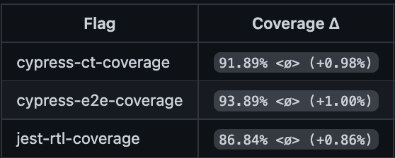
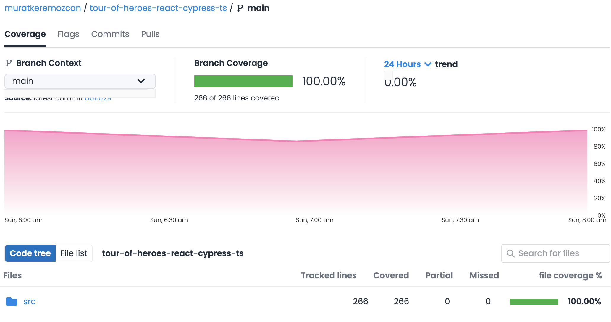

# Combined Code Coverage

Code coverage is not a be all, end all metric. However, we can empirically prove that practicing TDD at all levels can at the end yield a high amount of code coverage. We can also analyze where we may be missing coverage, or have redundant source code looking at analytics.

We will acquire coverage from Cypress CT, Cypress E2e, as well as any Jest and / or RTL tests. We will then combine the coverage into a single report.

## References

This appendix is based on the blog post [Triple combined code coverage for React Apps with Jest, Cypress component and e2e tests, using Github Actions](https://dev.to/muratkeremozcan/triple-combined-code-coverage-for-react-apps-with-jest-cypress-component-and-e2e-tests-using-github-actions-1icc). We will be adapting it to TypeScript.

## Setup Cypress Component & E2e coverage

### Add the packages

With TS the packages are slightly different with `@babel/preset-typescript`:

```bash
yarn add -D @babel/plugin-transform-modules-commonjs @babel/preset-env @babel/preset-react @babel/preset-typescript @bahmutov/cypress-code-coverage @cypress/instrument-cra  babel-loader istanbul istanbul-lib-coverage nyc
```

### Instrument the app for E2e

This script is the same as the JS version

```json
"start": "react-scripts -r @cypress/instrument-cra start"
```

### Configure `nyc` for local coverage evaluation

This is similar to the JS version, with TS and TSX included.

```json
"excludeAfterRemap": true,
"report-dir": "coverage-cy",
"reporter": ["text", "json", "html"],
"extension": [".ts", ".tsx", "js", "jsx"],
"include": ["src/**/*.tsx", "src/**/*.ts", "src/**/*.jsx", "src/**/*.js"],
"exclude": [
  "any files you want excluded"
]
```

### Configure `cypress.config.js` for code coverage, instrument the app for component testing

There are 3 key differences on the TS version of the configuration. In the beginning of the file we have to import `@cypress/instrument-cra`. We need to include `@babel/preset-typescript` in the module presets, and the test property has to be TS instead of JS.

```js
import "@cypress/instrument-cra";
import { defineConfig } from "cypress";
const codeCoverageTask = require("@bahmutov/cypress-code-coverage/plugin");

module.exports = defineConfig({
  projectId: "7mypio",
  experimentalSingleTabRunMode: true,
  retries: {
    runMode: 2,
    openMode: 0,
  },
  env: {
    API_URL: "http://localhost:4000/api",
  },
  e2e: {
    specPattern: "cypress/e2e/**/*.cy.{js,jsx,ts,tsx}",
    baseUrl: "http://localhost:3000",
    setupNodeEvents(on, config) {
      return Object.assign({}, config, codeCoverageTask(on, config));
    },
  },

  component: {
    setupNodeEvents(on, config) {
      return Object.assign({}, config, codeCoverageTask(on, config));
    },
    specPattern: "src/**/*.cy.{js,jsx,ts,tsx}",
    devServer: {
      framework: "create-react-app",
      bundler: "webpack",
      // here are the additional settings from Gleb's instructions
      webpackConfig: {
        // workaround to react-scripts 5 issue https://github.com/cypress-io/cypress/issues/22762
        devServer: {
          port: 3001,
        },
        mode: "development",
        devtool: false,
        module: {
          rules: [
            // application and Cypress files are bundled like React components
            // and instrumented using the babel-plugin-istanbul
            {
              test: /\.ts$/,
              exclude: /node_modules/,
              use: {
                loader: "babel-loader",
                options: {
                  presets: [
                    "@babel/preset-env",
                    "@babel/preset-react",
                    "@babel/preset-typescript",
                  ],
                  plugins: [
                    "istanbul",
                    [
                      "@babel/plugin-transform-modules-commonjs",
                      { loose: true },
                    ],
                  ],
                },
              },
            },
          ],
        },
      },
    },
  },
});

/* eslint-disable @typescript-eslint/no-unused-vars */
```

> This is our preferred component test config because `@babel/plugin-transform-modules-commonjs` lets us customize webpack config, so that we can make all imports accessible from any file including specs. This allows to spy/stub a wider range of code in the component tests.

### Configure both `cypress/support/e2e.ts` and `cypress/support/component.ts`

Indifferent to a JS app.

```js
import "@bahmutov/cypress-code-coverage/support";
```

### Add coverage convenience scripts to package.json

Same convenience scripts as in the JS version

```json
"cov:combined": "yarn copy:reports && yarn combine:reports && yarn finalize:combined-report",
"copy:reports": "(mkdir reports || true) && cp coverage-cy/coverage-final.json reports/from-cypress.json && cp coverage/coverage-final.json reports/from-jest.json",
"combine:reports": "(mkdir .nyc_output || true) && yarn nyc merge reports && mv coverage.json .nyc_output/out.json",
"finalize:combined-report": "yarn nyc report --reporter html --reporter text --reporter json-summary --report-dir combined-coverage",
"cov:reset": "rm -rf .nyc_output && rm -rf reports && rm -rf coverage && rm -rf coverage-cy && rm -rf combined-coverage",
```

### In the TS version there are no differences in local combined coverage, CodeCov service, Github Actions setup

We can replicate the same steps from the JS variant of the guide.

### `jest` to ignore `cy.ts*` files

We need to tell Jest not to include coverage from `cy.ts*` files. This can be done in the `package.json` script.

```json
"test:coverage": "yarn test --watchAll=false --collectCoverageFrom=src/**/*.ts* --collectCoverageFrom=!src/**/*.*.ts* --coverage",
```

### Redundant source code

In `Heroes.tsx` and `Villiains.tsx` we have a section

```tsx
if (status === "loading") {
  return <PageSpinner />;
}
```

Code coverage points out that this line is not covered, although we have tests in `Hero.cy.tsx` etc. explicitly checking for the spinner. This is leftover code from prior to implementing ErrorBoundary. We can safely remove it.

## Coverage measurements

TDD has ensured that we build and explore the application through tests, covering everything that matters. Code coverage has not been a thought while practicing TDD, but TDD helped us gain 100% combined code coverage at the end. Here is the [CodeCov report](https://app.codecov.io/gh/muratkeremozcan/tour-of-heroes-react-cypress-ts?search=&trend=24%20hours):




