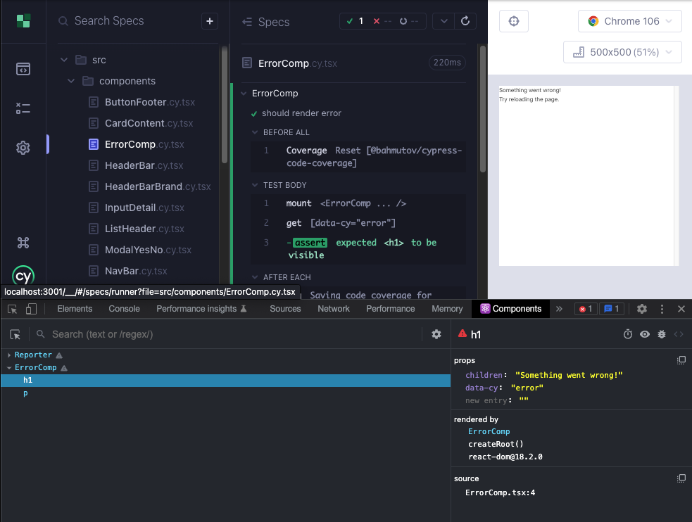

# React-dev-tools with Cypress 10

It is highly desirable to have a tool that allows us to inspect the React component tree in the browser. This is especially useful when we are trying to debug a problem in the UI. It is even more desirable when a single component is being served. The React Dev Tools extension is a great tool for this purpose.

Here are [video instructions]( https://youtu.be/mluEiIYtyE0) for enabling React Dev Tools in Cypress.

Steps:

1. Open the Cypress runner, either an e2e test or component test will do. We recommend component since that is more relevant to the React Dev Tools extension.

2. In the Cypress browser, open a new tab and navigate to [Chrome Web Store](https://chrome.google.com/webstore/detail/react-developer-tools/fmkadmapgofadopljbjfkapdkoienihi). Add the Extension.

   > We can also have the extension pre-installed as described in the [Cypress Blog](https://www.cypress.io/blog/2020/01/07/how-to-load-the-react-devtools-extension-in-cypress/). TL, DR; the downloaded extension files have to be copied over to your source code (for example inside the cypress folder), and then loaded in the configuration file using `on('before:browser:launch'`.

3. The key is to have a `<script>` tag in the file `./cypress/support/component-index.html`. If you have used the React TS Cypress template, you will already have this change. If not, you can copy the below

   ```html
   <script>
     if (window.parent !== window) {
       window["__REACT_DEVTOOLS_GLOBAL_HOOK__"] =
         window.parent["__REACT_DEVTOOLS_GLOBAL_HOOK__"];
     }
   </script>
   ```

4. Start a component test, and verify that React Dev Tools loads.

Mind that the components from the Cypress runner will also be showing. Another shortcoming is that components do not get cleaned up when running components back to back.



